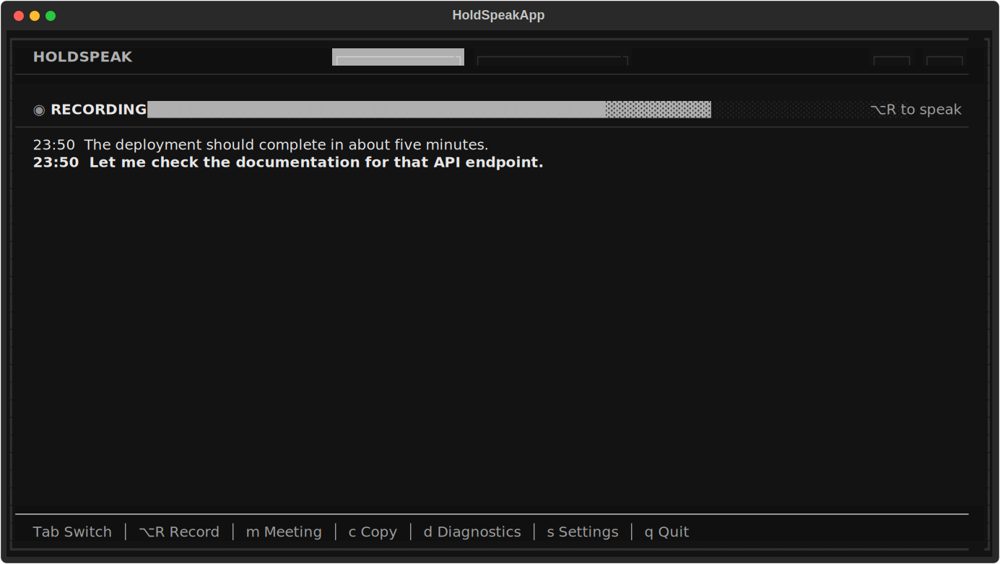
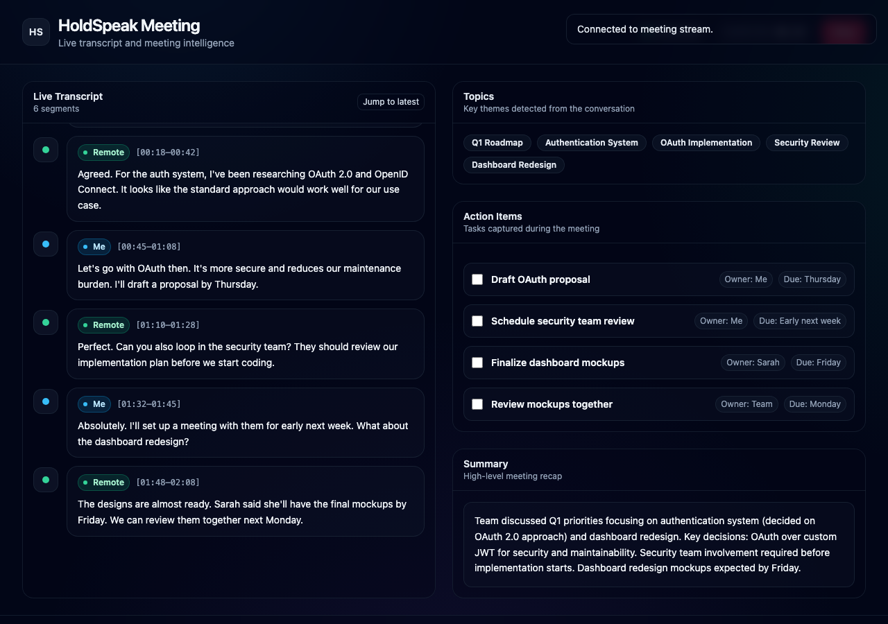

# HoldSpeak

Voice typing for macOS and Linux - hold a hotkey, speak, release.

**100% local. 100% private. Fast.**

## Features

- **Voice Typing**: Hold your configured hotkey, speak, release
- **Punctuation Commands**: Say "period", "comma", "question mark" etc. - they become punctuation
- **Clipboard Insertion**: Say "clipboard" to insert your clipboard contents
- **Meeting Mode**: Record meetings with dual-stream capture (mic + system audio)
- **Live Transcription**: Real-time transcript with speaker labels
- **Meeting Intelligence**: AI-powered topics, action items, and summaries via local LLM
- **Web Dashboard**: Modern browser UI for viewing meetings in real-time

## Platform Support

| Capability | macOS 14+ (Apple Silicon) | Linux X11 | Linux Wayland |
|------------|----------------------------|-----------|---------------|
| TUI voice typing | ✅ | ✅ | ✅ |
| Global hotkey (cross-app) | ✅ | ✅ | ⚠️ Best effort |
| Cross-app auto paste/type | ✅ | ✅ | ⚠️ Best effort |
| Focused hold-to-talk fallback | ✅ | ✅ | ✅ |
| Meeting mode (mic capture) | ✅ | ✅ | ✅ |
| Meeting mode (system audio capture) | ✅ (BlackHole) | ✅ (Pulse/PipeWire monitor) | ✅ (Pulse/PipeWire monitor) |
| `menubar` mode | ✅ | ❌ | ❌ |

## Known Limitations

- Wayland sessions often block global hooks and synthetic typing; HoldSpeak falls back to focused hold-to-talk + clipboard/manual paste.
- `menubar` command is macOS-only (TUI/CLI flows are cross-platform).
- Linux system audio capture requires an available Pulse/PipeWire monitor source.

## Installation

```bash
uv pip install -e .
```

### Linux

OS deps (Debian/Ubuntu):

```bash
sudo apt-get install portaudio19-dev ffmpeg xclip pulseaudio-utils
```

Install HoldSpeak + faster-whisper:

```bash
uv pip install -e '.[linux]'
```

### macOS

Optional system-audio capture dependency:

```bash
brew install blackhole-2ch
```

### Optional: Meeting Mode Dependencies

For meeting mode with AI intelligence:

```bash
uv pip install -e '.[meeting]'

# Optional: accelerate llama-cpp on macOS
CMAKE_ARGS="-DGGML_METAL=on" uv pip install llama-cpp-python
```

## Usage

### Voice Typing

```bash
holdspeak
```

Hold your configured hotkey (default: **Right Alt/Option**) and speak.
If global hooks are unavailable (common on Wayland), keep HoldSpeak focused and hold **v** to record.

#### Punctuation Commands

Speak these words and they become punctuation:

| Say | Get |
|-----|-----|
| "period" or "full stop" | `.` |
| "comma" | `,` |
| "question mark" | `?` |
| "exclamation mark" | `!` |
| "colon" | `:` |
| "semicolon" | `;` |
| "open quote" / "close quote" | `"` |
| "open paren" / "close paren" | `()` |
| "dash" or "hyphen" | `-` |
| "new line" | line break |
| "new paragraph" | double line break |

**Example:** "Hello comma how are you question mark" → "Hello, how are you?"

#### Clipboard Insertion

Say **"clipboard"** to insert whatever text is currently on your clipboard.

**Example:** Copy "example.com" then say "visit clipboard for details" → "visit example.com for details"

### Meeting Mode

Start a meeting from the TUI by pressing `m`, or run setup first:

```bash
# Check system-audio setup (BlackHole on macOS, Pulse monitor on Linux)
holdspeak meeting --setup

# List audio devices
holdspeak meeting --list-devices
```

#### TUI Navigation

| Key | Action |
|-----|--------|
| `Tab` | Cycle between Voice Typing / Meetings tabs |
| `1` | Voice Typing tab |
| `2` | Meetings Hub (browse saved meetings) |
| `?` | Help screen |
| `s` | Settings |
| `q` | Quit |

#### Meeting Controls (TUI)

| Key | Action |
|-----|--------|
| `m` | Toggle meeting on/off |
| `b` | Add bookmark (auto-labeled from context) |
| `t` | Show transcript |
| `e` | Edit meeting title/tags |
| `w` | Open web dashboard in browser |

When a meeting starts, a web dashboard URL appears. Open it in your browser to see:
- Live transcript with speaker labels (Me / Remote)
- AI-extracted topics and action items
- Meeting summary
- Bookmark, copy, and export controls

**For complete setup instructions and troubleshooting, see the [Meeting Mode Guide](docs/MEETING_MODE_GUIDE.md).**

## Testing

```bash
# Base integration subset (no optional meeting/web deps required)
uv pip install -e '.[test]'
uv run pytest -q tests/integration

# Optional meeting/web integration subset
uv pip install -e '.[meeting]'
uv run pytest -q tests/integration -m requires_meeting
```

## Configuration

Config file: `~/.config/holdspeak/config.json`

```json
{
  "hotkey": {
    "key": "alt_r",
    "display": "Right Option"
  },
  "model": {
    "name": "base"
  },
  "meeting": {
    "system_audio_device": null,
    "mic_label": "Me",
    "remote_label": "Remote",
    "intel_enabled": true,
    "intel_realtime_model": "~/Models/gguf/Mistral-7B-Instruct-v0.3-Q6_K.gguf",
    "web_enabled": true
  }
}
```

## Architecture

```
┌─────────────────────────────────────────────────────────────┐
│                        HoldSpeak TUI                        │
├─────────────────────────────────────────────────────────────┤
│  [1 Voice Typing]  [2 Meetings Hub]     ← Tab Navigation    │
├─────────────────────────────────────────────────────────────┤
│  Voice Typing Tab           │  Meetings Hub Tab             │
│  ─────────────────          │  ─────────────────            │
│  Hotkey → Record → Type     │  Browse saved meetings        │
│  Transcription history      │  Search & filter              │
│                             │  View/Edit/Export/Delete      │
├─────────────────────────────┴───────────────────────────────┤
│  Meeting Mode (shared bar visible in both tabs)             │
│  ───────────────────────────────────────────────────────── │
│  Dual-stream recording: Mic → "Me", System → "Remote"       │
│  Every 10s: Transcribe chunks                               │
│  Every 5 segments: Run intel (topics, actions, summary)     │
│  Bookmarks: Auto-labeled from context (±10s window)         │
├─────────────────────────────────────────────────────────────┤
│                     Per-Meeting Web Server                  │
│  GET  /          → Dashboard HTML (Alpine.js + Tailwind)   │
│  GET  /api/state → Current meeting state                   │
│  WS   /ws        → Real-time segment/intel broadcast       │
└─────────────────────────────────────────────────────────────┘
```

## Screenshots

### TUI (Terminal UI)


### Meeting Dashboard


See [docs/screenshots/](docs/screenshots/) for more examples.

## Requirements

- macOS 14+ (Apple Silicon) or Linux x86_64 (Ubuntu/Debian-family)
- Python 3.10+
- Accessibility/input permissions for global hotkey/text injection (platform-dependent)
- Microphone permissions
- BlackHole 2ch (optional, macOS system audio capture)
- Pulse/PipeWire monitor source (optional, Linux system audio capture)
- GGUF model (optional, for meeting intelligence)

## License

MIT
