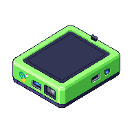

# HoldSpeak

Voice input for macOS and Linux — hold a key, speak, release. Local-first and private by default, with optional cloud intelligence when you want it. Works standalone as a voice typing tool or wired into meeting mode, AI agents, and the AIPI-Lite companion device.

## What it does

**Voice typing** — hold your configured hotkey, speak, release. Text appears in any app. Punctuation commands (`"period"`, `"comma"`, etc.) work out of the box. When you say `"clipboard"` inside a dictated phrase, HoldSpeak replaces that word with the current clipboard text.

**Meeting mode** — dual-stream capture (mic + system audio), live transcript with speaker labels, AI-extracted topics and action items, web dashboard, deferred intel queue for homelab/cloud models.

**Intelligent dictation** — project-aware pipeline that routes utterances through intent classification, project KB enrichment, and LLM rewriting before text lands in the destination app. Adapts output for Codex, Claude, terminal, browser, or editor.

## Workflow Map

| Voice typing | Meeting intelligence | Project-aware typing |
| --- | --- | --- |
|  |  |  |
| Hold the hotkey, speak, release, and insert text into the active app. | Capture meetings, review transcripts, accept actions, and export local handoffs. | Use `.hs/` project context and agent hooks to shape rough speech into useful prompts. |

## Intelligence Pipeline

<p align="center">
  
</p>

HoldSpeak turns speech into transcript context, reviewable actions, summaries,
and coding-agent replies while the local runtime stays in control.

## AIPI-Lite Companion

<p align="center">
  
</p>

The optional AIPI-Lite companion is a portable ESPHome-based device you can
carry between rooms. Put it on Wi-Fi, including a phone hotspot when needed,
and it can provide meeting capture controls and status feedback while
HoldSpeak handles real-time transcription and intelligence.

It also works as a coding-agent companion. With Claude/Codex hooks enabled,
HoldSpeak can notify the device when an agent is waiting for your answer; you
can speak the reply through AIPI-Lite and have HoldSpeak route it back into the
active coding session. For remote use, the device and bridge still need a
network path you control, such as home Wi-Fi, hotspot, VPN, or another private
tunnel.

Buy hardware from the [official AIPI Lite product page](https://aipi.com/products/aipi-lite)
or the [Amazon listing](https://www.amazon.com/dp/B0FQNNVV36). Firmware,
bridge setup, and verification live in [AIPI-Lite Developer Workflow](docs/AIPI_LITE_DEV_WORKFLOW.md).

## Platform support

| Capability | macOS 14+ (Apple Silicon) | Linux X11 | Linux Wayland |
|---|---|---|---|
| Voice typing | ✅ | ✅ | ✅ |
| Global hotkey | ✅ | ✅ | ⚠️ Best effort |
| Cross-app typing | ✅ | ✅ | ⚠️ Best effort |
| Meeting mode | ✅ | ✅ | ✅ |
| System audio capture | ✅ BlackHole | ✅ Pulse/PipeWire | ✅ Pulse/PipeWire |
| Menu bar mode | ✅ | ❌ | ❌ |

Wayland sessions often block global hooks and synthetic typing. HoldSpeak falls back to focused hold-to-talk + clipboard paste.

## Install

```bash
curl -fsSL https://raw.githubusercontent.com/karolswdev/HoldSpeak/main/scripts/install.sh | bash
holdspeak doctor
holdspeak
```

Optional extras (install only what you need):

```bash
# Meeting mode with AI intelligence
curl ... | bash -s -- --with-meeting

# Intelligent dictation — pick one backend
uv pip install -e '.[dictation-mlx]'      # Apple Silicon (MLX)
uv pip install -e '.[dictation-llama]'    # Cross-platform (GGUF)
uv pip install -e '.[dictation-openai]'   # OpenAI-compatible endpoint
```

For local installs from this checkout: `uv pip install -e .`

## Where to go next

| I want to… | Read this |
|---|---|
| Get it running and verify my setup | [Getting Started](docs/GETTING_STARTED.md) |
| Set up project-aware dictation for Codex / Claude | [Intelligent Typing Setup](docs/INTELLIGENT_TYPING_GUIDE.md) |
| Use meeting mode and configure AI intelligence | [Meeting Mode Guide](docs/MEETING_MODE_GUIDE.md) |
| Wire up the AIPI-Lite companion device | [AIPI-Lite Developer Workflow](docs/AIPI_LITE_DEV_WORKFLOW.md) |
| Install Claude / Codex agent hooks | [Agent Hook Install](docs/AGENT_HOOK_INSTALL.md) |
| Understand what's stored and what can leave my machine | [Security & Privacy](docs/SECURITY.md) |

## Meeting intelligence plugins

When you record or save a meeting, HoldSpeak can turn the transcript into
structured, reviewable artifacts. A saved meeting flows through **multi-intent
routing (MIR)** — the transcript is scored for intent (architecture, delivery,
product, incident, comms), a plugin chain is selected for the active profile, and
each plugin calls your configured **OpenAI-compatible LLM** to produce a typed
artifact. Artifacts are persisted and rendered **read-only** in the web UI at
`/history` (diagrams as inline SVG; everything else as structured lists/tables).

Plugins run on **saved/recorded meetings**, not live, and are gated on an `llm`
capability — with no LLM endpoint configured they're skipped, not failed. Nothing
leaves your machine beyond the LLM endpoint you point at (local or LAN is fine).

HoldSpeak ships **14 built-in plugins**, all producing real LLM-backed artifacts:

| Plugin | Produces | Fires on (profile / intent) |
|---|---|---|
| `mermaid_architecture` | Architecture diagram (Mermaid → SVG) | architecture |
| `adr_drafter` | Architecture Decision Records | architecture |
| `requirements_extractor` | Requirements (functional / non-functional / constraint / acceptance) | architecture, default |
| `action_owner_enforcer` | Action items with owner/due-date gap flags | delivery, default |
| `milestone_planner` | Milestone plan (targets, deliverables, dependencies) | delivery |
| `dependency_mapper` | Dependency map (directed edges) | delivery |
| `decision_capture` | Decisions + open questions | default (every meeting) |
| `scope_guard` | Scope review (in-scope / out-of-scope / scope-creep) | product |
| `customer_signal_extractor` | Customer signals (request / pain / praise / churn-risk) | product |
| `incident_timeline` | Ordered incident timeline | incident |
| `runbook_delta` | Runbook changes (added / modified / removed) | incident |
| `risk_heatmap` | Risk register (impact / likelihood / mitigation / owner) | incident |
| `stakeholder_update_drafter` | Stakeholder update (headline + highlights / risks / next steps) | comms |
| `decision_announcement_drafter` | Decision announcements (title / audience / message) | comms |

The architecture, contracts, and how to think about authoring more plugins live in
the plugin RFC: [`docs/PLAN_ARCHITECT_PLUGIN_SYSTEM.md`](docs/PLAN_ARCHITECT_PLUGIN_SYSTEM.md).
For configuring meeting intelligence (endpoints, routing), see the
[Meeting Mode Guide](docs/MEETING_MODE_GUIDE.md).

## Configuration

Config file: `~/.config/holdspeak/config.json`

```json
{
  "hotkey": { "key": "alt_r", "display": "Right Option" },
  "model": { "name": "base", "warm_on_start": true, "backend": "auto" }
}
```

`model.backend` — `"auto"` picks MLX on Apple Silicon when available, otherwise `faster-whisper`. Override with `"mlx"` or `"faster-whisper"`.

Full configuration reference (meeting intel, dictation pipeline, cloud endpoints, MIR routing) is in the relevant guide docs above.

## License

MIT
