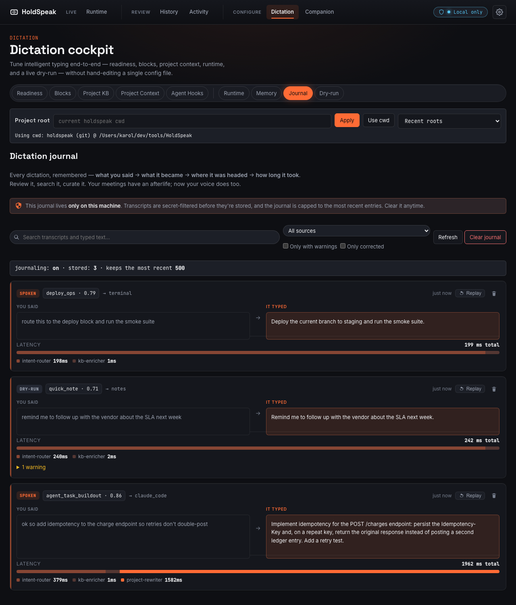

# HoldSpeak

<p align="center">
  
</p>

<p align="center"><strong>Hold a key. Speak. It types — anywhere. 100% local. And it learns you.</strong></p>

[](LICENSE)
[](https://github.com/karolswdev/HoldSpeak/actions/workflows/test.yml)
[](https://www.python.org/downloads/)
[](#platform-support)

HoldSpeak is **local-first voice input** for macOS and Linux. Hold your hotkey,
speak, release — text lands in whatever app you're in. No cloud, no account, no
telemetry: nothing leaves your machine except the model endpoint *you* choose to
point at. It works standalone as a voice-typing tool, or scales up into meeting
intelligence, project-aware dictation, and an AIPI-Lite companion device.

> **Status: early / pre-release.** Mature in features but not yet published to
> PyPI — install from source (below). APIs, config, and defaults may still
> change. Feedback and contributions welcome.

## Why it's different

- 🔒 **100% local by default** — Whisper transcription plus *your* LLM; private unless you deliberately point at a cloud endpoint. [Security & privacy →](docs/SECURITY.md)
- 🧠 **It learns you** — every dictation is journaled (said → typed → routed → latency); **correct it in the moment** with one tap, and **replay** it through the tuned pipeline to watch the copilot improve. [See it learn →](docs/INTELLIGENT_TYPING_GUIDE.md#12-dictation-journal-corrections--replay)
- 🎙️ **Voice *and* meetings both get an afterlife** — not a transcript that evaporates the instant it types: a searchable, reviewable record on both sides.
- 🧩 **14 real LLM-backed meeting plugins** — architecture diagrams, ADRs, risk registers, incident timelines, decisions, stakeholder updates… all extracted from the transcript. [Meeting intelligence →](docs/MEETING_MODE_GUIDE.md)
- 🔌 **Bring your own model** — GGUF in-process, MLX on Apple Silicon, or any OpenAI-compatible endpoint. [Models →](docs/MODELS.md)
- 🪟 **Ambient desktop presence** *(opt-in)* — a native, focus-safe HUD shows *listening / transcribing / typing* while you dictate into another app, without the dashboard on screen. [More →](docs/INTELLIGENT_TYPING_GUIDE.md#11-desktop-presence-ambient-on-desktop-status)
- 📟 **AIPI-Lite companion** *(optional)* — a portable device for meeting-capture controls and speak-the-reply-to-your-agent, between rooms. [Workflow →](docs/AIPI_LITE_DEV_WORKFLOW.md)

## What it does, at a glance

| Voice typing | Meeting intelligence | Project-aware typing |
| --- | --- | --- |
|  |  |  |
| Hold the hotkey, speak, release — text inserts into the active app. Punctuation commands (`"period"`, `"comma"`) and `"clipboard"` substitution work out of the box. | Dual-stream capture (mic + system audio), live transcript with speaker labels, AI-extracted topics, actions, and artifacts — reviewable at `/history`. | Route rough speech through intent classification, project-KB enrichment, and LLM rewriting before it lands — tuned for Codex, Claude, terminal, browser, or editor. |

## See it learn

<p align="center">
  
</p>

Speech becomes transcript context, reviewable actions, summaries, and
coding-agent replies — while the local runtime stays in control. Because every
dictation is recorded, you can **review** what it heard, **correct** a misfire in
one tap (which teaches it), and **replay** it through the updated pipeline — so
"it got better" becomes something you can watch. [End to end →](docs/DICTATION_COPILOT.md)

<p align="center">
  
</p>
<p align="center"><em>The dictation Journal — every utterance: what you said, what it typed, where it routed, and how long it took.</em></p>

## Quickstart

The install script clones it; `doctor` checks your setup; `holdspeak` launches:

```bash
curl -fsSL https://raw.githubusercontent.com/karolswdev/HoldSpeak/main/scripts/install.sh | bash
holdspeak doctor   # verify mic permissions + backends
holdspeak          # launch the web runtime
```

Or from a clone, using [`uv`](https://docs.astral.sh/uv/):

```bash
git clone https://github.com/karolswdev/HoldSpeak.git && cd HoldSpeak
uv pip install -e .
holdspeak doctor && holdspeak
```

Optional extras (install only what you need):

```bash
uv pip install -e '.[meeting]'         # meeting mode + AI intelligence
uv pip install -e '.[dictation-mlx]'   # intelligent dictation — Apple Silicon (MLX)
uv pip install -e '.[dictation-llama]' # intelligent dictation — cross-platform (GGUF)
uv pip install -e '.[dictation-openai]'# intelligent dictation — OpenAI-compatible endpoint
```

The dictation/meeting LLM is **bring-your-own** — see [`docs/MODELS.md`](docs/MODELS.md) for the contract and current suggestions.

## Platform support

| Capability | macOS 14+ (Apple Silicon) | Linux X11 | Linux Wayland |
|---|---|---|---|
| Voice typing | ✅ | ✅ | ✅ |
| Global hotkey | ✅ | ✅ | ⚠️ Best effort |
| Cross-app typing | ✅ | ✅ | ⚠️ Best effort |
| Meeting mode | ✅ | ✅ | ✅ |
| System audio capture | ✅ BlackHole | ✅ Pulse/PipeWire | ✅ Pulse/PipeWire |

Wayland often blocks global hooks and synthetic typing — HoldSpeak falls back to clipboard paste for injection.

## Meeting intelligence

Record or save a meeting and HoldSpeak turns the transcript into structured,
reviewable artifacts via **multi-intent routing**: the transcript is scored for
intent (architecture, delivery, product, incident, comms), a plugin chain runs,
and each plugin calls your LLM to produce a typed artifact — rendered **read-only**
at `/history`. HoldSpeak ships **14 built-in plugins**, all real and LLM-backed.

Plugins can also **propose actions** — an *actuator* proposes an external side
effect (file a ticket, post an update) that only happens after an explicit,
audited, **per-action human approval**, **off by default**. Write your own with
the [Plugin Authoring guide](docs/PLUGIN_AUTHORING.md); for endpoints and routing
see the [Meeting Mode Guide](docs/MEETING_MODE_GUIDE.md).

## AIPI-Lite companion

<p align="center">
  
</p>

The optional **AIPI-Lite** is a portable ESPHome-based device you carry between
rooms. On Wi-Fi (a phone hotspot works), it gives you meeting-capture controls
and status feedback — and with Claude/Codex hooks enabled, it notifies you when
an agent is waiting so you can **speak the reply** back into the coding session.
Hardware: the [official page](https://aipi.com/products/aipi-lite) or the
[Amazon listing](https://www.amazon.com/dp/B0FQNNVV36); firmware + bridge setup in
the [AIPI-Lite Developer Workflow](docs/AIPI_LITE_DEV_WORKFLOW.md).

## Where to go next

| I want to… | Read this |
|---|---|
| Browse all the docs | [Documentation index](docs/README.md) |
| Get it running and verify my setup | [Getting Started](docs/GETTING_STARTED.md) |
| Choose / configure a model | [Models — bring your own](docs/MODELS.md) |
| See speech become a project-grounded task | [The Dictation Copilot](docs/DICTATION_COPILOT.md) |
| Set up project-aware dictation for Codex / Claude | [Intelligent Typing Setup](docs/INTELLIGENT_TYPING_GUIDE.md) |
| Review, correct, and replay past dictations | [Dictation journal & replay](docs/INTELLIGENT_TYPING_GUIDE.md#12-dictation-journal-corrections--replay) |
| Use meeting mode and configure AI intelligence | [Meeting Mode Guide](docs/MEETING_MODE_GUIDE.md) |
| Wire up the AIPI-Lite companion | [AIPI-Lite Developer Workflow](docs/AIPI_LITE_DEV_WORKFLOW.md) |
| Install Claude / Codex agent hooks | [Agent Hook Install](docs/AGENT_HOOK_INSTALL.md) |
| Understand what's stored and what can leave my machine | [Security & Privacy](docs/SECURITY.md) |

## Configuration

Config lives at `~/.config/holdspeak/config.json`, but you rarely touch it by
hand — **Settings** in the web runtime exposes the hotkey, model, meeting intel,
dictation pipeline, and presence knobs. Full reference in
[Getting Started](docs/GETTING_STARTED.md) and the guides above.

## Contributing

Contributions are welcome. See [`CONTRIBUTING.md`](CONTRIBUTING.md) for setup
(`uv`, the git hooks, the test command) and the commit-contract workflow. Recent
changes are tracked in [`CHANGELOG.md`](CHANGELOG.md).

## License

Licensed under the **Apache License 2.0** — see [`LICENSE`](LICENSE).
