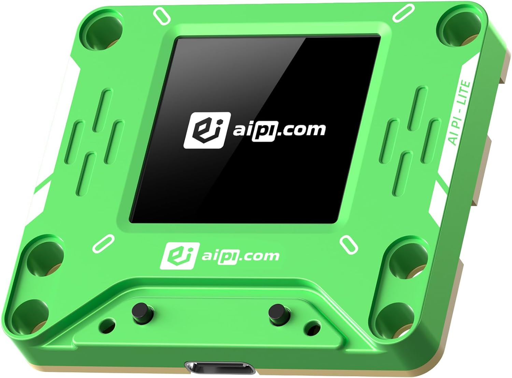

# HoldSpeak

Voice input for macOS and Linux — hold a key, speak, release. Local-first and private by default, with optional cloud intelligence when you want it. Works standalone as a voice typing tool or wired into meeting mode, AI agents, and the AIPI-Lite companion device.

## What it does

**Voice typing** — hold your configured hotkey, speak, release. Text appears in any app. Punctuation commands (`"period"`, `"comma"`, etc.) work out of the box. When you say `"clipboard"` inside a dictated phrase, HoldSpeak replaces that word with the current clipboard text.

**Meeting mode** — dual-stream capture (mic + system audio), live transcript with speaker labels, AI-extracted topics and action items, web dashboard, deferred intel queue for homelab/cloud models.

**Intelligent dictation** — project-aware pipeline that routes utterances through intent classification, project KB enrichment, and LLM rewriting before text lands in the destination app. Adapts output for Codex, Claude, terminal, browser, or editor.

## Workflow Map

| Voice typing | Meeting intelligence | Project-aware typing |
| --- | --- | --- |
|  |  |  |
| Hold the hotkey, speak, release, and insert text into the active app. | Capture meetings, review transcripts, accept actions, and export local handoffs. | Use `.hs/` project context and agent hooks to shape rough speech into useful prompts. |

## AIPI-Lite Companion

<p align="center">
  
</p>

The optional AIPI-Lite companion is the dedicated hardware path for capture
controls and status feedback. Firmware, bridge setup, and verification live in
[AIPI-Lite Developer Workflow](docs/AIPI_LITE_DEV_WORKFLOW.md).

## Platform support

| Capability | macOS 14+ (Apple Silicon) | Linux X11 | Linux Wayland |
|---|---|---|---|
| Voice typing | ✅ | ✅ | ✅ |
| Global hotkey | ✅ | ✅ | ⚠️ Best effort |
| Cross-app typing | ✅ | ✅ | ⚠️ Best effort |
| Meeting mode | ✅ | ✅ | ✅ |
| System audio capture | ✅ BlackHole | ✅ Pulse/PipeWire | ✅ Pulse/PipeWire |
| Menu bar mode | ✅ | ❌ | ❌ |

Wayland sessions often block global hooks and synthetic typing. HoldSpeak falls back to focused hold-to-talk + clipboard paste.

## Install

```bash
curl -fsSL https://raw.githubusercontent.com/karolswdev/HoldSpeak/main/scripts/install.sh | bash
holdspeak doctor
holdspeak
```

Optional extras (install only what you need):

```bash
# Meeting mode with AI intelligence
curl ... | bash -s -- --with-meeting

# Intelligent dictation — pick one backend
uv pip install -e '.[dictation-mlx]'      # Apple Silicon (MLX)
uv pip install -e '.[dictation-llama]'    # Cross-platform (GGUF)
uv pip install -e '.[dictation-openai]'   # OpenAI-compatible endpoint
```

For local installs from this checkout: `uv pip install -e .`

## Where to go next

| I want to… | Read this |
|---|---|
| Get it running and verify my setup | [Getting Started](docs/GETTING_STARTED.md) |
| Set up project-aware dictation for Codex / Claude | [Intelligent Typing Setup](docs/INTELLIGENT_TYPING_GUIDE.md) |
| Use meeting mode and configure AI intelligence | [Meeting Mode Guide](docs/MEETING_MODE_GUIDE.md) |
| Wire up the AIPI-Lite companion device | [AIPI-Lite Developer Workflow](docs/AIPI_LITE_DEV_WORKFLOW.md) |
| Install Claude / Codex agent hooks | [Agent Hook Install](docs/AGENT_HOOK_INSTALL.md) |
| Understand what's stored and what can leave my machine | [Security & Privacy](docs/SECURITY.md) |

## Configuration

Config file: `~/.config/holdspeak/config.json`

```json
{
  "hotkey": { "key": "alt_r", "display": "Right Option" },
  "model": { "name": "base", "warm_on_start": true, "backend": "auto" }
}
```

`model.backend` — `"auto"` picks MLX on Apple Silicon when available, otherwise `faster-whisper`. Override with `"mlx"` or `"faster-whisper"`.

Full configuration reference (meeting intel, dictation pipeline, cloud endpoints, MIR routing) is in the relevant guide docs above.

## License

MIT
