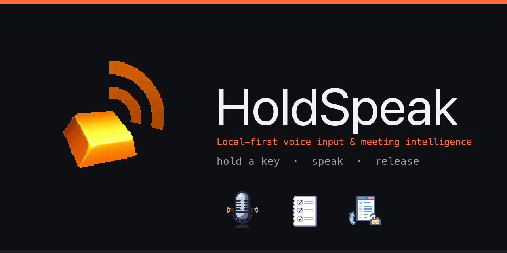
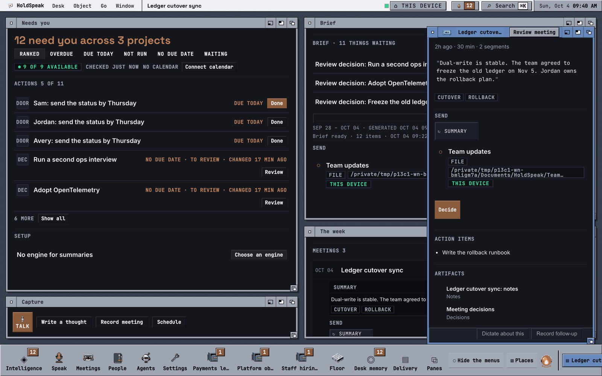
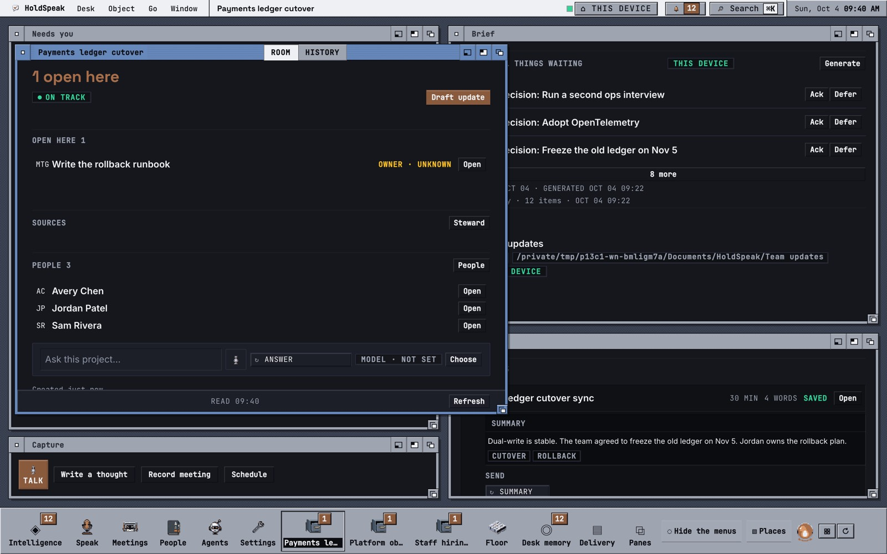
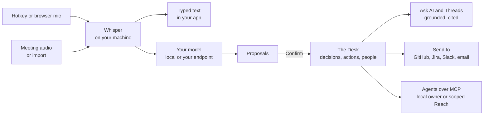

<p align="center">
  
</p>

<h3 align="center">Hold a key, speak, it types. Record a meeting, it closes the loop. Ask anything about your work. All local.</h3>

<p align="center">
  <a href="LICENSE"></a>
  
  
  
  
</p>

<p align="center">
  <a href="#quick-start">Quick start</a> ·
  <a href="#whats-inside">What's inside</a> ·
  <a href="#extend-everything">Extend it</a> ·
  <a href="#how-it-compares-mid-2026">Compare</a> ·
  <a href="docs/README.md">Docs</a>
</p>

---

You lead a team. Your work lives in your voice, your meetings, your projects, your people, and a growing fleet of coding agents.
HoldSpeak is one local workbench for all of it.

**Speak** into any app. **Record** a meeting and confirm what was decided. **Ask** your model about any meeting, note, or project, with sources. **Send** the result to GitHub, Jira, Slack, or email. **Steer** your Claude Code and Codex sessions by voice. **Extend** every part with plugins, connectors, and 248 MCP tools.

Whisper runs on your machine. The language model is yours: a local GGUF or MLX model, or any OpenAI-compatible endpoint you choose. There is no account and no HoldSpeak cloud.

<p align="center">
  
</p>

## What's inside

| | You get | Read more |
| --- | --- | --- |
| 🎙️ | [**Voice typing that learns**](#speak-anywhere): hold a key, speak, the text lands in any app and improves with each correction | [Speak](docs/USER_GUIDE.md#speak) |
| 🗂️ | [**Meetings that close the loop**](#meetings-that-close-the-loop): live or imported, read by 14 built-in plugins, confirmed by you | [Meeting mode](docs/MEETING_MODE_GUIDE.md) |
| ✦ | [**Ask AI on everything**](#ask-anything-about-your-work): any meeting, note, project, or Knowledge collection, grounded and cited | [Threads](docs/USER_GUIDE.md#threads) |
| 🧠 | [**Memory with receipts**](#memory-that-cites-its-sources): facts, beliefs, and standing pages where every sentence cites a source | [Memory](docs/RELATIONSHIP_AWARE_MEMORY.md) |
| 🧭 | [**A Desk for the work you lead**](#a-desk-for-the-work-you-lead): what needs you, Project Rooms, people, your week | [The Desk](docs/WEB_DESK.md) |
| 📤 | [**Send it anywhere**](#send-it-anywhere): a folder, GitHub, Jira, Confluence, email, or Slack, previewed first | [Integrations](docs/INTEGRATIONS.md) |
| 🤖 | [**Command your coding agents**](#command-your-coding-agents): watch and answer Claude Code and Codex sessions from the Desk | [Coders](docs/CODER_INTEGRATION.md) |
| 🧩 | [**Extend everything**](#extend-everything): plugins, connectors, actuators, agents, Workflows, voice commands, MCP | [Plugin authoring](docs/PLUGIN_AUTHORING.md) |

## Speak anywhere

Hold the hotkey (Right Option by default), speak, and release. The text goes into the app you are in: your editor, your terminal, a chat box.

- **The dictation pipeline** adds your project's facts and context, and can rewrite a rough prompt with your model before it types. Automation hooks connect it to Claude Code and Codex.
- **Teach it once.** Select **Wrong** on a result, correct it, and select **Teach**. The next matching dictation comes out right.
- **See the receipts.** The dictation journal records what you said, what it typed, and how long it took. The learning digest shows each rule it learned and when it fired. Replay runs an old utterance through the updated pipeline, so you see the improvement.
- **Voice commands** and a wake word run actions you define.

## Meetings that close the loop

Record your microphone and system audio, or import a recording or a transcript file.

- **14 built-in plugins** read the transcript on your model: decisions, requirements, action owners, risks, dependencies, milestones, an incident timeline, an ADR draft, an architecture diagram, a stakeholder update, and more.
- **You stay in charge.** Meeting intelligence saves the summary and the extracted action items. Decisions arrive as proposals: select **Confirm** to create the linked decisions and commitments.
- **Meeting aftercare** shows what is open, what was decided, and what changed since the last meeting.
- **The clock.** Connect a calendar to see your week. **Auto-record** is off by default. Turn it on for calendar events with meeting links: all of them, or only those linked to a Room. A recording arms five minutes before the event by default, then starts after a countdown.

## Ask anything about your work

Every piece of your work is something you can talk to.

- **Ask AI** on a Meeting, a Note, an Artifact, a Knowledge collection, or a Workflow. The answer shows what it was grounded on, with citations you can open. **Keep** it as an Artifact with the exact sources and instruction, or **Bin** it and nothing is stored.
- **Ask this project** sits in every Project Room. Ask what is blocked, who owes what, or what changed, and get an answer from that project's records.
- **Develop a thought.** Keep a rough sentence as a Note and select **Develop this thought**. Each **Ask AI** turn asks you one question, until the idea is clear. Your original text is always kept.
- **Threads** are saved, multi-turn conversations with your work:
  - Type `@` to attach Meetings, Notes, Artifacts, and decisions. Select **Continue in thread** on a Desk object to start from it.
  - Pick a mode: **Desk**, **Chase**, **Draft**, **Plan**, **Project**, or **Interview**. Each one gives the model its own instructions and tools.
  - **The Thread has hands.** The model can call real tools. A held call asks you: **Allow once**, **Allow always**, or **Deny**.
  - Slash commands: `/todo` creates an action item, `/keep` saves the reply as a Note, `/fork` branches, `/compact` summarizes, `/prompt` inserts a saved prompt.
  - Edit or regenerate a message to branch the conversation. Saved prompts and guardrails are Notes with a tag.
  - **The Call** turns a Thread into a voice conversation: you speak, and it answers aloud.
- **Interview mode** asks about your goals, Projects, cadences, and decisions, and saves the answers as context.

## Memory that cites its sources

You never save to memory. Your normal work is the write path.

- **Search by meaning** across Notes, Meetings, Decisions, and Threads.
- **Recall** returns the current decision first, with its rationale and source, then the versions it superseded.
- **Facts become beliefs.** Background jobs extract facts from your records and fold them into beliefs that keep their evidence. A later fact can refine, supersede, or contradict one.
- **Standing pages** answer the recurring questions. For each Project: what we decided, what is open and who owes it, risks and disputes, and what changed this week. Every sentence cites its sources. A sentence with no source is cut. When you delete a source, the sentence that cites it disappears.

These jobs run on the model you assign to them. With no model, nothing runs and nothing is written.

## A Desk for the work you lead

<p align="center">
  
</p>

- **Needs you** ranks what waits on you across every project: overdue actions, decisions to review, people to answer.
- **Project Rooms** hold one project each: its sources (GitHub, Jira, Confluence, meetings), its health, and its people. **Draft update** writes the weekly status from those records. You review it before it goes out.
- **The steward** works for each Room. It drafts the update and proposes a reviewer nudge on a pull request that waits too long.
- **People** keeps your reports and peers. Before a 1:1, the 1:1 card collects what is open between you. The Monday brief adds what each person owes you and what you owe them.
- **The Heartbeat** sweeps your Watches on a schedule and keeps **Needs you** current, so the Desk is ready when you arrive.
- **Search** (`⌘K`) finds your records and runs any Desk verb.

## Send it anywhere

Select **Send to** on a summary, an update, or an Artifact, and pick a saved destination:

| Destination | Uses |
| --- | --- |
| A folder | Your file system, or a synced folder |
| GitHub | Your local `gh` sign-in |
| Jira and Confluence | Your local `acli` sign-in, across many accounts and sites |
| Email | Your SendGrid or Resend sender |
| Slack | A Slack incoming webhook |

HoldSpeak shows the exact text before it sends, freezes the target, and keeps a receipt of every send.

## Command your coding agents

Your Claude Code and Codex sessions report to the Desk through agent hooks.

- **See who needs you.** Blocked sessions come first, with the question they are asking.
- **Watch live.** Open a session to see its terminal pane, read-only.
- **Answer by voice.** Select **Arm this pane**, hold the microphone, and speak the reply. HoldSpeak shows the exact text before it types it into that pane, on this machine or another.
- **Ground the answer.** Attach a meeting or an Artifact, so the agent gets the context you have.
- **Follow the pull request.** Mission Control tracks each PR through review to merge, with receipts.

## Extend everything

HoldSpeak is built from parts you can add to. You do not need to fork it.

| Add a... | It does | Guide |
| --- | --- | --- |
| **Meeting plugin** | Turns a transcript into a typed artifact. Drop a Python file in `~/.holdspeak/plugin_packs/`. | [Plugin authoring](docs/PLUGIN_AUTHORING.md) |
| **Connector** | Reads activity from any tool into HoldSpeak. Drop a pack in `~/.holdspeak/connector_packs/`. | [Connector development](docs/CONNECTOR_DEVELOPMENT.md) |
| **Actuator** | Proposes an effect outside HoldSpeak, such as an issue or a webhook post. It runs only what you previewed. | [Actuator development](docs/ACTUATOR_DEVELOPMENT.md) |
| **Agent** | A role you author, with its own instructions. | [Agents and Threads](docs/AGENTS_AND_THREADS.md) |
| **Workflow** | A sequence of steps that runs with a receipt for each step. | [Automation](docs/AUTOMATION.md) |
| **Voice command** | Maps a spoken phrase to a registered action. | [Voice commands](docs/VOICE_COMMANDS.md) |
| **Saved prompt or guardrail** | A Note tagged `prompt` or `guardrail`, used in any Thread. | [Threads](docs/USER_GUIDE.md#threads) |
| **Model** | Any local GGUF or MLX model, or any OpenAI-compatible endpoint, assigned per job. | [Models](docs/MODELS.md) |

**MCP, first-class.** One service layer declares every operation. The web app, the MCP server, and the tests all reach the same operation, with the same authority checks.

- **The MCP sidecar** gives Claude Code, Cursor, or any MCP client 248 tools across 43 families. It acts with your owner authority on this machine.
- **Reach** lets a remote agent connect over Streamable HTTP with a scoped credential: a tool palette and a time limit, shown once.
- **Every consequential write leaves a Receipt.** Control modes (**Secure**, **Normal**, **YOLO**) set how much runs without asking you.

## How it works


```mermaid
flowchart LR
    K["Hotkey or browser mic"] --> W["Whisper<br/>on your machine"]
    M["Meeting audio<br/>or import"] --> W
    W --> T["Typed text<br/>in your app"]
    W --> L["Your model<br/>local or your endpoint"]
    L --> P["Proposals"]
    P -->|Confirm| D["The Desk<br/>decisions, actions, people"]
    D --> Q["Ask AI and Threads<br/>grounded, cited"]
    D --> S["Send to<br/>GitHub, Jira, Slack, email"]
    D --> A["Agents over MCP<br/>local owner or scoped Reach"]
```

Transcription is always local. Model work goes to the host you assign in **Settings > Models**, and the Desk shows that host before you run. See [Security & Privacy](docs/SECURITY.md) for every data boundary.

## Quick start

You need Python 3.10+, [`uv`](https://docs.astral.sh/uv/), Node.js 22.12+, and a C++ compiler (the local model runtime builds from source).

```sh
git clone https://github.com/karolswdev/HoldSpeak.git
cd HoldSpeak
uv venv && source .venv/bin/activate
uv pip install -e .            # Linux: uv pip install -e '.[linux]'
holdspeak
```

Then, in the browser tab that HoldSpeak opens:

1. Select **Set up local AI**. It downloads the speech model and a starter language model.
2. When **First words** shows **SPEECH READY**, select **Dictate one sentence**.
3. Speak, select **Stop**, then select **Keep as note**.

Setup then offers your calendar and connections. Set them up now, or select **Continue later** to enter the Desk. If something does not work, run `holdspeak doctor`. It tells you what is broken and what to do.

Full instructions, permissions, and Linux packages: [Getting Started](docs/GETTING_STARTED.md).

## Platform support

| Capability | macOS (Apple Silicon) | Linux X11 | Linux Wayland |
| --- | --- | --- | --- |
| Transcription | MLX Whisper | faster-whisper | faster-whisper |
| Global hotkey and typing | Yes, after you grant permissions | Yes | Best effort (compositor limits) |
| Meeting capture | Microphone + BlackHole system audio | Microphone + PulseAudio/PipeWire | Microphone + PulseAudio/PipeWire |

The web app also takes browser microphone input. There is no Windows support today.

## How it compares (mid-2026)

| Tool or category | They do better | HoldSpeak does better | Pick them if |
| --- | --- | --- | --- |
| OS dictation (Apple Dictation, Windows Voice Typing) | Zero setup, free, always there | Your own models, the learning loop, meetings | You dictate occasionally |
| Local Whisper menu-bar apps (superwhisper, MacWhisper, VoiceInk) | Simpler setup, polished single-purpose UX | Local LLM rewriting, the visible learning loop, meetings, Linux | You want local transcription on a Mac and nothing else |
| AI dictation services (Wispr Flow, Aqua Voice) | Strong accuracy and editing UX, no model management | Everything local, open source, no subscription, meetings | Your voice in their cloud is acceptable to you |
| Talon | The deepest hands-free coding control, a mature ecosystem | Prose dictation with LLM rewriting, meetings, a lower learning curve | You need full hands-free computer control |
| Raw Whisper tooling (whisper.cpp, faster-whisper) | Total control, minimal surface | A product: typing, routing, journal, meetings, a Desk | You enjoy building your own pipeline |

**The honest trade-offs.** HoldSpeak is 0.x and pre-alpha: defaults and APIs still change. The smart parts need a local model or an endpoint you provide. Setup is heavier than a menu-bar app. Wayland limits global hotkeys to best effort.

## Documentation

| Start with | Then |
| --- | --- |
| [What is HoldSpeak?](docs/WHAT_IS_HOLDSPEAK.md): the product on one page | [User Guide](docs/USER_GUIDE.md): every daily task |
| [Getting Started](docs/GETTING_STARTED.md): install and first run | [Agents and Threads](docs/AGENTS_AND_THREADS.md) and [MCP sidecar](docs/MCP_SIDECAR.md) |
| [Models](docs/MODELS.md): pick and assign your models | [Architecture](docs/ARCHITECTURE.md): the runtime and data flow |

Every guide and reference is in the [documentation index](docs/README.md).

## Contributing

HoldSpeak is open source under the [Apache License 2.0](LICENSE). See [Contributing](CONTRIBUTING.md) for development setup and tests, and the [change history](CHANGELOG.md) for what changed.
