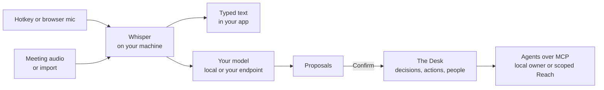

<p align="center">
  
</p>

<h3 align="center">Hold a key, speak, it types. Record a meeting, it closes the loop. All local.</h3>

<p align="center">
  <a href="LICENSE"></a>
  
  
  
</p>

<p align="center">
  <a href="#quick-start">Quick start</a> ·
  <a href="#what-it-does">What it does</a> ·
  <a href="#how-it-compares-mid-2026">Compare</a> ·
  <a href="docs/README.md">Docs</a>
</p>

---

You lead a team. Your day happens in two places: at the keyboard and in meetings.
HoldSpeak is one local copilot for both.

- **Speak.** Hold a key in any app, say what you mean, release. The text lands in the focused field. It learns your words and your corrections.
- **Meet.** Record or import a meeting. You get decisions, action items, and follow-ups to confirm, not a recording to listen to again.
- **Lead.** Both feed one Desk. It shows what needs you across your projects, your people, and your week.

Whisper runs on your machine. The language model is yours: a local GGUF or MLX model, or any OpenAI-compatible endpoint you choose. There is no account and no HoldSpeak cloud.

<p align="center">
  
</p>

## What it does

### Voice typing that learns how you work

Hold the hotkey (Right Option by default), speak, and release. The text goes into the app you are in: your editor, your terminal, a chat box.

- **The dictation pipeline** adds your project's facts and context, and can rewrite a rough prompt with your model before it types.
- **Teach it once.** Select **Wrong** on a result, correct it, and select **Teach**. The next matching dictation comes out right.
- **See the receipts.** The dictation journal records what you said, what it typed, and how long it took. The learning digest shows each rule it learned and when it fired. Replay runs an old utterance through the updated pipeline, so you see the improvement.
- **Voice commands** and a wake word run actions you define.

### Meetings that end with the loop closed

Record your microphone and system audio, or import a recording or a transcript file.

- **14 built-in plugins** read the transcript on your model and extract decisions, action items, risks, requirements, and more.
- **You stay in charge.** Meeting intelligence saves the summary and the extracted action items. Decisions arrive as proposals: select **Confirm** to create the linked decisions and commitments.
- **Meeting aftercare** shows what is open, what was decided, and what changed since the last meeting.
- **Actuators** turn a confirmed action into a filed issue or a sent update. They show a preview first and run exactly what you saw.
- **The clock.** Connect a calendar to see your week and get a weekly brief. **Auto-record** is off by default. Turn it on for calendar events with meeting links: all of them, or only those linked to a Room. A recording arms five minutes before the event by default, then starts after a countdown.

### A Desk for the work you lead

<p align="center">
  
</p>

- **Needs you** ranks what waits on you across every project: overdue actions, decisions to review, people to answer.
- **Project Rooms** hold one project each: its sources (GitHub, Jira, Confluence, meetings), its health, and its people. **Draft update** writes the weekly status from those records. You review it before it goes out.
- **People** keeps your reports and peers. Before a 1:1, the 1:1 card collects what is open between you.
- **Threads** are saved conversations with your records as sources. Keep a reply as a Note.
- **Search** (`⌘K`) finds Notes, Meetings, Decisions, and Threads.

### Built for agents, on your terms

One service layer declares every operation. The web app, the MCP server, and the tests all reach the same operation, with the same authority checks.

- **The MCP sidecar** gives Claude Code, Cursor, or any MCP client 248 tools across 43 families.
- **A tool name is not a permission.** The local MCP sidecar acts with your owner authority. Agents that use Reach are limited by their credential's tool palette and your grants. Each consequential write leaves a Receipt.
- **Reach** lets a remote agent connect with a scoped credential: a tool palette and a time limit, shown once.
- **Extend it** with your own [meeting plugins](docs/PLUGIN_AUTHORING.md) and [activity connectors](docs/CONNECTOR_DEVELOPMENT.md).

## How it works


```mermaid
flowchart LR
    K["Hotkey or browser mic"] --> W["Whisper<br/>on your machine"]
    M["Meeting audio<br/>or import"] --> W
    W --> T["Typed text<br/>in your app"]
    W --> L["Your model<br/>local or your endpoint"]
    L --> P["Proposals"]
    P -->|Confirm| D["The Desk<br/>decisions, actions, people"]
    D --> A["Agents over MCP<br/>local owner or scoped Reach"]
```

Transcription is always local. Model work goes to the host you assign in **Settings > Models**, and the Desk shows that host before you run. See [Security & Privacy](docs/SECURITY.md) for every data boundary.

## Quick start

You need Python 3.10+, [`uv`](https://docs.astral.sh/uv/), Node.js 22.12+, and a C++ compiler (the local model runtime builds from source).

```sh
git clone https://github.com/karolswdev/HoldSpeak.git
cd HoldSpeak
uv venv && source .venv/bin/activate
uv pip install -e .            # Linux: uv pip install -e '.[linux]'
holdspeak
```

Then, in the browser tab that HoldSpeak opens:

1. Select **Set up local AI**. It downloads the speech model and a starter language model.
2. When **First words** shows **SPEECH READY**, select **Dictate one sentence**.
3. Speak, select **Stop**, then select **Keep as note**.

Setup then offers your calendar and connections. Set them up now, or select **Continue later** to enter the Desk. If something does not work, run `holdspeak doctor`. It tells you what is broken and what to do.

Full instructions, permissions, and Linux packages: [Getting Started](docs/GETTING_STARTED.md).

## Platform support

| Capability | macOS (Apple Silicon) | Linux X11 | Linux Wayland |
| --- | --- | --- | --- |
| Transcription | MLX Whisper | faster-whisper | faster-whisper |
| Global hotkey and typing | Yes, after you grant permissions | Yes | Best effort (compositor limits) |
| Meeting capture | Microphone + BlackHole system audio | Microphone + PulseAudio/PipeWire | Microphone + PulseAudio/PipeWire |

The web app also takes browser microphone input. There is no Windows support today.

## How it compares (mid-2026)

| Tool or category | They do better | HoldSpeak does better | Pick them if |
| --- | --- | --- | --- |
| OS dictation (Apple Dictation, Windows Voice Typing) | Zero setup, free, always there | Your own models, the learning loop, meetings | You dictate occasionally |
| Local Whisper menu-bar apps (superwhisper, MacWhisper, VoiceInk) | Simpler setup, polished single-purpose UX | Local LLM rewriting, the visible learning loop, meetings, Linux | You want local transcription on a Mac and nothing else |
| AI dictation services (Wispr Flow, Aqua Voice) | Strong accuracy and editing UX, no model management | Everything local, open source, no subscription, meetings | Your voice in their cloud is acceptable to you |
| Talon | The deepest hands-free coding control, a mature ecosystem | Prose dictation with LLM rewriting, meetings, a lower learning curve | You need full hands-free computer control |
| Raw Whisper tooling (whisper.cpp, faster-whisper) | Total control, minimal surface | A product: typing, routing, journal, meetings, a Desk | You enjoy building your own pipeline |

**The honest trade-offs.** HoldSpeak is 0.x and pre-alpha: defaults and APIs still change. The smart parts need a local model or an endpoint you provide. Setup is heavier than a menu-bar app. Wayland limits global hotkeys to best effort.

## Documentation

| Start with | Then |
| --- | --- |
| [What is HoldSpeak?](docs/WHAT_IS_HOLDSPEAK.md): the product on one page | [User Guide](docs/USER_GUIDE.md): every daily task |
| [Getting Started](docs/GETTING_STARTED.md): install and first run | [Meeting mode](docs/MEETING_MODE_GUIDE.md) and [Dictation pipeline](docs/DICTATION_PIPELINE_GUIDE.md) |
| [Models](docs/MODELS.md): pick and assign your models | [Architecture](docs/ARCHITECTURE.md): the runtime and data flow |

Every guide and reference is in the [documentation index](docs/README.md).

## Contributing

HoldSpeak is open source under the [Apache License 2.0](LICENSE). See [Contributing](CONTRIBUTING.md) for development setup and tests, and the [change history](CHANGELOG.md) for what changed.
