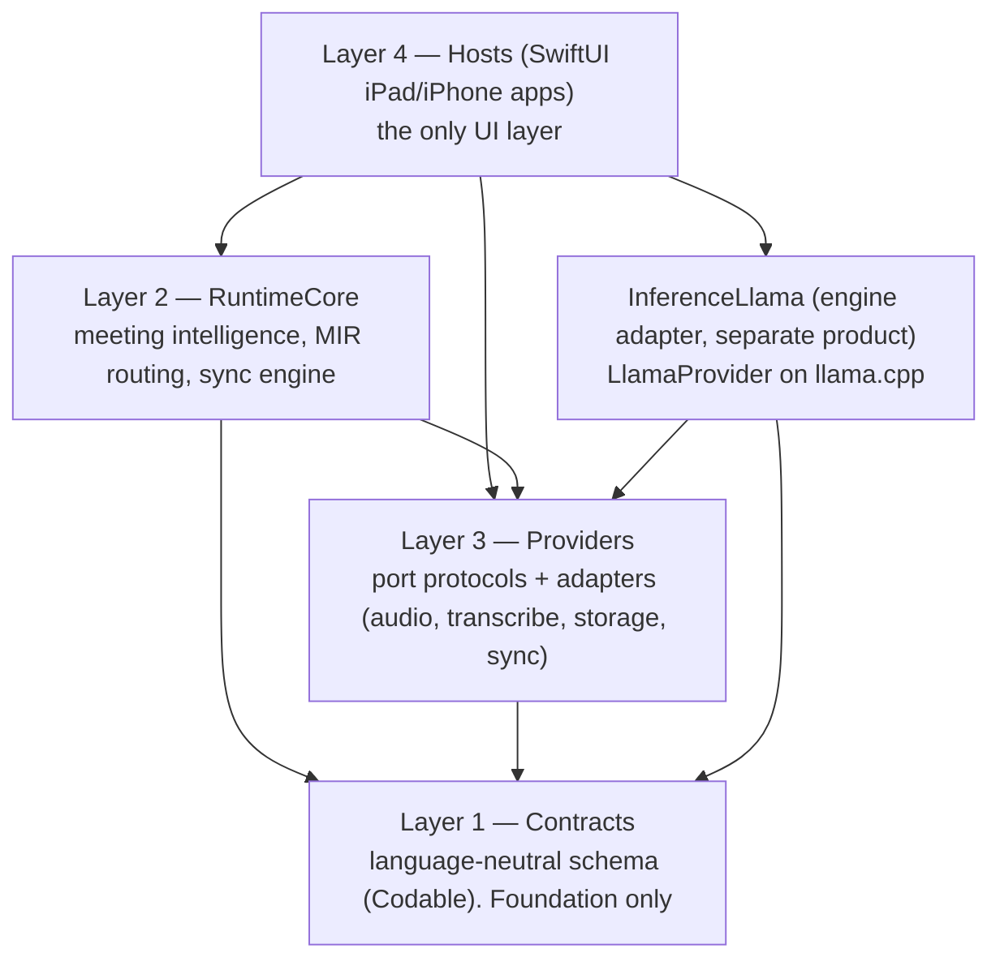
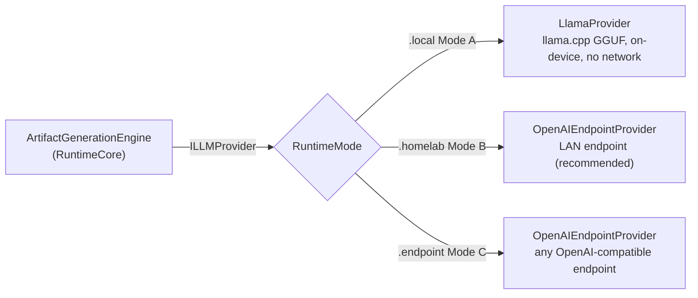
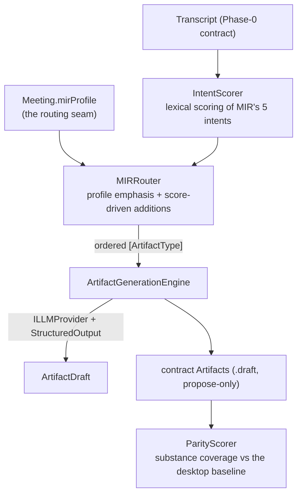
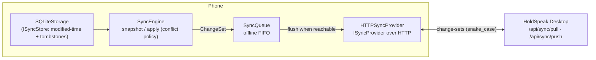

# HoldSpeak Mobile Runtime — architecture

The map a contributor reads first: how the Apple mobile runtime fits together and
where each piece lives. It traces the shipped `apple/` SwiftPM package against the
charter's four-layer design. Roadmap + rationale live in
[`../pm/roadmap/holdspeak-mobile/`](../pm/roadmap/holdspeak-mobile/README.md); this
is the code map.

> The objective is not "an iPad version of HoldSpeak" but the **first mobile runtime
> of the HoldSpeak ecosystem** — a new host that executes HoldSpeak workloads on
> Apple hardware while staying contract-compatible with the desktop/server runtimes.

## The four layers

**The dependency rule:** `Contracts`, `RuntimeCore`, and `Providers` never import
SwiftUI / UIKit / WebView — only `Hosts` (Layer 4) bears UI. And the native LLM
engine (llama.cpp) lives **only** in the separate `InferenceLlama` product, so the
domain (`Contracts`/`RuntimeCore`) never links it. The package manifest
([`Package.swift`](./Package.swift)) and a layer-guard test enforce this.

| Layer | Target | What | Imports |
|---|---|---|---|
| 1 | `Contracts` | The interop spine — `Meeting`, `Transcript`, `Segment`, `ActionItem`, `Decision`/`Risk`/`Requirement` via `Artifact`, `IntelSnapshot`, `IntentWindow`, plus the sync envelope (`ChangeSet`/`Synced`/`SyncMetadata`). The coder (snake_case ⇄ camelCase, UTC-Z). | Foundation |
| 2 | `RuntimeCore` | Meeting-intelligence engine, MIR routing, the sync engine. No UI, no engine. | Contracts, Providers |
| 3 | `Providers` | The port protocols (`I*`) + their Foundation adapters (audio core, transcription registry, SQLite storage, model store/downloader, HTTP sync + queue, the endpoint LLM provider). | Contracts |
| 3 | `InferenceLlama` | `LlamaProvider` — the on-device (Mode A) `ILLMProvider` on **llama.cpp via LLM.swift**. Kept a separate product so the engine never links into the domain. | Providers, Contracts, LLM.swift |
| 4 | `Hosts` | The SwiftUI iPad/iPhone apps (Phases 8–9). | RuntimeCore, Providers, Contracts |

## The provider seams (Layer 3)

The Runtime Core depends only on these protocols ([`Providers.swift`](./Sources/Providers/Providers.swift)),
never on a concrete adapter — so engines/transports are swappable:

- `IAudioCapture` — streamed 16 kHz mono PCM16 capture (`AudioCaptureService` + the
  bounded `AudioAccumulator` + `WavWriter`).
- `ITranscriber` — audio → contract `Segment`s (WhisperKit adapter device-gated; the
  `WhisperLanguage` registry + model policy are host-side).
- `ILLMProvider` — `complete(prompt:) -> String`. **Three implementations behind one
  seam** (see Inference below).
- `IStorage` — meeting/artifact CRUD (`SQLiteStorage`).
- `ISyncStore` — the sync-facing view of the store (modified-time + tombstones).
- `ISyncProvider` — `push`/`pull` change-sets (`HTTPSyncProvider`).

## Inference — one seam, three modes

`ILLMProvider` is the only thing the intelligence engine knows. The active mode is a
user **setting** (`RuntimeMode`), resolved by `InferenceProviderFactory`
([`InferenceSettings.swift`](./Sources/Providers/Inference/InferenceSettings.swift)):

- **Mode A — `LlamaProvider`** (`InferenceLlama`): loads a GGUF and generates with no
  network. Per-device tiers (`InferenceModelPolicy`: 4B iPhone / 8B iPad / 12B+
  plugged-in only).
- **Modes B/C — `OpenAIEndpointProvider`** (`Providers`): `POST {base}/chat/completions`
  over the LAN/homelab or any OpenAI-compatible endpoint — the iPad reaches a model
  far larger than it could load locally, spending no unified memory.

**Model packaging** ([`ModelCatalog`](./Sources/Providers/Inference/ModelCatalog.swift) /
[`ModelStore`](./Sources/Providers/Inference/ModelStore.swift) /
[`ModelDownloader`](./Sources/Providers/Inference/ModelDownloader.swift)): weights
arrive two ways — **Files sideload** (`ModelStore.importModel`) or **Hugging Face
download** (`ModelDownloader`, by pinned resolve-URL with progress) — never bundled
in the binary. The store resolves the per-device default model.

`StructuredOutput` ([file](./Sources/Providers/Inference/StructuredOutput.swift))
turns messy model text into validated contract values (extract JSON → decode through
the contract `Codable` → bounded repair-retry) — the engine-agnostic floor under any
provider.

## Meeting intelligence — transcript to artifacts

The **MIR port** ([`MIRRouter`](./Sources/RuntimeCore/MeetingIntelligence/MIRRouter.swift) /
[`RoutedArtifactGenerator`](./Sources/RuntimeCore/MeetingIntelligence/RoutedArtifactGenerator.swift))
makes generation profile-driven: the active profile (carried on `Meeting.mirProfile`)
plus deterministic lexical intent scores select which artifact types the
[`ArtifactGenerationEngine`](./Sources/RuntimeCore/MeetingIntelligence/ArtifactGenerationEngine.swift)
emphasizes. Every artifact is a `.draft` proposal (Propose → Review → Approve →
Execute is preserved; the runtime never acts on its own). The
[`ParityHarness`](./Sources/RuntimeCore/MeetingIntelligence/ParityHarness.swift)
scores output on substance coverage, not exact strings.

## Sync — local-first cross-device continuity

The sync object is the **contract entities themselves**, wrapped in a thin envelope
([`Sync.swift`](./Sources/Contracts/Sync.swift): `ChangeSet` of `Synced<T>`; payload
= the unmodified entity, `nil` ⇔ tombstone) — no parallel schema that can drift. The
[`SyncEngine`](./Sources/RuntimeCore/Sync/SyncEngine.swift) snapshots/applies with a
**conflict policy** (last-writer-wins by `last_modified`; concurrent same-time
divergence surfaced non-destructively; tombstone no-resurrect; idempotent). The
[`HTTPSyncProvider`](./Sources/Providers/Sync/HTTPSyncProvider.swift) +
[`SyncQueue`](./Sources/Providers/Sync/SyncQueue.swift) carry it to a desktop/homelab
peer, offline-tolerant (sync is never on the capture/review path). The desktop
receiver is `holdspeak/web/routes/sync.py` in the Python product.

## Persistence

[`SQLiteStorage`](./Sources/Providers/Storage/SQLiteStorage.swift) (built-in
`SQLite3`, WAL, `SCHEMA_VERSION = 2`): each entity stored as its contract JSON; v2
added `modified_at` + soft-delete tombstones for sync. Crash-recovery /
atomicity / integrity are host-tested.

## On-device deploy tooling (`apple/scripts/`)

SwiftPM can't emit a signed iOS `.app`, so device builds stage sources into a
generated Xcode project:

- `gate1-device.sh` / `gen-device-project.rb` — the Phase-1 shell on real metal.
- `gen-inference-harness.rb` / `harness-device.sh` — the Mode-C inference harness
  (stages Contracts+Providers+RuntimeCore into one module).
- `push-model-device.sh` — push a GGUF into the app container via `devicectl` (the
  developer's third model-delivery path alongside sideload + download).

## Testing

`cd apple && swift test` is host-hermetic and fast. Tests that need a real model or
endpoint are **opt-in** via env vars and skip by default:
`HS_LIVE_ENDPOINT` (endpoint provider + parity verdict), `HS_GGUF_PATH` (the
on-device engine on host Metal), `HS_HF_DOWNLOAD=1` (the real Hugging Face download).
On-hardware gates (capture, WhisperKit latency, the 30-min/4-hour runs, live
cross-device sync) run on a physical device via the deploy scripts.
