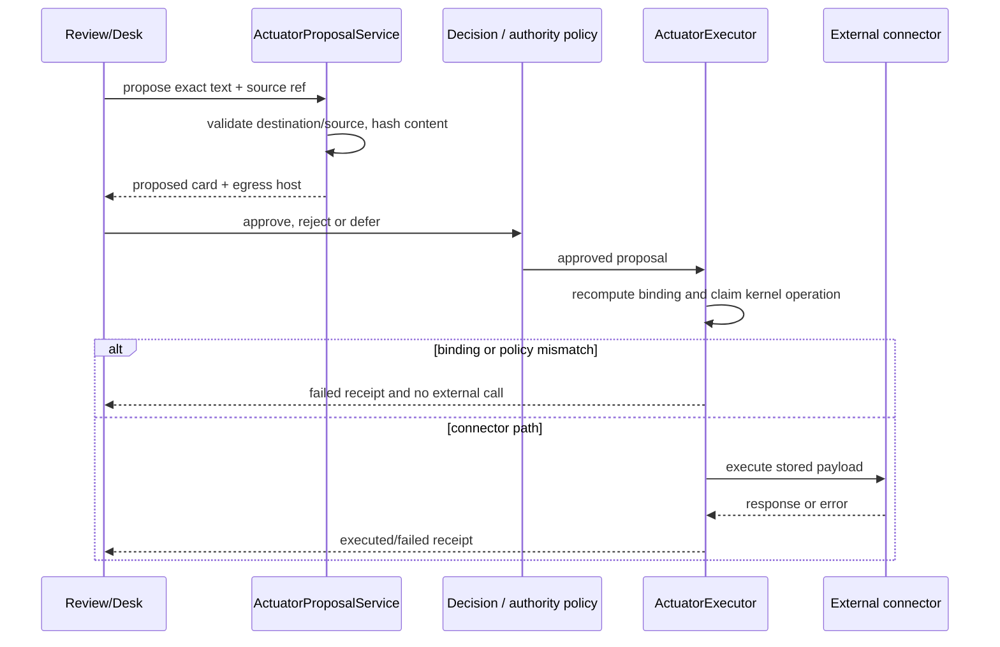

# Actuator development

This document supplements the canonical [Plugin Authoring](PLUGIN_AUTHORING.md)
and [Connector Development](CONNECTOR_DEVELOPMENT.md) guides. It records the
external-effect seam at source snapshot `675401a857b85336d4acaa8c65383dfc9636e4c8`.

## The contract

An actuator plugin proposes an effect. Its `run(context)` returns an
`ActuatorProposal` with a target, action, human-readable preview, payload,
reversibility and required capabilities
(`holdspeak/plugins/actuators.py::ActuatorProposal`, lines 41-84). It never
opens a socket or runs a CLI from `run`. The host stores the proposal as
`proposed`; a separate authority/lifecycle path decides whether it can execute.

The proposal must be faithful to the effect. For a GitHub issue this means
repo, title and body. For Slack or a webhook it means the exact text that will
be sent. Destination credentials stay in host configuration. The proposal may
carry a normalized destination and hashes, but never the secret URL or token.

## Lifecycle and idempotency

`ActuatorProposalService._propose` validates configured Slack/webhook/GitHub
destinations, resolves an optional Meeting/Note/Artifact source, and creates a
stable idempotency key from destination plus content
(`holdspeak/services/actuator_service.py::ActuatorProposalService._propose`,
lines 50-86). Repeating the same source and content returns the same proposal;
changing the content creates a new one. Source identity puts the receipt back
on the originating Desk subject.

`ActuatorExecutor.execute` has five material gates: proposal status must be
`approved`; master and actuator allow-lists must admit it; the current
authority binding must equal the binding captured at approval; a scoped grant,
if used, must match and consume atomically; and only then may the connector
run (`holdspeak/plugins/actuator_executor.py::execute`, lines 102-208). The
connector result is stored, the proposal moves to `executed`, and the kernel
operation receives a terminal receipt. Any connector exception moves it to
`failed` with a reason. Re-running an executed proposal does not send twice.

## Built-in write effects

| Plugin | Action | Restriction |
|---|---|---|
| `GithubIssueActuator` | `gh issue create` | opt-in actuator; validates owner/name repo and allowlisted argv |
| GitHub PR comment connector | `gh pr comment` | exact PR target; no merge/close/force-push |
| GitHub PR status connector | GitHub API status POST | fixed status endpoint and signed/expected SHA shape |
| `WebhookPostActuator` | configured HTTP POST | configured host allow-list; no URL in responses or broadcasts |
| desk Slack adapter | configured Slack webhook | preview bytes equal wire body; control posture or per-action decision |

The canonical guides contain authoring examples and fixture harnesses. Keep
those contracts authoritative; add an actuator here only when it has a real
manifest, explicit destination policy and a focused assertion.

## Failure, receipt and security rules

- Missing configuration is a named proposal error. It does not create a
  network call.
- Rejected or unapproved proposals do not call a connector.
- Authority binding mismatch fails before egress and records “no side effect”.
- Host refusal, timeout, non-2xx response and connector exceptions are failed
  receipts with retry information; they are not successful results.
- Proposal and broadcast payloads omit secrets. The egress host is shown at the
  point where the call leaves the machine.
- A fixed destination may execute under the configured control posture; a
  free destination still requires the applicable owner decision. A suggestion,
  model output or Qlippy dismissal never authorizes an effect.
- A consequential action is admitted through the kernel and closes with a
  receipt, including refusal, failure and indeterminate outcomes.

`tests/unit/test_actuator_executor.py` checks each gate, grant consumption,
binding mismatch and audit. The GitHub and webhook actuator tests check
allowlists, shell argument safety, no-egress paths, nonzero results and
terminal audit. `tests/integration/test_web_companion_slack.py` additionally
checks deduplication, Yolo fixed-destination behavior, URL removal between
proposal and approval, secret omission, and receipt projection. These tests
were inspected and not run in this documentation audit.
