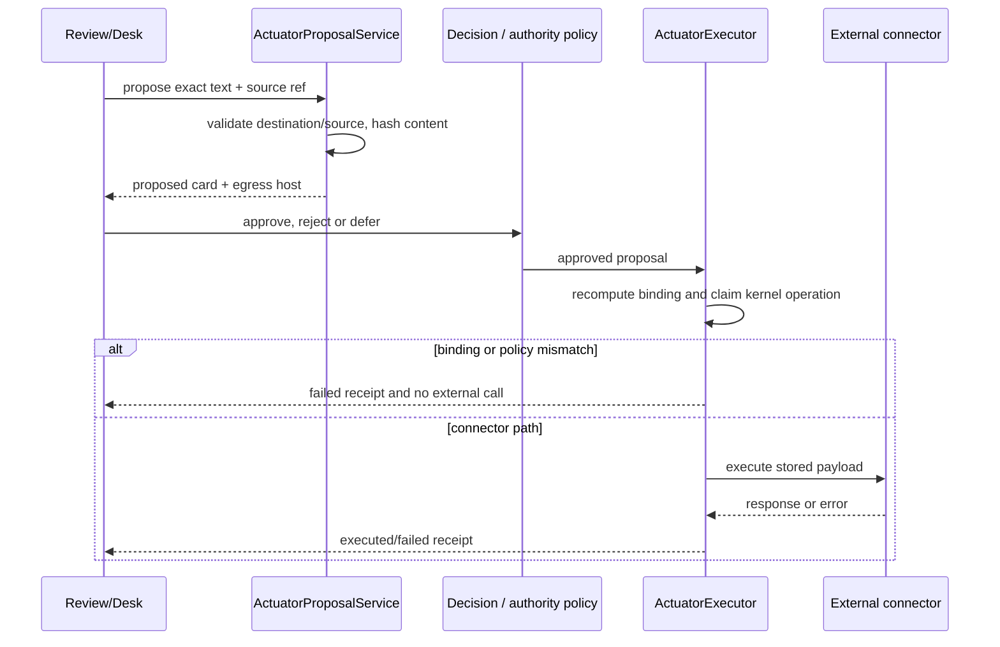

# Actuator Development

An actuator is a plugin that proposes an effect outside HoldSpeak, such as a
GitHub issue or a webhook post. This guide covers the contract, the gates, the
write connectors and the tests. For plugin basics, read
[Plugin Authoring](PLUGIN_AUTHORING.md) first. For read-only activity
connectors, see [Connector Development](CONNECTOR_DEVELOPMENT.md).

The rule: no external effect happens without recorded authority, and the effect
that runs is exactly the effect that the owner saw in the preview.

## Contract

An actuator sets `kind = "actuator"` and `required_capabilities = ["actuator"]`.
Its `run(context)` returns an `ActuatorProposal`
([`holdspeak/plugins/actuators.py`](../holdspeak/plugins/actuators.py)):

| Field | Meaning |
|---|---|
| `target` | The system the effect lands on, for example `github`, `webhook` or `outbox`. |
| `action` | The verb, for example `create_issue`. |
| `preview` | A plain description of exactly what will happen. |
| `payload` | The machine form of the effect. It is the source of truth for execution. |
| `reversible` | Whether the effect can be undone. The approver sees it. |
| `required_capabilities` | Capabilities that the execution needs. |

`run()` must not open a socket or run a CLI. It only builds the proposal. If
there is nothing to propose, it raises. The host then records a plain error and
no proposal.

The proposal must match the effect. For a GitHub issue, it holds the repo, the
title and the body. For a webhook, it holds the exact text to send. Secrets stay
in host configuration. A proposal can carry a normalized destination and
hashes, but never a secret URL or token.

The `actuator` capability is off by default. A registered actuator is `blocked`
until the host enables it.

## Lifecycle

A proposal moves through these states. Each change is recorded.

```
proposed -> approved -> executed
    |           |
    |           +-> failed -> approved (retry)
    +-> rejected
```


```mermaid
sequenceDiagram
    participant R as Review/Desk
    participant S as ActuatorProposalService
    participant D as Decision / authority policy
    participant E as ActuatorExecutor
    participant X as External connector
    R->>S: propose exact text + source ref
    S->>S: validate destination/source, hash content
    S-->>R: proposed card + egress host
    R->>D: approve, reject or defer
    D->>E: approved proposal
    E->>E: recompute binding and claim kernel operation
    alt binding or policy mismatch
        E-->>R: failed receipt and no external call
    else connector path
        E->>X: execute stored payload
        X-->>E: response or error
        E-->>R: executed/failed receipt
    end
```

`ActuatorProposalService`
([`holdspeak/services/actuator_service.py`](../holdspeak/services/actuator_service.py))
creates proposals for webhook and GitHub destinations. A Slack proposal is
refused with `slack_moved_to_channel`. The service validates the destination. It resolves an optional `source_ref` that names a Meeting, a Note
or an Artifact. It makes an idempotency key from the destination and the
content. The same source and content return the same proposal. New content
makes a new proposal. The source puts the receipt back on the Desk subject that
it came from.

## Gates

`ActuatorExecutor.execute(proposal_id)`
([`holdspeak/plugins/actuator_executor.py`](../holdspeak/plugins/actuator_executor.py))
is the one place where an effect happens. It checks, in order:

1. The proposal status is `approved`.
2. The master switch and the allow-list admit the actuator. A refusal here
   changes no state, so the owner can fix the setting and retry.
3. The current authority binding equals the binding saved at approval. A
   mismatch ends as `failed` with no outside call.
4. A scoped grant, if the proposal uses one, matches the operation. The
   executor consumes the grant in one atomic step.
5. The injected connector runs the stored payload. The executor never opens a
   socket itself.

The executor stores the result. The proposal becomes `executed`, or `failed`
with a reason if the connector raised. The kernel operation closes with a
receipt. An executed proposal does not send a second time.

Who authorizes an execution depends on the control posture:

- Under YOLO, an eligible operation to a registered fixed destination can run
  at once.
- Under Normal and Secure, the owner must decide, or a bounded grant must
  match.
- A free destination always needs the owner decision.
- A suggestion, a model output or a dismissed Qlippy card never authorizes an
  effect.

Two config keys set the governance. `meeting.allow_actuators` is the master
switch. `meeting.allowed_actuators` is the allow-list. The shipped defaults are
`true` and `["*"]`. A host or executor that you build in code stays closed
unless you enable it. A project can narrow both values.

## Write connectors

The executor receives a connector from its caller. To reach a real system,
build the connector with `build_gated_connector`
([`holdspeak/plugins/gated_connector.py`](../holdspeak/plugins/gated_connector.py)).
It sends every call through `PermissionGate` under a `WriteConnectorManifest`.
The manifest only narrows what can reach the outside. It never replaces a gate
above it.

A manifest declares one permission and the operations that it allows:

| Permission | Gate operation | Allow-list field | Example |
|---|---|---|---|
| `shell:exec` | `run_subprocess` | `allowed_argv_prefixes` | `gh issue create` |
| `network:outbound` | `open_outbound_socket` | `allowed_hosts` | `hooks.slack.com` |

An empty allow-list admits nothing. For each proposal the connector runs
`plan`, then the allow-check, then the gate, then `interpret`. An operation that
the manifest does not admit raises `ConnectorOperationRefused` before the gate.
The proposal ends as `failed` and no effect happens.

```python
connector = build_gated_connector(
    manifest,
    plan=plan,            # proposal -> one GatedOperation
    interpret=interpret,  # raw gate result -> result dict
    runner=runner,        # shell:exec only; defaults to subprocess.run
    opener=opener,        # network:outbound only; defaults to a urllib POST
)
```

## Built-in write effects

The three plugin actuators each have a `register_*` function. None of them is
part of `register_builtin_plugins`. Registration is explicit.

| Actuator | Effect | Limits |
|---|---|---|
| `followup_ticket_actuator` | Writes a follow-up ticket as a local Markdown file in an outbox. | No network. Reversible. The reference for tests. |
| `github_issue_actuator` | `gh issue create` | Repo must be `owner/name`. The argv runs without a shell, so payload text is only an argument. |
| `github_pr_actuator` | `gh pr comment` or one `gh api` commit-status POST | Not a plugin. It is a connector builder, `build_github_pr_connector`. An exact PR or SHA. No merge, close or force-push. |
| `webhook_post_actuator` | HTTP POST to a configured URL | Host must be on `meeting.webhook_allowed_hosts`. The URL never appears in a response or broadcast. |

A Slack or Teams incoming webhook is a URL whose host you add to
`webhook_allowed_hosts`. It is not a separate integration. The Desk Slack
adapter is parked. Sending a document to Slack uses `channel.send`, which the
owner presses. A posture policy cannot press it.

## Live proposals

When a proposal is stored for a meeting, the host sends a read-only
`actuator_proposed` frame. The frame holds `id`, `meeting_id`, `plugin_id`,
`status`, `target`, `action`, `preview`, `reversible` and `created_at`. It never
holds the `payload`. The
dashboard shows the proposal with Approve and Reject.

Both actions use `POST /api/meetings/{id}/proposals/{pid}/decision`. The body
sets `decision` to `approved` or `rejected`. The request records the decision. For a registered connector target, it can also
call the executor. Nothing is sent unless an actuator is registered and its
capability is on.

## Failure and receipts

- Missing configuration is a named proposal error. It makes no network call.
- A rejected or unapproved proposal never reaches a connector.
- An authority mismatch fails before egress. The receipt says no effect
  happened.
- A refusal, a timeout, a non-2xx reply and a connector exception are failed
  receipts with retry information. They are never a success.
- Proposals and broadcasts omit secrets. The UI shows the egress host where the
  call leaves the machine.
- Every consequential action closes with a receipt, including refusal, failure
  and an unknown outcome.

## Test an actuator

Do not use real egress in tests. Inject the runner or the HTTP client.

Assert these cases:

- The proposal matches the intended effect.
- Execution without approval, with the switch off, off the allow-list, or for an
  operation the manifest does not admit makes no outside call.
- Approve then execute reaches the `executed` state with an audit record.
- A payload change after approval ends as `failed`.

Reference tests:

- [`tests/unit/test_actuator_executor.py`](../tests/unit/test_actuator_executor.py):
  each gate, grant use, binding mismatch and audit.
- [`tests/unit/test_actuator_reference.py`](../tests/unit/test_actuator_reference.py):
  the full loop with the outbox actuator.
- [`tests/unit/test_github_issue_actuator.py`](../tests/unit/test_github_issue_actuator.py)
  and [`tests/unit/test_webhook_post_actuator.py`](../tests/unit/test_webhook_post_actuator.py):
  allow-lists, shell argument safety, no-egress paths and failure results.
- [`tests/unit/test_live_proposals.py`](../tests/unit/test_live_proposals.py):
  the live frame.
- [`tests/integration/test_web_companion_slack.py`](../tests/integration/test_web_companion_slack.py):
  deduplication, fixed-destination behavior under YOLO, secret omission and
  receipts.

Add an actuator only when it has a real manifest, an explicit destination
policy and a focused test.
