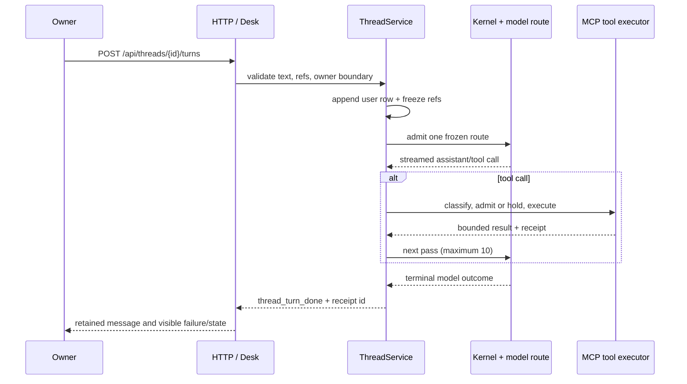

# Agents, Threads, Interview, MCP, memory and grounding

Source audit at `675401a857b85336d4acaa8c65383dfc9636e4c8`. This document
describes executable seams and inspected assertions. Source presence is not a
release claim and none of the tests below were run for this audit.

## The persistent thread

A Thread is a durable conversation record on the hub. `ThreadRepository` owns
the thread, message, part, frozen reference, draft and tool policy rows
(`holdspeak/db/threads.py::ThreadRepository`, lines 183-887). The HTTP surface
is concrete:

| User capability | Served route | Current behavior |
|---|---|---|
| create/list/read/patch/park a thread | `POST /api/threads`, `GET /api/threads`, `GET /api/threads/{thread_id}`, `PATCH /api/threads/{thread_id}`, `DELETE /api/threads/{thread_id}` | CRUD and soft delete; a deleted row is not returned as a live thread |
| send a turn | `POST /api/threads/{thread_id}/turns` | persists the user message and frozen refs, then streams the assistant result |
| stop the active turn | `POST /api/threads/{thread_id}/abort` | closes the active run as `aborted`; an indeterminate receipt remains possible |
| branch or regenerate | `POST /api/threads/{thread_id}/branch`, `POST /api/threads/{thread_id}/regenerate` | creates a new message path or reruns a selected assistant path |
| keep a result | `POST /api/threads/{thread_id}/keep` | writes a separate durable artifact/note result |
| import and inspect composition | `POST /api/threads/import`, `POST /api/threads/{thread_id}/compact`, `POST /api/threads/{thread_id}/annotations`, `POST /api/threads/{thread_id}/todo` | imports, records a compaction cut, edits draft annotations, and creates a todo |
| tool decision | `POST /api/threads/{thread_id}/decide` | resolves a held tool call; the decision is tied to the active call handle |
| Interview command/read | `POST /api/threads/{thread_id}/interview`, `GET /api/threads/{thread_id}/interview/promotions` | uses the same Thread and the owner-only Interview reducer |

The route roster is also recorded in [`api-surface.json`](api-surface.json),
whose defining module for these paths is `web.routes.threads`.

`ThreadService.start_turn` validates the thread and text, separates People
references from grounding references, freezes the references before the model
admission, and returns ids before the RuntimeBus stream starts
(`holdspeak/services/thread_service.py::ThreadService.start_turn`, lines
300-558). The stream emits `thread_turn_started`, deltas, tool pending/result,
status and `thread_turn_done` frames. The pass loop is capped at ten passes and
each tool call has a 30 second deadline (`_CHAT_PASS_CAP` and
`_TOOL_DEADLINE_S`, lines 61-65). A model tool palette is resolved once at
admission; a mid-turn mode change cannot widen it.

Tool calls use the closed classification and decision table in
`holdspeak/services/thread_tools.py::resolve_tool_decision` (lines 407-445).
`ThreadToolExecutor.admit`, `decide`, `execute` and `cancel` (lines 496-815)
produce a handle state such as `admitted`, `awaiting_decision`, `denied`,
`completed` or `discarded`. `evidence_read` and `candidate_builder` are
different from `effect_proposal`; the control mode and a per-thread policy
decide whether a call runs or waits. Sensitive People results remain marked
sensitive. Tool results are capped at 32,768 bytes. An aborted turn carries
`receipt_id = indeterminate` when the final outcome cannot be known.

Inspected assertions in `tests/unit/test_thread_tool_loop.py` prove the frame
order, held approval, denial, ten-pass cap and abort receipt shape. The same
file proves cloud-route People text is redacted by
`ThreadService._m1_redactor`; `tests/unit/test_thread_tool_gate.py` pins the
allow/deny/hold table, child receipts, elicitation, cancellation and tool
classification. `tests/integration/test_threads_api.py` checks CRUD, import,
soft-delete and idempotent import. These are assertion evidence only here;
`execution: not_run`.

## Interview is a Thread mode

Interview does not add a second model runtime. `INTERVIEW_MODE_ID` is the
seeded mode `hs-seed-mode-interview`; its descriptor has eight sections:
Goals, Projects, What matters, Cadences, People, Decision log, Delegation, and
Sources & models (`holdspeak/services/interview_contracts.py::SECTIONS`, lines
10-49). Its palette is the intersection of the section allow-list and the
registered MCP catalogue (`InterviewService.palette`, lines 109-119).

Interview state is a durable revisioned projection: facts keep exact quoted
user provenance, suggestions name their supporting fact ids and disposition,
and the section changes without making a new Thread
(`holdspeak/services/interview_service.py::InterviewService.get`, lines
79-91). `InterviewService.command` requires the owner, an expected revision,
and a caller command id. It uses an immediate transaction, rejects a stale
revision, replays the same command and digest without applying it twice, and
prunes facts whose source message is deleted, sensitive or a draft (lines
142-190). A People section is a protected handoff; ThreadService refuses to
persist a People-content turn until the owner continues in People.

The Interview MCP family exposes `interview.get`, `interview.change_section`,
`interview.record_fact`, and `interview.suggest`
(`holdspeak/mcp/families/interview.py::TOOLS`, lines 21-42). Suggestions are
manual or prerequisite-aware proposals. They do not install automation, grant
authority, or imply that an unsupported integration exists. The inspected
tests are `tests/unit/test_interview_service.py::test_command_replay_and_conflict_are_atomic`,
`::test_fact_requires_actual_permitted_user_provenance`,
`::test_people_handoff_refuses_before_input_persistence`, and
`tests/integration/test_interview_conversation.py::test_llm_turn_calls_real_tools_saves_suggestion_keeps_result_and_revisits`.

## MCP and the model/tool boundary

The HTTP MCP transport is one served route, `POST /api/mcp`, implemented by
`holdspeak/web/routes/mcp_http.py::mcp_http_endpoint` (lines 71-198). It is
loopback-guarded for owner use; remote use requires the configured remote
credential path. The sidecar catalogue is composed from family `TOOLS` and
dispatches into the same services. Tool names are contracts, not permissions.

Relevant families include `ask`, `thread`, `interview`, `memory`, `coder`,
`sequence`, `plugin_job`, `project`, `practice_recipe`, `people`, and the
primitive/workbench catalogue. `holdspeak/mcp/tools.py::TOOLS` supplies the
closed desk and Workbench schema. `tests/unit/test_mcp_tools.py` checks closed
schemas, retired tools and representative Workbench/recipe/zone/KB calls;
`tests/unit/test_mcp_phase133_ask.py` checks grounding, model receipt, cancel
and keep; `tests/unit/test_mcp_phase133_coder_memory.py` checks coder list/get/
audit and memory search. MCP dispatch errors remain typed `isError` results.

## Grounding and memory

Grounding is explicit evidence hydration, not a hidden prompt search. The
shared resolver is `holdspeak/grounding.py::hydrate_grounding_blocks_detailed`
(lines 602-668). It accepts meetings, artifacts, qualified references and
optional memory search; it expands a meeting to summary or full transcript,
deduplicates visited refs, marks unknown refs, and enforces
`GROUNDING_MAX_REFS = 16` and `GROUNDING_TRANSCRIPT_CAP = 12_000` (lines
24-26). The result records `selection`, `matched_count`, and `overflow_count`.
Project refs are scoped; an unqualified query may use the memory repository,
and promoted references are excluded from relevance-only reachability.

Roadmap rails use the same `GroundingBlock` through
`holdspeak/grounding_rails.py::hydrate_rails_refs` (lines 100-166). It asks the
Delivery Workbench for a named path, reads that file as opaque capped text,
and refuses unknown, stale or unreachable refs. Rail state is not parsed from
the Markdown body.

The long-horizon store is SQLite FTS-backed
(`holdspeak/db/memory.py::MemoryRepository.search`, lines 166-227 and the
kind-specific row builders). `MemoryService.search` requires a principal with
read permission and supports kind, project and time filters
(`holdspeak/services/memory_service.py::MemoryService.search`, lines 18-48).
The served routes are `GET /api/memory/search` and `GET /api/memory/recall`
(`web.routes.memory`); the MCP twin is `memory.search` with a closed schema.
Search is selection evidence, not an authority grant. An empty result is a
real empty result.

Workbench memory is a separate, advisory append-only JSONL store. It keeps at
most 100 entries, recalls at most 20 and 2,048 bytes, and injects a `[MEMORY]`
block into a Workbench prompt (`holdspeak/workbench_memory.py::append_memory`
and `::recall_for_prompt`, lines 45-96). `clear_memory` is explicit. Memory
informs a run; it never authorizes a run.

## Workflow and run boundary

Workflow definitions are authorable primitives. The served routes are
`GET /api/workflows`, `POST /api/workflows`, `GET /api/workflows/{workflow_id}`,
`PUT /api/workflows/{workflow_id}`, `DELETE /api/workflows/{workflow_id}`,
`POST /api/workflows/{workflow_id}/run`, and
`POST /api/workflows/runs/{parent_operation_id}/cancel`
(`holdspeak/web/routes/primitives/workflows.py::build_workflows_router`, lines
16-74). The native runner is
`holdspeak/services/sequence_workflow_service.py::SequenceWorkflowService`.
It parses a graph, refuses branches, joins, loops and unknown node kinds, then
freezes route/deployment evidence before admitting each child. A run returns a
parent receipt, child receipts, steps and an artifact projection. Failure policy
can hold, skip or carry output; cancel and restart reconciliation preserve a
terminal receipt or honest `indeterminate` state.

The assertions in `tests/unit/test_workflow_graph.py` cover graph decoding and
linearization refusal. `tests/unit/test_sequence_workflow_runner_migration.py`
checks authenticated parent admission, child cardinality, retries/fallback,
route and deployment immutability, cancellation, idempotent replay and crash
reconciliation. The MCP twin is `sequence.run`, `sequence.cancel`,
`workflow.run`, and `workflow.cancel` in
`holdspeak/mcp/families/sequence.py::TOOLS`; these names expose the same
admitted path rather than a free-running automation engine.

## Limits and Tuesday use

This inventory can show where a Senior Software Architect can open a saved
Thread, ask with named evidence, inspect a durable Interview state, and run a
linear Workflow with receipts. It cannot prove a configured model, live
provider, release package, or owner observation. UI shots and a live first-use
walk remain required before a surface is called ready.
