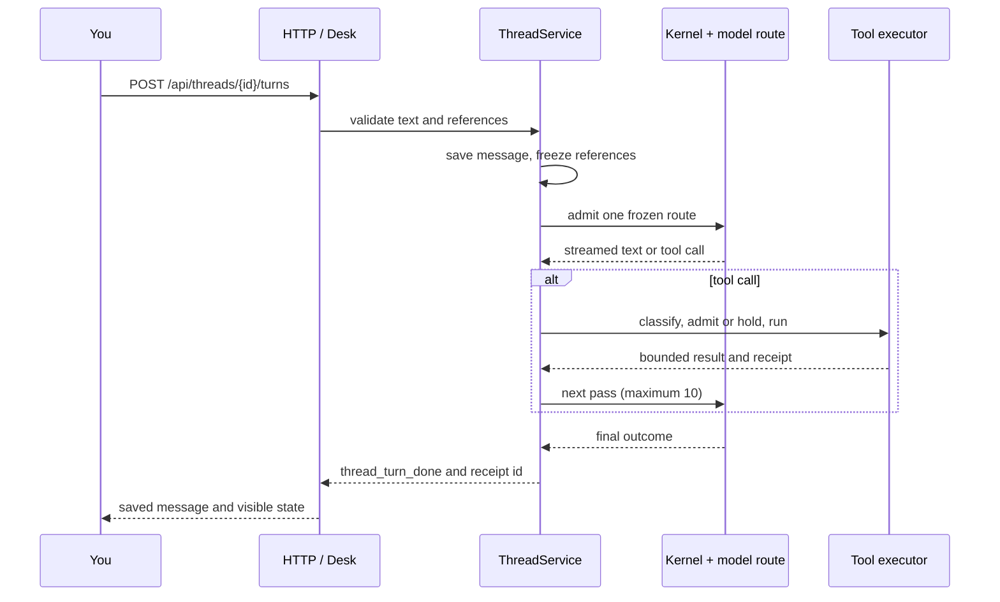

# Agents and Threads

A Thread is a saved conversation on the hub. An Agent is a persona that you
author. A Thread can run in a mode, such as Desk, Chase, Draft, Plan, Project
or Interview. A coder is a different thing: it is a live Claude or Codex
session. See [Coder integration](CODER_INTEGRATION.md).

This page describes how Threads work, what limits apply, and which routes
serve them. For the steps to start and use a Thread, see the
[User Guide](USER_GUIDE.md#threads).

## What a Thread keeps

The hub stores each Thread with its messages, message parts, frozen source
references, drafts and tool policy. Edit and regenerate actions create
branches. Delete is a soft delete: a deleted Thread does not appear as live.

| Action | Route |
|---|---|
| Create, list, read, update, delete | `POST /api/threads`, `GET /api/threads`, `GET /api/threads/{thread_id}`, `PATCH /api/threads/{thread_id}`, `DELETE /api/threads/{thread_id}` |
| Send a turn | `POST /api/threads/{thread_id}/turns` |
| Stop the active turn | `POST /api/threads/{thread_id}/abort` |
| Branch or regenerate | `POST /api/threads/{thread_id}/branch`, `POST /api/threads/{thread_id}/regenerate` |
| Keep a result as a Note or Artifact | `POST /api/threads/{thread_id}/keep` |
| Import a Thread | `POST /api/threads/import` |
| Compact, annotate, create a todo | `POST /api/threads/{thread_id}/compact`, `POST /api/threads/{thread_id}/annotations`, `DELETE /api/threads/{thread_id}/annotations/{part_id}`, `POST /api/threads/{thread_id}/todo` |
| Decide a held tool call | `POST /api/threads/{thread_id}/decide` |
| Interview command and promotions | `POST /api/threads/{thread_id}/interview`, `GET /api/threads/{thread_id}/interview/promotions` |

[`api-surface.json`](api-surface.json) lists every route.

## What happens in a turn

When you send a turn, `ThreadService.start_turn` does these steps:

1. It checks the Thread and the text.
2. It separates People references from other grounding references.
3. It freezes the references before the model call.
4. It returns the ids, then streams the result on the runtime bus.

The stream carries `thread_turn_started`, text deltas, tool pending and
tool result frames, status frames and `thread_turn_done`.

```mermaid
sequenceDiagram
    participant U as You
    participant H as HTTP / Desk
    participant T as ThreadService
    participant K as Kernel + model route
    participant M as Tool executor
    U->>H: POST /api/threads/{id}/turns
    H->>T: validate text and references
    T->>T: save message, freeze references
    T->>K: admit one frozen route
    K-->>T: streamed text or tool call
    alt tool call
        T->>M: classify, admit or hold, run
        M-->>T: bounded result and receipt
        T->>K: next pass (maximum 10)
    end
    K-->>T: final outcome
    T-->>H: thread_turn_done and receipt id
    H-->>U: saved message and visible state
```

Limits:

- A turn runs at most 10 passes.
- A tool call has a 30 second deadline.
- A tool result is capped at 32,768 bytes.
- The tool list is fixed when the turn starts. A mode change during the turn
  cannot widen it.
- An aborted turn closes as `aborted`. Its receipt id is `indeterminate`
  when the hub cannot know the final outcome.
- A turn that sends People text to a cloud route redacts that text first.

## Tool calls

A Thread can call a tool from the MCP catalogue, with these limits:

- A Thread receives only the tools that the authority table marks as work
  (`holdspeak/mcp/tool_authority.py`). It never receives a tool that sends
  data out, changes authority, or changes configuration. Those need your
  own action.
- Each tool has a class: `evidence_read`, `candidate_builder` or
  `effect_proposal`.
- A per-Thread tool policy (`allow`, `deny` or `ask`) wins first. Without a
  policy, the Control posture decides:

| Control posture | `evidence_read` | `candidate_builder` | `effect_proposal` |
|---|---|---|---|
| YOLO | runs | runs | runs |
| Normal | runs | runs | held |
| Secure | runs | held | held |

A held call waits in the decision box. You resolve it with
`POST /api/threads/{thread_id}/decide`. A tool call has one of these
states: `admitted`, `awaiting_decision`, `denied`, `completed` or
`discarded`. Sensitive People results keep their sensitive mark.

## Interview is a Thread mode

Interview is a Thread mode. It adds no second model runtime. The seeded
mode id is `hs-seed-mode-interview`. It has eight sections: Goals,
Projects, What matters, Cadences, People, Decision log, Delegation, and
Sources & models. Each section allows a fixed set of tools. The Thread's
palette is the overlap of that set and the registered MCP catalogue.

Interview state is a saved, revisioned projection:

- A fact keeps the exact words of the message that produced it.
- A suggestion names the facts that support it and its disposition.
- A command needs you as the owner, an expected revision and a command id.
  A stale revision is rejected. A repeated command with the same digest does
  not apply twice.
- A fact is removed when its source message is deleted, sensitive or a
  draft.

The People section is a handoff. The hub refuses to save a turn that holds
People content until you continue in People.

The Interview MCP tools are `interview.get`, `interview.change_section`,
`interview.record_fact` and `interview.suggest`. A suggestion is a proposal.
It does not install automation or grant authority. See the
[Interview guide](INTERVIEW.md) for the conversation.

## Grounding

Grounding is explicit. You attach evidence to a turn. The hub does not
search your data for a hidden prompt.

`hydrate_grounding_blocks_detailed` (`holdspeak/grounding.py`) resolves the
references. It accepts Meetings, Artifacts, qualified references and an
optional memory search. It expands a Meeting to a summary or a transcript
and removes duplicates. It marks an unknown reference as unknown. The caps:

- `GROUNDING_MAX_REFS = 16` references per turn.
- `GROUNDING_TRANSCRIPT_CAP = 12_000` characters per transcript.

The result reports `selection`, `matched_count` and `overflow_count`.
Project references stay in their Project scope.

Roadmap rails use `hydrate_rails_refs` (`holdspeak/grounding_rails.py`).
It asks the Delivery Workbench for a named path and reads the file as
capped plain text. It refuses unknown, stale and unreachable references.
It does not parse the Markdown body.

## Memory

Long-horizon memory is a searchable store of your Meetings, Notes,
Artifacts, decisions, Threads and other records. These routes serve it:

- `GET /api/memory/search`
- `GET /api/memory/recall`
- `GET /api/memory/pages`
- `GET /api/memory/meaning-search`, with `POST /api/memory/meaning-search/turn-on`
  and `POST /api/memory/meaning-search/turn-off`

The MCP tool is `memory.search`. A search needs a principal with read
permission. It supports kind, Project and time filters. Search selects
evidence. It does not grant authority. An empty result is a real empty
result. See [Desk memory](DESK_MEMORY.md).

Workbench memory is separate. Each Workbench keeps an append-only JSONL
file of at most 100 entries. A run recalls the most recent entries, up to
20 entries and 2,048 bytes, and adds them to the prompt in a `[MEMORY]`
block (`holdspeak/workbench_memory.py`). Memory informs a run. It never
authorizes one.

## Workflows

A Workflow is an authorable primitive. These routes serve it:

- `GET /api/workflows`, `POST /api/workflows`
- `GET /api/workflows/{workflow_id}`, `PUT /api/workflows/{workflow_id}`,
  `DELETE /api/workflows/{workflow_id}`
- `POST /api/workflows/{workflow_id}/run`
- `POST /api/workflows/runs/{parent_operation_id}/cancel`

`SequenceWorkflowService` runs a Workflow. It reads the graph and refuses a
graph that it cannot run as a line, or that has an unknown node kind. It
freezes the route evidence before each child call. A run returns a parent
receipt, child receipts, steps and an Artifact projection. A node failure
policy can hold, skip or carry the output. Cancel and restart keep a
terminal receipt or an honest `indeterminate` state.

The MCP tools are `sequence.run`, `sequence.cancel`, `workflow.run` and
`workflow.cancel`. They use the same admitted path. They are not a free
running automation engine. See [Automation](AUTOMATION.md).

## MCP

`POST /api/mcp` serves MCP over HTTP. See the [MCP sidecar](MCP_SIDECAR.md)
for tools, resources and trust rules. A tool name is a contract, not a
permission.
