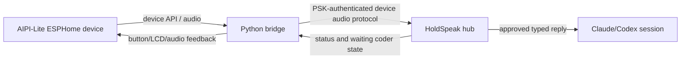

# AIPI-Lite companion

AIPI-Lite is an optional ESPHome device plus a Python bridge. Source audit at
`675401a857b85336d4acaa8c65383dfc9636e4c8`; no hardware, Wi-Fi, microphone or
bridge process was run here.

## Topology and trust

The device does not hold model credentials or operate a provider. The bridge
is a separate Python environment under `aipi-lite/.venv`, keeping ESPHome and
`aioesphomeapi` dependencies out of the main runtime. The bridge uses
`HOLDSPEAK_PORT` and `HOLDSPEAK_PSK`; the PSK is shown by
`holdspeak device-psk show`. A LAN, phone hotspot, VPN or private tunnel is
the transport chosen by the owner; there is no HoldSpeak-hosted relay in this
source surface.

## User capabilities

| Capability | Source seam | State/failure |
|---|---|---|
| meeting start/stop | `aipi-lite/bridge/holdspeak.py` and device command mapping | sends typed hub controls; bridge reconnect/transport errors are visible |
| live audio forwarding | `aipi-lite/bridge/audio.py`, `holdspeak_proto.py` | forwards device audio to the hub protocol; no provider call in the device |
| status/LCD feedback | `bridge/companion_status.py`, `bridge/lcd.py`, `companion_state.py` | reflects hub/device state; stale link is a state, not success |
| bookmark/gesture controls | `bridge/companion_gestures.py`, `bridge/device.py` | button gestures dispatch named commands; tests cover retrigger and double tap |
| waiting Coder selection | `bridge/holdspeak.py` and companion state | cycles waiting sessions and shows prompt state |
| spoken Coder reply | bridge audio path plus hub Coder delivery | reply is reviewed/selected through hub authority; device proximity is not approval |
| reconnect | `bridge/reconnect.py` | retries are bounded by the bridge policy; duplicate delivery must use hub request identity |

The checked-in developer workflow is [`docs/AIPI_LITE_DEV_WORKFLOW.md`](AIPI_LITE_DEV_WORKFLOW.md).
It defines local secrets (`secrets.yaml`, `bridge.env`), test commands,
`scripts/aipi_bridge.sh --check`, `--audio-loopback`, and firmware compile/flash
commands. Those commands are operational instructions; none was run during
this documentation audit.

## Protocol and recovery

`aipi-lite/holdspeak_proto.py` is the shared Python-side protocol model;
`aipi-lite/tests/test_protocol_sync.py` pins compatibility with the Swift/Python
contracts. Audio chunks and control messages have typed shapes. The bridge
must reconnect without replaying a final owner action; hub request ids and
terminal receipts provide the deduplication boundary for remote dictation.

Failures to document on a device face are: PSK missing/invalid, bridge
unreachable, hub auth refusal, audio format mismatch, device API unavailable,
stale Coder target, and delivery receipt unknown. A disconnected AIPI device
does not make a waiting Coder session disappear; the hub state remains the
source of truth.

## Release boundary

The repository contains firmware YAML, bridge code, tests and provisioning
notes. It does not prove a flashed device, signed firmware release, network
reachability or owner observation. Classify AIPI capabilities as
`experimental` or `built_unreleased` per the individual evidence row, never as
stable solely because source and tests exist.
