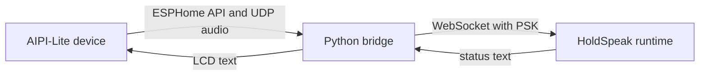

# AIPI-Lite companion

AIPI-Lite is an optional ESP32-S3 device. It runs ESPHome firmware. A Python bridge connects it to HoldSpeak.

The device gives you a button and a small LCD. You can dictate, record a meeting, add a bookmark, and answer a waiting coding agent by voice.

## How it connects

```mermaid
graph LR
    Device[AIPI-Lite device] -->|ESPHome API and UDP audio| Bridge[Python bridge]
    Bridge -->|WebSocket with PSK| Hub[HoldSpeak runtime]
    Hub -->|status text| Bridge
    Bridge -->|LCD text| Device
```

- The device holds no model keys. It sends audio only.
- The bridge runs on the same machine as HoldSpeak. It connects to `ws://127.0.0.1:<port>/api/devices/audio`.
- The device reaches the bridge over your Wi-Fi, a phone hotspot, a VPN, or a private tunnel. HoldSpeak has no hosted relay.
- The bridge has its own Python environment in `aipi-lite/.venv`. This keeps ESPHome pins out of the main runtime.
- The bridge authenticates with a shared secret (PSK). Run `holdspeak device-psk show` to read it. Run `holdspeak device-psk rotate` to replace it.

## What the device does

| Action | Result |
|---|---|
| Hold the button, speak, release | The runtime transcribes the audio. It sends the text to a waiting coding session. Without one, it types the text where your cursor is. |
| Start a meeting with the device attached | The device records the meeting audio. The LCD shows `Recording MM:SS`. |
| Long press during a meeting | HoldSpeak adds a bookmark. The LCD shows `Bookmark @ <seconds>s`. |
| Query agent status | The LCD shows the question that a Claude or Codex session is waiting on. |
| Speak a reply | HoldSpeak delivers the reply to the selected coding session. |

Agent status needs the Claude and Codex hooks. See [Agent Hook Install](AGENT_HOOK_INSTALL.md).

## Failures

| Symptom | Cause |
|---|---|
| The runtime closes the connection with code 4003 | The PSK is wrong. Run `holdspeak device-psk show` and update `bridge.env`. |
| The runtime closes the connection with code 4009 | Another device uses the same label. |
| The LCD shows `No reply target` | A coding session waits, but HoldSpeak cannot deliver text to it. It has no tmux pane and no typing backend. |
| The bridge cannot connect | The runtime is not running, or `HOLDSPEAK_PORT` is wrong. |

The bridge reconnects by itself after a lost link. A lost device does not remove a waiting coding session. The runtime keeps that state.

## Next

- Set up, test, and flash: [AIPI-Lite Developer Workflow](AIPI_LITE_DEV_WORKFLOW.md).
- Wire format: [Device Protocol](DEVICE_PROTOCOL.md).
- Hardware and firmware notes: `aipi-lite/README.md`.
