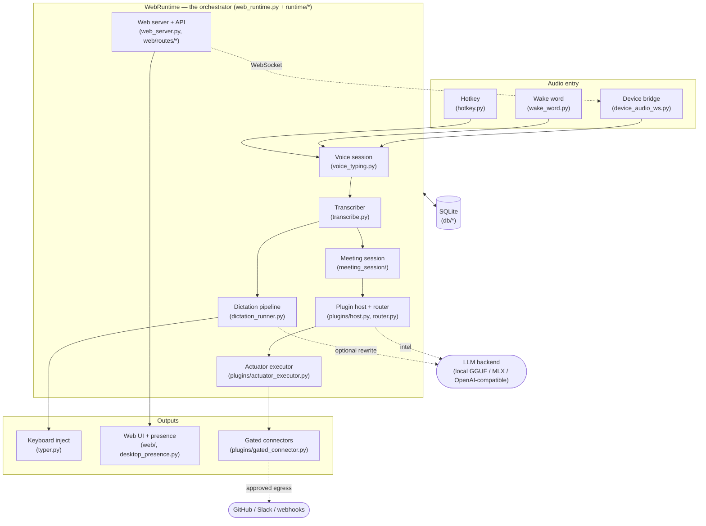

# HoldSpeak architecture

This is the map a contributor should read first: how HoldSpeak's pieces fit
and how a single utterance flows through them. It is the runtime view. For
how the code is laid out into modules, see the two structure docs in
[`internal/`](internal/): the
[web frontend decomposition](internal/ARCHITECTURE_WEB_FRONTEND.md) and the
[backend runtime decomposition](internal/ARCHITECTURE_BACKEND_RUNTIME.md).

The diagrams are Mermaid and render on GitHub. A guard
(`tests/e2e/test_mermaid_renders.py`) checks that every block in the docs
still renders, so a broken diagram cannot ship.

## The shape of it

HoldSpeak is one process. A web runtime (`WebRuntime`, the
mixin-composed orchestrator in `holdspeak/web_runtime.py`) owns the
hardware-facing pieces and a local FastAPI server (`MeetingWebServer`) that
serves the web UI and the API. Two modes run on top of the same building
blocks:

- **Dictation** turns held-key or wake-word speech into typed text, with an
  optional pipeline that routes and rewrites it before it lands.
- **Meetings** turn captured or imported audio into a transcript, typed
  artifacts, and an aftercare digest, with approval-gated actions out.

Transcription is local (`Transcriber`, MLX or faster-whisper). The LLM is
whichever backend you configure. State lives in one SQLite database behind
a set of repositories. Nothing takes an outbound action without an explicit
approval, and the network crossings are enumerated in the
[trust boundary](#the-trust-boundary) below and in
[`SECURITY.md`](SECURITY.md).

## The components

How the major pieces connect. Boxes are subsystems, not classes; the module
that owns each is named in the label.

The dictation and meeting flows are detailed in their own sections below.

## The dictation pipeline

How held-key or wake-word speech becomes typed text, with the optional
routing and rewrite stages, the learning loop, voice commands, and the
device path in between.

## The meeting pipeline

How captured or imported audio becomes a transcript, typed artifacts, and
an aftercare digest, with approval-gated actions out.

## The trust boundary

Every point where data crosses the machine boundary, and the gate on each
crossing. Aligned with [`SECURITY.md`](SECURITY.md).
