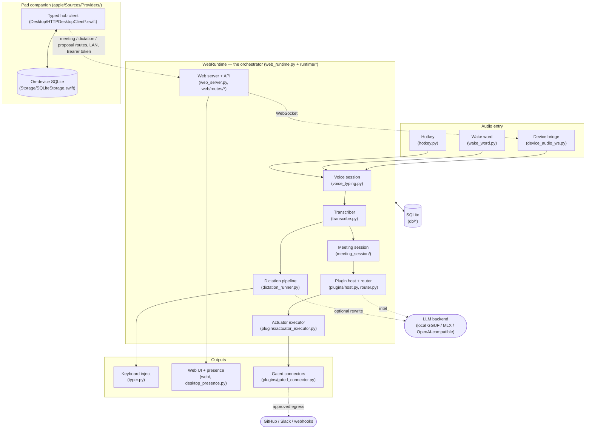
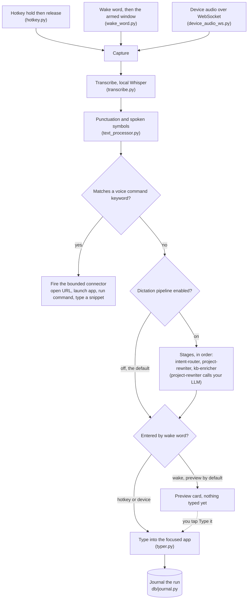
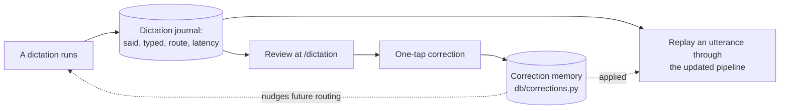
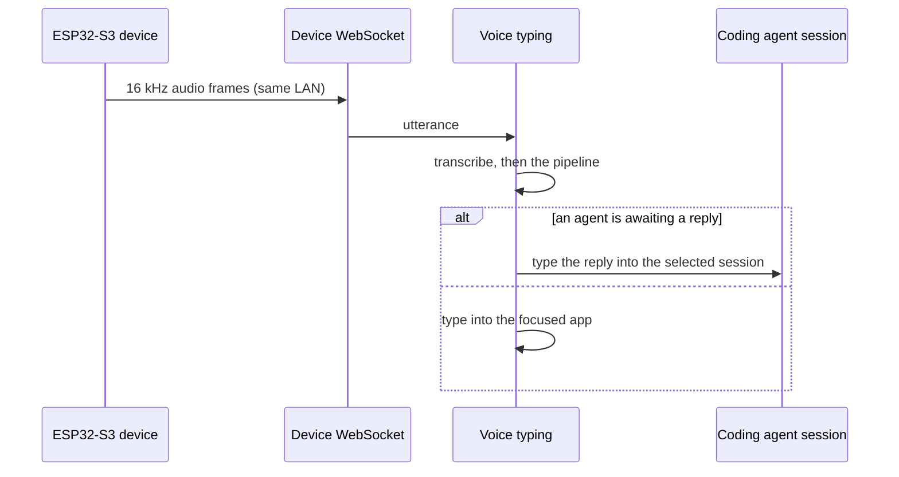
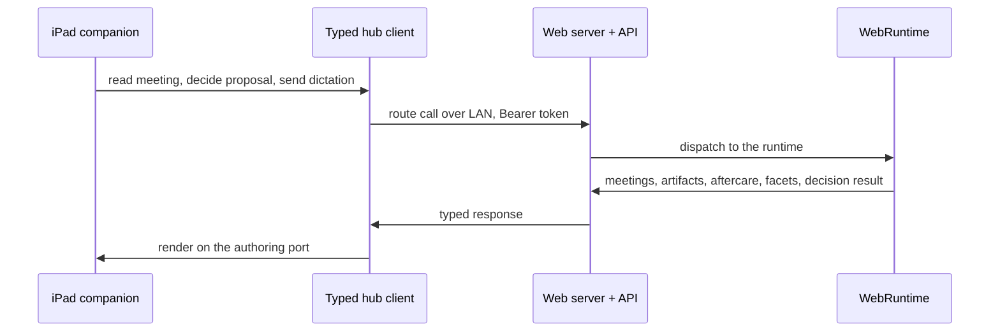
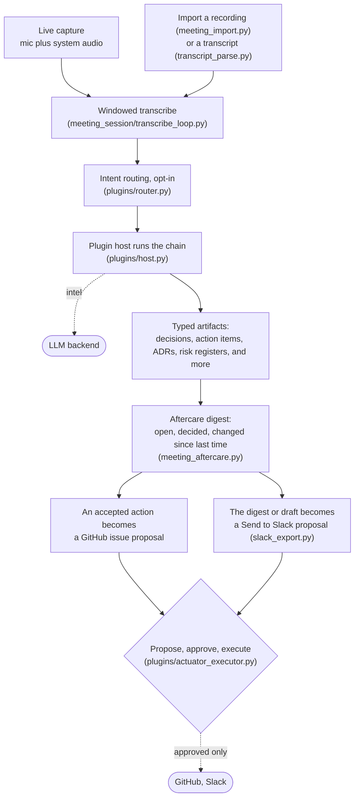
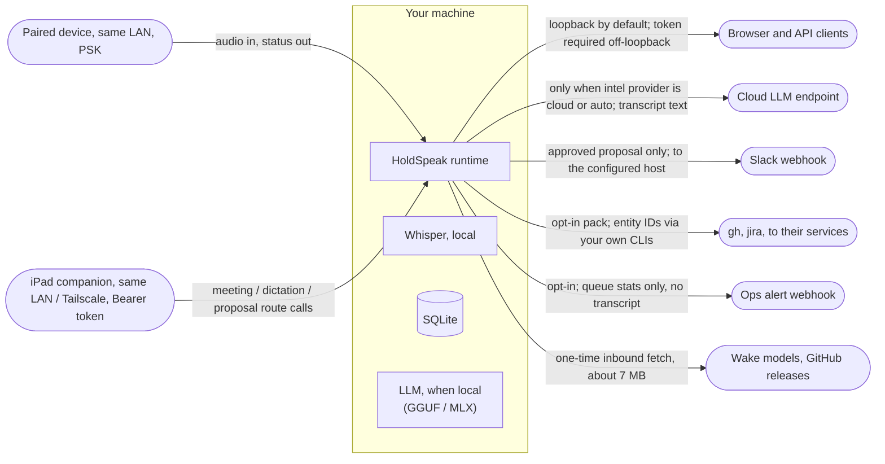

# HoldSpeak architecture

This is the map a contributor should read first: how HoldSpeak's pieces fit
and how a single utterance flows through them. It is the runtime view. For
how the code is laid out into modules, see the two structure docs in
[`internal/`](internal/): the
[web frontend decomposition](internal/ARCHITECTURE_WEB_FRONTEND.md) and the
[backend runtime decomposition](internal/ARCHITECTURE_BACKEND_RUNTIME.md).

The diagrams are Mermaid and render on GitHub. A guard
(`tests/e2e/test_mermaid_renders.py`) checks that every block in the docs
still renders, so a broken diagram cannot ship.

## The shape of it

HoldSpeak is one process. A web runtime (`WebRuntime`, the
mixin-composed orchestrator in `holdspeak/web_runtime.py`) owns the
hardware-facing pieces and a local FastAPI server (`MeetingWebServer`) that
serves the web UI and the API. Two modes run on top of the same building
blocks:

- **Dictation** turns held-key or wake-word speech into typed text, with an
  optional pipeline that routes and rewrites it before it lands.
- **Meetings** turn captured or imported audio into a transcript, typed
  artifacts, and an aftercare digest, with approval-gated actions out.

Transcription is local (`Transcriber`, MLX or faster-whisper). The LLM is
whichever backend you configure. State lives in one SQLite database behind
a set of repositories. Nothing takes an outbound action without an explicit
approval, and the network crossings are enumerated in the
[trust boundary](#the-trust-boundary) below and in
[`SECURITY.md`](SECURITY.md).

An iPad companion can join over your own network. It is a typed client of
the same FastAPI routes the web UI calls, not a second runtime: it reads
meetings, artifacts, aftercare, and faceted search, decides proposals, and
sends dictation back to a focused app or a waiting coding agent. The desktop
stays the hub; the iPad is an authoring port. Its piece of the
[device path](#the-device-path) is the typed client layer, and the LAN
crossing it opens is listed in the [trust boundary](#the-trust-boundary).

## The components

How the major pieces connect. Boxes are subsystems, not classes; the module
that owns each is named in the label.

The dictation and meeting flows are detailed in their own sections below.

## The dictation pipeline

How held-key or wake-word speech becomes typed text. Capture and
transcription always run; the routing and rewrite stages are opt-in and off
by default, so the plain path is "speak, and it types what you said."

### The learning loop

Every dictation is recorded, so you can correct a wrong result once and
watch the change take effect, rather than trusting that it did.

### The device path

An AIPI-Lite ESP32-S3 board on the same network (home Wi-Fi or a phone
hotspot) streams audio to the runtime. If a coding agent is waiting on a
reply, the transcribed text goes straight into that session instead of the
focused app.

### The iPad companion

The iPad joins the same hub over your own network (LAN or Tailscale, no
hosted relay). It is a typed client of the FastAPI routes, built around one
HTTP client (`apple/Sources/Providers/Desktop/HTTPDesktopClient.swift`)
split into focused extensions, one per surface it reads or drives:

- `HTTPDesktopClient+Aftercare.swift` reads the aftercare digest and files an
  accepted action as a GitHub issue proposal (`GET .../aftercare`,
  `POST .../aftercare/file-issue`).
- `HTTPDesktopClient+Facets.swift` lists and searches meetings with the
  server-side facets (`GET api/meetings/facets`, `GET api/meetings`).
- `HTTPDesktopClient+Artifacts.swift` reads a meeting's typed artifacts
  (`GET api/meetings/{id}/artifacts`).
- `HTTPDesktopClient+Proposals.swift` reads pending proposals and submits an
  approve or reject decision (`GET`/`POST .../proposals`); the executor still
  runs on the hub, so the iPad approves but never acts on its own.
- `HTTPDesktopClient+Dictation.swift` previews the dictation pipeline and
  reports readiness (`POST api/dictation/dry-run`,
  `GET api/dictation/readiness`); the base client sends the dictation itself
  to a focused app or a waiting coding agent (`POST api/dictation/remote`).

Every request carries the desktop's Bearer token, joined at call time and
never stored in a payload. The hub is the only place state changes; the iPad
is an authoring port onto it.

The iPad keeps its own SQLite store
(`apple/Sources/Providers/Storage/SQLiteStorage.swift`) for what it captures
on device. It runs in WAL mode for crash safety: an integrity check on
reopen confirms a committed write survives a crash, and an uncommitted write
is rolled back. The schema carries a `user_version`, and a forward migration
runs only when an older database is opened. This mirrors, on the mobile side,
the same safe-by-default posture the desktop store takes. The desktop store
is the one that also runs the four-way schema matrix below, where a database
newer than the build is refused rather than rewritten.

The desktop schema matrix:

- **Newer than this build:** refuse to touch it, and let `doctor` report the
  mismatch, so a newer build never gets a downgrade rewrite from an older one.
- **Older than this build:** back up first, then apply the migration, so the
  pre-migration database is always recoverable.
- **Already current:** no-op.
- **Missing:** create a fresh database.

Back up on demand with `holdspeak backup` and put a snapshot back with
`holdspeak restore`. The matrix lives in `holdspeak/db/core.py`.

## The meeting pipeline

How captured or imported audio becomes a transcript, typed artifacts, and an
aftercare digest. The intelligence work calls the LLM you configured; the
actions out are proposals you approve, never automatic.

## The trust boundary

Everything inside the box runs on your machine. Every arrow leaving it is a
crossing you opened, with the gate on it named. This mirrors the egress
table in [`SECURITY.md`](SECURITY.md); if the two ever disagree, SECURITY is
the source of truth.

