# HoldSpeak architecture

This is the map a contributor should read first: how HoldSpeak's pieces fit
and how a single utterance flows through them. It is the runtime view. For
how the code is laid out into modules, see the two structure docs in
[`internal/`](internal/): the
[web frontend decomposition](internal/ARCHITECTURE_WEB_FRONTEND.md) and the
[backend runtime decomposition](internal/ARCHITECTURE_BACKEND_RUNTIME.md).

The diagrams are Mermaid and render on GitHub. A guard
(`tests/e2e/test_mermaid_renders.py`) checks that every block in the docs
still renders, so a broken diagram cannot ship.

## Interview and Thread state

Interview composes the existing Thread conversation, model routing, and MCP services.
It does not create a separate model runtime or a universal automation engine.

| Component | Responsibility |
| --- | --- |
| Thread window and store | Display sent messages, streamed replies, references, and tool activity. |
| Thread service | Run the model conversation and its tool loop. |
| Interview section descriptors | Declare each section's purpose, tool set, and handoff. |
| Interview service | Validate and persist facts, suggestion choices, section changes, and revisions. |
| MCP family | Expose Interview operations through the common service contract. |
| Existing Project services | Perform supported setup operations under their own policy. |

The model chooses its question or proposed tool call.
The controller validates the resulting operation and state change.
These checks make state transitions predictable. They do not make model recommendations deterministic or necessarily correct.

Interview state belongs to a Thread.
Each change includes an expected revision and a command identity.
A stale revision refuses the change. A repeated command cannot substitute a different payload.
Source references distinguish stated facts from inferred context.
Changed or removed facts invalidate or remove dependent suggestions.

The initial capability prepares manual drafts and supports the existing Project setup path.
General scheduled work and agent assignment through Interview remain target requirements.
See [Interview](INTERVIEW.md) for user behavior and the
[specification package](internal/architect-assistant/README.md) for requirements and verification limits.

Implementation references:

- [Section descriptors](../holdspeak/services/interview_contracts.py).
- [Interview service](../holdspeak/services/interview_service.py).
- [MCP family](../holdspeak/mcp/families/interview.py).
- [Thread service](../holdspeak/services/thread_service.py).

## The shape of it

The Web runtime is the main runtime process.
`WebRuntime` owns the hardware-facing components and the local FastAPI server
(`MeetingWebServer`) that serves the Web app and API.
Supporting processes include the MCP sidecar and the isolated desktop typing executor.
Dictation and Meetings use the shared runtime components:

- **Dictation** turns held-key or wake-word speech into typed text. Its
  always-on pipeline routes it through local stages and uses a model only for
  configured model-backed stages.
- **Meetings** turn captured or imported audio into a transcript, typed
  artifacts, and an aftercare digest, with control-mode-authorized actions out.

Transcription is local (`Transcriber`, MLX or faster-whisper). Model Library is
the authority for available model profiles, Assignments owns the ordered
compatible choices for each registered capability, and the Intelligence Router
freezes the selected route before a physical attempt. State lives in one SQLite
database behind a set of repositories. Outbound actions require audited
authority from the captured control posture, a scoped grant, or a per-action
decision, and the network crossings are enumerated in the
[trust boundary](#the-trust-boundary) below and in
[`SECURITY.md`](SECURITY.md).

The iPad app can join over your own network. It is a typed client of
the same FastAPI routes the web UI calls, not a second runtime: it reads
meetings, artifacts, aftercare, and faceted search, decides proposals, and
sends dictation back to a focused app or a waiting coding agent. The desktop
stays the hub; the iPad is an authoring port. Its piece of the
[device path](#the-device-path) is the typed client layer, and the LAN
crossing it opens is listed in the [trust boundary](#the-trust-boundary).

## Inference admission: one path, one receipt per attempt

This section is the canonical integration contract for model work. Every actual
provider attempt enters `InferenceRunner.invoke()` at its executing boundary and
becomes one `inference.invoke@1` operation. The runner admits and claims that
child before a physical adapter can construct or call a provider. The child
names one immutable `DeploymentRevision`, captured before admission, and ends in
exactly one immutable terminal receipt. The reviewed adapters accept a
single-use, runner-issued `DispatchContext` bound to that child operation,
revision, destination, attempt ordinal, and authority; no route, service, plugin,
command, local Whisper backend, or mesh worker is an alternate entrance.

A parent run or session is causation and a finite budget, not a substitute for
the invocation receipt. Sequence, Workflow, Workbench, Cadence drafting,
Decision promotion, Delivery review, voice resolution, live meetings, deferred
meeting intelligence, dictation, and configured wake captures use typed parents.
Each model-bearing step below them is still its own `inference.invoke@1` child.
An outer parent receipt says how the run or session ended; each child receipt says
how that physical attempt ended.

Ad hoc Ask and saved Agents make the definition distinction explicit:

- Ask uses the truthful service contract `holdspeak.ask@1`. The `1` is the
  service-contract schema revision; Ask does not pretend to be a saved Agent.
- Agent run and chat use `recipe:<id>` plus that saved Agent's `last_modified`
  definition revision. Editing the Agent invalidates the old definition revision.
- Both freeze the destination as a `DeploymentRevision` before dispatch. A mutable
  **Runs on** edit after admission cannot retarget an in-flight child.

Provider output is staged behind the same terminal election. The receipt carries
the immutable operation outcome and a result reference, not the prompt or domain
body; the referenced projection becomes visible only if that child wins
publication. Cancellation advances the execution fence and rejects late output.
A compatibility fallback or retry is another physical attempt, therefore another
child and another receipt with a higher attempt ordinal. If execution may have
started but no terminal fact can be proved, the outcome is `indeterminate`; the
runtime never guesses success or blindly retries uncertain work.

Meetings, dictation, and configured wake use one authenticated parent per live
session: `meeting.session@1`, `dictation.session@1`, or `wake.session@1`. Every
actual LLM or shared local Whisper call is a causally linked child that rechecks
parent liveness, revocation, deadline, budget, and exact revision. Pre-session
Whisper preload/warmup is not exempt: it requires a narrow preload authority that
names the exact model-config revision and receives its own child receipt. Prompt,
transcript, dictated text, audio, completion, and token-stream material stays in
the dispatch path; kernel operation, journal, and receipt fields carry only
content-free refs, hashes, authority, placement, and outcomes.

Scheduled Workbench execution is not owner impersonation. Deliberately enabling a
schedule mints one bounded delegation over the exact Workbench, Agent, and
schedule revisions, effective deployment revision, cadence, and expiry. The owner
is recorded as delegator; the due tick acts as the rights-limited `scheduler`
principal. The tick refuses before a model call if terms are missing; the
schedule is disabled, revoked, or expired; cadence, target, Agent, or Workbench
has drifted; or the due minute is a duplicate. It reports
`delegation_missing`, `schedule_disabled`, `delegation_revoked`,
`delegation_expired`, `delegation_cadence_changed`,
`delegation_target_changed`, `delegation_stale_work`, or `duplicate_tick` and
leaves a terminal refusal receipt.

Finally, sync follows code authority in one direction. `SYNC_REGISTRY` in
`holdspeak/services/sync_service.py` defines the Python/web kind, bucket, schema,
and merge contract; `/api/sync/*`, the JSON schemas, and required web fields are
tested against it. Swift is not a contract authority, and this contract adds no
Swift work or Swift-shaped compatibility requirement. A native client
may consume the finished Python/web contract later; it does not define it.

## The components

How the major pieces connect. Boxes are subsystems, not classes; the module
that owns each is named in the label.

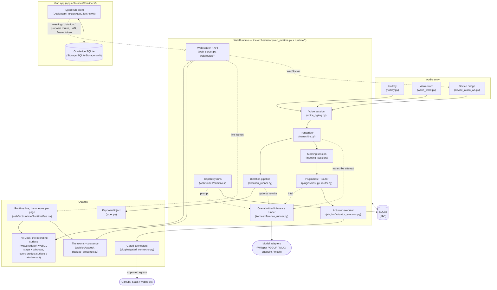
```mermaid
flowchart TB
  subgraph entry["Audio entry"]
    HK["Hotkey<br/>(hotkey.py)"]
    WW["Wake word<br/>(wake_word.py)"]
    DEV["Device bridge<br/>(device_audio_ws.py)"]
  end

  subgraph runtime["WebRuntime — the orchestrator (web_runtime.py + runtime/*)"]
    VS["Voice session<br/>(voice_typing.py)"]
    TR["Transcriber<br/>(transcribe.py)"]
    DR["Dictation pipeline<br/>(dictation_runner.py)"]
    MS["Meeting session<br/>(meeting_session/)"]
    PH["Plugin host + router<br/>(plugins/host.py, router.py)"]
    RUN["Capability runs<br/>(web/routes/primitives/)"]
    IR["One admitted inference runner<br/>(kernel/inference_runner.py)"]
    AX["Actuator executor<br/>(plugins/actuator_executor.py)"]
    SRV["Web server + API<br/>(web_server.py, web/routes/*)"]
  end

  subgraph out["Outputs"]
    TY["Keyboard inject<br/>(typer.py)"]
    DESK["The Desk, the operating surface<br/>(web/src/desk/: WebGL stage + windows,<br/>every product surface a window at /)"]
    UI["The rooms + presence<br/>(web/src/pages/, desktop_presence.py)"]
    BUS["Runtime bus, the one /ws per page<br/>(web/src/runtime/RuntimeBus.tsx)"]
    CN["Gated connectors<br/>(plugins/gated_connector.py)"]
  end

  subgraph ipad["iPad app (apple/Sources/Providers/)"]
    HC["Typed hub client<br/>(Desktop/HTTPDesktopClient*.swift)"]
    LS[("On-device SQLite<br/>(Storage/SQLiteStorage.swift)")]
  end

  DB[("SQLite<br/>(db/*)")]
  MODEL(["Model adapters<br/>(Whisper / GGUF / MLX / endpoint / mesh)"])

  HK --> VS
  WW --> VS
  DEV --> VS
  VS --> TR
  TR --> DR
  TR --> MS
  TR -. "transcribe attempt" .-> IR
  DR --> TY
  DR -. "optional rewrite" .-> IR
  MS --> PH
  PH -. "intel" .-> IR
  IR --> MODEL
  PH --> AX
  AX --> CN
  CN -. "approved egress" .-> EXT(["GitHub / Slack / webhooks"])
  SRV --> DESK
  SRV --> UI
  SRV -. "live frames" .-> BUS
  BUS --> DESK
  BUS --> UI
  RUN -. "prompt" .-> IR
  RUN --> DB
  runtime <--> DB
  SRV -. "WebSocket" .-> DEV
  HC -. "meeting / dictation / proposal routes, LAN, Bearer token" .-> SRV
  HC <--> LS
```

The dictation and meeting flows are detailed in their own sections below.

## The dictation pipeline

How held-key or wake-word speech becomes typed text. Capture and
transcription always run; the routing and rewrite stages are opt-in and off
by default, so the plain path is "speak, and it types what you said."

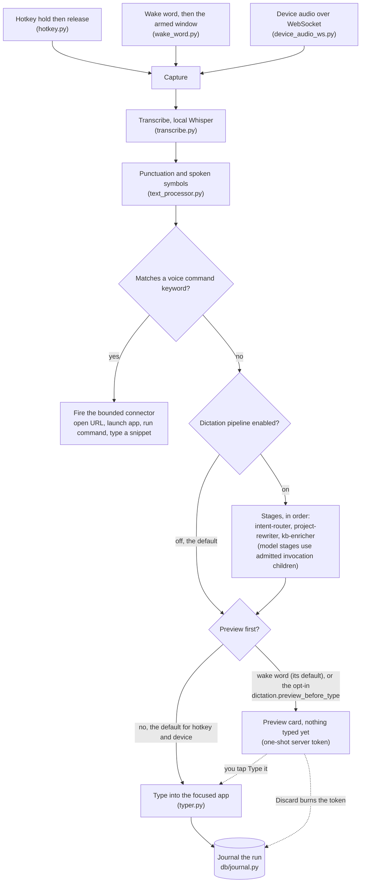
```mermaid
flowchart TD
  HK["Hotkey hold then release<br/>(hotkey.py)"] --> CAP
  WW["Wake word, then the armed window<br/>(wake_word.py)"] --> CAP
  DEV["Device audio over WebSocket<br/>(device_audio_ws.py)"] --> CAP
  CAP["Capture"] --> TR["Transcribe, local Whisper<br/>(transcribe.py)"]
  TR --> PUNC["Punctuation and spoken symbols<br/>(text_processor.py)"]
  PUNC --> VC{"Matches a voice command keyword?"}
  VC -- yes --> FIRE["Fire the bounded connector<br/>open URL, launch app, run command, type a snippet"]
  VC -- no --> PIPE{"Dictation pipeline enabled?"}
  PIPE -- "off, the default" --> FORK
  PIPE -- "on" --> STAGES["Stages, in order:<br/>intent-router, project-rewriter, kb-enricher<br/>(model stages use admitted invocation children)"]
  STAGES --> FORK{"Preview first?"}
  FORK -- "no, the default for hotkey and device" --> TYPE["Type into the focused app<br/>(typer.py)"]
  FORK -- "wake word (its default), or the opt-in<br/>dictation.preview_before_type" --> PREVIEW["Preview card, nothing typed yet<br/>(one-shot server token)"]
  PREVIEW -. "you tap Type it" .-> TYPE
  PREVIEW -. "Discard burns the token" .-> J
  TYPE --> J[("Journal the run<br/>db/journal.py")]
```

### The learning loop

Every dictation is recorded, so you can correct a wrong result once and
watch the change take effect, rather than trusting that it did.

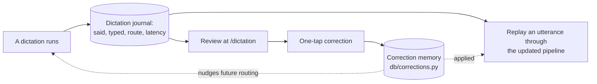
```mermaid
flowchart LR
  RUN["A dictation runs"] --> J[("Dictation journal:<br/>said, typed, route, latency")]
  J --> REVIEW["Review at /dictation"]
  REVIEW --> FIX["One-tap correction"]
  FIX --> MEM[("Correction memory<br/>db/corrections.py")]
  MEM -. "nudges future routing" .-> RUN
  J --> REPLAY["Replay an utterance through<br/>the updated pipeline"]
  MEM -. "applied" .-> REPLAY
```

### The device path

An AIPI-Lite ESP32-S3 board on the same network (home Wi-Fi or a phone
hotspot) streams audio to the runtime. If a coding agent is waiting on a
reply, the transcribed text goes straight into that session instead of the
focused app.

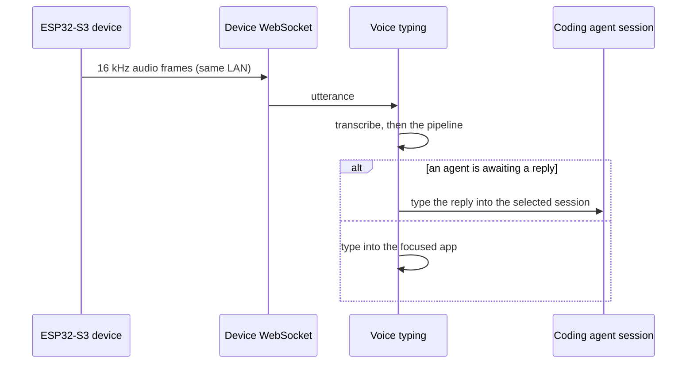
```mermaid
sequenceDiagram
  participant D as ESP32-S3 device
  participant WS as Device WebSocket
  participant VT as Voice typing
  participant AG as Coding agent session
  D->>WS: 16 kHz audio frames (same LAN)
  WS->>VT: utterance
  VT->>VT: transcribe, then the pipeline
  alt an agent is awaiting a reply
    VT->>AG: type the reply into the selected session
  else
    VT->>VT: type into the focused app
  end
```

### The iPad app

The iPad joins the same hub over your own network (LAN or Tailscale, no
hosted relay). It is a typed client of the FastAPI routes, built around one
HTTP client (`apple/Sources/Providers/Desktop/HTTPDesktopClient.swift`)
split into one base client (meeting control, the coder board, remote
dictation delivery) plus ten focused extensions (aftercare, facets,
artifacts, proposals, dictation, dictation blocks, voice commands,
activity, learning, meeting import); the sync transport rides its own
provider on the same pairing.

The full surface it consumes is generated, not hand-listed: see
[API_SURFACE.md](API_SURFACE.md), where every route the app serves carries
its consumers as extracted from the real call sites. As of the last
generation the iPad consumes 47 routes, spanning meetings (list, facets,
detail, artifacts, aftercare, file-issue, proposals + decisions, start,
stop, import), dictation (dry-run, readiness, remote delivery, journal,
blocks + templates, learning digest, project context), the voice command
board (settings read and write, test one action), activity (briefing,
nudges, select, dismiss), capability runs (agents, chains), the coder board
(`api/coders/*`: which live coding session receives a spoken answer), the
desk actuator relay (`api/desk/actuators/*`: a desk card becomes a hub
proposal; the executor still runs on the hub, so the iPad proposes and
approves but never acts on its own), and sync (`api/sync/pull`, `push`).

Every request carries the desktop's Bearer token, joined at call time and
never stored in a payload. The hub is the only place state changes; the iPad
is an authoring port onto it.

The iPad's trust surface uses one egress grammar, defined once in the
contracts layer (`apple/Sources/Contracts/EgressScope.swift`: on device,
local plus a named target, or cloud with the target named) and consumed by
every badge and chip; a desk primitive carries its real posture, and the
app header's trust chip reads the same `/api/setup/status` posture the web
header chip does, mapped by the same four-state precedence.

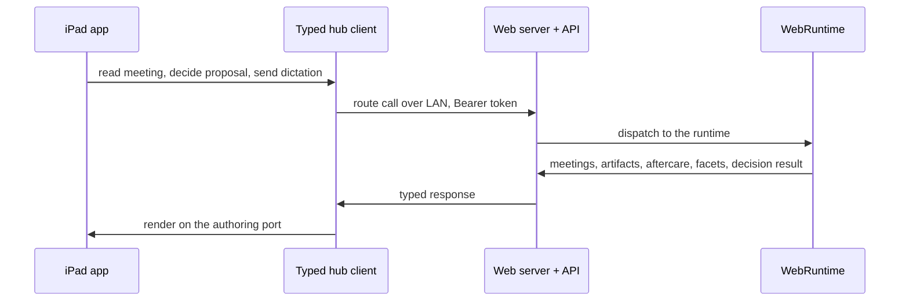
```mermaid
sequenceDiagram
  participant IP as iPad app
  participant HC as Typed hub client
  participant SRV as Web server + API
  participant RT as WebRuntime
  IP->>HC: read meeting, decide proposal, send dictation
  HC->>SRV: route call over LAN, Bearer token
  SRV->>RT: dispatch to the runtime
  RT->>SRV: meetings, artifacts, aftercare, facets, decision result
  SRV->>HC: typed response
  HC->>IP: render on the authoring port
```

The iPad keeps its own SQLite store
(`apple/Sources/Providers/Storage/SQLiteStorage.swift`) for what it captures
on device. It runs in WAL mode for crash safety: an integrity check on
reopen confirms a committed write survives a crash, and an uncommitted write
is rolled back. The schema carries a `user_version`, and the store reads it
before it touches anything: a database newer than the build is refused (it
throws rather than rewrite your data), an older one is backed up to a
timestamped sibling and then migrated forward, and a current one is a no-op.
The iPad keeps its own version-gated four-way matrix on the Swift side; the
desktop store has since moved to the declarative reconcile described below,
though both share the same safe-by-default posture. A readiness section in the
iPad's Settings surfaces the matrix as a health readout: a probe on the same
open path reports the stamped schema version, the integrity check, the count
of backup siblings, and a refused newer database named with both versions,
beside the hub's own doctor sections read from the setup-status route.

The desktop schema reconciliation (`holdspeak/db/reconcile.py`):

On every open, `reconcile_schema` brings the database to the canonical shape
defined in `holdspeak/db/schema.py` (`SCHEMA_SQL`). It applies the DDL
(creating any missing table, index, or trigger), introspects each table
against an in-memory reference built from `SCHEMA_SQL`, and `ALTER TABLE
ADD COLUMN`s anything the live file is missing. If the shape actually
changed on an existing populated database, it backs the file up first
(timestamped sibling, same as the manual `holdspeak backup` path), then
runs the idempotent data backfills. A fresh creation skips the backup
(nothing to protect yet). It is additive-only: it never DROPs a table or
column and never DELETEs a row. Orphan tables left by older builds are
left untouched.

There is no version gate. A database stamped with a version newer than
the running build opens without error; the reconcile simply adds anything
the live file is missing and moves on. The `schema_version` table remains
as an informational stamp (written on every open); nothing branches on it.

Accepted caveats: (1) SQLite cannot widen a CHECK constraint on an
existing column, so the reconcile does not attempt it. The live database
already carries the final CHECK values; only a very old backup restored
from before the constraint existed would differ. (2) The historical
table renames (e.g. `agents` to `recipes`) are not replayed; a database
from before those renames would orphan the old-named tables, not lose
them.

Back up on demand with `holdspeak backup` and put a snapshot back with
`holdspeak restore`.

## The meeting pipeline

How captured or imported audio becomes a transcript, typed artifacts, and an
aftercare digest. Each intelligence attempt enters the admitted runner before it
reaches the model you configured; actions out are proposals you approve, never
automatic.

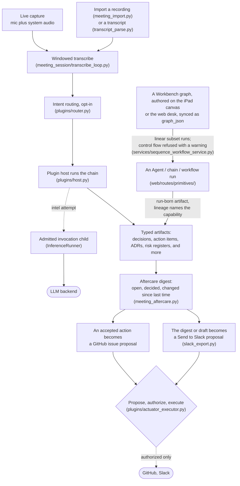
```mermaid
flowchart TD
  LIVE["Live capture<br/>mic plus system audio"] --> TRW
  IMP["Import a recording (meeting_import.py)<br/>or a transcript (transcript_parse.py)"] --> TRW
  TRW["Windowed transcribe<br/>(meeting_session/transcribe_loop.py)"] --> ROUTE
  ROUTE["Intent routing, opt-in<br/>(plugins/router.py)"] --> HOST
  HOST["Plugin host runs the chain<br/>(plugins/host.py)"]
  HOST -. "intel attempt" .-> IR["Admitted invocation child<br/>(InferenceRunner)"]
  IR --> LLM(["LLM backend"])
  HOST --> ART["Typed artifacts:<br/>decisions, action items, ADRs, risk registers, and more"]
  RUNB["An Agent / chain / workflow run<br/>(web/routes/primitives/)"] -- "run-born artifact,<br/>lineage names the capability" --> ART
  GRAPH["A Workbench graph, authored on the iPad canvas<br/>or the web desk, synced as graph_json"] -- "linear subset runs;<br/>control flow refused with a warning<br/>(services/sequence_workflow_service.py)" --> RUNB
  ART --> AFT["Aftercare digest:<br/>open, decided, changed since last time<br/>(meeting_aftercare.py)"]
  AFT --> ISSUE["An accepted action becomes<br/>a GitHub issue proposal"]
  AFT --> SLACK["The digest or draft becomes<br/>a Send to Slack proposal (slack_export.py)"]
  ISSUE --> APV{"Propose, authorize, execute<br/>(plugins/actuator_executor.py)"}
  SLACK --> APV
  APV -. "authorized only" .-> EXT(["GitHub, Slack"])
```

### The loop closes

After a meeting ends and its transcript is saved, the loop carries extracted
intelligence through to confirmed decisions and commitments. The trigger,
extraction, and proposal path are separate steps; nothing commits without
a human **Confirm**.

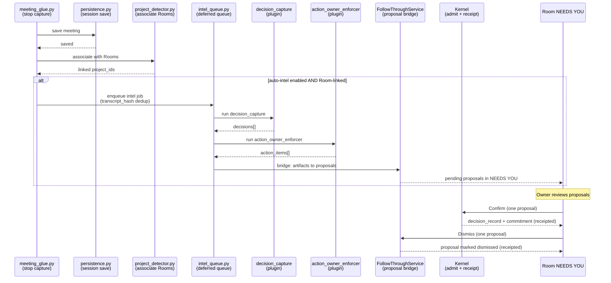
```mermaid
sequenceDiagram
  participant MG as meeting_glue.py<br/>(stop capture)
  participant PS as persistence.py<br/>(session save)
  participant PD as project_detector.py<br/>(associate Rooms)
  participant IQ as intel_queue.py<br/>(deferred queue)
  participant DC as decision_capture<br/>(plugin)
  participant AO as action_owner_enforcer<br/>(plugin)
  participant FT as FollowThroughService<br/>(proposal bridge)
  participant KO as Kernel<br/>(admit + receipt)
  participant UI as Room NEEDS YOU

  MG->>PS: save meeting
  PS-->>MG: saved
  MG->>PD: associate with Rooms
  PD-->>MG: linked project_ids
  alt auto-intel enabled AND Room-linked
    MG->>IQ: enqueue intel job<br/>(transcript_hash dedup)
    IQ->>DC: run decision_capture
    DC-->>IQ: decisions[]
    IQ->>AO: run action_owner_enforcer
    AO-->>IQ: action_items[]
    IQ->>FT: bridge: artifacts to proposals
    FT-->>UI: pending proposals in NEEDS YOU
  end
  Note over UI: Owner reviews proposals
  UI->>KO: Confirm (one proposal)
  KO-->>UI: decision_record + commitment (receipted)
  UI->>FT: Dismiss (one proposal)
  FT-->>UI: proposal marked dismissed (receipted)
```

The People resolver enriches the 1:1 brief with Watch entity data. It matches
owner aliases and display names inside the encrypted People boundary at read
time (`people_service.resolve_relationship_by_watch_identity`). The match
result never leaves the boundary; only Watch entity data (PR titles, issue
keys, days waiting) appears in the brief projection.

A suggested source is a post-intel step (not a plugin): it scans the transcript
for `owner/repo` patterns and Jira-style issue keys, checks them against
connected providers, and presents rows in the Room's **SOURCES** section.
**Add** creates a Watch source; **Dismiss** persists the dismissal. A
suggestion matching an existing Watch source is suppressed.

### The steward's hand

The steward's hand is the path from observed project
health to a receipted external action. Two flows share the policy gate: the
drafted update (model rewrite of the deterministic inventory) and the reviewer
nudge (a proposed `gh pr comment`).

**The drafter path:**

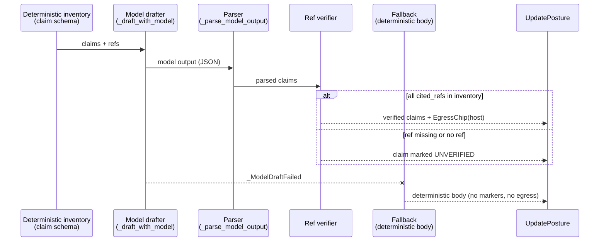
```mermaid
sequenceDiagram
  participant INV as Deterministic inventory<br/>(claim schema)
  participant MDL as Model drafter<br/>(_draft_with_model)
  participant PRS as Parser<br/>(_parse_model_output)
  participant VER as Ref verifier
  participant FB as Fallback<br/>(deterministic body)
  participant UI as UpdatePosture

  INV->>MDL: claims + refs
  MDL->>PRS: model output (JSON)
  PRS->>VER: parsed claims
  alt all cited_refs in inventory
    VER-->>UI: verified claims + EgressChip(host)
  else ref missing or no ref
    VER-->>UI: claim marked UNVERIFIED
  end
  MDL--xFB: _ModelDraftFailed
  FB-->>UI: deterministic body (no markers, no egress)
```

**The nudge path (the first external write):**

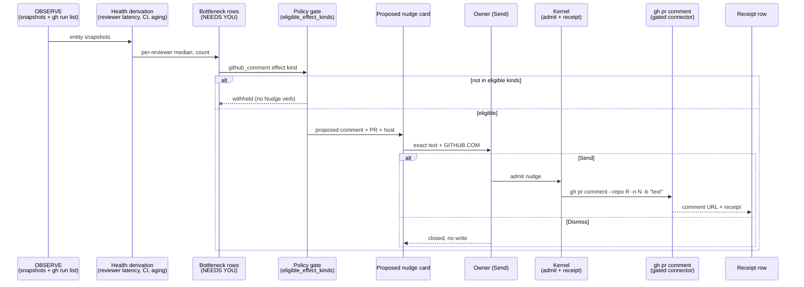
```mermaid
sequenceDiagram
  participant OBS as OBSERVE<br/>(snapshots + gh run list)
  participant DRV as Health derivation<br/>(reviewer latency, CI, aging)
  participant BTL as Bottleneck rows<br/>(NEEDS YOU)
  participant POL as Policy gate<br/>(eligible_effect_kinds)
  participant NUD as Proposed nudge card
  participant OWN as Owner (Send)
  participant KRN as Kernel<br/>(admit + receipt)
  participant GH as gh pr comment<br/>(gated connector)
  participant RCP as Receipt row

  OBS->>DRV: entity snapshots
  DRV->>BTL: per-reviewer median, count
  BTL->>POL: github_comment effect kind
  alt not in eligible kinds
    POL--xBTL: withheld (no Nudge verb)
  else eligible
    POL->>NUD: proposed comment + PR + host
    NUD->>OWN: exact text + GITHUB.COM
    alt Send
      OWN->>KRN: admit nudge
      KRN->>GH: gh pr comment --repo R -n N -b "text"
      GH-->>RCP: comment URL + receipt
    else Dismiss
      OWN-->>NUD: closed, no write
    end
  end
```

The health derivations read existing Watch snapshots (`ProjectService._entities`).
Review wait computes `now - createdAt` for open PRs with pending review requests,
grouped by reviewer. Issue aging counts issues older than the threshold
(default 14 days). Flaky CI uses the last 10 runs per branch
(`gh run list --limit 10`, collected during the steward's OBSERVE phase).
Merge-queue depth counts open PRs with passing CI not yet merged. The release
readiness scorecard composites the four signals: green when all green, amber
when any amber and none red, red when any red.

The double gate: the policy eligibility gate (`eligible_effect_kinds_json`)
prevents the steward from proposing a nudge on a project where it is not armed;
the per-nudge approval gate (the owner pressing Send) prevents any individual
nudge from firing without review. Either gate alone is sufficient to block.

The 7-day cooldown: after a nudge is sent for a PR and reviewer, the steward
checks the receipt ledger before proposing again. A recent
`steward.effect.github_comment` on the same PR and reviewer within the cooldown
window suppresses the proposal.

### Reach

The hub's Streamable HTTP route (`POST /api/mcp`)
exposes the same `handle_message` entry point that the stdio sidecar and
the web runtime's in-process fetcher use. One implementation, three
transports. The remote path composes on the web runtime's live services
(the conductor, the wired fetcher, the scheduler), not the sidecar's bare
instances.

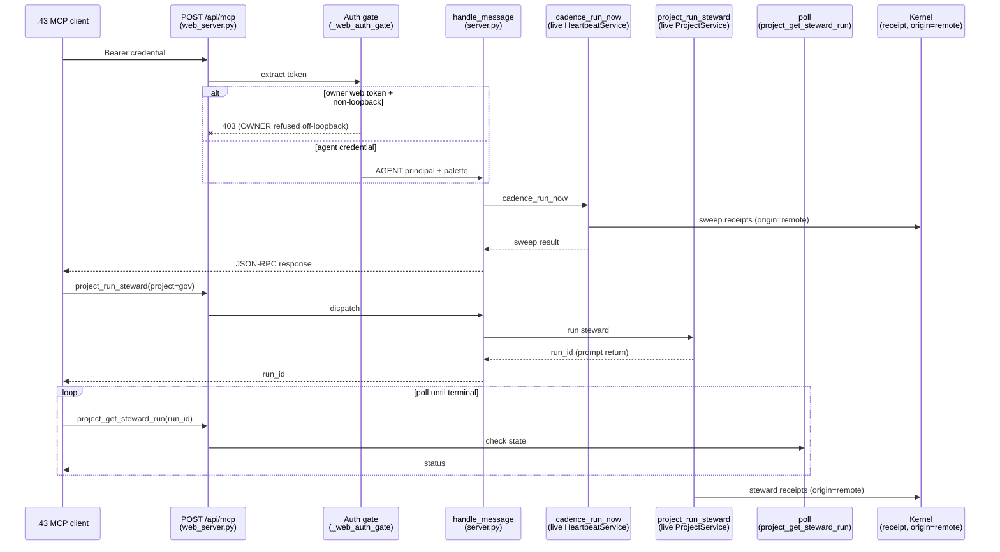
```mermaid
sequenceDiagram
  participant C as .43 MCP client
  participant R as POST /api/mcp<br/>(web_server.py)
  participant AG as Auth gate<br/>(_web_auth_gate)
  participant HM as handle_message<br/>(server.py)
  participant CS as cadence_run_now<br/>(live HeartbeatService)
  participant ST as project_run_steward<br/>(live ProjectService)
  participant PO as poll<br/>(project_get_steward_run)
  participant KO as Kernel<br/>(receipt, origin=remote)

  C->>R: Bearer credential
  R->>AG: extract token
  alt owner web token + non-loopback
    AG--xR: 403 (OWNER refused off-loopback)
  else agent credential
    AG->>HM: AGENT principal + palette
  end
  HM->>CS: cadence_run_now
  CS->>KO: sweep receipts (origin=remote)
  CS-->>HM: sweep result
  HM-->>C: JSON-RPC response
  C->>R: project_run_steward(project=gov)
  R->>HM: dispatch
  HM->>ST: run steward
  ST-->>HM: run_id (prompt return)
  HM-->>C: run_id
  loop poll until terminal
    C->>R: project_get_steward_run(run_id)
    R->>PO: check state
    PO-->>C: status
  end
  ST->>KO: steward receipts (origin=remote)
```

The Confluence adapter sits beside the Jira adapter.
Both use the `(site, email)` identity and the switch-and-verify pattern.
The connector pack (`acli_confluence.py`) names a read-only allowlist:
`auth status`, `auth switch`, `space list`, `space view`, `page view`,
`blog list`, `blog view`. No REST call is made; the CLI holds the
credentials. The `ConfluenceWatchSource` watches blog posts via `blog list`
and pages by known ID via `page view --id`. Entities follow the same shape
as Jira (id, title, url, status, timestamps).

### The scheduled recording conductor

The hub can start a recording on its own at a scheduled time. The scheduled
recording conductor (`scheduled_recording_conductor.py`) is a daemon thread
modeled on the Workbench Conductor: it ticks every 60 seconds, checking
enabled schedules for due fires. A due schedule enters a 10-second arming
countdown (broadcast on the bus, cancellable), then fires through the existing
`_start_meeting` seam under a `SCHEDULER` principal (it does not reimplement
capture). Auto-stop runs at the set duration.

Durability uses persisted deadlines. The `deadline_at` and `armed_at` timestamps
are written before any observable side-effect, so a hub restart can reconcile
interrupted states: a recording whose deadline passed during downtime is stopped
with a receipt, an interrupted arming resolves as missed, and a fire whose
scheduled time passed while the hub was down produces a bounded missed receipt
(one per missed window, never a burst of catch-up fires). One-shot schedules
disable after their terminal outcome; recurring schedules advance `next_fire_at`
strictly forward.

## The calendar pipeline

The Door's Upcoming rail projects calendar events from one or more ICS
sources into a merged chronological timeline. The pipeline is config-driven,
source-isolated, and bounded.

**Config shape.** `CalendarConfig.sources` is a list of `CalendarSource`
(`holdspeak/config/integrations.py:18`), each carrying an `id` (UUID, minted
on add), `label`, `url` (a local file path or HTTPS URL), and `enabled` flag.
A one-shot migration in `Config.load()` (`holdspeak/config/core.py`) converts
the old single `calendar.subscription` key to a one-element `sources` list;
the old key is consumed once and dropped on the next save.

**Per-source revision namespace.** `calendar_source_revision(source_id, url)`
(`holdspeak/config/integrations.py:122`) hashes the source id and the
normalized URL together. The source id enters the hash so two sources
pointing at the same URL get independent projection namespaces, and the
parser's existing `subscription_revision` parameter carries the per-source
fingerprint unchanged.

**Conductor refresh.** `CalendarIngestConductor`
(`holdspeak/calendar_ingest_conductor.py:137`) ticks at boot and every
15 minutes. Each tick iterates enabled sources independently:
`CalendarSourceReader` fetches the URL (HTTPS: no redirects, 10 s timeout,
no credentials or custom headers; file: direct read); `parse_calendar_bytes`
(`holdspeak/calendar_ingest.py:66`) parses within hard bounds (5 MiB feed,
14-day horizon, 128 occurrences per master event);
`CalendarEventRepository.replace_projection`
(`holdspeak/db/calendar_events.py:62`) atomically deletes and reinserts only
that source's rows (`DELETE ... WHERE source_id = ?`). A failed source never
touches a healthy source's projection (per-source last-good law).

**Orphan cleanup.** After all enabled sources have refreshed, the conductor
calls `delete_sources_not_in(enabled_ids)`
(`holdspeak/db/calendar_events.py:125`), removing rows whose `source_id` is
no longer enabled. Disabling or removing a source cleans up its events at the
next tick; re-enabling refetches.

**Projection columns.** `calendar_events`
(`holdspeak/db/schema.py:3379`): `id`, `uid`, `title`, `starts_at`,
`ends_at`, `location`, `meeting_url`, `last_seen_at`,
`subscription_revision`, `source_id`, `source_label`. Unique index:
`(source_id, uid, starts_at)`.

**Door consumption.** `DoorService._calendar_configured`
(`holdspeak/services/door_service.py:60`) returns true when at least one
enabled source passes validation. `_calendar_event_item`
(`holdspeak/services/door_service.py:200`) projects each row including
`source_id` and `source_label` into the `DoorUpcomingItem` aggregate, so the
rail can render provenance chips when more than one source is configured.

**The snapshot adapter.** `calendar_snapshot_service`
(`holdspeak/services/calendar_snapshot_service.py`) extracts events from a
calendar screenshot via the `calendar.snapshot_extract` inference capability
(vision-required). The extraction result is model output and is treated as
hostile input: the generated `.ics` passes through the same
`parse_calendar_bytes` parser used by every other source (the parser is the
one trust boundary). Confirmed events become a local `.ics` file under
`~/.local/share/holdspeak/calendar-snapshots/<source_id>.ics`, registered as
a `CalendarSource` through the settings write path only. The review gate
(`CalendarSnapshotReviewCore`) requires an explicit week anchor (never
silently guessed) and lets the owner edit or remove events before confirm.

**The connections readiness projection.** `ConnectionsService`
(`holdspeak/services/connections_service.py:90`) provides one readiness shape
over all provider adapters. `list_tools`
(`holdspeak/services/connections_service.py:111`) returns one entry per known
tool (GitHub, Jira, calendar, models) with `state`, `account`,
`next_action`, `recovery_hint`, `error_detail`, `last_checked_at`, and
`egress_host`. The five display states
(`holdspeak/services/connections_service.py:36-40`) are mapped from each
adapter's wire constants. The service stores no new state; it delegates to
`github_provider`, `jira_provider`, the calendar config, and the inference
assignment service. Routes (`holdspeak/web/routes/connections.py:24`)
expose `GET /api/connections` and
`POST /api/connections/{provider}/recheck`. MCP twins are
`connection.list` and `connection.recheck`
(`holdspeak/mcp/families/project.py:774,785`).

### The clock

The clock connects the calendar pipeline to the desk's temporal
surfaces: the arrival's WEEK strip, event-born recordings, the Room's
meeting watch, and the weekly brief.

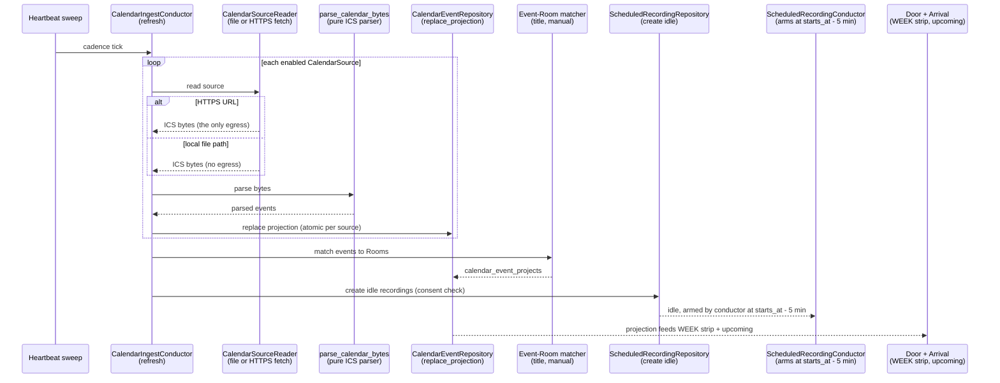
```mermaid
sequenceDiagram
  participant HB as Heartbeat sweep
  participant CC as CalendarIngestConductor<br/>(refresh)
  participant SR as CalendarSourceReader<br/>(file or HTTPS fetch)
  participant PA as parse_calendar_bytes<br/>(pure ICS parser)
  participant DB as CalendarEventRepository<br/>(replace_projection)
  participant EM as Event-Room matcher<br/>(title, manual)
  participant SC as ScheduledRecordingRepository<br/>(create idle)
  participant CD as ScheduledRecordingConductor<br/>(arms at starts_at - 5 min)
  participant DI as Door + Arrival<br/>(WEEK strip, upcoming)

  HB->>CC: cadence tick
  loop each enabled CalendarSource
    CC->>SR: read source
    alt HTTPS URL
      SR-->>CC: ICS bytes (the only egress)
    else local file path
      SR-->>CC: ICS bytes (no egress)
    end
    CC->>PA: parse bytes
    PA-->>CC: parsed events
    CC->>DB: replace projection (atomic per source)
  end
  CC->>EM: match events to Rooms
  EM-->>DB: calendar_event_projects
  CC->>SC: create idle recordings (consent check)
  SC-->>CD: idle, armed by conductor at starts_at - 5 min
  DB-->>DI: projection feeds WEEK strip + upcoming
```

The `MeetingWatchSource` sits beside `GitHubWatchSource` and
`JiraWatchSource` in the Watch source dispatch. It reads from the
local database only (meetings, meeting_projects, segments,
decision_record_sources, decision_records, decision_commitments,
intel_job_attempts). Each entity carries title, date, participant
count, decisions count, commitments count, intel status, and an
`updated_at` that participates in the Room's SINCE YOU LOOKED delta.
Zero egress.

The brief's lookback window (`compute_window`) is unchanged: the
preceding business-day close to now. A separate `compute_lookahead`
returns now to Sunday 23:59. Two new collectors (calendar events and
meeting Watch entities) produce items in the `this_week` section
using a full-week window (Monday 00:00 to Sunday 23:59).

## The conductor loops and the Heartbeat

The runtime starts several daemon threads, each with its own failure
boundary: an exception in one loop never kills another. The five loops
and their lifetimes:

| Loop | Thread name | Module | Lifecycle | Failure handling |
|---|---|---|---|---|
| Plugin queue | `HoldSpeakMirPluginQueue` | `web_runtime.py` (PluginQueueMixin) | Always on | try/except per dequeue; logs and continues |
| Cadence engine | `HoldSpeakCadenceEngine` | `runtime/cadence.py` (CadenceMixin) | Conditional on `config.cadence.enabled` | try/except per tick (`cadence.py:61`); logs and continues |
| Heartbeat | `HoldSpeakHeartbeat` | `runtime/heartbeat.py` (HeartbeatMixin) | Always on | try/except per tick; logs and continues |
| Recording ticker | (per-meeting thread) | `device_recording_tick.py` via `runtime/meeting_glue.py:346` | Per-meeting lifecycle (start/stop) | Independent; started by `_start_meeting`, stopped by `_stop_active_meeting` |
| Transcriber warm | (one-shot thread) | `runtime/transcriber_state.py:202` | One-shot at startup | Independent; no restart on failure |

### The Heartbeat sweep

The Heartbeat thread (`runtime/heartbeat.py`) ticks every 60 seconds and
checks whether a sweep is due. When due, it calls
`HeartbeatService.run_sweep` (`services/heartbeat_service.py`), which
performs three steps:

1. **Evaluate due watches** via `WatchService.evaluate_due`. Each
   graduated Watch with `next_evaluation_at <= now` is evaluated against
   its sources. Outcomes are collected and summarized for the receipt
   (N2: counts per state plus failing watch IDs, never the full list).
2. **Refresh the aggregate** via
   `needs_you_aggregate.build_aggregate`. The `NeedsYouCache`
   (`services/needs_you_aggregate.py`) wraps the builder in a
   stale-while-refresh cache whose lifetime matches the sweep interval.
   The cache invalidates after each sweep; `GET /api/desk/needs-you`
   reads from the cache (O(1) on hit, rebuilds on miss). The response
   carries `computedAt`, `stale`, and `sweepId` fields.
3. **Write the receipt** as a `heartbeat.sweep` kernel operation
   (Article XI.2) and a `pipeline_events` entry with the duration,
   watch count, room count, and the bounded outcome summary.

After the sweep, the Heartbeat evaluates the notification edge and quiet
hours. The notifier (`desktop_notify.py`) fires a macOS banner via
`osascript` (the PyObjC `UserNotifications` bridge is not in the venv)
or a Linux banner via the libnotify seam. Every notification writes a
`heartbeat.notify` receipt.

The cadence engine's tick also regenerates the Monday brief once per day
after quiet hours close (`_maybe_regenerate_brief` in
`runtime/cadence.py`) and invalidates the needs-you cache
(`_invalidate_needs_you_cache`).

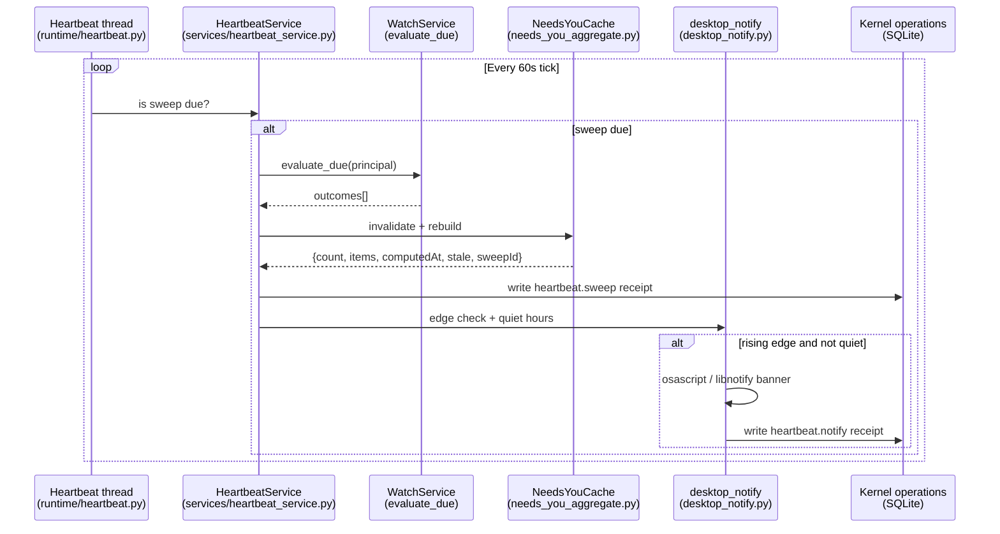
```mermaid
sequenceDiagram
  participant HB as Heartbeat thread<br/>(runtime/heartbeat.py)
  participant HS as HeartbeatService<br/>(services/heartbeat_service.py)
  participant WS as WatchService<br/>(evaluate_due)
  participant AGG as NeedsYouCache<br/>(needs_you_aggregate.py)
  participant DN as desktop_notify<br/>(desktop_notify.py)
  participant KO as Kernel operations<br/>(SQLite)

  loop Every 60s tick
    HB->>HS: is sweep due?
    alt sweep due
      HS->>WS: evaluate_due(principal)
      WS-->>HS: outcomes[]
      HS->>AGG: invalidate + rebuild
      AGG-->>HS: {count, items, computedAt, stale, sweepId}
      HS->>KO: write heartbeat.sweep receipt
      HS->>DN: edge check + quiet hours
      alt rising edge and not quiet
        DN->>DN: osascript / libnotify banner
        DN->>KO: write heartbeat.notify receipt
      end
    end
  end
```

## Project memory and the process read model

Meeting plugins still produce ordinary typed artifacts. When the shared
`PluginRepository.record_artifact` path stores an artifact of type `decisions`,
it also projects each entry into the `decisions` table in the same transaction.
The projection is one-way and derived: plugin contracts do not gain a second
write path. Decision identity is anchored to normalized decision text plus its
source keys, so a later plugin pass can add a verified transcript moment without
minting a duplicate. Lifecycle and supersession belong to the projected record,
not to the plugin output.

A meeting deletion severs that projection instead of cascading through it. The
decision row remains, with `source_state=source_deleted`; the meeting and its
transcript moment do not. Promoted ADRs, notes, and decision announcements carry
both decision and meeting source references. Superseding a decision also marks
artifacts derived from it rejected, so the old face cannot keep presenting
itself as current.

Long-horizon retrieval uses three FTS5 indexes, one each for decisions,
artifacts, and notes. Writes keep them fresh through database triggers, and
`holdspeak memory rebuild-index` reconstructs them from canonical rows. Search
normalizes BM25 within each kind before interleaving the kinds, because raw
scores from different corpora are not comparable.

The shared grounding hydrator expands a project reference into citable source
blocks. With a query, it selects project sources by memory-search relevance;
without one, it labels the bounded recency fallback. Each selected source stays
in its own block with a qualified `[REF: kind:id]` line. The hydration receipt
carries `matched_count` and `overflow_count`, so an Ask surface can disclose
exactly how much of the match set reached the prompt.

The **Process** window is the corresponding read model for live work. It polls
authenticated `/api/kernel/events` and `/api/kernel/read?view=process`, folds the
journal into fixed sections, and never invents a lifecycle state. It is a pure
read and presentation consumer under Constitution Article XI clause 5: it owes
authenticated read authority, but no operation admission or receipt. It does
not expose execution controls.

## The agent sync loop

A live Claude Code or Codex session becomes an object on the iPad desk, and
the answer travels back into it. Capture is hook driven; nothing in this loop
acts on its own. The AI can draft a reply, but only an explicit human send
delivers anything, and every crossing wears its badge.

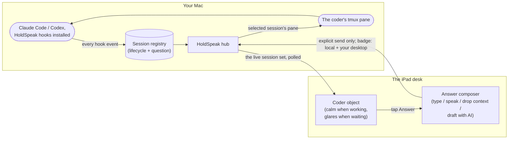
```mermaid
flowchart LR
  subgraph mac["Your Mac"]
    CC(["Claude Code / Codex,<br/>HoldSpeak hooks installed"])
    REG[("Session registry<br/>(lifecycle + question)")]
    HUB["HoldSpeak hub"]
    PANE(["The coder's tmux pane"])
  end
  subgraph ipad["The iPad desk"]
    PRIM["Coder object<br/>(calm when working,<br/>glares when waiting)"]
    COMP["Answer composer<br/>(type / speak / drop context /<br/>draft with AI)"]
  end
  CC -->|"every hook event"| REG
  REG --> HUB
  HUB -->|"the live session set, polled"| PRIM
  PRIM -->|"tap Answer"| COMP
  COMP -->|"explicit send only; badge: local + your desktop"| HUB
  HUB -->|"selected session's pane"| PANE
  PANE --> CC
```

The composer's draft runs on the engine you configured, on device or on your
endpoint, and shows that as its own badge; where the draft runs is not where
the answer goes. A failed delivery keeps the question on the desk.

### The steering chokepoint

The web desk can also steer a live session directly: watch its pane, resolve
authority, and type into it. Watching is free and read only, a hash-gated peek
that costs a poll only while a pull-out is open. Every text delivery, by
contrast, passes one function, `coder_steering.deliver`, and there is no other
path to the pane. The central operation policy selects the authority invariant:
Secure and Normal consume an exact, bounded pane grant; YOLO accepts the
registered pane as posture authority without manufacturing a grant. The pane
identity captured by the read side rides the request, and the chokepoint
re-resolves the session target immediately before delivery. It sends only to
the verified canonical `%N`, so a missing, recycled, or retargeted pane refuses
before a keystroke. An invalid grant also revokes. The send itself reuses the
same tmux transport the answer loop uses. Every delivery and every refusal
writes the operation and policy snapshot plus a bounded text fingerprint to the
steering audit, never the whole steer, and projects a source-linked Receipt. A
test greps the codebase to keep the transport's call sites pinned to that one
chokepoint. The local path does not leave the machine; its authority model lives
in [SECURITY.md](SECURITY.md).

That chokepoint later grew from a reply channel into full manipulation without
loosening. Real keys (`C-c`, `Escape`, arrows) pass a sibling function,
`coder_steering.deliver_keys`, with the same policy-selected identity check and
audit and its own pinned census; a named key is allow-listed or refused by name,
never handed to `tmux` raw. A `pane:%N` key steers any exact tmux pane on the
machine, not only a tracked session, and is re-verified the same way. And
`coder_steering_relay` reaches another machine: it forwards the command and
expected identity to a configured node whose own copy of this chokepoint
resolves policy and executes it. The machine that types owns the authority
decision and audit while the hub only relays and names where the key landed.
Each addition is more reach over the same spine: watch free, resolve a bounded
grant or eligible posture, re-verify every target, preserve the key allow-list,
and audit every attempt.

The lifecycle joins it in `coder_factory.py`: `spawn` and `rename` are
name-validated audited acts (the name is an allow-list, passed as its own
argument), and `kill` reuses the steer gate outright, requiring the grant and
re-verifying the pinned pane before it ends anything. Those verbs live behind the
web desk's session surface, so a person spawns, drives, renames, and ends a
session from glass, each act its own line in the audit.

### The tool-call gate

The gate is the same spine pointed the other way: instead of the desk typing
into an agent, an opted-in Claude Code session stops before a matched tool
call and asks the desk. Its PreToolUse hook redacts the arguments (sha256 plus
a 120-character head; the full payload never crosses the wire), posts a
proposal to the loopback hub, and blocks its own loop, polling for the
decision. The proposal row is a record, never authority: only the waiting hook
can let the call proceed. Held proposals surface on the shade as needs-you
cards with Approve and Deny plus a one-line reason that rides back to the
agent verbatim. Every state flip passes one census-pinned transition (first
write wins), expiry is a deny, a hub restart invalidates every held row, and
armed-plus-any-error denies by name; the unarmed hook is inert. On session
end, a Stop-hook leg reports the session's token totals (numbers and model
only) so the receipt line can print reported figures the capability ledger
(`agent_capabilities.py`) actually vouches for.

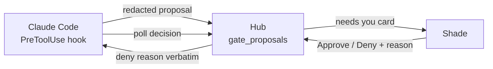
```mermaid
flowchart LR
    A[Claude Code<br/>PreToolUse hook] -- "redacted proposal" --> H[Hub<br/>gate_proposals]
    H -- "needs you card" --> S[Shade]
    S -- "Approve / Deny + reason" --> H
    A -- "poll decision" --> H
    H -- "deny reason verbatim" --> A
```

The delivery collector gained a PR pass on the same receipt discipline: one
batched `gh pr list` per registered source, run by the Refresh verb or an
explicitly set per-source cadence, mapped to rows carrying state, the CI
conclusion, the observed-at stamp, and an attribution label that never claims
more than the match proves (exact worktree identity, a name-match heuristic,
or unattributed). A failing poll degrades to a named stale row and keeps the
last good rows; the see-diff verb is local-only, offering an explicit fetch
when commits are absent.

### The rails as material

The delivery rails are also material a run can ground on. An open phase, a
story, an evidence file, or the roadmap can be picked in the same grounding
picker as a meeting, and the hub hydrates it through the one grounding seam
that ask and steer share. The content is a receipt: the `dw` command line
names the exact file for that object, the hub reads that file as opaque text,
and rail state is never re-derived from the markdown, so a grounded story is
always the real thing on disk. Alongside grounding, an ambient observer
(off by default) tails the rails' own event stream through the same command
line, summarizes each batch of new activity on a local model, and writes a
journal note. The observer only reads and journals; anything it would do
rides the existing story-flip proposal, and a remote machine's events reach
the journal as events alone, named by their origin node. The whole surface
reads your own `dw` and runs your own model; nothing new leaves the machine.

## The desk across surfaces

The desk is one convention rendered three times. Every desk concept
(meeting, artifact, note, recipe, knowledge base, directory, chain,
workflow, profile) is a primitive under a single documented contract
([the Primitive Framework](../pm/roadmap/holdspeak-mobile/contracts/THE_PRIMITIVE_FRAMEWORK.md):
one canonical table of kinds, wire shapes, and per-surface parity), and
each surface derives its rendering from that contract rather than keeping
its own model. The desktop hub owns the canonical store; the iPad and the
web desk are authoring ports onto it.

On the web desk the world layer speaks the Workbench grammar (Phase
105, law in [DESK_GRAMMAR.md](internal/DESK_GRAMMAR.md)): every
primitive renders as a working icon in one uniform cell (64px pixel
art 1:1, a real on-disk state-image set of rest/`_sel`/`_stale`, and
badges fed only by named live fields) and composes by direct manipulation
through a declared drop matrix (`web/src/desk/dropMatrix.ts`).
Directories are drawers that open into remembering windows
(icons/list views persisted per zone); every object answers one
contract-derived Info card (`infoContract.ts`, properties only where
a real update path exists); and desk verbs live in one registry
(`verbRegistry.ts`) rendered by both the menu bar and the search
shelf. The verb registry's wire face is deliberately deferred to the
kernel's userland dispatch
([PLAN_KERNEL_OPERATION_BROKER.md](internal/PLAN_KERNEL_OPERATION_BROKER.md)).

Not everything on a desk is the same kind of data, and the sync model
keeps four classes apart:

- **Content** (meetings, artifacts): the canonical record; syncs.
- **Organization** (directories, knowledge bases, membership): which
  object lives in which container is shared truth; it syncs, and the hub
  is canonical.
- **Capability** (recipes, chains, workflows, runtime profiles): the
  definitions are portable and sync, so a workflow authored on the iPad
  runs on the hub. Models are the exception: only a small **manifest**
  syncs per node (its id, node, name, capabilities), so every surface can
  say which model "run it on your desktop" would actually use. The model
  binary never rides the wire, and the schema, the Swift wire test, and a
  hub route test each assert that independently.
- **Layout** (where a card sits, how it is arranged): per-device
  ergonomics; never syncs.

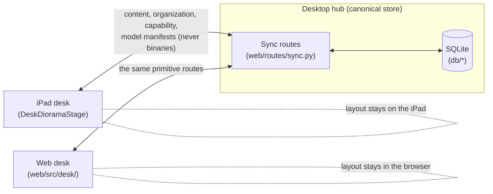
```mermaid
flowchart LR
  subgraph hub["Desktop hub (canonical store)"]
    DB[("SQLite<br/>(db/*)")]
    SY["Sync routes<br/>(web/routes/sync.py)"]
  end
  IPAD["iPad desk<br/>(DeskDioramaStage)"]
  WEBD["Web desk<br/>(web/src/desk/)"]
  IPAD <-->|"content, organization, capability,<br/>model manifests (never binaries)"| SY
  WEBD <-->|"the same primitive routes"| SY
  SY <--> DB
  IPAD -. "layout stays on the iPad" .- IPAD
  WEBD -. "layout stays in the browser" .- WEBD
```

The simplest capability needs no authoring at all. On any desk you can
rope a few objects together and ask the AI one thing about exactly that
pile: the run is grounded in the canonical record (the hub or the device
reads each roped object's real content), nothing is stored unless you
keep the answer, and a kept answer becomes an artifact whose lineage
names every object it read plus the exact instruction. Both surfaces
mint and read one provenance shape, so a card kept on the iPad shows the
same lineage on the web and the other way round. The printed card's
badge states where that run went (the model, and the host for an
endpoint run), resolved per run rather than from the app default.

The desk's mission-control conveyor is a read path with one deliberate
shape: the hub shells each mapped repository's own `dw` CLI for the
three documents the Delivery Workbench contract allows a client (state
feed, session correlation, event log), asks the operator's own `gh` for
open pull requests and their check rollups, and relays all of it typed
and byte-honest (`missioncontrol_bridge.py` behind
`/api/missioncontrol/*`, every belt read GET-only under a fitness
test). When a read observes a repository's state tree change, the hub
broadcasts a `scope:"belt"` frame on the one `/ws` bus, so any surface
can move its belt without private polling. Evidence files open through
the same CLI-resolved paths, contained to each repository's
`pm/roadmap` tree.

## The trust boundary

Everything inside the box runs on your machine. Every arrow leaving it is a
crossing you opened, with the gate on it named. This mirrors the egress
table in [`SECURITY.md`](SECURITY.md); if the two ever disagree, SECURITY is
the source of truth.

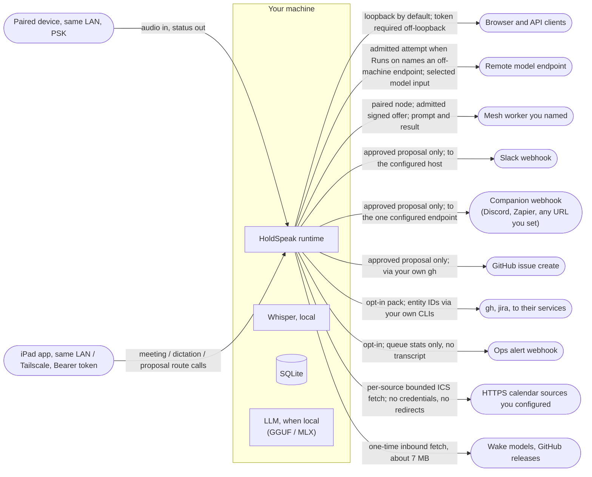
```mermaid
flowchart LR
  subgraph machine["Your machine"]
    RT["HoldSpeak runtime"]
    WH["Whisper, local"]
    DB[("SQLite")]
    LL["LLM, when local<br/>(GGUF / MLX)"]
  end
  RT -->|"loopback by default; token required off-loopback"| WEB(["Browser and API clients"])
  RT -->|"admitted attempt when Runs on names an off-machine endpoint; selected model input"| CLOUD(["Remote model endpoint"])
  RT -->|"paired node; admitted signed offer; prompt and result"| NODE(["Mesh worker you named"])
  RT -->|"approved proposal only; to the configured host"| SK(["Slack webhook"])
  RT -->|"approved proposal only; to the one configured endpoint"| WHK(["Companion webhook<br/>(Discord, Zapier, any URL you set)"])
  RT -->|"approved proposal only; via your own gh"| GH(["GitHub issue create"])
  RT -->|"opt-in pack; entity IDs via your own CLIs"| CLI(["gh, jira, to their services"])
  RT -->|"opt-in; queue stats only, no transcript"| OPS(["Ops alert webhook"])
  RT -->|"per-source bounded ICS fetch; no credentials, no redirects"| ICS(["HTTPS calendar sources you configured"])
  RT -->|"one-time inbound fetch, about 7 MB"| WM(["Wake models, GitHub releases"])
  DEVCE(["Paired device, same LAN, PSK"]) -->|"audio in, status out"| RT
  IPAD(["iPad app, same LAN / Tailscale, Bearer token"]) -->|"meeting / dictation / proposal route calls"| RT
```
