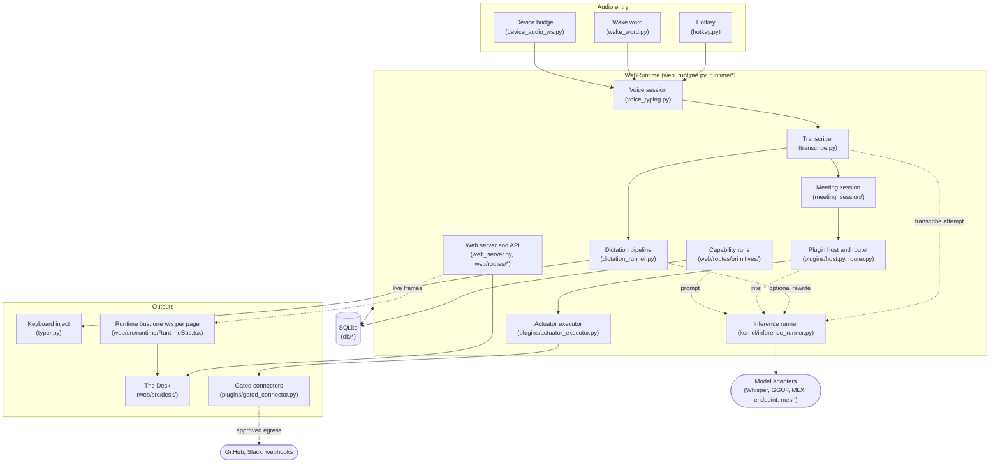
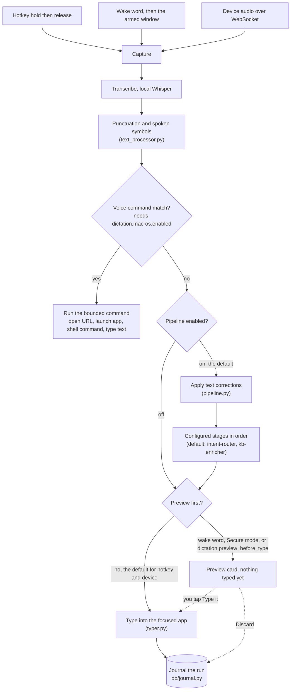
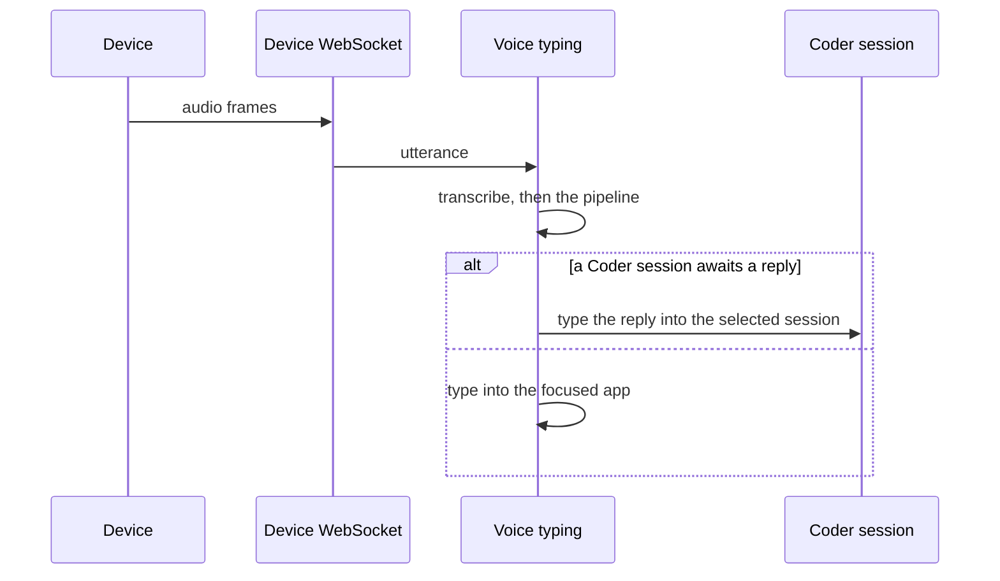
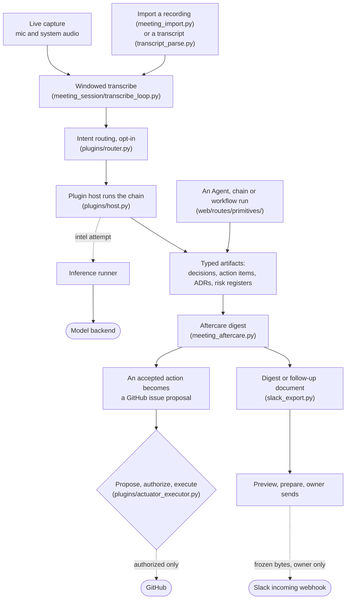
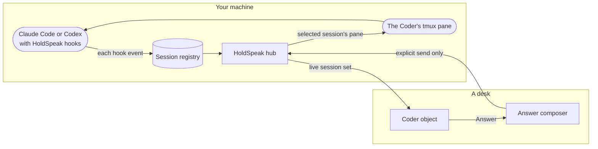
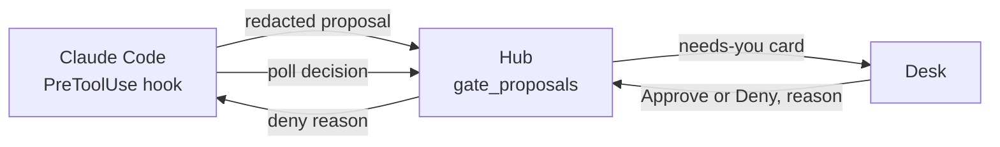
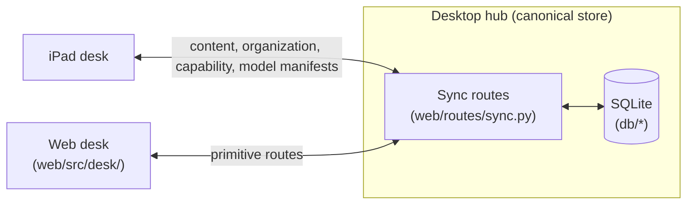
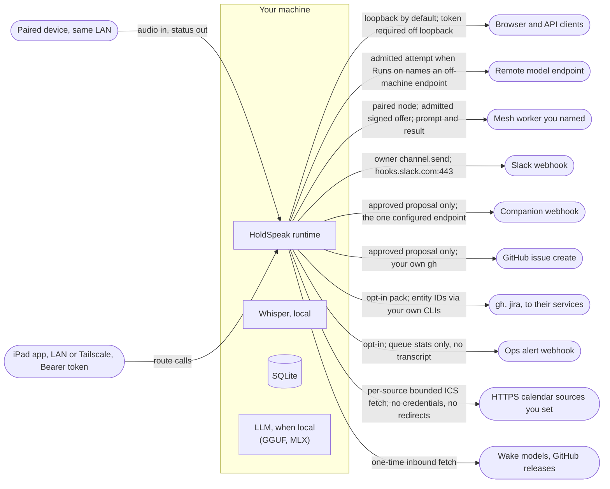

# HoldSpeak architecture

This is the map for a contributor. It shows how the pieces of HoldSpeak fit
and how one utterance flows through them. It is the runtime view. For the code
layout, read the
[web frontend decomposition](internal/ARCHITECTURE_WEB_FRONTEND.md) and the
[backend runtime decomposition](internal/ARCHITECTURE_BACKEND_RUNTIME.md).
For a shorter map, read [System architecture](SYSTEM_ARCHITECTURE.md).

The diagrams are Mermaid. A test (`tests/e2e/test_mermaid_renders.py`) renders
every block in the docs, so a broken diagram fails the test.

## The shape of it

The Web runtime is the main process. `WebRuntime` (`holdspeak/web_runtime.py`
and `holdspeak/runtime/`) owns the hardware-facing components and the local
FastAPI server (`MeetingWebServer`). The server serves the Web app and the
API. Two supporting processes exist: the MCP sidecar and the isolated desktop
typing executor.

- **Dictation** turns held-key or wake-word speech into typed text. Capture and
  transcription always run. The pipeline stages follow the `dictation.pipeline`
  config.
- **Meetings** turn live or imported audio into a transcript, typed artifacts
  and an aftercare digest. Actions out are proposals that you approve.

Transcription is local (`Transcriber`, MLX or faster-whisper). The Model
Library lists the model profiles. Assignments hold the ordered choices for each
capability. The inference runner freezes the chosen route before each attempt.
State lives in one SQLite database behind repositories. An outbound action
needs audited authority: the control posture, a scoped grant or a decision for
that action. See [The trust boundary](#the-trust-boundary) and
[Security](SECURITY.md).

The iPad app joins over your own network. It is a typed client of the same
FastAPI routes as the web UI. It is not a second runtime. See
[Companion architecture](COMPANIONS_ARCHITECTURE.md).

## The components

Boxes are subsystems. The label names the owning module.

```mermaid
flowchart TB
  subgraph entry["Audio entry"]
    HK["Hotkey<br/>(hotkey.py)"]
    WW["Wake word<br/>(wake_word.py)"]
    DEV["Device bridge<br/>(device_audio_ws.py)"]
  end

  subgraph runtime["WebRuntime (web_runtime.py, runtime/*)"]
    VS["Voice session<br/>(voice_typing.py)"]
    TR["Transcriber<br/>(transcribe.py)"]
    DR["Dictation pipeline<br/>(dictation_runner.py)"]
    MS["Meeting session<br/>(meeting_session/)"]
    PH["Plugin host and router<br/>(plugins/host.py, router.py)"]
    RUN["Capability runs<br/>(web/routes/primitives/)"]
    IR["Inference runner<br/>(kernel/inference_runner.py)"]
    AX["Actuator executor<br/>(plugins/actuator_executor.py)"]
    SRV["Web server and API<br/>(web_server.py, web/routes/*)"]
  end

  subgraph out["Outputs"]
    TY["Keyboard inject<br/>(typer.py)"]
    DESK["The Desk<br/>(web/src/desk/)"]
    BUS["Runtime bus, one /ws per page<br/>(web/src/runtime/RuntimeBus.tsx)"]
    CN["Gated connectors<br/>(plugins/gated_connector.py)"]
  end

  DB[("SQLite<br/>(db/*)")]
  MODEL(["Model adapters<br/>(Whisper, GGUF, MLX, endpoint, mesh)"])

  HK --> VS
  WW --> VS
  DEV --> VS
  VS --> TR
  TR --> DR
  TR --> MS
  TR -. "transcribe attempt" .-> IR
  DR --> TY
  DR -. "optional rewrite" .-> IR
  MS --> PH
  PH -. "intel" .-> IR
  IR --> MODEL
  PH --> AX
  AX --> CN
  CN -. "approved egress" .-> EXT(["GitHub, Slack, webhooks"])
  SRV --> DESK
  SRV -. "live frames" .-> BUS
  BUS --> DESK
  RUN -. "prompt" .-> IR
  RUN --> DB
  runtime <--> DB
```

## Inference admission: one path, one receipt per attempt

This section is the integration contract for model work.

Every provider attempt enters `InferenceRunner.invoke()` and becomes one
`inference.invoke@1` operation. The runner admits and claims that child before
an adapter can call a provider. The child names one immutable
`DeploymentRevision`, captured before admission. It ends in exactly one
immutable terminal receipt. The reviewed adapters accept a single-use
`DispatchContext` from the runner. No route, service, plugin, command, local
Whisper backend or mesh worker is an alternate entrance.

- A parent run or session is causation and a finite budget. It does not replace
  the receipt of each attempt.
- Sequence, Workflow, Workbench, Cadence drafting, Decision promotion,
  Delivery review, voice resolution, Meetings, dictation and wake captures use
  typed parents. Each model step under a parent is its own child.
- A parent receipt says how the run ended. A child receipt says how that
  attempt ended.
- Ask uses the service contract `holdspeak.ask` (`services/ask_service.py`).
  Saved Agents use `recipe:<id>` and the Agent's `last_modified` revision.
- Both freeze the destination as a `DeploymentRevision` before dispatch. A
  later **Runs on** edit cannot retarget a child in flight.
- Provider output waits behind the terminal election. The receipt carries the
  outcome and a result reference. It does not carry the prompt or the domain
  body. The result becomes visible only if that child wins publication.
- Cancel advances the execution fence and rejects late output.
- A fallback or retry is a new child with a new receipt and a higher attempt
  number.
- If the runner cannot prove the end of an attempt that may have started, the
  outcome is `indeterminate`. The runtime does not guess success and does not
  retry uncertain work.

A live Meeting, dictation or wake session has one authenticated parent
(`meeting.session@1`, `dictation.session@1`, `wake.session@1`). Each LLM or
Whisper call is a linked child. A child checks the parent for liveness,
revocation, deadline, budget and revision. Whisper preload needs a narrow
preload authority and its own receipt. Prompt, transcript, text and audio stay
in the dispatch path. Kernel records carry only refs, hashes, authority,
placement and outcomes.

A scheduled Workbench run is not owner impersonation. Enabling a schedule
mints one bounded delegation over the exact Workbench, Agent and schedule
revisions, the deployment revision, the cadence and an expiry. The owner is the
delegator. The due tick acts as the `scheduler` principal. The tick refuses
before any model call and leaves a refusal receipt in these cases:
`delegation_missing`, `delegation_revoked`, `delegation_expired`,
`delegation_target_changed` and `duplicate_tick`.

Sync follows code authority in one direction. `SYNC_REGISTRY` in
`holdspeak/services/sync_service.py` defines the kind, bucket, schema and merge
contract. `/api/sync/pull` and `/api/sync/push` and the schemas follow it.
Native clients consume that contract. They do not define it.

For states, receipts and recovery, read [Kernel](KERNEL.md). For model routing,
read [Model runtime](MODEL_RUNTIME.md).

## The dictation pipeline

Held-key or wake-word speech becomes typed text. Capture and transcription
always run. The pipeline is on by default with the stages `intent-router` and
`kb-enricher`. With the pipeline off, you speak and HoldSpeak types what you
said. [Dictation architecture](DICTATION_ARCHITECTURE.md)
holds the detail.

```mermaid
flowchart TD
  HK["Hotkey hold then release"] --> CAP
  WW["Wake word, then the armed window"] --> CAP
  DEV["Device audio over WebSocket"] --> CAP
  CAP["Capture"] --> TR["Transcribe, local Whisper"]
  TR --> PUNC["Punctuation and spoken symbols<br/>(text_processor.py)"]
  PUNC --> VC{"Voice command match?<br/>needs dictation.macros.enabled"}
  VC -- yes --> FIRE["Run the bounded command<br/>open URL, launch app, shell command, type text"]
  VC -- no --> PIPE{"Pipeline enabled?"}
  PIPE -- "off" --> FORK
  PIPE -- "on, the default" --> CORR["Apply text corrections<br/>(pipeline.py)"]
  CORR --> STAGES["Configured stages in order<br/>(default: intent-router, kb-enricher)"]
  STAGES --> FORK{"Preview first?"}
  FORK -- "no, the default for hotkey and device" --> TYPE["Type into the focused app<br/>(typer.py)"]
  FORK -- "wake word, Secure mode, or dictation.preview_before_type" --> PREVIEW["Preview card, nothing typed yet"]
  PREVIEW -. "you tap Type it" .-> TYPE
  PREVIEW -. "Discard" .-> J
  TYPE --> J[("Journal the run<br/>db/journal.py")]
```

Model stages run as admitted inference children.

### The learning loop

The hub journals every dictation run. You correct one wrong result, and the
next matching utterance changes. The store
(`holdspeak/plugins/dictation/corrections.py`) holds three kinds of
correction.

| Kind | Key | Value | Match |
| --- | --- | --- | --- |
| `text` | The phrase as heard | The phrase as said | Exact phrase |
| `intent` | A gist of the utterance | A block id | Token overlap of 0.5 or more |
| `target` | A gist of the utterance | A target profile id | Token overlap of 0.5 or more |

- Text rules apply inside `DictationPipeline.run`, before the stage loop. Every stage
  reads the corrected words.
- Rules apply longest key first. Each rule sees the text that earlier rules
  left.
- `PipelineRun.corrections_applied` lists the rules that changed the run. The
  journal row stores it.
- The recorder sends one `dictation.journal.entry` frame on the runtime
  WebSocket after it stores a row. Secret filtering runs before the store.
- `CorrectionStore.record` refuses a correction with the reason `kind`,
  `empty`, `secret` or `one_word`. The one-word refusal applies only to the
  routing kinds.

The routes are under `/api/dictation/`: `dry-run`, `remote`, `journal`,
`journal/{entry_id}/correct`, `corrections`, `corrections/{id}` (delete) and
`readiness`. See [API reference](API_REFERENCE.md).

### The device path

An AIPI-Lite board on the same network streams 16 kHz audio to the runtime.
If a Coder session waits for a reply, the transcript goes to that session. If
not, it goes to the focused app. See [AIPI-Lite](AIPI_LITE.md) and
[Device protocol](DEVICE_PROTOCOL.md).

```mermaid
sequenceDiagram
  participant D as Device
  participant WS as Device WebSocket
  participant VT as Voice typing
  participant AG as Coder session
  D->>WS: audio frames
  WS->>VT: utterance
  VT->>VT: transcribe, then the pipeline
  alt a Coder session awaits a reply
    VT->>AG: type the reply into the selected session
  else
    VT->>VT: type into the focused app
  end
```

## The meeting pipeline

Live or imported audio becomes a transcript, typed artifacts and an aftercare
digest. Each intelligence attempt enters the inference runner. Actions out are
proposals that you approve. See [Meeting architecture](MEETING_ARCHITECTURE.md)
and [Meeting aftercare](MEETING_AFTERCARE.md).

```mermaid
flowchart TD
  LIVE["Live capture<br/>mic and system audio"] --> TRW
  IMP["Import a recording (meeting_import.py)<br/>or a transcript (transcript_parse.py)"] --> TRW
  TRW["Windowed transcribe<br/>(meeting_session/transcribe_loop.py)"] --> ROUTE
  ROUTE["Intent routing, opt-in<br/>(plugins/router.py)"] --> HOST
  HOST["Plugin host runs the chain<br/>(plugins/host.py)"]
  HOST -. "intel attempt" .-> IR["Inference runner"]
  IR --> LLM(["Model backend"])
  HOST --> ART["Typed artifacts:<br/>decisions, action items, ADRs, risk registers"]
  RUNB["An Agent, chain or workflow run<br/>(web/routes/primitives/)"] --> ART
  ART --> AFT["Aftercare digest<br/>(meeting_aftercare.py)"]
  AFT --> ISSUE["An accepted action becomes<br/>a GitHub issue proposal"]
  AFT --> SLACK["Digest or follow-up document<br/>(slack_export.py)"]
  ISSUE --> APV{"Propose, authorize, execute<br/>(plugins/actuator_executor.py)"}
  SLACK --> SEND["Preview, prepare, owner sends"]
  SEND -. "frozen bytes, owner only" .-> SLEXT(["Slack incoming webhook"])
  APV -. "authorized only" .-> EXT(["GitHub"])
```

After a Meeting ends and its transcript is saved:

1. The hub links the Meeting to Rooms (`plugins/project_detector.py`).
2. If auto-intel is on and a Room is linked, the hub enqueues an intel job.
   The queue deduplicates by transcript hash.
3. The intel queue conductor drains the queue. It polls every 15 seconds. The
   **Run summary** verb wakes it at once.
4. The `decision_capture` and `action_owner_enforcer` plugins run.
5. The follow-through service turns the artifacts into proposals under
   **NEEDS YOU**.
6. Nothing commits until you press **Confirm**. Confirm writes a decision
   record and a commitment with a receipt. **Dismiss** marks the proposal
   dismissed with a receipt.

A suggested source is a step after intel. It scans the transcript for
`owner/repo` patterns and Jira-style issue keys. It checks them against the
connected providers. Matches appear in the Room's **SOURCES** section. **Add**
creates a Watch source. **Dismiss** saves the dismissal.

## The calendar pipeline

Calendar events from one or more ICS sources feed the Door's Upcoming rail,
event-born recordings, the Room's meeting watch and the weekly brief.

| Part | Behavior | Source |
| --- | --- | --- |
| Sources | `CalendarConfig.sources` lists `CalendarSource` entries: `id`, `label`, `url` (file path or HTTPS URL), `enabled` | `holdspeak/config/integrations.py` |
| Refresh | `CalendarIngestConductor` runs at boot and every 15 minutes. Each source refreshes alone. A failed source keeps its last good rows. | `holdspeak/calendar_ingest_conductor.py` |
| Fetch | HTTPS has no redirects, no credentials and a 10-second timeout. A file path reads directly. | `CalendarSourceReader` |
| Parse | Bounds: 5 MiB feed, 14-day horizon, 128 occurrences per master event | `holdspeak/calendar_ingest.py` |
| Store | `replace_projection` swaps only that source's rows. Removed or disabled sources are cleaned at the next tick. | `holdspeak/db/calendar_events.py` |
| Door | `DoorService` adds `source_id` and `source_label` to each upcoming item | `holdspeak/services/door_service.py` |
| Snapshot | A calendar screenshot becomes events through the vision capability `calendar.snapshot_extract`. The result is hostile input. The same parser checks it. The owner confirms the week anchor and the events. | `holdspeak/services/calendar_snapshot_service.py` |

The `MeetingWatchSource` reads only the local database. It has zero egress.

The Connections view (`ConnectionsService`) gives one readiness shape for
GitHub, Jira, calendar and models. It stores no state. Routes:
`GET /api/connections` and `POST /api/connections/{provider}/recheck`.

## Background loops

The runtime starts daemon threads. Each has its own failure boundary. An
exception in one loop does not stop another.

| Loop | Thread name | Module | Runs |
| --- | --- | --- | --- |
| Plugin queue | `HoldSpeakMirPluginQueue` | `web_runtime.py` | Always |
| Cadence engine | `HoldSpeakCadenceEngine` | `runtime/cadence.py` | When `config.cadence.enabled` is set |
| Heartbeat | `HoldSpeakHeartbeat` | `runtime/heartbeat.py` | Always |
| Transcriber warm-up | `HoldSpeakTranscriptionWarmup` | `runtime/transcriber_state.py` | Once at start |
| Intel queue | `HoldSpeakIntelQueue` | `intel_queue_conductor.py` | Hub lifespan. Only in the process that owns the database. |
| Workbench conductor | `workbench-conductor` | `workbench_conductor.py` | Hub lifespan |
| Scheduled recording | (conductor thread) | `scheduled_recording_conductor.py` | Hub lifespan. Ticks every 60 seconds. |
| Calendar ingest | (conductor thread) | `calendar_ingest_conductor.py` | Hub lifespan |
| Memory | `memory-conductor` | `memory_conductor.py` | Hub lifespan. Only in the process that owns the database. |
| Defaults | `defaults-conductor` | `defaults_conductor.py` | Hub lifespan |

The hub lifespan in `web_server.py` stops every conductor it starts.

### Scheduled recording

A due schedule starts a 10-second arming countdown. The countdown shows on the
bus and you can cancel it. Then the conductor starts the Meeting through the
normal `_start_meeting` path as the `SCHEDULER` principal. Auto-stop runs at
the set duration. The conductor writes `deadline_at` and `armed_at` before any
side effect. After a restart it stops a recording whose deadline passed. It
resolves an interrupted arming as missed. It writes one missed receipt for each
missed window. It does not fire a burst of catch-up recordings.

### The Heartbeat sweep

The Heartbeat thread checks every 60 seconds whether a sweep is due. The sweep
interval is the `sweep_every_minutes` setting. A due sweep runs
`HeartbeatService.run_sweep`:

1. Evaluate due Watches (`WatchService.evaluate_due`).
2. Refresh the needs-you aggregate (`needs_you_aggregate.build_aggregate`).
   `GET /api/desk/needs-you` reads from its cache. The response has
   `computedAt`, `stale` and `sweepId`.
3. Write a `heartbeat.sweep` kernel receipt and a `pipeline_events` entry.

Then the Heartbeat checks the notification edge. The edge is the set of item
ids, not the count. `ItemSetEdge` (`desktop_notify.py`) remembers which ids
were notified. It notifies when an unmuted id is new or when an id becomes due
today or overdue. A held sweep marks no ids as delivered. A restart notifies
nothing again. The banner uses `osascript` on macOS and libnotify on Linux.
Each notification writes a `heartbeat.notify` receipt.

Rules of the sweep:

- The Heartbeat is the only scheduler for graduated Watches. The Workbench
  conductor keeps only the Steward scheduler.
- Quiet hours hold the whole scheduled sweep. Nothing is evaluated and nothing
  is notified. The first sweep after quiet hours catches up.
- **Run now** is the owner's override. It runs in quiet hours and the receipt
  records `quiet_overridden: true`. Routes:
  `POST /api/settings/heartbeat/run-now` and the MCP tool `heartbeat.run_now`.
- A `runs_on` value other than `local` holds the whole sweep, with a quiet
  receipt. The remote host must run its own sweep.
- The scheduled sweep evaluates at most `WATCH_SWEEP_MAX` (10) Watches, oldest
  due first. The rest wait for the next sweep. The receipt has
  `watches_deferred`. The owner paths `POST /api/steward/trigger` and the MCP
  tool `project.steward.trigger` have no limit.
- A Watch is armed when you create or enable it. The first evaluation of an
  empty baseline is silent. It saves the snapshot, writes no evaluation row and
  returns the state `baselined`. The second run is a normal diff.
- The aggregate ranks rows with `services/attention_ranking.py`: overdue, due
  today, not run, no due date, waiting. One obligation from several sources is
  one row.

The Cadence engine tick regenerates the Monday brief once a day after quiet
hours end. It also clears the needs-you cache.

## Memory and the process read model

Meeting plugins produce typed artifacts. When `PluginRepository.record_artifact`
stores a `decisions` artifact, it also projects each entry into the `decisions`
table in the same transaction. The projection is one-way. A decision keeps its
identity from its normalized text and its source keys. Deleting a Meeting
keeps the decision row with `source_state=source_deleted`. Superseding a
decision marks artifacts derived from it as rejected.

Search uses full-text indexes for decisions, artifacts and notes. Database
triggers keep them current. `holdspeak memory rebuild-index` rebuilds them.
Search normalizes BM25 scores within each kind before it merges the kinds.

The native memory engine (`holdspeak/memory/`) adds chunks, embeddings, facts,
entities, consolidation and pages. The memory conductor runs it. It needs a
model assignment for the capabilities `memory.embed`, `memory.extract` and
`memory.page`. Without an assignment, memory still builds chunks. Recall falls
back to keyword and relation search. It yields to a live Meeting and to a live
local model call.

The grounding hydrator turns a project reference into citable source blocks,
each with a `[REF: kind:id]` line. The hydration receipt carries
`matched_count` and `overflow_count`.

The **Process** window shows live work. It polls `/api/kernel/events` and
`/api/kernel/read?view=process` and folds the journal into fixed sections. It
reads and shows. It admits no operation and has no execution controls.

## Interview and Thread state

Interview uses the Thread conversation, the model routing and the MCP
services. It does not add a model runtime or an automation engine.

| Component | Job |
| --- | --- |
| Thread window and store | Show messages, streamed replies, references and tool activity |
| Thread service | Run the conversation and its tool loop |
| Interview section descriptors | Declare the purpose, tool set and handoff of each section |
| Interview service | Validate and save facts, suggestion choices, section changes and revisions |
| MCP family | Expose Interview operations |
| Project services | Do the supported setup operations under their own policy |

The model chooses its question or tool call. The controller validates the
operation and the state change. Interview state belongs to a Thread. Each
change carries an expected revision and a command identity. A stale revision
is refused. A repeated command cannot carry a different payload. Changed or
removed facts remove the suggestions that depend on them.

Code: `holdspeak/services/interview_contracts.py`,
`holdspeak/services/interview_service.py`,
`holdspeak/mcp/families/interview.py`,
`holdspeak/services/thread_service.py`. For user behavior, read
[Interview](INTERVIEW.md).

## Coder sessions

A live Claude Code or Codex session is an object on the desk. Hooks report its
state. Nothing here acts alone. An AI can draft a reply. Only an explicit human
send delivers it. See [Coder integration](CODER_INTEGRATION.md).

```mermaid
flowchart LR
  subgraph mac["Your machine"]
    CC(["Claude Code or Codex<br/>with HoldSpeak hooks"])
    REG[("Session registry")]
    HUB["HoldSpeak hub"]
    PANE(["The Coder's tmux pane"])
  end
  subgraph desk["A desk"]
    PRIM["Coder object"]
    COMP["Answer composer"]
  end
  CC -->|"each hook event"| REG
  REG --> HUB
  HUB -->|"live session set"| PRIM
  PRIM -->|"Answer"| COMP
  COMP -->|"explicit send only"| HUB
  HUB -->|"selected session's pane"| PANE
  PANE --> CC
```

### The steering chokepoint

Watching a pane is read only. Every text delivery passes one function,
`coder_steering.deliver`. There is no other path to the pane.

- The central operation policy picks the authority rule. Secure and Normal need
  an exact, bounded pane grant. YOLO accepts the registered pane as posture
  authority.
- The read side captures the pane identity. The chokepoint resolves the target
  again just before delivery. It sends only to the verified `%N` pane. A
  missing, recycled or retargeted pane is refused before any keystroke.
- Every delivery and refusal writes the operation, the policy snapshot and a
  bounded text fingerprint to the steering audit. A source-linked Receipt
  follows.
- `coder_steering.deliver_keys` sends real keys (`C-c`, `Escape`, arrows) under
  the same checks. A named key is on the allow list or it is refused.
- `coder_steering_relay` sends a command to another machine. That machine's own
  chokepoint decides and runs it.
- `coder_factory.py` has `spawn`, `rename` and `kill`. `kill` needs the same
  grant and the same pane check.

A test pins the call sites of the tmux transport to this chokepoint. Authority
details are in [Security](SECURITY.md).

### The tool-call gate

The Gate points the same spine the other way. An opted-in Claude Code session
stops before a matched tool call and asks the desk. The PreToolUse hook
redacts the arguments (a SHA-256 and a 120-character head) and posts a
proposal to the loopback hub. Then it blocks and polls for the decision. The
proposal row is a record, not authority. Only the waiting hook lets the call
proceed. Held proposals show as needs-you cards with **Approve**, **Deny** and
a reason. Expiry is a deny. A hub restart invalidates every held row. An error
while armed denies. An unarmed hook does nothing. See [Gate](GATE.md).

```mermaid
flowchart LR
    A[Claude Code<br/>PreToolUse hook] -- "redacted proposal" --> H[Hub<br/>gate_proposals]
    H -- "needs-you card" --> S[Desk]
    S -- "Approve or Deny, reason" --> H
    A -- "poll decision" --> H
    H -- "deny reason" --> A
```

### Reach through MCP

`POST /api/mcp` exposes the same `handle_message` entry point as the stdio
sidecar and the in-process fetcher. There is one implementation and three
transports. The remote path uses the live services of the web runtime. An
agent credential gets the agent principal and its tool palette. The owner web
token is refused off loopback. See [MCP sidecar](MCP_SIDECAR.md).

## The Desk across surfaces

Each desk concept (Meeting, Artifact, Note, recipe, knowledge base, directory,
chain, workflow, profile) is a primitive under one contract. See
[Desk object model](DESK_OBJECT_MODEL.md) and [Desk architecture](DESK_ARCHITECTURE.md).
The hub owns the canonical store. The iPad and the web desk are authoring
ports.

Sync keeps four classes apart:

- **Content** (Meetings, Artifacts): the canonical record. It syncs.
- **Organization** (directories, knowledge bases, membership): shared truth.
  It syncs. The hub is canonical.
- **Capability** (recipes, chains, workflows, runtime profiles): the
  definitions sync. A workflow made on the iPad runs on the hub. For models,
  only a small manifest syncs. The model binary never moves.
- **Layout** (where a card sits): per-device. It never syncs.

```mermaid
flowchart LR
  subgraph hub["Desktop hub (canonical store)"]
    DB[("SQLite<br/>(db/*)")]
    SY["Sync routes<br/>(web/routes/sync.py)"]
  end
  IPAD["iPad desk"]
  WEBD["Web desk<br/>(web/src/desk/)"]
  IPAD <-->|"content, organization, capability, model manifests"| SY
  WEBD <-->|"primitive routes"| SY
  SY <--> DB
```

A run over a few roped objects is grounded in the canonical record. Nothing is
stored unless you keep the answer. A kept answer becomes an Artifact whose
lineage names every object it read and the exact instruction. The badge on the
card names where the run went.

The mission-control belt is a read path. The hub runs each mapped repository's
own `dw` command for the documents the Delivery Workbench contract allows. It
asks your own `gh` for open pull requests. It relays the result typed
(`holdspeak/missioncontrol_bridge.py`, routes under `/api/missioncontrol/`).
When a read sees the state tree change, the hub sends a `scope:"belt"` frame on
the one `/ws` bus.

## Storage

On every open, `reconcile_schema` (`holdspeak/db/reconcile.py`) brings the
database to the shape in `SCHEMA_SQL` (`holdspeak/db/schema.py`).

- It creates missing tables, indexes and triggers.
- It adds missing columns with `ALTER TABLE ADD COLUMN`.
- If it changes a populated database, it first writes a timestamped backup.
- It then runs the idempotent data backfills.
- It is additive. It never drops a table or column and never deletes a row.
- There is no version gate. A database stamped with a newer version opens
  normally. The `schema_version` table is informational.
- SQLite cannot widen a CHECK constraint on an existing column. The reconcile
  does not try.

Back up with `holdspeak backup`. Restore with `holdspeak restore`. See
[Storage and migrations](STORAGE_AND_MIGRATIONS.md). The iPad keeps its own
SQLite store (`apple/Sources/Providers/Storage/SQLiteStorage.swift`). It
refuses a database newer than the build and backs up an older one before it
migrates.

## The trust boundary

Everything inside the box runs on your machine. Every arrow that leaves it is a
crossing you opened. The gate on each crossing is named. This diagram mirrors
the egress table in [Security](SECURITY.md). If they disagree, Security wins.

```mermaid
flowchart LR
  subgraph machine["Your machine"]
    RT["HoldSpeak runtime"]
    WH["Whisper, local"]
    DB[("SQLite")]
    LL["LLM, when local<br/>(GGUF, MLX)"]
  end
  RT -->|"loopback by default; token required off loopback"| WEB(["Browser and API clients"])
  RT -->|"admitted attempt when Runs on names an off-machine endpoint"| CLOUD(["Remote model endpoint"])
  RT -->|"paired node; admitted signed offer; prompt and result"| NODE(["Mesh worker you named"])
  RT -->|"owner channel.send; hooks.slack.com:443"| SK(["Slack webhook"])
  RT -->|"approved proposal only; the one configured endpoint"| WHK(["Companion webhook"])
  RT -->|"approved proposal only; your own gh"| GH(["GitHub issue create"])
  RT -->|"opt-in pack; entity IDs via your own CLIs"| CLI(["gh, jira, to their services"])
  RT -->|"opt-in; queue stats only, no transcript"| OPS(["Ops alert webhook"])
  RT -->|"per-source bounded ICS fetch; no credentials, no redirects"| ICS(["HTTPS calendar sources you set"])
  RT -->|"one-time inbound fetch"| WM(["Wake models, GitHub releases"])
  DEVCE(["Paired device, same LAN"]) -->|"audio in, status out"| RT
  IPAD(["iPad app, LAN or Tailscale, Bearer token"]) -->|"route calls"| RT
```
