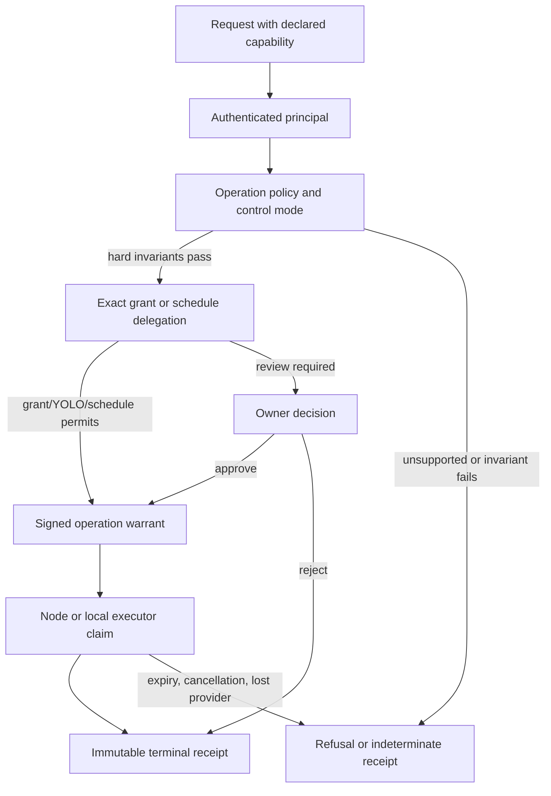

# Authority model

This is a source reconstruction at snapshot
`675401a857b85336d4acaa8c65383dfc9636e4c8` (2026-09-19). The existing
[AUTHORITY.md](AUTHORITY.md) is the product contract for control modes,
review, authorization, execution and grants. This page maps that contract to
the runtime paths and records where authority ends. It does not replace or
compete with the existing contract.

## Three separate questions

HoldSpeak keeps three decisions separate:

1. **Review:** is the proposed content acceptable?
2. **Authorization:** may this exact effect occur under the current posture,
   grant, delegation and hard invariants?
3. **Execution:** did an admitted executor claim, perform and receipt the
   effect?

An accepted proposal is not evidence that its effect ran. A successful
authorization is not evidence that a provider completed. The terminal receipt
and the operation state are the evidence boundary. The existing contract
states this distinction and the proposal rows in `holdspeak/db/schema.py:424-520`
persist the separate review, authorization and execution fields.

## Authority flow

## Principal rights

The principal kind is derived from authentication, never accepted as an
authority field in a request. Current rights are:

| Principal | Rights visible in source | Authority boundary |
| --- | --- | --- |
| Owner | Owner routes, approval, delegation, posture and read/write controls | The owner token is still subject to operation policy and hard invariants |
| Agent | `agent.submit`, `agent.read`, `agent.usage`, `self.revoke` | Cannot decide, delegate, change posture or claim as a node |
| Node | `node.link` | Executor/delivery protocol only; no owner control plane |
| Scheduler | No edge rights | Internal due-tick identity; only a persisted, exact delegation path can admit scheduled work |
| Service | No general rights | Narrowly issued ambient identity where a service path explicitly accepts it |
| None | No rights | Public routes are explicit exceptions, not authenticated authority |

These assignments are declared in `holdspeak/principals.py:20-59`; route
mapping and deny-by-default fallback are in `holdspeak/principals.py:275-380`.
The principal-separation assertions inspect owner, agent, node, expiry and
revocation behavior (`tests/integration/test_principal_separation.py`).

## Policy resolution

`operation_policy.py` evaluates authority in this order:

1. hard invariants;
2. revocation;
3. exact scoped grant;
4. control mode;
5. feature default.

Unknown operation families refuse. The current policy has `safe`, `neutral`
and `yolo` values and treats dictation commit, coder steering, external writes
and cadence as distinct families (`holdspeak/operation_policy.py:15-31,193-360`).
The policy test assertions cover safe review, neutral grants, fixed-destination
YOLO and unsupported-family refusal (`tests/unit/test_operation_policy.py`).
Those assertions were inspected and not run for this lane.

Changing control mode or a configured destination revokes applicable reusable
grants through the authority service; the change applies to future decisions
(`holdspeak/services/authority_service.py:72-103`). A grant is bound to actor,
family/effect, normalized destination, data classes, project/resource scope,
expiry and maximum use count. It contains no payload or credential. Issuance
requires a fixed-destination proposal; consumption records a use and revokes
when the count is exhausted (`holdspeak/services/authority_service.py:105-193`).

The focused grant assertions inspect scope binding, use records, count-based
revocation, config revocation, separate proposal axes and one captured policy
snapshot (`tests/unit/test_authority_grants.py`).

## Kernel authority layers

The generic kernel broker applies four gates (`holdspeak/kernel/broker.py:295-322`):

- authenticated principal and its route right;
- declared operation capability and registered operation specification;
- hard prerequisites such as causality, destination and policy;
- interruption policy for deadlines, cancellation and liveness.

The operation envelope binds name/version, target, placement, policy version,
authority basis, principal identity and idempotency. A caller cannot inject
authority fields in the admission body (`holdspeak/kernel/admission.py:11-47`).
The same principal and idempotency key with a changed envelope refuses instead
of replaying a different effect (`holdspeak/kernel/journal.py:127-155`).

An owner approval signs a warrant. The executor must later validate that
warrant, its exact envelope, revocation state, deadline and live ancestor; it
then writes one claim witness (`holdspeak/kernel/executor.py:26-87`). A warrant
does not grant unlimited authority: it is bound to one operation and the
operation's fixed target and placement.

## Parent runs, schedules and delegation

A parent run is a durable bounded authority shell. It carries a definition
reference/revision, input snapshot, deadline, execution epoch, planned node,
active child, child budget and lease (`holdspeak/db/schema.py:3253-3277`). A
physical model attempt is a child operation; fallback or retry creates a new
child. The parent controller persists each child and checkpoint so a stale
child cannot advance a newer epoch (`holdspeak/kernel/parent_run.py:148-200`,
`holdspeak/kernel/parent_checkpoint.py:21-51`).

Scheduled work uses an internal scheduler principal only after an exact owner
delegation is present. The contract in [SECURITY.md](SECURITY.md) describes
the terms that are frozen for Workbench and scheduled recording paths. A due
tick does not become an owner token and cannot widen its destination,
definition, cadence or deployment revision. Missing, revoked, expired, stale
or changed terms refuse before dispatch when that schedule path is reached.

## Approval, rejection and cancellation

The decision endpoint accepts only decision data. Mutation fields are rejected
by the HTTP route (`holdspeak/web/routes/system/kernel_routes.py:44-70`).
Approval produces a signed warrant; rejection is a terminal receipt with an
owner-rejection outcome and no execution claim
(`holdspeak/kernel/broker.py:183-262`).

Cancellation takes a write lock, changes an open parent to `CANCELLING`,
increments its execution epoch and clears its active child before asking the
provider to stop. A pending publication resolves to a truthful terminal
state; a late result cannot win (`holdspeak/kernel/parent_terminal.py:20-209`).
The publication guard blocks ordinary state or warrant-revocation writes
while a publication claim is active (`holdspeak/kernel/publication_transition.py:12-50`).

## Receipt and audit authority

Terminal states are `succeeded`, `failed`, `refused`, `cancelled` and
`indeterminate`. Every admitted terminal path is expected to leave one
immutable receipt, including rejection and refusal. A receipt's result
reference is validated and inference receipts include an attestation
(`holdspeak/kernel/executor.py:89-128`). The journal is hash-chained and the
inference attestation cannot be updated or deleted by SQLite triggers
(`holdspeak/kernel/journal.py:60-103,465-493`).

Use the operation state, receipt, journal event and native domain record
together. A review decision alone, a grant row alone, a process projection
alone, or a provider HTTP response without a receipt is insufficient evidence
of a completed effect.

## Boundaries and unknowns

This source snapshot establishes the application-level authority path. It does
not prove that every future adapter uses the kernel, that an owner has
observed every control surface, or that an arbitrary same-user process cannot
bypass cooperating code. It also does not establish the current production
contents of the in-memory credential store after restart. For those limits,
use [SECURITY_MODEL.md](SECURITY_MODEL.md) and the existing
[AUTHORITY.md](AUTHORITY.md) contract rather than inventing a stronger claim.
