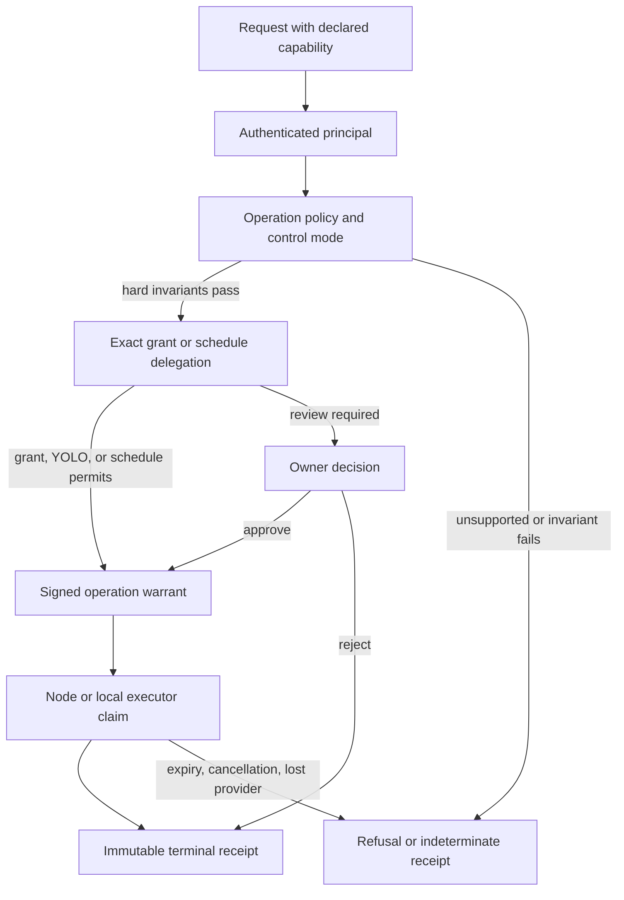

# Authority model

This page maps the [Authority](AUTHORITY.md) contract to the runtime code. It is
for contributors. It adds no second contract.

## Three separate questions

1. **Review.** Is the proposed content acceptable?
2. **Authorization.** May this exact effect occur under the current mode, grant,
   delegation, and hard invariants?
3. **Execution.** Did an admitted executor claim, perform, and receipt the effect?

An accepted proposal is not proof that the effect ran. A successful authorization
is not proof that a provider finished. The terminal receipt and the operation
state are the evidence. The `actuator_proposals` table in `holdspeak/db/schema.py` stores the
three fields apart: `review_decision`, `authorization_state`, and the execution
state.

## Authority flow

```mermaid
flowchart TD
  REQUEST[Request with declared capability]
  PRINCIPAL[Authenticated principal]
  POLICY[Operation policy and control mode]
  GRANT[Exact grant or schedule delegation]
  OWNER[Owner decision]
  WARRANT[Signed operation warrant]
  CLAIM[Node or local executor claim]
  RECEIPT[Immutable terminal receipt]
  REFUSE[Refusal or indeterminate receipt]

  REQUEST --> PRINCIPAL
  PRINCIPAL --> POLICY
  POLICY -->|hard invariants pass| GRANT
  GRANT -->|grant, YOLO, or schedule permits| WARRANT
  GRANT -->|review required| OWNER
  OWNER -->|approve| WARRANT
  OWNER -->|reject| RECEIPT
  WARRANT --> CLAIM
  CLAIM --> RECEIPT
  POLICY -->|unsupported or invariant fails| REFUSE
  CLAIM -->|expiry, cancellation, lost provider| REFUSE
```

## Principal rights

The edge derives the principal kind from authentication. A request body cannot
set it. `holdspeak/principals.py` declares the rights.

| Principal | Rights | Limit |
| --- | --- | --- |
| Owner | All rights: owner routes, decide, delegate, posture, read | Operation policy and hard invariants still apply |
| Agent | `agent.submit`, `agent.read`, `agent.usage`, `self.revoke` | Cannot decide, delegate, change posture, or claim as a node |
| Node | `node.link` | Executor and delivery protocol only. No owner control plane. |
| Scheduler | None | Internal due-tick identity. Only an exact saved delegation admits scheduled work. |
| Service | None | Narrow identity for a service path that accepts it |
| None | None | Public routes are named exceptions |

Route mapping and the deny-by-default fallback are in the same file.

## Policy resolution

`holdspeak/operation_policy.py` evaluates in this order: hard invariants,
revocation, exact scoped grant, control mode, feature default. An unknown family is
refused. The policy has the wire modes `safe`, `neutral`, and `yolo`. It treats
`dictation_commit`, `coder_steering`, `external_write`, and `sync_cadence` as
separate families. Steering grant TTLs are 5, 15, and 60 minutes for `safe`,
`neutral`, and `yolo`.

`holdspeak/services/authority_service.py` owns the mode and the grants.
`set_control_mode` revokes the reusable grants that the change affects. A change to
a configured destination does the same. `issue_grant` needs a fixed-destination
proposal. Each use records a row. A grant ends when its count is used up.

## Kernel authority layers

The broker (`holdspeak/kernel/broker.py`) applies four gates:

- the authenticated principal and its route right
- the declared capability and the registered operation spec
- hard prerequisites such as causality, destination, and policy
- interruption policy for deadlines, cancellation, and liveness

The envelope binds name and version, target, placement, policy version, authority
basis, principal identity, and idempotency. A caller cannot inject authority
fields into the admission body (`holdspeak/kernel/admission.py`). The same
principal and key with a changed envelope is refused.

An owner approval signs a warrant. The executor must check the warrant, the exact
envelope, revocation, the deadline, and the live ancestor. Then it writes one claim
witness (`holdspeak/kernel/executor.py`). A warrant covers one operation with its
fixed target and placement.

## Parent runs, schedules, and delegation

A parent run is a durable, bounded authority shell. It holds a definition
reference and revision, an input snapshot, a deadline, an execution epoch, a
planned node, an active child, a child budget, and a lease (`kernel_parent_runs`
in `holdspeak/db/schema.py`). A physical model attempt is a child operation. A
retry or fallback is a new child. The parent controller saves each child and
checkpoint, so a stale child cannot advance a newer epoch
(`holdspeak/kernel/parent_run.py`, `holdspeak/kernel/parent_checkpoint.py`).

Scheduled work uses the internal `scheduler` principal, and only when an exact
owner delegation exists (`holdspeak/kernel/schedule_delegated.py`). A due tick
cannot widen its destination, definition, cadence, or deployment revision. A
missing, revoked, expired, stale, or changed term is refused before dispatch. The
terms are listed in [Security and privacy](SECURITY.md#scheduled-workbench-runs).

## Approval, rejection, and cancellation

The decision route `POST /api/kernel/operations/{operation_id}/decide` accepts
decision data only. It rejects mutation fields
(`holdspeak/web/routes/system/kernel_routes.py`). Approval signs a warrant.
Rejection is a terminal receipt with an owner-rejection outcome and no execution
claim.

Cancellation takes a write lock, sets an open parent to `CANCELLING`, raises its
execution epoch, and clears its active child. Then it asks the provider to stop. A
pending publication ends in a truthful terminal state, and a late result cannot
win (`holdspeak/kernel/parent_terminal.py`). While a publication claim is active,
the publication guard blocks ordinary state writes and warrant revocation
(`holdspeak/kernel/publication_transition.py`).

## Receipts and audit

The terminal states are `succeeded`, `failed`, `refused`, `cancelled`, and
`indeterminate`. Every admitted terminal path leaves one immutable receipt,
including rejection and refusal. HoldSpeak validates the result reference.
Inference receipts include an attestation. The journal is hash-chained, and
database triggers block updates and deletes on the attestation.

To judge whether an effect completed, read the operation state, the receipt, the
journal event, and the domain record together. A review decision alone, a grant
row alone, a process projection alone, or a provider HTTP response without a
receipt is not enough.

## Limits

This page covers the application-level authority path. It does not prove that
every future adapter uses the kernel, or that a same-user process cannot bypass
cooperating code. Agent credentials live in memory and a restart clears them. See
[Security model](SECURITY_MODEL.md).
