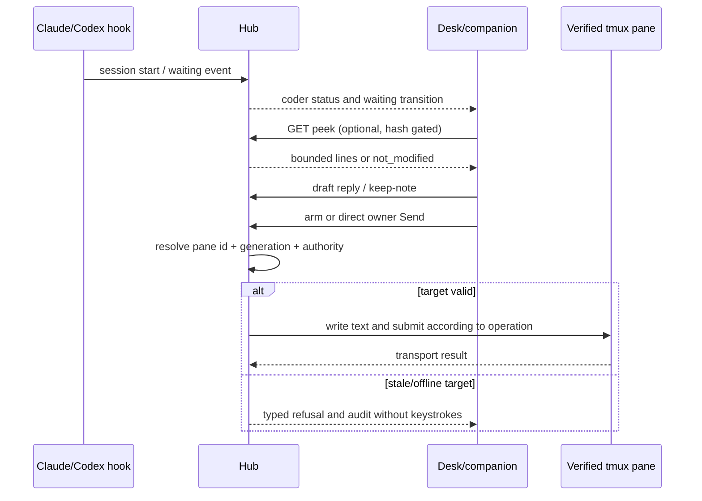

# Coder integration

Source audit at `675401a857b85336d4acaa8c65383dfc9636e4c8`. “Coder” means a
live Claude or Codex session exposed through hooks and a tmux-backed pane. It is
different from an authored Agent Thread. The hub observes session records and
can send a bounded, audited reply after the owner chooses the target.

## Capability inventory

| Capability | Concrete surface | State in source |
|---|---|---|
| observe sessions | `GET /api/coders/status`, `GET /api/coders/sessions` (`web.routes.system.coders`) | Returns current sessions, waiting state, age and target identity; no transcript claim beyond bounded peek |
| select/dismiss/pin a waiting target | `POST /api/coders/select`, `POST /api/coders/dismiss`, `POST /api/coders/pin` | Local companion board state; selection does not itself send input |
| clear stale sessions | `POST /api/coders/clear-stale` | Removes records past the requested age; route validates a non-negative integer |
| reply to a coder | `POST /api/coders/{key}/steer`, `POST /api/coders/relay/{node}/steer` | Sends typed text to one verified pane when the delivery posture permits it |
| draft and keep a reply | `POST /api/coders/{key}/keep-note` | Creates a durable Note containing the draft and session identity; keeping is separate from delivery |
| inspect pane output | `GET /api/coders/{key}/peek`, `GET /api/coders/relay/{node}/peek` | Returns ANSI-stripped, bounded lines plus a content hash; same hash returns `not_modified` |
| arm/disarm bounded steering | `POST /api/coders/{key}/arm`, `POST /api/coders/{key}/disarm`, `POST /api/coders/relay/{node}/arm`, `POST /api/coders/relay/{node}/disarm` | Creates or revokes a short-lived scoped grant; pane identity and generation are checked |
| send control keys | `POST /api/coders/{key}/keys`, `POST /api/coders/relay/{node}/keys` | Uses named keys and the same grant/pane checks |
| kill a pane/session | `POST /api/coders/{key}/kill` | Explicit control effect; pane/session scope is recorded and grant is dropped |
| spawn/rename a pane | `POST /api/coders/factory/spawn`, `POST /api/coders/factory/rename` | Validates safe names, runs tmux through the factory audit seam |
| read steering audit | `GET /api/coders/steering/audit` | Bounded, filterable audit rows; the MCP sidecar exposes read-only `coder.list`, `coder.get`, `coder.audit` |

The route roster and platform consumers are in [`api-surface.json`](api-surface.json).
The service boundary is `holdspeak/services/coder_service.py::CoderService`
(lines 14-172); tmux inspection and delivery are in
`holdspeak/coder_steering.py::peek_pane`, `::arm`, `::deliver`, and
`::deliver_keys` (lines 136-225, 331-476, 793-836). Factory effects are
`holdspeak/coder_factory.py::spawn`, `::rename`, and `::kill` (lines 41-182).

## Observation, draft, reply

The observation path reads a session record and, only when asked, takes a
bounded pane snapshot. `strip_ansi` removes terminal control sequences,
`content_hash` identifies unchanged content, and `peek_pane` keeps a byte and
line cap while retaining the tail. A dead pane is a typed `pane_gone` result;
tmux absence is `tmux_absent`; subprocess timeout is `error`.

The reply path resolves `agent:session` to one pane identity and expected
generation. `CoderService.reply` calls the steering delivery seam; it does not
send arbitrary shell commands. A normal reply records the text hash, byte
count, target pane, submit flag and operation policy. A no-submit draft can be
kept as a Note and edited again. Only an explicit Send/Steer commits process
input. A recycled or missing pane returns `pane_mismatch` or
`pane_identity_required` and types nothing.

`tests/unit/test_coder_steering.py` asserts peek hash gating, ANSI removal,
caps, dead-pane and timeout states. `tests/unit/test_coder_steering_deliver.py`
asserts unarmed refusal, exact text delivery, no-submit, recycled-pane refusal,
transport errors, grounding on the audit row and posture changes. The live
integration test `tests/integration/test_coder_steering_live.py` is evidence of
a test design that can exercise a real pane, but it was not run for this audit.

## Gate relationship

Coder steering and the Gate solve different problems. Steering is the owner's
deliberate reply/control of a selected process. Gate is a PreToolUse hold for a
risky tool call before that process runs it. A coder session may be visible
without Gate being armed; a waiting Gate proposal may be visible without a
reply being sent to the coder.

The agent hook never sends full tool arguments. It posts `args_sha256` and a
first-120-character canonical JSON head. The hub stores the same redacted
shape, then the owner decides the held proposal. See [`GATE.md`](GATE.md).

## GitHub observation and restrictions

The Coder/GitHub path is deliberately observation and proposal oriented:

- `gh pr view`, `gh pr list`, `gh issue view`, and `gh run list` are the
  read-only prefixes in `holdspeak/connector_packs/github_cli.py::ALLOWED_SUBCOMMANDS`
  (lines 27-40). The connector pack rejects writes such as `pr merge`,
  `issue close`, and `auth login` before the subprocess.
- A matched PR can be observed, its CI state retained, and a Coder session
  entered for the matching worktree. A generated GitHub comment is a proposal
  that needs its own approval and receipt through the actuator path.
- The actuator packs `github_issue_actuator` and `github_pr_actuator` are
  opt-in. Their tests explicitly reject non-allowlisted argv. Merge, close and
  force-push are not exposed by this workflow.

This source audit does not establish that `gh` is installed, authenticated, or
configured for a repository. It also does not establish a released Coder
package or owner observation.

## Failure and recovery

The observable states are `awaiting`, `live`, `not_modified`, `pane_gone`,
`tmux_absent`, `timeout`, `unarmed`, `delivered`, `pane_mismatch`,
`transport_error`, `empty_text`, and `pane_identity_required`. Each is data
for the Desk and steering audit. The steering grant has TTL and is revoked on
pane mismatch or kill. A Coder record can be stale and explicitly cleared;
stale data does not become a live target.

No Coder operation writes to the owner's real machine during documentation
work. A future product walk must prove the waiting card, draft/reply split,
failure copy and 1440/393 surfaces before the capability can be called
Tuesday-ready.
