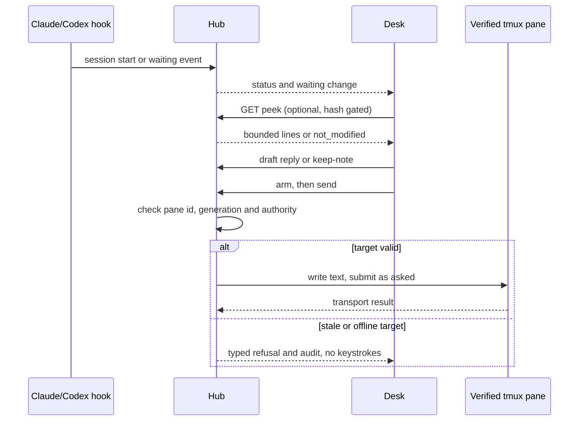

# Coder integration

A coder is a live Claude Code or Codex session that reports to HoldSpeak
through [agent hooks](AGENT_HOOK_INSTALL.md) and runs in a tmux pane. A
coder is not an Agent. An Agent is a persona that you author.

The hub observes coder sessions. After you choose a target, it can send
one bounded, audited reply to that pane. For the steps in the Desk, see
[Steer a session from the Desk](USER_GUIDE.md#steer-a-session-from-the-desk).

## Routes

| Action | Route | Behavior |
|---|---|---|
| Observe sessions | `GET /api/coders/status`, `GET /api/coders/sessions` | Current sessions, waiting state, age and target |
| Select, dismiss or pin a waiting session | `POST /api/coders/select`, `POST /api/coders/dismiss`, `POST /api/coders/pin` | Desk state only. Selection sends no input. |
| Clear stale sessions | `POST /api/coders/clear-stale` | Removes records older than the age you give |
| Read pane output | `GET /api/coders/{key}/peek`, `GET /api/coders/relay/{node}/peek` | Bounded text without terminal control codes, plus a content hash |
| Arm or disarm a pane | `POST /api/coders/{key}/arm`, `POST /api/coders/{key}/disarm`, and the same under `/api/coders/relay/{node}/` | Creates or removes a short-lived grant for one pane |
| Send a reply | `POST /api/coders/{key}/steer`, `POST /api/coders/relay/{node}/steer` | Types text into one verified pane |
| Send keys | `POST /api/coders/{key}/keys`, `POST /api/coders/relay/{node}/keys` | Sends named keys, such as `C-c`, `Escape` and `Enter` |
| Keep a draft | `POST /api/coders/{key}/keep-note` | Saves the draft and the session identity as a Note. It sends nothing. |
| End a session | `POST /api/coders/{key}/kill` | Ends the pane and drops its grant |
| Start or rename a pane | `POST /api/coders/factory/spawn`, `POST /api/coders/factory/rename` | Checks the name, then runs tmux |
| List panes, grants and nodes | `GET /api/coders/steering/panes`, `GET /api/coders/steering/grants`, `GET /api/coders/steering/nodes` | Read-only lists |
| Read the audit | `GET /api/coders/steering/audit` | Bounded, filterable rows |

The MCP tools `coder.list`, `coder.get` and `coder.audit` read sessions and
the audit. The sidecar has no tool that sends input. See the
[MCP sidecar](MCP_SIDECAR.md). [`api-surface.json`](api-surface.json) lists
every route.

The code lives in `holdspeak/services/coder_service.py` (`CoderService`),
`holdspeak/coder_steering.py` (peek, arm, deliver) and
`holdspeak/coder_factory.py` (spawn, rename, kill).

## Observe, draft, reply

Observation reads the session record. It reads the pane only when you ask.
A peek removes terminal control codes, keeps the tail within a byte and
line cap, and returns a content hash. A request that sends the same hash
gets `not_modified`, so polling stays cheap.

A reply names a session as `agent:session`. The hub resolves it to one
pane identity and a generation. It never sends a shell command. Each reply
records the text hash, byte count, target pane, submit flag and operation
policy. A draft with no submit can be kept as a Note and edited again.
Only an explicit send puts input in the pane.

A recycled or missing pane returns `pane_mismatch` or
`pane_identity_required`, and the hub types nothing.

```mermaid
sequenceDiagram
    participant C as Claude/Codex hook
    participant H as Hub
    participant D as Desk
    participant P as Verified tmux pane
    C->>H: session start or waiting event
    H-->>D: status and waiting change
    D->>H: GET peek (optional, hash gated)
    H-->>D: bounded lines or not_modified
    D->>H: draft reply or keep-note
    D->>H: arm, then send
    H->>H: check pane id, generation and authority
    alt target valid
        H->>P: write text, submit as asked
        P-->>H: transport result
    else stale or offline target
        H-->>D: typed refusal and audit, no keystrokes
    end
```

## Authority

Watching is free. Sending needs authority, and every attempt writes an
audit row.

- A grant covers one pane. Its length is 10 seconds to 1 hour. The default
  is 15 minutes. The Control posture sets the length that the Desk
  requests.
- In YOLO, a registered session needs no arm step. The hub still checks
  the pane identity before each key.
- A pane mismatch or a kill revokes the grant. A posture change or a hub
  restart clears all grants.
- A relay to another machine uses that machine's own posture, grant and
  audit.

## Coder steering and the Gate

Steering and the Gate solve different problems. Steering is your deliberate
reply to a selected session. The Gate holds a risky tool call before the
agent runs it. A session can show on the Desk with the Gate off. A held
Gate proposal can wait with no reply sent.

The Gate hook never sends full tool arguments. It posts `args_sha256` and a
canonical head of 120 characters. See [Gate](GATE.md).

## Result states

| State | Meaning |
|---|---|
| `live` | The peek returned lines and a hash. |
| `not_modified` | The pane has not changed since your hash. |
| `pane_gone` | The pane no longer exists. |
| `tmux_absent` | tmux is not available. |
| `unarmed` | No live grant covers this pane. |
| `delivered` | The text reached the pane. |
| `pane_mismatch` | The pane is not the one that you armed. The hub revoked the grant. |
| `pane_identity_required` | The request has no pane identity. |
| `empty_text` | The reply had no text. |
| `transport_error` | tmux failed to deliver. |

A coder record can go stale. Clear it with `POST /api/coders/clear-stale`.
A stale record never becomes a live target.
