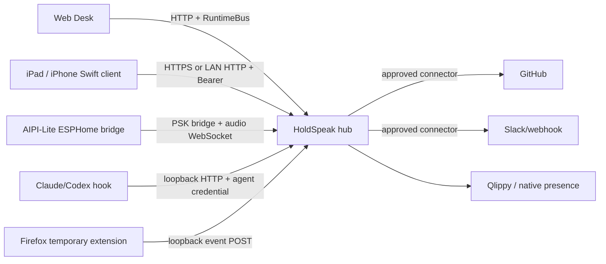

# Companion architecture

Source audit at `675401a857b85336d4acaa8c65383dfc9636e4c8`. A companion is a
client or presence surface that uses the hub's typed boundaries. It does not
become a second database, authority kernel or model router.

## Topology

The hub owns canonical records and operation receipts. Web, native clients and
devices hold local projection/state only. Authentication and effect authority
are separate: a paired bearer/PSK authenticates the client, while an owner
gesture, control posture or bounded grant admits the effect.

## Capability matrix

| Companion capability | Implementation seam | Release classification |
|---|---|---|
| dictation capture and review | Swift `VoiceNoteComposer.startRecording`, `stopAndTranscribe`, `editText`, `send` (`apple/Sources/RuntimeCore/Companion/VoiceNoteComposer.swift`, lines 15-119) | `built_unreleased` for native client; source/tests only |
| meeting start/stop and archive | `HTTPDesktopClient.startMeeting`, `stopMeeting`, `listMeetings` (`apple/Sources/Providers/Desktop/HTTPDesktopClient.swift`, lines 151-175) | `built_unreleased` |
| meeting artifact/proposal review | `HTTPDesktopClient+Proposals.swift` and CompanionMeetings | `built_unreleased`; approval remains a separate call |
| audio/transcript import | `HTTPDesktopClient+MeetingImport.swift::importMeeting` | `built_unreleased`; multipart upload to `/api/meetings/import` |
| coder waiting board | `CompanionBoard.load/select/dismiss/pin`, `GET /api/coders/status`, `GET /api/coders/sessions`, `POST /api/coders/select`, `POST /api/coders/dismiss`, `POST /api/coders/pin` | `built_unreleased`; no send from selection alone |
| coder draft and explicit answer | `CoderAnswer.compose/draft/send/approve`, `VoiceNoteComposer.send` | `built_unreleased`; destination verification remains hub-owned |
| activity nudges and briefing | `HTTPDesktopClient+Activity.swift::activityNudges`, `briefing` | `built_unreleased`; source API exists, provider state unknown |
| Slack/GitHub/webhook proposals | `HTTPDesktopClient+Proposals` or desk actuator routes | `built_unreleased`; configured host and policy required |
| Qlippy presence | web ambient glyph/cards; sprite assets are bundled separately | `experimental`; optional, off by default in product docs |
| AIPI controls/audio/status | `aipi-lite/bridge/*`, `holdspeak_proto.py`, device firmware | `experimental`/optional hardware; source and focused tests |

The native `HTTPDesktopClient` builds URLs from `Config.baseURL`, applies a
Bearer token in the HTTP header and uses an eight-second default timeout
(`apple/Sources/Providers/Desktop/HTTPDesktopClient.swift::HTTPDesktopClient.Config`,
lines 71-115). WebSocket auth uses the `holdspeak.v1` subprotocol and does not
put the bearer in a URL. HTTP failures become `DesktopClientError.http`; a
malformed peer URL is offline, not a crash.

## Store and recovery boundary

The iPad keeps a local SQLite projection for offline-safe client state, but
hub records win on sync. The native README says package and app sources are
implemented and lists `swift build`/`swift test`; it also says that serving a
model is foreground-only and later runs refuse when the node is offline. This
is implementation/test evidence, not an App Store or signed-device release
claim. The current Philo classification therefore keeps native capabilities at
`built_unreleased` unless an actual distribution artifact is found.

No companion may claim that a local dismiss, presence card, or proximity is
approval. External effects return through the same Actuator/Gate policy and
receipts as the Web Desk. The route roster and iOS consumers are in
`docs/api-surface.json`; native adapters in `apple/Sources/Providers/Desktop/`
must use the typed client rather than a feature-local HTTP stack.

## Verification and unknowns

Swift contract tests cover codable wire shapes and provider/client seams;
Python tests cover Web routes and bridge protocol. Their names are recorded in
the integration metadata shard with `execution: not_run`. No live LAN,
Tailscale, iPad, signed bundle, microphone, provider or owner desk walk was
used for this audit. Those are required before saying a companion works on a
Tuesday.

The current `Qlippy` component in `web/src/components/AmbientLayer.tsx` renders
a glyph and reads durable attention projections. Non-learning events refresh
those projections; learning events enter its local card queue. A conditional
actuator decision handler remains in the source, but its label strings alone
do not prove that an actuator card can reach that branch. Asset inventory is
in `web/public/qlippy/README.md`; the generated build copy is not a source owner.
