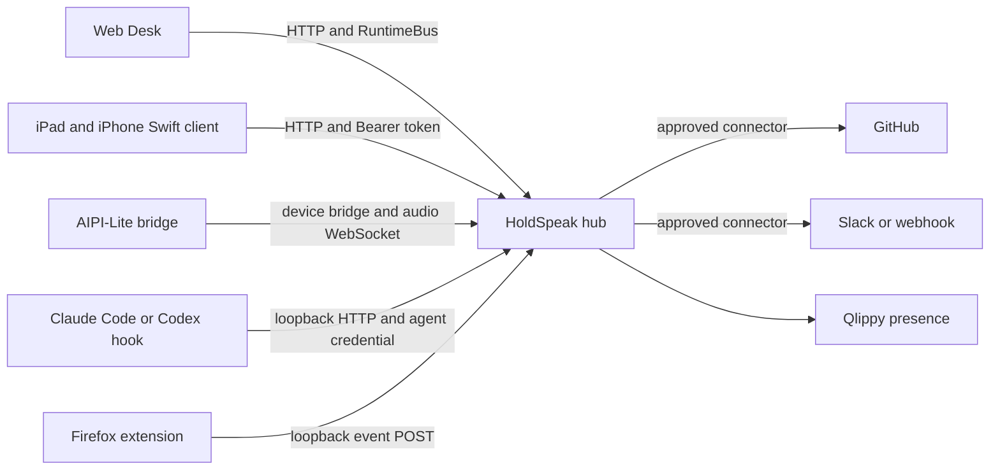

# Companion architecture

A companion is a client or presence surface that uses the hub's typed
boundaries. A companion is not a second database, a second authority kernel or
a second model router. The hub owns the records and the operation receipts.

For setup steps, read [iPad](IPAD.md), [AIPI-Lite](AIPI_LITE.md),
[Firefox extension](FIREFOX_EXTENSION_GUIDE.md) and
[Agent hook install](AGENT_HOOK_INSTALL.md).

## Topology

```mermaid
graph LR
    Web[Web Desk] -->|HTTP and RuntimeBus| Hub[HoldSpeak hub]
    iPad[iPad and iPhone Swift client] -->|HTTP and Bearer token| Hub
    AIPI[AIPI-Lite bridge] -->|device bridge and audio WebSocket| Hub
    Coder[Claude Code or Codex hook] -->|loopback HTTP and agent credential| Hub
    Firefox[Firefox extension] -->|loopback event POST| Hub
    Hub -->|approved connector| GitHub[GitHub]
    Hub -->|approved connector| Slack[Slack or webhook]
    Hub --> Presence[Qlippy presence]
```

Authentication and authority are separate. A paired Bearer token or a device
key proves who the client is. An owner action, a control posture or a bounded
grant admits an effect. A local dismiss, a presence card or physical nearness
is never approval. External effects use the same actuator policy and receipts
as the Web Desk. See [Authority](AUTHORITY_MODEL.md) and [Kernel](KERNEL.md).

## Companions

| Companion | What it does | Code |
| --- | --- | --- |
| Web Desk | Main surface. HTTP routes and one product WebSocket. | `web/src/desk/`, `web/src/runtime/RuntimeBus.tsx` |
| iPad and iPhone | Meeting control, meeting archive and import, dictation, proposal review, the Coder board, activity nudges and briefing. | `apple/Sources/Providers/Desktop/` |
| AIPI-Lite | Streams audio and shows status on an ESP32-S3 device. | `aipi-lite/bridge/`, `holdspeak/device_audio_ws.py` |
| Coder hooks | Report session state and hold tool calls for the Gate. | `holdspeak/coder_gate.py` |
| Firefox extension | Sends activity events to the loopback hub. | `holdspeak/web/routes/activity/enrichment.py` |
| Qlippy | Optional ambient presence in the Web Desk. | `web/src/components/AmbientLayer.tsx` |

The Swift sources build with `swift build` and `swift test` from `apple/`.
See `apple/README.md`.

## The native hub client

`HTTPDesktopClient` is the only HTTP client in the Swift package. A feature
adds an extension file, such as `HTTPDesktopClient+Proposals.swift`. A feature
does not add its own HTTP stack.

- It builds URLs from a base URL and adds the Bearer token to each request.
- The default timeout is 8 seconds.
- The WebSocket uses the `holdspeak.v1` subprotocol. The token is not in the
  URL.
- A failed request becomes `DesktopClientError.http`. A malformed peer URL
  counts as offline.

The iPad keeps a local SQLite store. A selection on the Coder board does not
send anything. Sending needs an explicit answer action.

The routes the iPad calls are listed in [API surface](API_SURFACE.md). Each
route there names its consumers.

## Qlippy

`AmbientLayer.tsx` renders Qlippy. Runtime frames only wake it up. A
`learning_event` frame enters a local card queue. Other frames refresh
durable projections. The sprite assets are listed in
`web/public/qlippy/README.md`.

## Limits

The repository holds the Swift sources and their tests. It does not ship a
signed iPad app. Test a companion against a live hub on your own network
before you rely on it.
