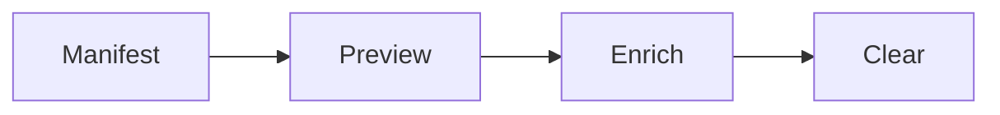

# Connector Development

A connector is a local module that produces activity records, annotations,
meeting candidates or planned commands for HoldSpeak. HoldSpeak ships
first-party connectors. You can add your own as a user pack, without a fork.

This guide is the contract a connector satisfies. For meeting-intel plugins, see
[Plugin Authoring](PLUGIN_AUTHORING.md). For connectors that write to outside
systems, see [Actuator Development](ACTUATOR_DEVELOPMENT.md).

## Quick path

1. Write a module that exports `MANIFEST`, built with
   `holdspeak.connector_sdk.validate_manifest`.
2. If the pack runs commands, add a read-only command policy
   (`is_command_allowed`) and a `run(db, ...)` entry point.
3. Drop the file in `~/.holdspeak/connector_packs/`.
4. Check the preview in the Activity view. Preview never changes data.
5. Add a fixture under `tests/fixtures/connectors/` for first-party packs.

The cleanest references are
[`github_cli.py`](../holdspeak/connector_packs/github_cli.py) and
[`acli_jira.py`](../holdspeak/connector_packs/acli_jira.py).

## Lifecycle



- **Manifest.** Declares what the connector is, what it produces and which
  permissions it needs. It is static.
- **Preview.** A dry run that changes nothing. It works when the connector is
  disabled. It shows planned commands, proposed rows, warnings and permission
  notes.
- **Enrich.** The step that writes rows. The runtime refuses to call it unless
  the persisted state of the connector has `enabled=true`. The connector does
  not own enablement.
- **Clear.** Removes the rows that the connector wrote. The scope is
  `source_connector_id` equal to the connector id.

## Manifest reference

The schema is in [`holdspeak/connector_sdk.py`](../holdspeak/connector_sdk.py).

| Field | Type | Notes |
|---|---|---|
| `id` | string | Required. `^[a-z][a-z0-9_]{0,31}$`. Stored as `source_connector_id`. |
| `label` | string | Required. The name shown in the Activity view. |
| `version` | string | Required. `MAJOR.MINOR.PATCH`, with an optional `-pre.N`. |
| `kind` | string | Required. One of `cli_enrichment`, `candidate_inference`, `extension_events`, `history_import`, `pipeline`. |
| `capabilities` | list | Required, not empty. A subset of `records`, `annotations`, `candidates`, `commands`, `snapshots`. |
| `description` | string | Optional. One line. |
| `requires_cli` | string | The binary name. Required when `kind` is `cli_enrichment`. |
| `requires_network` | bool | If true, declare `loopback:http` or `network:outbound`. |
| `permissions` | list | See [Permissions](#permissions). |
| `source_boundary` | string | Optional. Plain words on where the data comes from. |
| `settings_schema` | list | Optional. Settings the owner can change. Unknown keys are rejected. |
| `consumes`, `pipeline_freshness_seconds` | | Pipeline packs only. See [Pipeline packs](#pipeline-packs). |

```python
from holdspeak.connector_sdk import validate_manifest

MANIFEST = validate_manifest({
    "id": "my_connector",
    "label": "My Connector",
    "version": "0.1.0",
    "kind": "cli_enrichment",
    "capabilities": ["annotations", "commands"],
    "requires_cli": "mycli",
    "permissions": [
        "read:activity_records",
        "write:activity_annotations",
        "shell:exec",
    ],
})
```

`validate_manifest` collects every problem and then raises. Each problem is a
`ManifestError(field, code, message)` with a stable `code`, for example
`id_format`, `version_format`, `unknown_kind` and `network_permission_required`.

## Permissions

| Permission | Meaning |
|---|---|
| `read:activity_records` | Reads the activity ledger. |
| `read:activity_annotations` | Reads annotations. Pipelines use it. |
| `read:activity_meeting_candidates` | Reads meeting candidates. Pipelines use it. |
| `write:activity_records` | Writes activity records. |
| `write:activity_annotations` | Writes annotations. |
| `write:activity_meeting_candidates` | Writes meeting candidates. |
| `shell:exec` | Runs a local CLI subprocess. |
| `fs:read` | Reads files outside the HoldSpeak data directory. |
| `loopback:http` | Accepts loopback POST requests, for example from a browser extension. |
| `network:outbound` | Opens an outbound socket. High trust. |

Declare the narrowest set that the connector needs. Do not add
`network:outbound` "just in case".

`PermissionGate` in
[`holdspeak/connector_runtime.py`](../holdspeak/connector_runtime.py) enforces
four of them at run time:

| Gate operation | Permission |
|---|---|
| `run_subprocess` | `shell:exec` |
| `open_outbound_socket` | `network:outbound` |
| `accept_loopback_event` | `loopback:http` |
| `read_file` | `fs:read` |

A gate call without the matching permission raises `PermissionDenied`. The
runtime marks the run as failed and records the error in `connector_runs`. This
is honest enforcement, not a sandbox: a pack can still import `subprocess`
directly. The manifest stays the one true list of what a pack needs.

## Preview payload

`holdspeak.activity_connector_preview.dry_run(db, connector_id, limit=...)`
returns a `ConnectorDryRunResult`. Its `to_payload()` has this shape:

```python
{
    "connector_id": "my_connector",
    "kind": "cli_enrichment",
    "capabilities": ["annotations", "commands"],
    "enabled": False,
    "cli_required": "mycli",
    "cli_available": True,          # null when requires_cli is empty
    "commands": [...],
    "proposed_annotations": [...],
    "proposed_candidates": [...],
    "warnings": ["..."],
    "permission_notes": ["..."],
    "truncated": False,
}
```

Each list holds at most `PAYLOAD_SECTION_CAP` (100) rows. A longer list sets
`truncated` to true. `permission_notes` carries advice such as "the connector is
disabled" or "the CLI is not on PATH". `dry_run` does not raise for either case.

`dry_run` has built-in preview logic for the GitHub, Jira and calendar
connectors. It reads the descriptor of a connector from the registry. A new
pack gets the manifest fields, the enabled state and the CLI check. Row
previews for a new pack need a matching branch in `dry_run`.

The preview must never write to the database.

## Privacy checklist

Check each item before you merge a connector.

- The permissions match what the connector needs.
- `source_boundary` says where the data comes from and where it does not.
- A connector that parses outside input rejects every field that implies
  sensitive content: cookies, bodies, headers, form data, screenshots and
  selected text. The list is `FORBIDDEN_FIELDS` in
  [`holdspeak/activity_extension.py`](../holdspeak/activity_extension.py).
  Extend it for a new sensitive surface.
- The schema rejects URLs that are not `http` or `https`.
- `requires_network` is true only for real network use. Reading a local file is
  not network use.
- Enrich checks the `enabled` flag, even though the runtime also checks it.
- Clear is scoped to `source_connector_id`.
- Preview writes nothing.

## Fixtures

Add a JSON file under `tests/fixtures/connectors/`:

```json
{
  "id": "my-connector-happy-path",
  "connector": "my_connector",
  "limit": 10,
  "activity_records": [
    {
      "url": "https://example.com/things/1",
      "title": "Thing 1",
      "domain": "example.com",
      "entity_type": "my_entity_type",
      "entity_id": "thing-1",
      "last_seen_at": "2026-04-30T10:00:00"
    }
  ],
  "expect": {
    "kind": "cli_enrichment",
    "capabilities": ["annotations"],
    "command_count": 1,
    "annotation_count": 1,
    "candidate_count": 0,
    "permission_notes_contain": ["disabled"],
    "warnings_contain": [],
    "truncated": false
  }
}
```

Run one fixture:

```
uv run pytest tests/unit/test_connector_fixture_harness.py -k my-connector
```

The harness finds every fixture by itself. It also checks that no rows were
added to `activity_annotations` or `activity_meeting_candidates`. Every `expect`
field is optional. Lock only what you need.

## First-party packs

All first-party packs are in
[`holdspeak/connector_packs/`](../holdspeak/connector_packs/).

| Pack | Kind | Notes |
|---|---|---|
| `firefox_ext` | `extension_events` | Receives loopback events from the browser extension. Parser tests: `tests/unit/test_activity_extension.py`. |
| `github_cli` | `cli_enrichment` | Read-only `gh` allowlist. Fixtures: `gh-*.json`. |
| `acli_jira` | `cli_enrichment` | Read-only `acli jira <group> <verb>` allowlist. Needs `acli`. |
| `acli_confluence` | `cli_enrichment` | Read-only `acli confluence <group> <verb>` allowlist. Needs `acli`. |
| `jira_cli` | `cli_enrichment` | Legacy read-only `jira` allowlist. Fixtures: `jira-*.json`. |
| `calendar_activity` | `candidate_inference` | Builds meeting candidates from calendar and call activity. Fixtures: `calendar-*.json`. |
| `meeting_context` | `pipeline` | Consumes other packs. See below. |

The command packs ship a read-only allowlist and an `is_command_allowed`
function next to the manifest. The `acli` packs use `(product, group, verb)`
entries. Read them before you write a command pack.

## Pipeline packs

A pipeline pack reads the rows of other packs and writes its own. The
reference is
[`meeting_context.py`](../holdspeak/connector_packs/meeting_context.py).

| Field | Rule |
|---|---|
| `kind` | `"pipeline"`. |
| `consumes` | Required. A list of `{pack_id, output_kind}`. `output_kind` is `records`, `annotations` or `candidates`. |
| `pipeline_freshness_seconds` | Optional. Default 300. Skips an upstream run if its last good run is newer. |
| `permissions` | Must include the read permission for each consumed `output_kind`. |

The validator rejects `consumes` on a non-pipeline pack
(`consumes_only_on_pipeline`). It also rejects a pipeline pack without
`consumes` (`pipeline_requires_consumes`) and a missing read permission
(`pipeline_missing_read_permission`).

`PipelineRunner` in `holdspeak.connector_runtime` sorts the upstream packs in
dependency order. It runs each one with the module-level `run(db, ...)` of the
pack. Each step ends as one of these:

- `skipped_fresh`: the last good `connector_runs` row is inside the freshness
  window.
- `ran`: the runner called `run`.
- `failed`: `run` raised. The pipeline stops.
- `missing_runner`: the pack has no `run` and no fresh row. The pipeline stops.

A failed step stops the pipeline. There are no retries and no parallel steps.

## User packs

Put a `.py` file in `~/.holdspeak/connector_packs/`. The file exports
`MANIFEST`. To use another directory, set `HOLDSPEAK_USER_PACKS_DIR`.

- The loader re-validates the manifest on import. A bad pack is reported as a
  `DiscoveryError` and does not crash the runtime.
- A user pack id that matches a first-party id is rejected
  (`id_collision_first_party`). A duplicate user pack id is rejected
  (`id_collision_user_pack`).
- Each registered pack has a `source` of `first-party` or `user`. The API and
  `holdspeak doctor --connectors` show it.
- Discovery is not a sandbox. Code in your home directory is code you trust.

## Run history

Every enrich run and pipeline step writes one row to `connector_runs`. Preview
does not. The columns are `connector_id`, `started_at`, `finished_at`,
`succeeded`, `error`, `output_bytes`, `annotation_count`, `candidate_count` and
`command_count`.

The database methods are `record_connector_run`, `list_connector_runs` and
`delete_connector_runs`. They are in
[`holdspeak/db/activity/enrichment.py`](../holdspeak/db/activity/enrichment.py).
The route is `GET /api/activity/enrichment/connectors/{id}/runs`.
`PipelineRunner` reads these rows to decide on a freshness skip.

## Out of scope

HoldSpeak ships the contract and the first-party packs. It has no marketplace,
no remote publishing and no loader for packages from the internet.

## See also

- [Firefox Extension Guide](FIREFOX_EXTENSION_GUIDE.md): a first-party
  `extension_events` connector.
- [Plugin Authoring](PLUGIN_AUTHORING.md): the sibling contract for meeting-intel
  plugins.
- [Security & Privacy](SECURITY.md): the permission model that connectors
  declare against.
