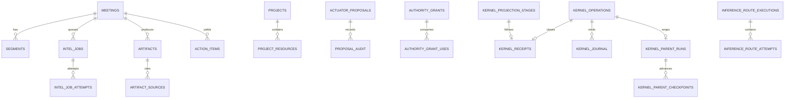

# Data model

This page describes the persistent data shape inspected at snapshot
`675401a857b85336d4acaa8c65383dfc9636e4c8` (2026-09-19). The generated
[schema inventory](generated/schema-inventory.json) is the mechanical list of
declared tables, columns, indexes and triggers. It comes from `SCHEMA_SQL` and
is explicitly a base-schema inventory; reconciliation may add shape or
backfill data in an existing database. For meanings and lifecycle vocabulary,
see [DOMAIN_MODEL.md](DOMAIN_MODEL.md). For kernel rows and transitions, see
[KERNEL.md](KERNEL.md).

## Relational shape

The diagram shows the source relationships that matter to runtime reasoning.
It is not a claim that every conceptual edge is a literal SQLite foreign key;
some source references are deliberately retained after deletion, and some
read models are projections. The exact declared constraints are in
`holdspeak/db/schema.py` and the generated inventory.

## Entity groups

### Capture and meeting intelligence

`meetings` is the aggregate root for captured/imported sessions. `segments`
stores text, speaker, speaker identity and timing. `bookmarks`, `meeting_tags`,
`topics`, `intel_snapshots`, speaker embeddings and meeting intelligence jobs
are child or supporting records (`holdspeak/db/schema.py:24-175`).
`segments_fts` is an FTS5 read projection maintained by insert/update/delete
triggers (`holdspeak/db/schema.py:189-213`). It is not a second transcript
authority.

`intel_jobs` stores a job id, meeting link, content-free descriptor and
transcript hashes, queue/lease state, parent operation link, attempts and last
error. `intel_job_attempts` is append-only attempt history. The job queue is
not the kernel journal even where it links to a parent operation.

### Memory and work objects

`artifacts` and `artifact_sources` retain typed result content and its plugin,
window and source lineage (`holdspeak/db/schema.py:339-379`). `decisions`
holds a durable decision projection and supports recorded, accepted,
superseded and rejected lifecycle. A source-deletion trigger preserves the
decision while marking source state (`holdspeak/db/schema.py:385-422`).

`action_items` is a first-class cross-meeting task with owner, due, status,
review state and source reference. `decision_commitments` provides an
optional accountability link from an accepted decision to an action
(`holdspeak/db/schema.py:97-113,224-236`). `follow_through_proposals` is an
extraction workflow; it is distinct from an actuator proposal that can cause
an external effect.

`projects`, `meeting_projects`, `project_resources`, project briefs and
project task tables provide owner-defined context. Notes, knowledge bases,
recipes, chains, workflows, directories, workbenches and their item/run
tables form the Desk/Workbench object family. Those surfaces have separate
documentation owners, but their runtime links can appear in parent operations
and route evidence. See [DOMAIN_MODEL.md](DOMAIN_MODEL.md) for the current
boundary and do not treat a Desk projection as source proof for a kernel
effect.

### Proposal and authority records

`actuator_proposals` stores candidate side effects and separates review,
authorization and execution states. It also binds approved payload and
destination hashes; its lifecycle is proposed, approved, executed, rejected
or failed (`holdspeak/db/schema.py:424-485`). `holdspeak/db/actuators.py:1-12`
shows the database actuator layer stores and reads proposals; it is not the
external executor.

`authority_grants` stores a bounded actor, operation family/effect,
normalized destination, data classes, optional scope, expiry, use limits, mode
and binding hash. `authority_grant_uses` is the per-consumption record
(`holdspeak/db/schema.py:487-520`). Grants hold no payload or secret.

### Kernel and inference records

The kernel uses:

| Row family | Canonical facts |
| --- | --- |
| `kernel_operations` | Request identity, envelope hash, principal, target, placement, state, decision, warrant and claim |
| `kernel_journal` | Append-only hash-chained event history and references |
| `kernel_receipts` | One terminal evidence row per operation |
| `kernel_inference_receipt_attestations` | Signed inference material bound one-to-one to an inference receipt |
| `kernel_parent_runs` | Durable bounded parent definition, deadline, epoch, child budget, lease and publication claim |
| `kernel_parent_checkpoints` | Receipt-linked child advancement and stale/winner evidence |
| `kernel_projection_stages` | Content/result staging before receipt-gated publication |
| `inference_route_plans`, `inference_route_executions`, `inference_route_attempts` | Frozen route assignment, deployment revision, retry/attempt state, outcome and result hashes |

Generic inference receipts carry references and hashes, but
`kernel_parent_runs.input_json` stores caller input snapshots, which can contain
prompt text. The model filter rejects specific audio/PCM/token keys, not every
content-bearing string (`holdspeak/kernel/model.py:9-13`;
`holdspeak/kernel/parent_run.py:105-106`).
The parent/child and receipt rules are detailed in [KERNEL.md](KERNEL.md).

## Keys, references and event semantics

SQLite primary keys are mixed by domain: text ids for meetings, jobs,
artifacts, decisions and kernel operations; integer autoincrement ids for
segments, bookmarks, topics and snapshots; and opaque text ids for authority
and route records. Code must use the declared type and not assume every id is
numeric or globally unique.

Foreign keys are enabled at connection time. Many meeting children use
`ON DELETE CASCADE`; decisions intentionally retain source references and
source-deleted state. Unique constraints protect operation idempotency,
one-receipt-per-operation, one active local inference lease, and route/attempt
identity. The generated inventory is the quickest way to inspect the exact
constraint for a named table.

JSON columns are snapshots or structured metadata, not an invitation to put
unbounded content in every row. Parent input JSON can contain caller request
content; child checkpoint JSON has its own advancement contract. Proposal and
native domain JSON must follow their owning subsystem's policy. A JSON hash or a `*_sha256` field
is evidence that the referenced material was bound, not proof that the
material is available locally.

Append-only means different things in source. Some ledgers use code-level
insert-only APIs; inference attestations and publication fences also have
SQLite triggers. A row with an update timestamp is not automatically immutable.
Inspect the table trigger or writer before relying on immutability.

## Projections and recovery

Read projections include FTS, process views, meeting/Desk cards and staged
kernel projections. They may be rebuilt only by their owner from canonical
rows and evidence. The kernel startup sequence reconciles parent liveness
before projection repair (`holdspeak/kernel/runtime.py:138-175`). A stale
projection must not overwrite a newer terminal receipt or make an
`indeterminate` operation appear successful.

The database's shape is also a projection of source declarations. `schema_version`
is informational; shape reconciliation is additive and idempotent. See
[STORAGE_AND_MIGRATIONS.md](STORAGE_AND_MIGRATIONS.md) for backup, repair and
pre-existing database limits.

## Retention and deletion boundaries

Meeting child rows normally follow meeting deletion, while decisions can
preserve memory with `source_deleted`. Kernel journal and receipt rows are
runtime evidence and must not be described as user transcript retention.
Backups can contain all database rows at their snapshot point; restore does
not erase separate config, audio, browser or People stores. The existing
[SECURITY.md](SECURITY.md) defines the product's data classes and People
retention boundary.

## Verification limits

This page uses source and inspected assertions, but no tests were run for the
documentation lane. The declared schema inventory does not prove the shape of
a particular live database, and the broad table set includes legacy and
feature-specific records outside this lane. Unknowns include the exact
reconcile result for an arbitrary old store and whether a requested projection
has already been repaired after a crash.
