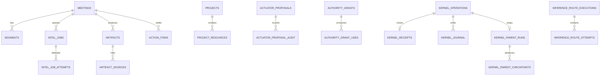

# Data model

HoldSpeak keeps its records in one SQLite database.
This page groups the tables and lists the rules for keys, JSON columns, and projections.
[DOMAIN_MODEL.md](DOMAIN_MODEL.md) defines the terms.
[KERNEL.md](KERNEL.md) describes kernel rows.
[STORAGE_AND_MIGRATIONS.md](STORAGE_AND_MIGRATIONS.md) covers backup and schema repair.

The [schema inventory](generated/schema-inventory.json) lists every table, column, index, and trigger.
It comes from `SCHEMA_SQL` in `holdspeak/db/schema.py`.
It shows the declared base schema.
It does not show the exact shape of your database.

## Relationships

```mermaid
erDiagram
  MEETINGS ||--o{ SEGMENTS : has
  MEETINGS ||--o{ INTEL_JOBS : queues
  INTEL_JOBS ||--o{ INTEL_JOB_ATTEMPTS : attempts
  MEETINGS ||--o{ ARTIFACTS : produces
  ARTIFACTS ||--o{ ARTIFACT_SOURCES : cites
  MEETINGS ||--o{ ACTION_ITEMS : yields
  PROJECTS ||--o{ PROJECT_RESOURCES : contains
  ACTUATOR_PROPOSALS ||--o{ ACTUATOR_PROPOSAL_AUDIT : records
  AUTHORITY_GRANTS ||--o{ AUTHORITY_GRANT_USES : consumes
  KERNEL_OPERATIONS ||--o| KERNEL_RECEIPTS : closes
  KERNEL_OPERATIONS ||--o{ KERNEL_JOURNAL : emits
  KERNEL_OPERATIONS ||--o| KERNEL_PARENT_RUNS : wraps
  KERNEL_PARENT_RUNS ||--o{ KERNEL_PARENT_CHECKPOINTS : advances
  INFERENCE_ROUTE_EXECUTIONS ||--o{ INFERENCE_ROUTE_ATTEMPTS : contains
```

Some lines are concepts and not SQLite foreign keys.
`holdspeak/db/schema.py` has the exact constraints.

## Table groups

### Capture and meeting analysis

`meetings` is the root.
`segments` holds the transcript.
`bookmarks`, `meeting_tags`, `topics`, and `intel_snapshots` are child rows.
`speakers` holds speaker embeddings and is not a child of one meeting.
`segments_fts` is an FTS5 search index kept current by triggers.
It is not a second copy of the transcript.

`intel_jobs` is the queue of deferred analysis.
`intel_job_attempts` is its append-only history.
The queue is not the kernel journal.

### Memory and work objects

- `artifacts` and `artifact_sources` hold typed results and their source links.
- `decisions` holds lasting decisions. A trigger keeps a decision when its meeting is deleted.
- `action_items` holds tasks. `decision_commitments` links a decision to a task.
- `follow_through_proposals` holds extracted tasks that wait for your review. It is not an actuator proposal.
- `projects`, `meeting_projects`, and `project_resources` hold project context.
- `notes`, `kbs`, `recipes`, `chains`, `workflows`, `directories`, and `workbenches` hold Desk objects.
- The `memory_*` tables hold the memory index: sources, chunks, embeddings, entities, facts, observations, pages, and jobs.

### Proposals and grants

`actuator_proposals` stores candidate outside effects.
It keeps review, authorization, and execution state in separate columns.
It binds the approved payload and destination by hash.
`actuator_proposal_audit` records each change.

`authority_grants` stores the actor, operation family, effect, destination, data classes, expiry, use limit, and a binding hash.
`authority_grant_uses` records each use.
A grant holds no payload and no secret.

### Kernel and inference

| Table | Content |
| --- | --- |
| `kernel_operations` | Request identity, envelope hash, principal, target, state, decision, warrant, claim |
| `kernel_journal` | Append-only, hash-chained event history |
| `kernel_receipts` | One terminal evidence row per operation |
| `kernel_inference_receipt_attestations` | Signed inference material bound to one receipt |
| `kernel_parent_runs` | Parent definition, deadline, child budget, lease, publication claim |
| `kernel_parent_checkpoints` | Child progress linked to receipts |
| `kernel_projection_stages` | Staged results that wait for a receipt before publication |
| `inference_route_plans`, `inference_route_executions`, `inference_route_attempts` | Frozen route, retry state, outcome, result hashes |

Receipts carry references and hashes.
`kernel_parent_runs.input_json` stores caller input snapshots, and a snapshot can contain prompt text.
The kernel filter rejects named audio, PCM, and token keys.
It does not reject every prompt string (`holdspeak/kernel/model.py`, `holdspeak/kernel/parent_run.py`).

## Keys and references

Primary keys differ by domain.
Meetings, jobs, artifacts, decisions, and kernel operations use text ids.
Segments, bookmarks, topics, and snapshots use integer ids.
Grants and route records use opaque text ids.
Do not assume that an id is numeric or globally unique.

Every connection turns on foreign keys.
Most meeting children use `ON DELETE CASCADE`.
Decisions keep their source ids on purpose.
Unique constraints protect operation idempotency, one receipt per operation, one active local inference lease, and route attempt identity.

## JSON columns and hashes

A JSON column holds a snapshot or metadata.
Do not store unbounded content in it.
A `*_sha256` field shows that material was bound.
It does not show that the material is on this machine.

## Append-only tables

Some ledgers are insert-only in code.
Inference attestations, tool-turn history, and many inference route records also have SQLite triggers that block updates and deletes.
A row with an update timestamp is not always immutable.
Read the table trigger or the writer before you rely on it.

## Derived views and recovery

FTS indexes, process views, Desk cards, and staged kernel projections are derived views.
Only their owner rebuilds them, from the owner rows.
At startup the kernel reaps expired claims, reconciles parent runs, recovers inference routes, and then recovers projections (`holdspeak/kernel/runtime.py`).
A stale view must not replace a newer receipt.
It must not make an `indeterminate` operation look successful.

## Retention

Deleting a meeting removes its child rows.
Decisions stay and are marked `source_deleted`.
Kernel journal and receipt rows are runtime evidence and are not transcript storage.
A backup holds every database row at its snapshot time.
A restore does not change config, audio files, browser storage, or People data.
[SECURITY.md](SECURITY.md) defines the data classes.
