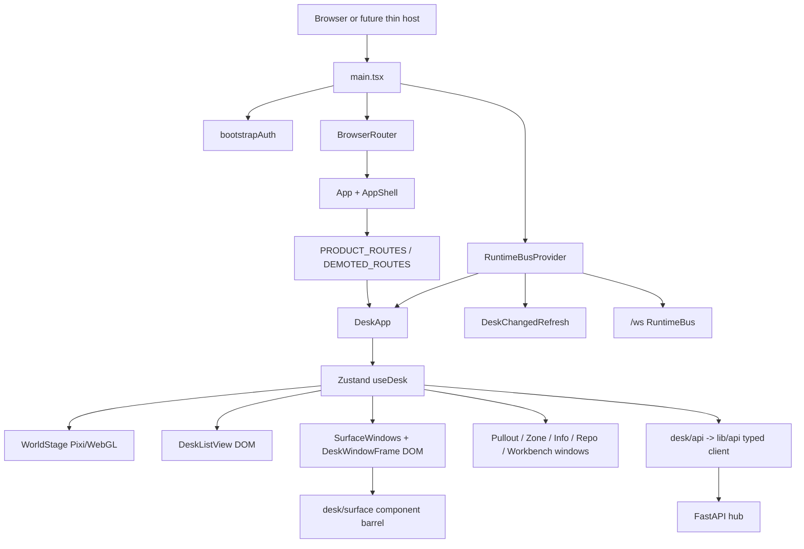

# Desk architecture: current contract

**Status:** source-derived specification for the pinned product revision
`675401a857b85336d4acaa8c65383dfc9636e4c8`. Research prototypes and authored
visual fixtures are separate from that implementation; see
[external research](internal/philo/EXTERNAL_RESEARCH.md) and
[visual fixtures](internal/philo/visuals/README.md).

## Authority and boundaries

The Constitution and UX Canon govern the product. The current implementation
is the fact source when a prose document is less precise. The source order used
for this census is:

| Order | Source | What it controls |
|---:|---|---|
| 1 | `docs/internal/CONSTITUTION.md` | Desk as operating surface, consent, local-first, no modal product UI |
| 2 | `docs/internal/AGENT_BRIEF.md` | Current OS ambition and delivery constraints |
| 3 | `docs/internal/UX-CANON.md` | Face grammar, component verbs, copy and evidence rules |
| 4 | `docs/internal/DESIGN_SYSTEM.md` | Tokens, states, window physics and surface composition |
| 5 | `docs/internal/DESK_GRAMMAR.md` | Object, drawer, selection, drop, Info and verb law |
| 6 | `web/ICON-DISCIPLINE.md` | Sprite geometry and state image rules |
| 7 | `web/src/desk/surface/contract.md` | Reusable surface component contract |
| 8 | `docs/internal/ARCHITECTURE_WEB_FRONTEND.md` | Runtime seams and route boundary |
| 9 | source and tests under `web/src` | Actual behavior, numerical thresholds and exceptions |

The future desktop wrapper is a host boundary only. No current source proves a
Tauri or Electron product, and this lane does not choose one.

## Render and data architecture

The browser bootstraps a tab-scoped hub token and strips it from the URL
(`web/src/lib/auth.ts:13-42`). `main.tsx` composes `BrowserRouter`, one
`RuntimeBusProvider`, the cross-tab refresh listener and `App`
(`web/src/main.tsx:1-27`). `AppShell` owns the immersive `<main>` and title
(`web/src/components/AppShell.tsx:8-25`).

The route boundary is deliberately small. `/`, `/welcome`, and `/presence`
are the only `PRODUCT_ROUTES` (`web/src/routes.tsx:16-29`). `/setup`,
`/dictation`, `/live`, `/history`, `/meetings`, `/settings`, `/activity`,
`/commands`, `/cadence`, `/workbenches`, `/profiles`, `/studio`, `/companion`,
`/docs/dictation-runtime`, and `/design/components` are deep links. A demoted
route stages a surface open, preserves query context, then navigates to `/`
(`web/src/App.tsx:18-44`; `web/src/routes.tsx:31-76`). `/desk` and unknown
paths redirect to `/` (`web/src/App.tsx:67-68`). A product capability therefore
does not create a second route world.

The Desk renders the Chair or Floor, then mounts the shared drop layer,
inspectors, delivery windows, object windows, `SurfaceWindows`, Dock, SnapGhost,
Expose and Switcher (`web/src/desk/DeskApp.tsx:184-260`). Floor mode chooses
the same objects as spatial Pixi or semantic list mode. The compact default is
list only when the user has no saved choice and the object count is greater
than 16 (`web/src/desk/store/types.ts:49-72`).

## State ownership

| State | Owner | Persistence | Contract |
|---|---|---|---|
| Hub primitives, profiles, projects, models and status | FastAPI hub; projected into `useDesk` | Hub database | `web/src/desk/api.ts:46-120`, `web/src/desk/store/types.ts:108-170` |
| Object positions | `useDesk.positions` | Local workspace/layout storage | `web/src/desk/world.ts:159-193`, `desk/store` position actions |
| Open surface instances | `useDesk.windowsById` | `hs.desk.workspace.v1` | `web/src/desk/store/workspaceStorage.ts:15-24,61-76` |
| Window rects, z order, maximized set | `panelRects`, `panelSaved`, `panelOrder`, `panelMax` | `hs.desk.workspace.v1` | `web/src/desk/store/workspaceStorage.ts:131-147` |
| Minimized windows | `panelMin` | Session only | `web/src/desk/store/types.ts:154-164`; storage omits `min` |
| Zone view/sort/direction and open set | `zoneViewPrefs`, `zoneWindows` | `hs.desk.workspace.v1` | `web/src/desk/store/types.ts:80-91`, `workspaceStorage.ts:104-113` |
| Selection, hover, dragging, editor, Ask, transient cards | `useDesk` ephemeral fields | Memory | `web/src/desk/store/types.ts:120-150` |
| Runtime connection and latest frame | `RuntimeBusProvider` | Memory | `web/src/runtime/RuntimeBus.tsx:13-29,95-120` |
| Rendering and animation progress | React, Motion/WAAPI, Pixi | Never authoritative | `web/src/desk/components/DeskWindow.tsx:400-480`, `web/src/desk/gl/WorldStage.tsx` |

`workspace.v1` is the sole lifecycle document. It validates version, panel
IDs, finite positive rects, window identity and zone preferences, caps ordered
IDs at 100, and returns an empty document for corrupt or unknown versions
(`web/src/desk/store/workspaceStorage.ts:8-117`). Saving includes only arranged
rects, order, max, surface instances, open zones and zone preferences; storage
failure leaves the live compositor authoritative (`workspaceStorage.ts:131-153`).

## Desk object census

`PrimitiveKind` is an exhaustive union of 21 kinds
(`web/src/lib/primitives.ts:23-63`). `PRIMITIVES` is the single descriptor
table: label, sync class, blurb, authorability, object capability set and open
surface (`web/src/lib/primitives.ts:419-644`). `world.ts` repeats every kind in
an exhaustive order and excludes only directory, game, layout, intelligence and
people from the ordinary world projection (`web/src/desk/world.ts:18-57,84-90`).

| Kind | Sync | Authorable | Object capabilities | Open declaration | World behavior |
|---|---|---:|---|---|---|
| `meeting` | content | no | ask | pullout | root object and drawer member |
| `artifact` | content | no | ask | pullout | root object and drawer member |
| `note` | content | yes | ask, edit, rename, duplicate, delete | pullout | root object and drawer member |
| `decision` | content | yes | duplicate, delete | pullout | root object and drawer member |
| `directory` / Zone | organization | yes | rename, delete | pullout declaration; Zone opens `ZoneWindow` | dedicated zone list/icon path |
| `kb` / Knowledge | organization | yes | ask, edit, rename, duplicate, delete | pullout | root object and drawer member |
| `project` | organization | no | none | surface `open-project-memory` | resolved for lookup/list, omitted from spatial Floor only by feature policy |
| `repository` | organization | yes | none | `RepositoryWindow` | dedicated repository window |
| `recipe` / Agent | capability | yes | ask, edit, rename, duplicate, delete | pullout | root object and drawer member |
| `chain` / Sequence | capability | yes | delete | pullout | root object and drawer member |
| `workflow` | capability | yes | ask, edit, rename, duplicate, delete | pullout | root object and drawer member |
| `coder` | presence | no | none | pullout | always visible, never filed out of the root |
| `game` | local | no | none | none | resolved only; excluded from visual list |
| `layout` | local | no | none | none | per-device positions; no hub record |
| `roadmap` | organization | no | none | `RoadmapWindow` | retained for lookup/deep links, omitted from ordinary spatial Floor |
| `story` | local | no | none | none | resolved only |
| `workbench` | capability | yes | duplicate | `WorkbenchWindow` | dedicated workbench window |
| `intelligence` | local | no | none | pullout | desk-wide singleton opened by registered action |
| `people` | local | no | none | surface `open-people` | protected local data plane, not person tiles |
| `thread` | content | yes | delete | pullout | persistent chat pullout |

At the root, filed objects are removed from the spatial Floor; entering a Zone
shows only its members. Coders remain visible even when filed. IDs are matched
as bare IDs or qualified `kind:id` refs to avoid cross-kind collisions
(`web/src/desk/world.ts:92-131`). A Zone has a member count but is a drawer, not
a generic card (`world.ts:134-151`).

## Window and application topology

Static applications are declared once in `web/src/desk/applications.ts:11-48`
and materialized by `SurfaceWindows` into a row containing key, window ID, label,
glyph, eyebrow, minimum width, default height, max preference and lazy core
(`web/src/desk/components/SurfaceWindows.tsx:32-56`). The current manifest has
hosted entries for Change places, Speak, Meetings, Agents, Settings, Live
meeting, Rhythm, Context, Workbenches, Components, Activity, Desk memory,
Models, New Project, Processes, Commands, People and Calendar snapshot, plus
Ask AI and Intelligence command surfaces. The exact manifest is the source of
truth; it must not be copied into another registry (`applications.ts:48-430`).

Dynamic object windows are `Pullout`, `ZoneWindow`, `InfoWindow`,
`RoadmapWindow`, `RepoWindow` and `WorkbenchWindow`. They share `DeskWindowFrame`;
they differ only in content and the store command that opens them. Surface
windows register handlers, consume staged deep-link opens and close through
`closeSurfaceWindow` (`SurfaceWindows.tsx:65-117,148-204`).

`DeskWindowFrame` is the one frame contract. It accepts identity/chrome slots,
minimum/default geometry, fit-content and origin, and lifecycle callbacks; it
owns `useDeskWindow`, head menu, focus return, minimize/maximize/close motion,
resize grips and edge physics (`web/src/desk/components/DeskWindow.tsx:58-113,
390-520`). Normal application windows are regions and do not claim a dialog or
focus trap (`web/src/desk/__tests__/windows.test.tsx:87-108`).

## HTTP, authentication and RuntimeBus

All Desk HTTP uses `apiRequest`, `apiFetch` or `apiBlob`; JSON requests set
`Accept`/`Content-Type`, errors become `ApiError(status, payload)`, and
`readableError` returns a human message (`web/src/lib/api.ts:14-88`). `desk/api.ts`
maps wire snake_case records into typed `Primitive` projections
(`web/src/desk/api.ts:46-120,174-410`). Provider secrets do not enter web state;
the browser holds only the hub access token in session storage
(`web/src/lib/auth.ts:13-42`).

`RuntimeBusProvider` owns exactly one `/ws` socket for the React tree. It
publishes `connecting`, `connected`, `reconnecting` and `offline`, parses only
string JSON frames with a string `type`, supports typed and `*` listeners,
sends a `ping` every 15 seconds, and reconnects with a capped exponential
delay: `min(12000, 500 * 2^(attempt-1))`, for attempts capped at 8
(`web/src/runtime/RuntimeBus.tsx:41-93`). Malformed frames are ignored while
the connection remains healthy. A separate hardware audio socket is outside
this product bus (`docs/internal/ARCHITECTURE_WEB_FRONTEND.md:88-98`).

## Current gaps and conflicts

The current source is strong but not complete. These are evidence-backed
SPEC-DEBT or UNIMPLEMENTED items, not proposed architecture:

| Gap | Evidence | Status |
|---|---|---|
| Window geometry/drag thresholds were previously TypeScript-only; this document now extracts them | `windowGeometry.ts:32-223` | SPEC-DEBT reduced; portable contract lives in `DESK_OBJECT_MODEL.md` |
| Cross-window re-filing, drawer arrangement, multi-object drops and orb drops | `docs/internal/DESK_GRAMMAR.md:229` | UNIMPLEMENTED |
| Per-object receipts for Info | `web/src/desk/infoContract.ts:1-8`, `DESK_GRAMMAR.md:52-59` | SPEC-DEBT / backend dependency |
| Artifact sprite scale | `DESK_GRAMMAR.md:229` | SPEC-DEBT |
| Raw Button residues | `docs/internal/UX-CANON.md:72-81` | PARTIAL ratchet; existing guard remains authoritative |
| Locale catalogue and pseudo-locale fixtures | no current Desk source was found in this bounded census | SPEC-DEBT; proposed requirements only |
| High-contrast and light theme parity | `web/src/styles/tokens.css:330-335`; current token layer is dark baseline | PARTIAL / proposed |
| Desktop host | no current host adapter in the Desk tree | UNIMPLEMENTED; later ADR lane |

The current Desk implementation must remain the baseline while those gaps are
paid down. No later requirement in this package permits a second store, route
world, HTTP client, component kit or runtime bus.
