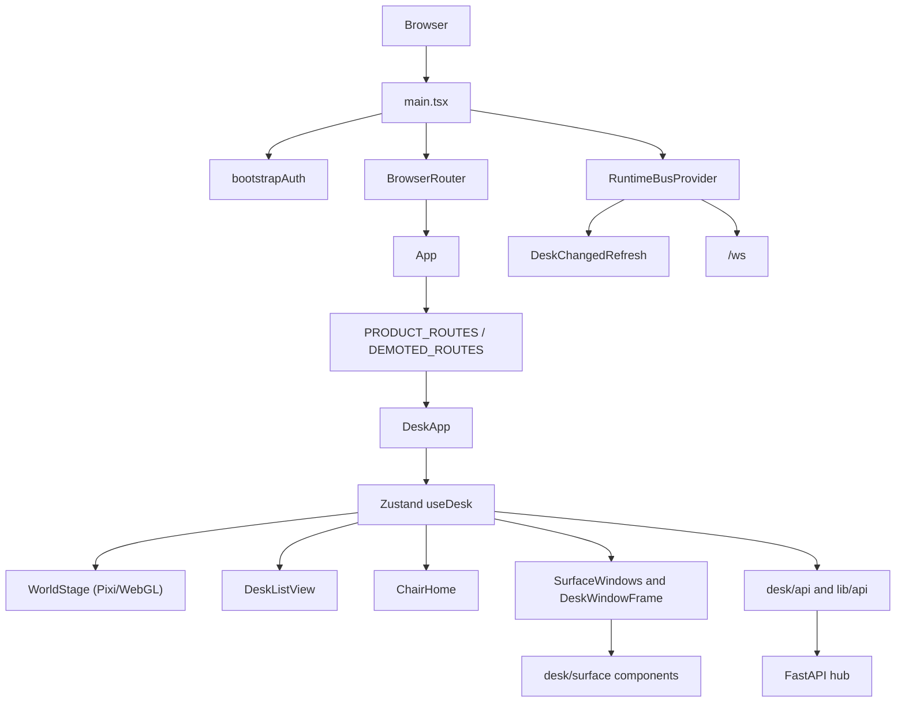

# Desk architecture

This page is for contributors.
It describes how the HoldSpeak web app renders the Desk and where each kind of state lives.
For object kinds, verbs, keys, and window geometry, see [Desk object model](DESK_OBJECT_MODEL.md).
For the full frontend design, see `docs/internal/ARCHITECTURE_WEB_FRONTEND.md`.

When this page and the source disagree, the source in `web/src/` is correct.
Face rules are in `docs/internal/UX-CANON.md`, `docs/internal/DESK_GRAMMAR.md`, and `web/src/desk/surface/contract.md`.

## Render and data flow

```mermaid
flowchart TD
  Browser[Browser] --> Main[main.tsx]
  Main --> Auth[bootstrapAuth]
  Main --> Router[BrowserRouter]
  Main --> Bus[RuntimeBusProvider]
  Router --> App[App]
  App --> Routes["PRODUCT_ROUTES / DEMOTED_ROUTES"]
  Routes --> Desk[DeskApp]
  Desk --> Store[Zustand useDesk]
  Store --> World["WorldStage (Pixi/WebGL)"]
  Store --> List[DeskListView]
  Store --> Chair[ChairHome]
  Store --> Windows["SurfaceWindows and DeskWindowFrame"]
  Windows --> Surface["desk/surface components"]
  Store --> HTTP["desk/api and lib/api"]
  Bus --> Refresh[DeskChangedRefresh]
  HTTP --> Hub[FastAPI hub]
  Bus --> WS["/ws"]
```

`bootstrapAuth` reads the hub token from the URL and keeps it in session storage.
It then removes the token from the URL (`web/src/lib/auth.ts`).
`main.tsx` mounts `BrowserRouter`, one `RuntimeBusProvider`, `DeskChangedRefresh`, and `App`.

## Routes

Three routes render a page: `/` (the Desk), `/welcome`, and `/presence`.
They are the `PRODUCT_ROUTES` in `web/src/routes.tsx`.

Every other product address is in `DEMOTED_ROUTES`.
A demoted route stages a window open, keeps the query string, and navigates to `/`.
`/desk` and unknown paths also navigate to `/`.
To add a tool, add a row to `DESK_APPLICATIONS` in `web/src/desk/applications.ts`.
Add a demoted route only when the tool needs its own address.

## What the Desk renders

`DeskApp` renders the Chair or the Floor.
The Floor is the `WorldStage` scene or the `DeskListView` list.
Above them, `DeskApp` mounts the shared drop layer, the dock, inspectors, delivery windows, object windows, and `SurfaceWindows`.

## State ownership

| State | Owner | Persistence |
| --- | --- | --- |
| Records, profiles, projects, models, status | Hub, projected into `useDesk` | Hub database |
| Object positions | `useDesk.positions` | Browser storage |
| Open tool windows, window rects, order, zoom, iconified windows | `useDesk` window slices | `hs.desk.workspace.v1` |
| Zone view, sort, and open Zones | `zoneViewPrefs`, `zoneWindows` | `hs.desk.workspace.v1` |
| Chair window state, unsent drafts, window places | `useDesk` | `hs.desk.workspace.v1` |
| Selection, hover, drag, editor, Ask, cards | `useDesk` | Memory |
| Connection state and latest frame | `RuntimeBusProvider` | Memory |
| Animation progress | React, Motion, Pixi | Never authoritative |

`workspaceStorage.ts` owns the workspace document.
It validates the version, window IDs, rects, and Zone preferences.
It keeps at most 100 ordered IDs.
It returns an empty document for corrupt or unknown data.
A storage failure leaves the live window state in charge.

## Applications and windows

`DESK_APPLICATIONS` is the one list of tools.
The window hosts, the dock, **Go** menu entries, shortcuts, and aliases all derive from it.
Do not add a second list.
`SurfaceWindows` turns each row with a `surface` into a lazy-loaded window.

These object windows open from the store: `Pullout`, `ZoneWindow`, `InfoWindow`, `RoadmapWindow`, `RepoWindow`, and `WorkbenchWindow`.

`DeskWindowFrame` is the one window frame.
It owns identity, minimum and default size, the head menu, focus return, minimize, zoom, close, and resize.
Ordinary windows are regions. They do not trap focus.

## HTTP and RuntimeBus

All Desk HTTP goes through `apiRequest`, `apiFetch`, or `apiBlob` in `web/src/lib/api.ts`.
A failed request throws `ApiError`. `readableError` gives a plain message.
`desk/api.ts` maps wire records to typed `Primitive` objects.
Provider secrets never enter web state.

`RuntimeBusProvider` owns one `/ws` socket.
It reports `connecting`, `connected`, `reconnecting`, or `offline`.
It accepts JSON frames that have a string `type` and ignores other frames.
It sends a ping every 15 seconds.
It reconnects after `min(12000, 500 * 2^(attempt-1))` milliseconds, with the attempt count capped at 8.
`DeskChangedRefresh` reloads the Desk when the hub sends a `desk_changed` frame, from any caller.

## Rules for new work

- Use the one store, the one HTTP client, and the one runtime bus.
- Compose faces from `desk/surface`. Do not add a raw `<button>`.
- Do not add a second route for a tool.
- Treat animation as presentation only.

## Known gaps

- Cross-window re-filing, multi-object drops, and Record orb drops do not exist. See `docs/internal/DESK_GRAMMAR.md`.
- Per-object receipts in Info need hub support.
- There is no locale catalog.
- The tokens give a dark theme only.
