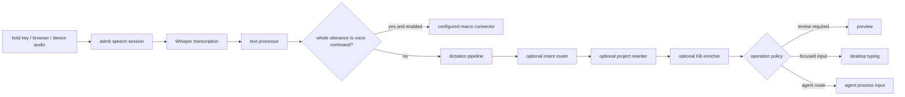
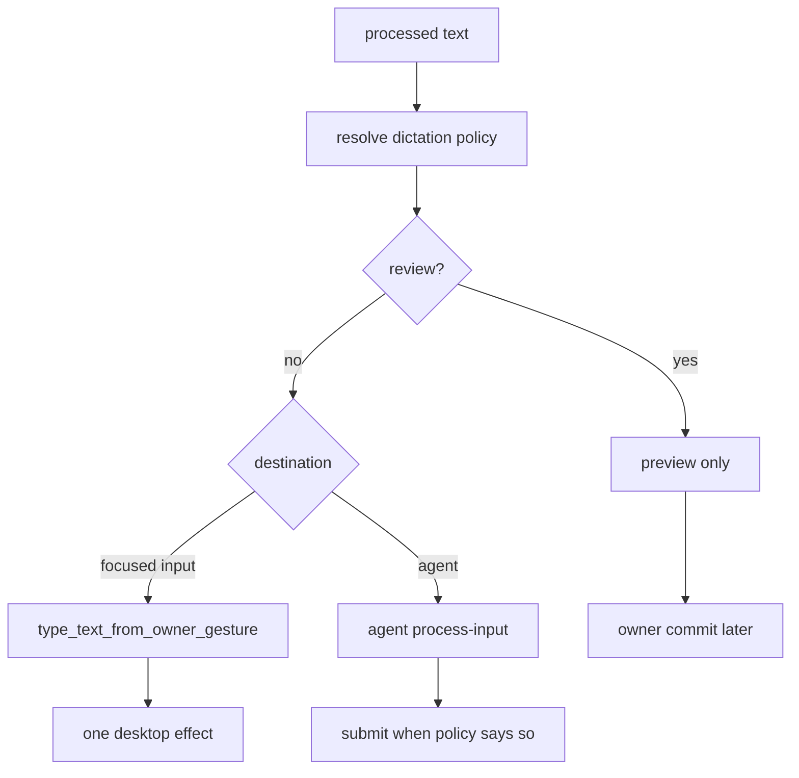

# Dictation architecture

This is a source audit of the dictation path at source snapshot `675401a857b85336d4acaa8c65383dfc9636e4c8`. The path below describes the current implementation. A source symbol proves that code exists; it does not prove that a release enables it or that a destination is available. The test assertions named here are inspection evidence. They are marked `not_run` in the Philo fixture.

## End-to-end path

The hotkey path is `holdspeak/runtime/dictation_capture.py:68-320`, symbol `_transcribe_and_type`. It admits a session, transcribes the captured audio, passes the result through `text_processor.process`, checks the configured whole-utterance voice-command path, then calls `_maybe_run_dictation_pipeline`. The final operation is selected by `resolve_dictation_policy` at `holdspeak/operation_policy.py:377-431` and has operation id `dictation:next-commit` with destination `focused_input`.

The browser path enters the same processing seam through `holdspeak/runtime/dictation_processing.py:51-89`, symbol `process_transcript`. Device and system meeting audio use a separate meeting transcription seam; they do not silently become focused-input dictation. The shared dictation pipeline accepts a transcript and a target context, so the target detector is skipped for browser input (`holdspeak/dictation_runner.py:253-304`).

## Admission, transcription, and command branch

`holdspeak/runtime/dictation_capture.py:68-320` closes the speech session in `finally`, updates activity, and reports typing errors as named failures. A configured command is dispatched only when the command path is enabled and the complete utterance matches. `holdspeak/dictation_runner.py:49-122`, `dispatch_voice_command`, creates an `ActuatorProposal` and invokes the configured connector. A command failure is reported as `voice-command-failed`; ordinary dictated text continues through the dictation path only when command matching did not claim it.

The command branch is disabled by default in `holdspeak/dictation_runner.py:49-58`. This is a configuration boundary, not proof that a connector is installed. The command connector can cause external effects, so its egress must be shown at the connector boundary.

## Pipeline stages and optional branches

`holdspeak/dictation_runner.py:307-509`, `run_pipeline_corrections_only`, builds the pipeline and records a journal entry. Pipeline off is an intentional pass-through. A failed build or ordinary stage error falls back to the utterance text and records the failure. Fatal speech-control signals are re-raised. A fenced session publishes no text, even when a pipeline or fallback has produced a local value.

`holdspeak/plugins/dictation/assembly.py:52-146`, `build_pipeline`, resolves configured stage ids. The built-in stage ids are `intent-router`, `project-rewriter`, and `kb-enricher`. The lexical path can be built without a model runtime. Model stages are skipped when the runtime is unavailable. Only one admitted runtime wrapper is constructed for the run.

`holdspeak/plugins/dictation/pipeline.py:68-208`, `DictationPipeline.run`, runs stages in order. A disabled LLM stage is skipped with a warning. An ordinary stage exception resets the final text to the utterance text and records the failed stage. A fatal speech-control signal stops the run. A run-hook failure is warning-only. The result carries `final_text`, stage results, intent, warnings, `short_circuited`, and `corrections_applied`.

The stages have different contracts:

* `intent-router` (`holdspeak/plugins/dictation/builtin/intent_router.py:79-138`) is an LLM stage. It coerces the response to the bounded intent schema and can emit a correction nudge.
* `project-rewriter` (`holdspeak/plugins/dictation/builtin/project_rewriter.py:1-7,49-105,158-191`) is optional and fails open. Missing `.hs` context, an unsupported runtime, or an empty input leaves the input unchanged. A failed first rewrite preserves the input; a failed refinement keeps the best draft.
* `kb-enricher` (`holdspeak/plugins/dictation/builtin/kb_enricher.py:1-7,95-187`) is a template stage. Unresolved placeholders skip injection and preserve the text. It does not require a model.

The runtime adapter is `holdspeak/plugins/dictation/runtime.py:1-16,66-203`. `auto` prefers MLX on Darwin arm64 when `mlx_lm` imports, then uses `llama_cpp`; explicit backends do not silently fall back. The accepted backends are MLX, llama.cpp, and OpenAI-compatible. An unavailable backend raises `RuntimeUnavailableError` with a named reason.

## Commit and delivery boundary

`tests/unit/test_dictation_commit_boundary.py:96-108` asserts that an ordinary commit produces one final desktop effect. Its preview assertion at `:111-128` verifies that preview defers typing; remote-focus send is covered at `:155-168`; agent `process-input` plus submit is covered at `:217-242`; receipt assertions at `:268-282` require content-free receipts. These are test assertions to inspect, not executed proof in this documentation lane.

The delivery path does not make a model call itself. It accepts the admitted and processed value, resolves a policy, and binds the final effect to the selected destination. A target that cannot bind must fail closed. `tests/unit/test_dictation_pipeline_admission.py:585-618` names the unbindable-target refusal; post-admission configuration changes cannot retarget the run (`:524-581`).

## Admission and failure behavior

The model-bearing stages are children of an admitted dictation parent. The admission tests describe the boundary: classify and rewrite are two frozen children (`tests/unit/test_dictation_pipeline_admission.py:194-221`); prompts and rewrites are not sent to the kernel (`:224-245`); an unplanned capability is refused (`:247-255`); cancellation prevents the next provider child (`:469-486`); and a fenced session publishes nothing (`:489-517`). Pipeline-off plus a fence also publishes nothing (`:760-797`), while an unreadable fence fails closed (`:872-890`).

The runner's fallback is text-preserving, not destination-changing. A runtime build error falls back to the original text (`tests/unit/test_dictation_runner.py:68-84`); a loaded pipeline produces its final text (`:106-142`); disabled processing remains unchanged and journals the pass-through (`:44-54,197-219`). The pipeline itself is disabled/no-op at `tests/unit/test_dictation_pipeline.py:73-85`, preserves stage order at `:90-110`, short-circuits on ordinary exceptions at `:115-128`, and skips a model stage when LLM use is disabled at `:146-154`.

## Current gaps and bounded unknowns

* The source defines local and OpenAI-compatible runtime adapters, but this audit does not establish a configured model file, key, endpoint, or release exposure. Those are runtime and destination facts.
* Browser input, hotkey input, and device audio share processing concepts but have different capture seams. There is no claim here that every platform exposes every seam.
* The configured voice-command connector can egress. Its concrete connector inventory and policy are outside this architecture document.
* “Pipeline off” and “runtime unavailable” preserve text, but they do not prove that the owner saw a visible warning in every surface.
* No live dictation, model call, desktop typing, or release walk was run for this audit.
