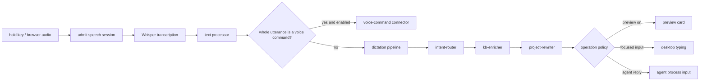
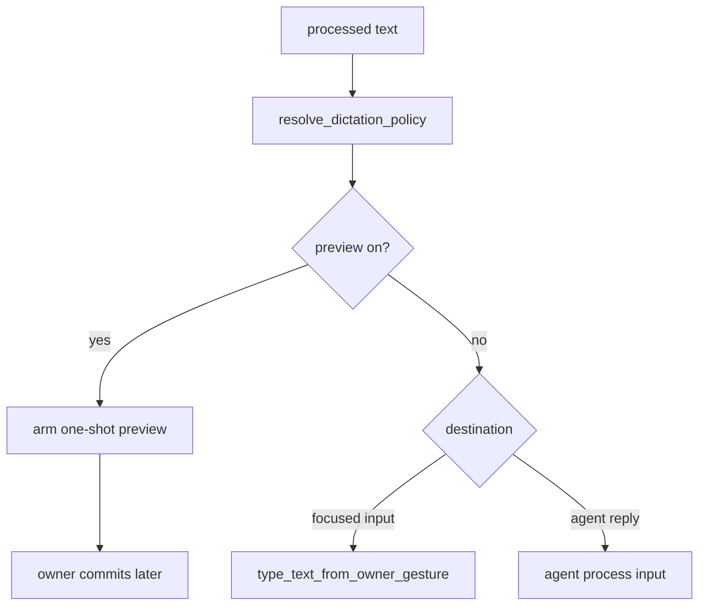

# Dictation architecture

This page is for contributors. It describes the code path from captured audio
to typed text. For setup, read the [Dictation Pipeline Guide](./DICTATION_PIPELINE_GUIDE.md).

## End-to-end path

```mermaid
flowchart LR
    A[hold key / browser audio] --> B[admit speech session]
    B --> C[Whisper transcription]
    C --> D[text processor]
    D --> E{whole utterance is a voice command?}
    E -->|yes and enabled| F[voice-command connector]
    E -->|no| G[dictation pipeline]
    G --> H[intent-router]
    H --> I[kb-enricher]
    I --> J[project-rewriter]
    J --> K{operation policy}
    K -->|preview on| L[preview card]
    K -->|focused input| M[desktop typing]
    K -->|agent reply| N[agent process input]
```

The diagram shows every stage. The configured `stages` list sets which stages
run and in what order.

## Entry points

| Path | Symbol | File |
|---|---|---|
| Hotkey | `_transcribe_and_type` | `holdspeak/runtime/dictation_capture.py` |
| Pipeline call from the hotkey | `_maybe_run_dictation_pipeline` | `holdspeak/runtime/dictation_processing.py` |
| Shared processing for hotkey and browser | `process_transcript` | `holdspeak/dictation_runner.py` |
| Pipeline run, journal, corrections | `run_pipeline_corrections_only` | `holdspeak/dictation_runner.py` |
| Voice command dispatch | `dispatch_voice_command` | `holdspeak/dictation_runner.py` |
| Pipeline assembly | `build_pipeline` | `holdspeak/plugins/dictation/assembly.py` |
| Stage loop | `DictationPipeline.run` | `holdspeak/plugins/dictation/pipeline.py` |
| Commit policy | `resolve_dictation_policy` | `holdspeak/operation_policy.py` |
| Typing | `type_text_from_owner_gesture` | `holdspeak/desktop_typing.py` |

The browser path calls `process_transcript` with source `browser`. The browser
is the target, so target detection is skipped. Corrections and learning still
run.

## Admission and the voice-command branch

`_transcribe_and_type` admits a speech session first. Each model call in the
pipeline is a child of that session. The session closes in a `finally` block.
A cancelled session is fenced: a fenced session publishes no text and fires no
command, even when the pipeline produced a local value.

After transcription, `text_processor.process` cleans punctuation. Then
`dispatch_voice_command` runs inside the same fenced election that
cancellation uses. It does nothing unless `dictation.macros.enabled` is true.
On a whole-utterance match, it builds a proposal and calls the connector from
`holdspeak/plugins/voice_macro_connector.py`. A match ends the run. A failed
command reports `voice_command_failed` and the text is not dictated.

## Pipeline stages

`build_pipeline` resolves the configured stage ids. The known ids are
`intent-router`, `project-rewriter`, and `kb-enricher`. An unknown id fails
config validation. The default list is `intent-router`, `kb-enricher`.

`DictationPipeline.run` runs the stages in order.

- A stage that needs a model is skipped when LLM use is off.
- An ordinary stage error stops the run. The final text resets to the
  utterance text, and the run records the failed stage.
- A fatal speech-control signal stops the run and is re-raised.
- A run-hook failure only adds a warning.
- The result holds `final_text`, stage results, the intent, warnings,
  `short_circuited`, and `corrections_applied`.

If the pipeline is off, the runner passes the text through and journals it.
If the build fails, the runner falls back to the utterance text.

| Stage | Module (`holdspeak/plugins/dictation/builtin/`) | Needs model | Behavior |
|---|---|---|---|
| `intent-router` | `intent_router.py` | Yes | Classifies the utterance into a block. Coerces the reply to a bounded schema. Applies correction nudges. |
| `kb-enricher` | `kb_enricher.py` | No | Stamps `{project.kb.<key>}` values into the block template. An unresolved placeholder skips injection. |
| `project-rewriter` | `project_rewriter.py` | Yes | Rewrites speech with `.hs/` context. Fails open. Runs `rewrite_passes` passes. |

## Runtime backends

`holdspeak/plugins/dictation/runtime.py` defines the `LLMRuntime` protocol and
`VALID_BACKENDS`: `auto`, `mlx`, `llama_cpp`, `openai_compatible`. `auto`
prefers MLX on Apple Silicon when `mlx_lm` imports. Otherwise it uses
`llama_cpp`. An explicit backend never falls back. An unavailable backend
raises `RuntimeUnavailableError` with a named reason.

The backend modules are `runtime_mlx.py`, `runtime_llama_cpp.py`,
`runtime_openai_compatible.py`, and `runtime_mesh_relay.py`. The
OpenAI-compatible backend sends `extra_body={"thinking": False}` on each call.

## Commit and delivery

```mermaid
flowchart TD
    P[processed text] --> Q[resolve_dictation_policy]
    Q --> R{preview on?}
    R -->|yes| S[arm one-shot preview]
    R -->|no| T{destination}
    T -->|focused input| U[type_text_from_owner_gesture]
    T -->|agent reply| V[agent process input]
    S --> W[owner commits later]
```

`resolve_dictation_policy` builds the operation `dictation:next-commit` with
destination `focused_input` and effect class `desktop/type_text`. It passes
`dictation.preview_before_type` to the policy resolver. The delivery step
makes no model call. A target that cannot bind fails closed. A config change
after admission cannot retarget the run.

## Tests to read

| Behavior | Test file |
|---|---|
| Stage order, fail-open, short circuit | `tests/unit/test_dictation_pipeline.py` |
| Runner fallback and journaling | `tests/unit/test_dictation_runner.py` |
| Admission, fences, cancellation | `tests/unit/test_dictation_pipeline_admission.py` |
| Commit boundary, preview, agent delivery, receipts | `tests/unit/test_dictation_commit_boundary.py` |

## See also

- [Dictation Pipeline Guide](./DICTATION_PIPELINE_GUIDE.md)
- [Voice Commands](./VOICE_COMMANDS.md)
- [Models](./MODELS.md)
