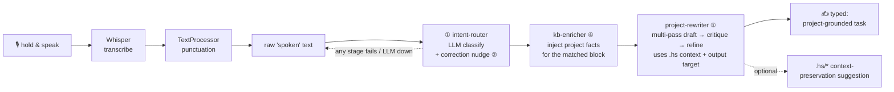
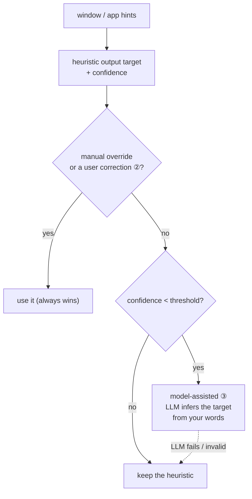

# The Dictation Copilot: spoken to enriched

Transcription gets your words onto the screen; the dictation pipeline gets
your *intent* there. It turns rough, rambling speech into a precise,
**project-grounded** task for a Coder session, using a model you run.
This page shows it working end to end against a real local LLM, then tells
you how to turn it on and run the same demo yourself.

> Everything here is **opt-in and off by default**. With the dictation pipeline
> disabled, HoldSpeak types your transcript exactly as before. See
> [Dictation Pipeline Guide](./DICTATION_PIPELINE_GUIDE.md) for the full setup
> and [Models](./MODELS.md) for the bring-your-own-model contract.

## See it work

A real run over the [`ledgerline`](../tests/fixtures/dictation_demo_project/pyproject.toml)
fixture project (it has [`.hs/` context](../tests/fixtures/dictation_demo_project/.hs/memory.md),
a [block taxonomy](../tests/fixtures/dictation_demo_project/.holdspeak/blocks.yaml),
[project facts](../tests/fixtures/dictation_demo_project/.holdspeak/project.yaml) (the `kb:` map),
and code), driving a homelab `Qwen3.5-9B` over an OpenAI-compatible endpoint,
with **every depth feature firing at once**:

```text
  Features that fired this run
  ① multi-pass rewrite      2 passes  (5202ms + 5615ms)
  ② correction memory       seeded intent→agent_task_buildout;  router → agent_task_buildout@0.85 corrected ✓  ← classifier missed; rescued by your correction
  ③ model-assisted target   window signal: none → heuristic unknown@0.00 (<0.80) → claude_code@0.70 src=llm  ✓ fired
  ④ kb-enricher injection   block agent_task_buildout → injected project facts (stack/invariants/DoD)

┌─ SPOKEN  (raw dictation, what Whisper heard) ──────────────────────────────┐
│ ok so um claude i need you to add idempotency to the charge endpoint       │
│ because right now if the gateway retries we post the entry twice and the   │
│ customer gets double charged which is really bad uh so use the idempotency │
│ key header that the client sends and store it somewhere and if we see the  │
│ same key again just return what we returned the first time dont post       │
│ another entry and yeah make sure it still balances and write a test for    │
│ the retry case                                                             │
└────────────────────────────────────────────────────────────────────────────┘
                                    │
                                    ▼  route · inject · multi-pass rewrite
┌─ ENRICHED  (project-grounded coding-agent task) ───────────────────────────┐
│ Implement idempotency for the `POST /charges` endpoint in                  │
│ `src/ledgerline/api/charges.py` to prevent double-charging during gateway  │
│ retries, strictly adhering to the append-only ledger invariant defined in  │
│ `.hs/memory.md`.                                                           │
│                                                                            │
│ **Implementation Spec:**                                                   │
│ 1.  **Extract Key:** Read the `Idempotency-Key` header.                    │
│ 2.  **Lookup:** Check the idempotency store (`key`, `request_hash`,        │
│ `response_json`).                                                          │
│ 3.  **Replay Logic:** If a match is found, return the stored response      │
│ without executing any posting logic in `src/ledgerline/ledger.py`.         │
│ 4.  **New Request:** Otherwise post the double-entry (debit customer,      │
│ credit revenue) in integer minor units, then store the response.           │
│ 5.  **Invariant Check:** Never UPDATE or DELETE rows in                    │
│ `src/ledgerline/db/entries.py`; corrections are new reversing entries.     │
│                                                                            │
│ **Acceptance Criteria:**                                                   │
│ - [ ] A retry with a used `Idempotency-Key` returns the same response with │
│ no new ledger rows.                                                        │
│ - [ ] Every new charge posts two rows summing to zero (integer cents).     │
│ - [ ] No UPDATE/DELETE on `ledger_entries`.                                │
│ - [ ] A test verifies the retry case writes nothing new.                   │
└────────────────────────────────────────────────────────────────────────────┘

  446 chars → 1719 chars (+1273)  ·  target claude_code  ·  passes 2
```

The 446-character ramble became a task that names the real files
(`src/ledgerline/...`), the real store columns (`key`, `request_hash`,
`response_json`), the **append-only** and **double-entry** invariants, and an
acceptance-criteria checklist, none of which were spoken. That grounding comes
from the project's own [`.hs/memory.md`](../tests/fixtures/dictation_demo_project/.hs/memory.md)
and KB, not from the model's imagination.

## How it works

After Whisper transcribes and `TextProcessor` cleans punctuation, the utterance
flows through an **opt-in, ordered pipeline** before it's typed. Each stage
fails open: if it errors or the LLM is unreachable, your plain transcript is
what gets typed.

An optional last gate, **preview before it types** (Settings, Voice
section; off by default): the finished text shows on a card everywhere in
the web app instead of typing. **Type it** commits through the normal
typing path, **Discard** drops it, and the token behind the card is
server-minted and one-shot (the same contract as the wake word's
preview).



The **output target** (where the text is headed: Claude Code, Codex, a
browser, an editor) is resolved in parallel and shapes the rewrite. That's
where correction memory (②) and model-assisted detection (③) decide together:



In the run above there was **no window signal** (the Wayland/terminal reality),
so the heuristic returned `unknown@0.00`; below the threshold, the LLM inferred
`claude_code` from the words. And the intent-router's raw classify actually
*failed* on this endpoint, but your earlier **correction rescued the routing**,
so the task still landed in the right block.

## What each feature did

| # | Feature | What happened above | Turn it on with |
|---|---------|---------------------|-----------------|
| ① | **Multi-pass rewriting** | Drafted, then critiqued + tightened in a second pass (latency-budget-gated). | `rewrite_passes: 2` |
| ② | **Correction memory** | A correction you made last session (`this kind of utterance → agent_task_buildout`) nudged routing. The LLM classifier actually *failed* on this turn; the correction **rescued** it. **Persists across restarts** (DB-backed); curate it in `/dictation → Memory`. | `corrections_enabled: true` |
| ③ | **Model-assisted target** | No window signal was available (the Wayland/terminal reality). The heuristic gave `unknown@0.00`; below the threshold, the LLM **inferred** `claude_code` from your words. A manual override always wins. | `target_detect_llm_enabled: true` |
| ④ | **KB injection** | The matched block injected the project's stack / invariants / definition-of-done before the rewrite. | add a block with an `inject` template |

The output is always **fail-open**: any stage that errors or an LLM that's
unreachable degrades to your plain transcript. The pipeline never makes your
text un-typeable.

## Turn it on

**Do it all in the web UI, no file editing.** Open the cockpit and flip the
toggles:

```
/dictation -> Runtime         # pick a backend + endpoint, enable the pipeline
/dictation -> Runtime -> Copilot depth   # rewrite passes, corrections, model-assist
/dictation -> Memory          # see + curate what the copilot has learned
```


Every feature above (① through ④) is a slider or toggle in **Runtime → Copilot depth**;
the round-trip persists through the settings API. See the
[Dictation Pipeline Setup guide](./DICTATION_PIPELINE_GUIDE.md) for the full
walk-through.

Then add a project's [`.hs/` context](./DICTATION_PIPELINE_GUIDE.md) (and,
optionally, a `.holdspeak/blocks.yaml` taxonomy + `.holdspeak/project.yaml` KB)
so the rewrite has facts to ground in.

<details>
<summary><strong>Advanced: the same config in <code>config.json</code></strong> (headless / scripted)</summary>

Add a `dictation` block to `~/.config/holdspeak/config.json` (point the runtime
at any local or LAN [OpenAI-compatible / GGUF / MLX endpoint](./MODELS.md)):

```json
{
  "dictation": {
    "pipeline": {
      "enabled": true,
      "stages": ["intent-router", "kb-enricher", "project-rewriter"],
      "rewrite_passes": 2,
      "corrections_enabled": true,
      "target_detect_llm_enabled": true,
      "target_detect_llm_below": 0.8
    },
    "runtime": {
      "backend": "openai_compatible",
      "openai_compatible_base_url": "http://127.0.0.1:8080/v1",
      "openai_compatible_model": "your-model-id"
    }
  }
}
```

Prefer the picker: author the endpoint once as a Runs on destination (the Web
compatibility route is `/profiles`), then pick it under Dictation → Runtime →
**Runs on**. The fields above remain the fallback when nothing is selected.

</details>

## Run the demo yourself

The exact run above is reproducible. Point it at your endpoint and go:

```bash
HOLDSPEAK_DICTATION_E2E_BASE_URL=http://127.0.0.1:8080/v1 \
HOLDSPEAK_DICTATION_E2E_MODEL=your-model-id \
uv run python scripts/dictation_enrichment_demo.py
```

Pass `--spoken "..."` to feed your own dictation, or `--project /path/to/repo`
to ground it in one of your repos.

The same code is a committed end-to-end test
([`tests/e2e/test_dictation_enrichment_e2e.py`](../tests/e2e/test_dictation_enrichment_e2e.py)):
it asserts all four features fired and that the task is grounded in project
specifics. It **auto-skips** when no endpoint is configured (so it's safe in
hosted CI) and runs for real wherever your endpoint is reachable.

## See also

- [Dictation Pipeline Guide](./DICTATION_PIPELINE_GUIDE.md): the full setup,
  `.hs/` conventions, output targets, automation hooks, and every config knob.
- [The learning loop](./DICTATION_PIPELINE_GUIDE.md#12-dictation-journal-corrections--replay):
  what feature ② becomes over time. Correct a misfire in one tap, watch the "What
  HoldSpeak learned" digest count the honest reach, and replay to prove it improved.
- [Models](./MODELS.md): choosing and pointing at a model.
- [Security & Privacy](./SECURITY.md): what leaves your machine (only the LLM
  endpoint you configure; local or LAN is fine).
