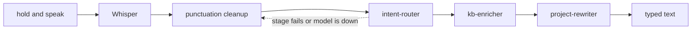
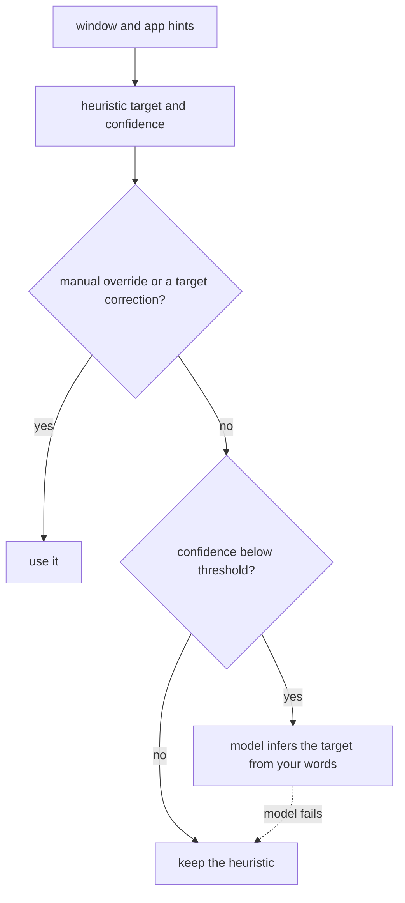

# The Dictation Copilot

Transcription puts your words on the screen. The dictation pipeline puts your
intent there. It turns rough speech into a precise task that uses your
project context. This page shows one real run and then lists the settings
that control it.

The pipeline is on by default. A stage that fails or has no model passes your
plain transcript through. For setup, read the
[Dictation Pipeline Guide](./DICTATION_PIPELINE_GUIDE.md). For model setup,
read [Models](./MODELS.md).

## One real run

This run used the [`ledgerline`](../tests/fixtures/dictation_demo_project/pyproject.toml)
fixture project and a `Qwen3.5-9B` model on an OpenAI-compatible endpoint. All
four depth features were on.

```text
Features that fired
 1 multi-pass rewrite    2 passes
 2 correction memory     router rescued: agent_task_buildout@0.85
 3 model-assisted target window signal none -> unknown@0.00 -> claude_code@0.70
 4 kb-enricher           project facts injected (stack, invariants, DoD)

SPOKEN
 ok so um claude i need you to add idempotency to the charge endpoint because
 right now if the gateway retries we post the entry twice and the customer
 gets double charged ... use the idempotency key header ... and write a test
 for the retry case

ENRICHED
 Implement idempotency for the `POST /charges` endpoint in
 `src/ledgerline/api/charges.py` to prevent double-charging during gateway
 retries, within the append-only ledger invariant in `.hs/memory.md`.

 Implementation Spec:
 1. Extract Key: read the `Idempotency-Key` header.
 2. Lookup: check the idempotency store (`key`, `request_hash`, `response_json`).
 3. Replay: on a match, return the stored response and post nothing.
 4. New request: post the double entry in integer minor units, then store the response.
 5. Never UPDATE or DELETE ledger rows. Corrections are new reversing entries.

 Acceptance Criteria:
 - [ ] A retry with a used key returns the same response and adds no ledger rows.
 - [ ] Every charge posts two rows that sum to zero.
 - [ ] A test shows that the retry case writes nothing new.

446 chars -> 1719 chars  -  target claude_code  -  passes 2
```

The spoken text names no file, no table column, and no invariant. The
enriched task names all of them. The grounding comes from the project's
[`.hs/memory.md`](../tests/fixtures/dictation_demo_project/.hs/memory.md) and
its project facts. The model does not invent it.

## How it works

After Whisper and punctuation cleanup, the utterance runs through the
pipeline stages in order. Each stage fails open.


```mermaid
flowchart LR
    A[hold and speak] --> B[Whisper]
    B --> C[punctuation cleanup]
    C --> E[intent-router]
    E --> F[kb-enricher]
    F --> G[project-rewriter]
    G --> H[typed text]
    E -.->|stage fails or model is down| C
```

HoldSpeak also resolves the output target (Claude Code, Codex CLI, terminal,
browser, editor, chat). The target shapes the rewrite.


```mermaid
flowchart TD
    T1[window and app hints] --> T2[heuristic target and confidence]
    T2 --> T3{manual override or a target correction?}
    T3 -->|yes| TW[use it]
    T3 -->|no| T4{confidence below threshold?}
    T4 -->|no| TH[keep the heuristic]
    T4 -->|yes| T5[model infers the target from your words]
    T5 -.->|model fails| TH
```

## The four depth features

| # | Feature | What it does | Setting |
|---|---|---|---|
| 1 | Multi-pass rewriting | The rewriter drafts, critiques, and refines. A pass is skipped if it would pass `max_total_latency_ms`. | `rewrite_passes` (1 to 5, default `1`) |
| 2 | Correction memory | Your corrections change the transcript or nudge routing. They persist across restarts. | Always on. Manage on the **Learned** wing. |
| 3 | Model-assisted target | When window hints are weak, the model infers the target. A manual override always wins. | `target_detect_llm_enabled` (default `false`), `target_detect_llm_below` (default `0.8`) |
| 4 | Project facts | The matched block injects your stack, rules, and checklist into the template. | Add a block with an `{project.kb.<key>}` template. |

## Configure it

Open **Settings > Voice** and unfold **RAW**. The **Pipeline** group holds
**Stages**, **Latency budget**, **Rewrite passes**, **LLM target detect**, and
**Detect below**. Choose the dictation model in **Settings > Models**. See
the [Dictation Pipeline Guide](./DICTATION_PIPELINE_GUIDE.md).

For a headless setup, edit `~/.config/holdspeak/config.json`:

```json
{
  "dictation": {
    "pipeline": {
      "stages": ["intent-router", "kb-enricher", "project-rewriter"],
      "rewrite_passes": 2,
      "target_detect_llm_enabled": true,
      "target_detect_llm_below": 0.8
    }
  }
}
```

The endpoint and model are not dictation config keys. Assign them in
**Settings > Models**. See [Models](./MODELS.md).

## Run the demo yourself

```bash
HOLDSPEAK_DICTATION_E2E_BASE_URL=http://127.0.0.1:8080/v1 \
HOLDSPEAK_DICTATION_E2E_MODEL=your-model-id \
uv run python scripts/dictation_enrichment_demo.py
```

Use `--spoken "..."` for your own dictation. Use `--project /path/to/repo` for
your own repository. Use `--passes N` to set the rewrite passes.

The same flow runs as an end-to-end test,
[`tests/e2e/test_dictation_enrichment_e2e.py`](../tests/e2e/test_dictation_enrichment_e2e.py).
It skips when no endpoint is set.

## See also

- [Dictation Pipeline Guide](./DICTATION_PIPELINE_GUIDE.md): setup, `.hs/` files, targets, hooks, and the journal.
- [Models](./MODELS.md): choose and assign a model.
- [Security & Privacy](./SECURITY.md): only the model endpoint you assign receives your text.
