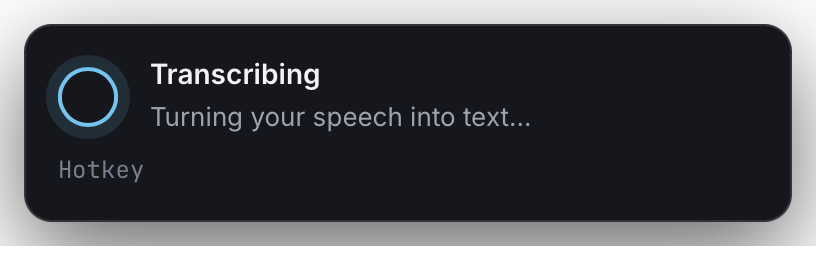
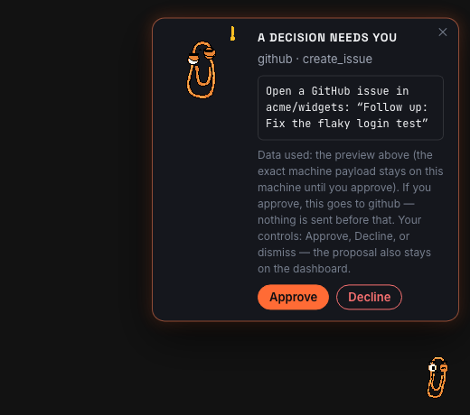

# Dictation Pipeline Guide

The dictation pipeline turns rough speech into useful text for the app you
type in. It routes each utterance through your dictation blocks, your project
facts, your project context, and an optional model rewrite. Then HoldSpeak
types the result.

Read [Getting Started](./GETTING_STARTED.md) first if basic voice typing does
not work yet. To see a full run first, read [The Dictation Copilot](./DICTATION_COPILOT.md).

The loop is:

```text
speech -> Whisper transcript -> punctuation cleanup -> dictation pipeline -> typed text
```

The pipeline is on by default. Every stage fails open. If a stage fails or its
model is not available, HoldSpeak types your plain transcript.

An optional last gate sits after the pipeline. Turn on **Preview before
type** in **Settings > Voice > Typing**. HoldSpeak then shows the finished
text on a card. **Type it** commits the text. **Discard** drops it.

## Project knowledge: facts and context

Project knowledge has two parts. They do different jobs.

| Part | Where it lives | Used by | What it does |
|---|---|---|---|
| Facts | `kb:` map in `<repo>/.holdspeak/project.yaml` | `kb-enricher` stage | Stamps exact values into a block template. No model. |
| Context | `.hs/` folder of Markdown files in your repo | `project-rewriter` stage | Guides the model when it rewrites your speech. |

HoldSpeak reads both. It never writes them without your approval.

## 1. Open the dictation face

Start HoldSpeak and open `/dictation`.

```bash
holdspeak
```

The face has four wings: **Speak**, **Journal**, **Blocks**, and **Learned**.
The gear opens **Configure dictation**. It holds readiness, the learning
digest, project knowledge, the runtime, automation hooks, and activity nudges.

Start in **Configure dictation**. The **Pipeline** group shows if the pipeline
is on and what is missing.

## 2. Choose the model

The dictation runtime is not set on the dictation face. The **Dictation
runtime** group in **Configure dictation** says **RUNS ON LIVES IN MODELS**.
Click **Open Models**.

1. In **Settings > Models**, add your endpoint or local model.
2. Assign it to **Writing & dictation** in the Concierge set.
3. Click **Use these**.

See [Models](./MODELS.md) for the full contract, API keys, and the headless
fallback.

The available backends are:

| Backend | Use when |
|---|---|
| `auto` | You want MLX on Apple Silicon, and llama.cpp elsewhere. |
| `mlx` | You are on Apple Silicon with an MLX model. |
| `llama_cpp` | You have a local GGUF model. |
| `openai_compatible` | You have a local, LAN, or hosted `/v1/chat/completions` endpoint. |

Install the extra for your backend:

```bash
uv pip install -e '.[dictation-mlx]'
uv pip install -e '.[dictation-llama]'
uv pip install -e '.[dictation-openai]'
```

HoldSpeak sends `thinking: false` on every call to an OpenAI-compatible
endpoint. This stops extended thinking on models that support it. An endpoint
that does not support the field ignores it.

The intent router and the rewriter need a model. The `kb-enricher` stage does
not.

## 3. Choose the stages

The `dictation.pipeline.stages` list sets which stages run, in order. The
default is `intent-router` and `kb-enricher`.

| Stage | Needs model | What it does |
|---|---|---|
| `intent-router` | Yes | Matches the utterance to a dictation block. |
| `kb-enricher` | No | Stamps project facts into the block template. |
| `project-rewriter` | Yes | Rewrites speech with `.hs/` context. Adds one model call. |

To add the rewriter, set `stages` in **Settings > Voice**. Unfold **RAW** and
edit **Stages** in the **Pipeline** group. Or edit the config file:

```json
{
  "dictation": {
    "pipeline": {
      "stages": ["intent-router", "kb-enricher", "project-rewriter"],
      "max_total_latency_ms": 600
    }
  }
}
```

Enable the rewriter only when a model is assigned and you have written
`.hs/instructions.md`.

## 4. Set the output target

HoldSpeak detects the active app and shapes the text for it. Set
`dictation.pipeline.target_profile_override` when detection is wrong.

| Value | Meaning |
|---|---|
| `auto` | Use active-window hints. This is the default. |
| `codex_cli` | Write an implementation prompt for Codex. |
| `claude_code` | Write a prompt or reply for Claude Code. |
| `terminal_shell` | Keep command syntax exact. |
| `browser` | Write plain prose for text boxes. |
| `editor` | Write code-friendly prose. |
| `chat` | Write conversational text. |

The **Delivery** group in **Configure dictation** shows the detected target.
Set the value back to `auto` when detection works again.

When the window gives weak hints, the model can infer the target. Turn on
**LLM target detect** in **Settings > Voice > RAW**. **Detect below** sets
the confidence limit. The default is `0.8`. A manual override always wins.

## 5. Set up project knowledge

### Facts

A fact is an exact value that you reuse: your stack, a deploy command, a ticket
prefix. In **Configure dictation**, open **Knowledge**. Enter a **Fact name**
and **Fact value**.

A fact in `<repo>/.holdspeak/project.yaml`:

```yaml
kb:
  stack: Rails 7 + Postgres 16
```

A block template that uses it:

```text
Follow our stack: {project.kb.stack}
```

The typed text is:

```text
Follow our stack: Rails 7 + Postgres 16
```

Fact names must match `[A-Za-z_][A-Za-z0-9_]*`. Values are strings.

If the project has no facts, the **Pipeline** group shows **Project KB:
MISSING**. Click **Create** to write a starter file.

To use another repository, set **Project root** in **Knowledge** and click
**Use**. The default is the working directory of HoldSpeak.

### Context

Context is prose that the `project-rewriter` stage reads. Create a `.hs/`
folder in your repository:

```text
.hs/
  instructions.md
  context.md
  workflows.md
  targets.md
  ignore
```

The **Instructions** group in **Knowledge** edits `.hs/instructions.md`. A
minimal set:

```md
# .hs/instructions.md
When dictating into Codex or Claude, rewrite rough speech into a concise
engineering request. Keep filenames, commands, and test names exact.

# .hs/context.md
This project is a local-first Python app with a FastAPI runtime and a
React and Vite frontend.

# .hs/workflows.md
Run focused Python tests with `.venv/bin/pytest <path>`.

# .hs/targets.md
Codex: concise implementation request.
Terminal: keep command syntax exact.

# .hs/ignore
.env
secrets
private keys
```

Rules:

- HoldSpeak reads `.hs/` during dictation.
- HoldSpeak does not write `.hs/` files unless you approve a suggestion.
- HoldSpeak skips or rejects content that looks like a secret.
- Do not put API keys in `.hs/` files.

### Suggested documentation updates

When the rewriter sees durable context, it can suggest a small update, for
example `.hs/decisions/agent-hooks-context-channel.md`. You can read, apply,
or dismiss a suggestion through `/api/dictation/project-doc-suggestion`.
Apply writes only to these folders:

```text
.hs/memory/
.hs/decisions/
.hs/handoffs/
.hs/workflows/
.hs/issues/
```

HoldSpeak hides a suggestion that repeats the target file. HoldSpeak does not
repeat a dismissed suggestion for a similar utterance in the same session.

## 6. Install the agent hooks

Hooks tell HoldSpeak the working directory, session id, and recent state of
your Claude Code or Codex session. This tells HoldSpeak which project the
agent works in. The full install is in
[Claude/Codex automation hook install](./AGENT_HOOK_INSTALL.md).

Print a template:

```bash
holdspeak agent-hook templates --agent claude
holdspeak agent-hook templates --agent codex
```

Add `--capture-messages` to also capture the latest assistant message. This
lets HoldSpeak detect that the session waits for your reply. HoldSpeak stores
only a short local snippet.

The **Automation hooks** group in **Configure dictation** shows a `SET` chip
for each agent that has sent a session.

## 7. Rehearse a dictation

A dry run shows the pipeline result and types nothing. In the **Speak** wing,
turn on **DRY RUN**, type or speak an utterance, and read the result. From the
command line:

```bash
holdspeak dictation dry-run "ask codex to inspect the failing test and propose a minimal fix"
```

Check these items:

- The runtime status is loaded.
- The target is correct.
- No stage fell back without a reason.
- The final text is useful.

Other CLI commands:

```bash
holdspeak dictation runtime status
holdspeak dictation blocks ls
holdspeak dictation blocks show <id>
holdspeak dictation blocks validate [--project PATH]
holdspeak doctor
```

## 8. Dictation blocks

A block is a named kind of utterance. The router matches speech to a block.
The block holds the template, which can include `{project.kb.<key>}` values.
Use the **Blocks** wing to add, edit, and delete blocks. A project can
override the global set with `<repo>/.holdspeak/blocks.yaml`.

## Rewrite passes

`rewrite_passes` sets how many times the rewriter refines its draft. The range
is 1 to 5. The default is `1`. A higher value adds a critique and a refine
pass. HoldSpeak skips a pass that would break `max_total_latency_ms`. A failed
refine pass keeps the best draft.

Set **Rewrite passes** in **Settings > Voice > RAW**, or in the config:

```json
{ "dictation": { "pipeline": { "rewrite_passes": 2 } } }
```

## The journal, corrections, and replay

HoldSpeak learns from your corrections. Every step runs on your machine.

1. **Dictate.** Each run is journaled, spoken or dry run.
2. **Correct.** Mark a result **Wrong** and teach the fix.
3. **Learn.** The correction changes later similar utterances.
4. **See it.** The **Learned** wing shows what HoldSpeak learned.
5. **Replay.** Run a past utterance again and compare.

### The journal

Open the **Journal** wing. Each entry shows the time, the transcript, where
it landed, the run time in milliseconds, and a source badge. Search the list.
Filter by source: **ALL**, **DICTATION**, **BROWSER**, or **HOTKEY**. Open an
entry to edit the transcript, **Replay**, **Copy** the transcript, or
**Delete** it. **Clear** removes all entries after you confirm.

The journal stays on your machine. It uses a secret filter before storage.
It keeps the 500 most recent entries (`dictation.pipeline.journal_retention`).
It never changes what gets typed.

### Correct a result

A result shows **OK** and **Wrong**. **OK** only acknowledges the result.
**Wrong** opens the teach row. Pick a **FIELD**: `TEXT`, `INTENT`, or
`TARGET`. Type the right value. Click **Teach**.

| Kind | What it corrects | How it matches |
|---|---|---|
| `text` | A phrase Whisper heard wrong | Exact phrase. Ignores case, spacing, and edge punctuation. Matches whole words only. |
| `intent` | The block that the router chose | Word overlap (Jaccard similarity) above a threshold. |
| `target` | The delivery target | Word overlap, same as `intent`. |

A `text` correction rewrites the transcript before the stages run. An
`intent` or `target` correction nudges the routing of a similar utterance.
HoldSpeak rejects text that looks like a secret. It also refuses a one-word
routing gist. There is no model training and no embedding model.

### See what it learned

The **Learned** wing lists every correction with its kind, the key, and the
corrected value. **N APPLIED** is the number of retained journal entries that
the rule changed. The number can fall as old entries age out. **Forget**
removes a correction. The **Learning digest** in **Configure dictation**
counts corrections by block and target.

### Replay

**Replay** on a journal entry runs the stored transcript through the current
pipeline as a dry run. It types nothing and writes no new journal entry. It
shows the before and after. Use it to check that a correction works.

## Desktop presence

When you dictate into another app, the web dashboard is not visible. Desktop
presence shows what HoldSpeak does now: listening, transcribing, processing,
or typing. It is off by default and never takes keyboard focus.

Turn on **Presence** in **Settings > Sounds & Presence**. Or set the config:

```json
{ "presence": { "enabled": true } }
```

`HOLDSPEAK_DESKTOP_PRESENCE=1` forces it on for a headless launch. Install
the native extra:

```bash
uv pip install -e '.[presence]'
```

| State | Label |
|---|---|
| `listening` | Listening |
| `recording` | Recording |
| `transcribing` | Transcribing |
| `processing` | Processing |
| `typing` | Typing |
| `complete` | Complete |
| `error` | Needs attention |

Presence shows only while something happens. It never renders `idle`.

On macOS, presence is a floating panel and a menu-bar glyph. The panel is
non-activating, so it cannot take keyboard focus.



On Linux, presence is an in-place notification and a tray glyph. On X11 and
wlroots Wayland, it also shows a floating overlay. On GNOME and KDE Wayland,
the compositor blocks overlays, so only the notification and tray work.
On GNOME, the tray glyph needs the AppIndicator extension. The Linux system
packages are `gir1.2-notify-0.7` and `gir1.2-ayatanaappindicator3-0.1`. The
overlay also needs `gir1.2-gtk-3.0` and `gir1.2-webkit2-4.1`.

### Qlippy, the mascot

Qlippy is a small pixel-art companion on the presence surface. Turn on
**Mascot** in **Settings > Sounds & Presence**, or set
`presence.mascot` to `true`. It is off by default.

The dock is a small animated sprite that mirrors the runtime state. A card
slides out only in these cases:

- **A decision needs you.** An action waits for approval. The card stays until
  you resolve or dismiss it.
- **The result of an action you approved.** The card says that it ran as
  previewed, or that it failed and nothing was sent.
- **Learned from you.** A correction reached past dictations. The card shows
  the real match count.
- **A finished meeting left open items.** The card names the top items.

Qlippy never acts on his own. **Approve** on a card sends the same request as
**Approve** on the dashboard. It uses the same audit trail and the same
guarded path. Dismissing a card is always safe.

Each card shows the egress badge. **Local** means everything stays on this
machine. A cloud mark with a destination means that approval sends the
previewed content to that destination only. The preview is the exact content.
The badge is the destination.



## Troubleshooting

| Symptom | Likely cause | Fix |
|---|---|---|
| Runtime unavailable | Missing extra, model, or server | Run `holdspeak doctor` and `holdspeak dictation runtime status`. |
| Dry run keeps the original text | A stage fell back, or no context exists | Check `.hs/instructions.md` and the model assignment. |
| Target shows `unknown` | Window hints are not available | Set `target_profile_override`. |
| Agent working directory is missing | Hooks are not installed | Print the templates again and install them. |
| Suggestions are noisy | Context is too broad | Narrow `.hs/instructions.md` and `.hs/targets.md`. |
| Endpoint times out | Model is too slow | Raise `openai_compatible_timeout_seconds` or use a smaller model. |

## Verification lanes

Default tests never open a real microphone, load a model, or type through the
keyboard. Tests marked `metal` need the explicit hardware flag.

```bash
.venv/bin/pytest -q tests/unit tests/integration
cd web && npm run check
swift test --package-path apple
```

The hardware lane needs microphone permission, PortAudio, and the local
Whisper and model files. It can type into the active app. Close sensitive
apps and use a disposable document.

```bash
.venv/bin/pytest -q tests/e2e/test_metal.py -m metal --run-metal -s
```

Record the build, audio route, model, destination, elapsed time, and result.
Never record the dictated phrase.

## See also

- [Getting Started](./GETTING_STARTED.md): install and basic voice typing.
- [The Dictation Copilot](./DICTATION_COPILOT.md): one full run.
- [Voice Commands](./VOICE_COMMANDS.md): spoken keywords that run actions.
- [Dictation architecture](./DICTATION_ARCHITECTURE.md): the code path.
- [Models](./MODELS.md): choose and assign a model.
- [Claude/Codex automation hooks](./AGENT_HOOK_INSTALL.md): hook install.
- [Security & Privacy](./SECURITY.md): what is stored and what can leave your machine.
