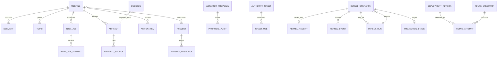

# Domain model

This is a source reconstruction at snapshot
`675401a857b85336d4acaa8c65383dfc9636e4c8` (2026-09-19). It separates
durable entities, API representations, frontend projections, derived read
models, and concepts. Names in this document describe the current executable
shape; the [existing authority contract](AUTHORITY.md) and
[existing security contract](SECURITY.md) remain authoritative for their
respective subjects.

## Canonical vocabulary

HoldSpeak has several overlapping vocabularies. These terms are the useful
canonical set for runtime documentation:

| Term | Meaning | Source kind |
| --- | --- | --- |
| Meeting | A captured or imported session with transcript and derived records | database entity: `meetings` |
| Segment | One timed transcript row belonging to a meeting | database entity: `segments` |
| Artifact | A typed, provenance-linked result produced by a plugin or run | database entity: `artifacts` |
| Decision | A durable memory projection from a decision artifact | database entity: `decisions` |
| Action item | A tracked task extracted from a meeting or another source | database entity: `action_items` |
| Proposal | A candidate external effect awaiting content review and/or authority | database entity: `actuator_proposals`; separate `follow_through_proposals` records exist for extracted work |
| Approval | A decision or scoped grant that allows a concrete effect | operation state/warrant or authority grant |
| Receipt | Durable evidence of a terminal execution or proposal transition | kernel/native receipt entity |
| Work | One bounded runtime undertaking; the kernel calls its generic row an operation | concept plus `kernel_operations` |
| Process | A read-side view of current work state | API/frontend projection |
| Parent run | Durable outer orchestration shell with bounded children | database entity: `kernel_parent_runs` |
| Invocation | One physical model attempt | database/runtime entity: `inference_route_attempts` plus `kernel_operations` |
| Destination | Frozen place and boundary where an operation runs | deployment/revision representation |
| Project | Owner-defined context and room aggregate | database entity: `projects` |
| Desk primitive | Synced object identity rendered by Desk surfaces | database entities such as notes, recipes, workbenches, directories |

“Job”, “run”, and “task” are not interchangeable in source. `intel_jobs` is a
deferred meeting-intelligence queue; `workbench_runs` and `kernel_parent_runs`
are run records; `work_attempts` is a bounded worktree/session observation;
`action_items` are user work objects. Use the concrete table or API name when
the distinction matters.

## Entity relationship diagram

The diagram is a compact relationship map. It is not a claim that every
foreign key shown in concept has a literal SQLite foreign key. For example,
`decisions.source_artifact_id` and `source_meeting_id` intentionally preserve
memory after a meeting deletion, while a trigger marks source state
`source_deleted` [holdspeak/db/schema.py:381-422].

## Durable entities and lifecycle

### Meeting and transcript

`meetings` is the capture/import aggregate. It carries capture, transcription,
intelligence, provenance, route-fence, and timestamps. `segments` stores text,
speaker, speaker identity, and timing; `segments_fts` is an FTS projection kept
in sync by insert/update/delete triggers [holdspeak/db/schema.py:24-51,
75-85,189-213]. Meeting tags, bookmarks, speaker embeddings, topics, and
historical intelligence snapshots are child records. Deleting a meeting
cascades through most transcript and derived child rows by foreign key.

### Deferred intelligence work

`intel_jobs` is a durable queue keyed by an immutable job id and content-free
descriptor/transcript hashes. It records queue status, claim, parent operation,
executor lease, retry count, and error. `intel_job_attempts` is append-only and
records outcome and retry timing [holdspeak/db/schema.py:134-175]. The queue is
not the kernel journal; it links to a parent operation when the runtime admits
one.

### Artifacts, decisions, and actions

`artifacts` stores a title, Markdown body, structured JSON, confidence, plugin
identity/version, and source lineage. `artifact_sources` links an artifact to
window/plugin/run references [holdspeak/db/schema.py:339-379].

`decisions` is a memory projection with lifecycle `recorded`, `accepted`,
`superseded`, or `rejected`. `superseded_by` creates a decision chain. It can
survive meeting deletion with `source_state=source_deleted`; this is deliberate
retention, not a missing foreign key [holdspeak/db/schema.py:385-422].

`action_items` is a first-class task row with task, owner, due, status, review
state, completion, source type, and source reference. `decision_commitments`
links an accepted decision to an accountable action [holdspeak/db/schema.py:97-113,
224-236].

The separate `follow_through_proposals` table is the extraction proposal
workflow. It has proposed/confirmed/dismissed behavior in
`holdspeak/db/proposals.py:79-386`; it is not the same entity as an actuator
proposal that can cause an external effect.

### Projects and context

`projects` is the owner-defined context aggregate with lifecycle, purpose,
outcome, owner, cadence, revision, and room-read markers. `meeting_projects`
associates a meeting with confidence and source; `project_resources` links
resources to projects with relationship, semantic role, confidence, and
revision [holdspeak/db/schema.py:538-595,1621-1635]. Activity records and
calendar/project detection rows are supporting evidence and projections.

### Desk primitives

Notes, knowledge bases (`kbs`), recipes, chains, workflows, directories,
workbenches, and their items are persisted primitives. `directories` and
`directory_memberships` hold organization/nesting; device layout is a surface
projection, not canonical content [holdspeak/db/schema.py:1384-1648].
`workbenches` own recipe/profile/schedule references and `workbench_items` own
pending/claimed/done/failed/dismissed items. `workbench_runs` records summary,
egress boundary, model, parent operation and child links
[holdspeak/db/schema.py:1706-1766].

### Proposals, authority, and receipts

`actuator_proposals` owns a proposed side effect. Its status lifecycle is
`proposed -> approved -> executed | rejected | failed`; a failed proposal may
be approved again. It separately stores `review_decision`,
`authorization_state`, and `execution_state`, plus approved payload and
destination hashes [holdspeak/db/schema.py:424-485]. The repository stores and
audits; it does not execute [holdspeak/db/actuators.py:1-12].

`authority_grants` binds actor, operation family, effect, destination, data
classes, optional scopes, expiry, maximum/remaining uses, mode, and a binding
hash. `authority_grant_uses` records each consumption
[holdspeak/db/schema.py:487-520]. A grant contains no secret or payload.

Kernel receipts are one-to-one with `kernel_operations`. Native receipt tables
retain effect-specific proof: `desktop_type_receipts`,
`delivery_command_receipts`, `remote_dictation_deliveries`, and gate/steering
audit tables. A native receipt is not a substitute for the kernel receipt.

### Runtime work

The kernel data model is described in [KERNEL.md](KERNEL.md). The important
durable graph is `kernel_operations -> kernel_parent_runs -> child operations`,
with `kernel_journal`, `kernel_receipts`, and `kernel_projection_stages` as
evidence. `inference_route_plans` and `inference_route_executions` freeze
capability, assignment, deployment, budget, retry, and attempt evidence. A
route attempt is one physical model attempt; it has a child invocation id,
deployment revision, boundary, state, disposition, outcome, and result/receipt
hashes [holdspeak/db/schema.py:2810-2851,3060-3154].

`work_attempts` is a separate operator-facing observation bound to source,
story, worktree, node, session, and target. It has states `starting`, `working`,
`waiting`, `idle`, `ended`, `abandoned`, and `unknown`, with append-only
transition history [holdspeak/db/schema.py:2023-2070]. It is not a kernel
operation and does not prove that an external effect executed.

## Ownership and source of truth

| Concern | Canonical owner | Projections or evidence |
| --- | --- | --- |
| Meeting and transcript | `meetings`, `segments` | FTS, web meeting responses |
| Meeting intelligence queue | `intel_jobs`, `intel_job_attempts` | Process and meeting status |
| Typed meeting result | `artifacts` plus `artifact_sources` | Desk/project room cards |
| Durable accepted decision | `decisions` | memory FTS, Ask, room projections |
| External effect proposal | `actuator_proposals` | proposal API, actuator receipts |
| Human control posture | config plus `operation_policy.py` | authority API and settings |
| Reusable grant | `authority_grants` and uses | authority API |
| Runtime operation | `kernel_operations` | Process and API views |
| Runtime event history | `kernel_journal` | kernel events cursor |
| Terminal runtime evidence | `kernel_receipts` | Process/read receipt view |
| Frozen model route | route-plan/execution/attempt tables | inference status and receipts |
| Desk placement | browser/device storage and Desk projection | canvas/window layout |

The distinction matters during repair. A Process row can be rebuilt from
kernel rows; an FTS table can be rebuilt from its content table; a Desk layout
cannot be used as proof of a meeting or effect. The current source does not
provide one universal aggregate repository for all these concepts.

## Lifecycle rules and boundaries

* Meeting deletion cascades transcript and most meeting children. Decisions
  preserve memory and mark their source deleted.
* Proposal transition writes an audit row. A proposal review decision alone does
  not authorize an effect.
* A kernel operation has one terminal receipt. Late execution cannot change it.
* A route execution has one terminal disposition/outcome, and a successful
  outcome requires a winning attempt and result reference
  [holdspeak/db/schema.py:3088-3097].
* Append-only triggers protect inference authority/evidence, kernel attestation,
  queue attempts, and tool-turn transition records.
* “Deleted” and “archived” are domain lifecycle values in several tables. The
  owner’s standing rule is to park work; code paths that expose these states
  must not be documented as physical erasure without a source assertion.

## Unknowns and verification limits

The schema is broad and contains legacy, sync, feature, and projection tables.
This document covers the entities that define runtime, authority, storage, and
operator behavior for this lane. It does not claim that every frontend type is
a database entity, or that every table has a public route. The declared schema
contains 79 as an informational version stamp, but reconciliation is shape
based; see [STORAGE_AND_MIGRATIONS.md](STORAGE_AND_MIGRATIONS.md).

The repository has no single machine-checked domain ontology. Competing names
remain in source (`intel job`, `work attempt`, `run`, `invocation`, `proposal`),
so an agent changing a subsystem must follow its concrete repository and table
rather than infer a cross-domain transition.
