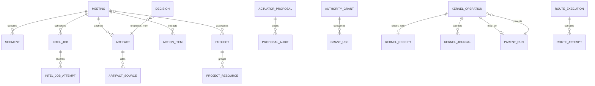

# Domain model

This page names the main records in HoldSpeak and says which table owns each one.
Use it to pick the right term.
The [Data model](DATA_MODEL.md) shows the table layout.
[AUTHORITY.md](AUTHORITY.md) and [SECURITY.md](SECURITY.md) own the rules for control and data protection.

## Terms

| Term | Meaning | Owner |
| --- | --- | --- |
| Meeting | A captured or imported session with a transcript | `meetings` |
| Segment | One timed transcript row of a meeting | `segments` |
| Artifact | A typed result with source links, made by a plugin or run | `artifacts` |
| Decision | A lasting record taken from a decision artifact | `decisions` |
| Action item | A tracked task from a meeting or another source | `action_items` |
| Proposal | An outside effect that waits for review or authority | `actuator_proposals` |
| Follow-through proposal | A task that HoldSpeak extracted and you confirm or dismiss | `follow_through_proposals` |
| Grant | A scoped permission for one kind of effect | `authority_grants` |
| Receipt | Proof that an operation ended | `kernel_receipts` |
| Operation | One bounded unit of runtime work | `kernel_operations` |
| Parent run | An outer run that holds a bounded set of child operations | `kernel_parent_runs` |
| Route attempt | One physical model call | `inference_route_attempts` |
| Project | A context you define, with its meetings and resources | `projects` |
| Desk object | A note, recipe, chain, workflow, workbench, or directory | `notes`, `recipes`, `chains`, `workflows`, `workbenches`, `directories` |

Do not use "job", "run", and "task" as the same word.
`intel_jobs` is the queue of deferred meeting analysis.
`workbench_runs` and `kernel_parent_runs` record runs.
`work_attempts` records what an agent session does in a worktree.
`action_items` are your tasks.
Use the exact table or API name when the difference matters.

## Relationships

```mermaid
erDiagram
  MEETING ||--o{ SEGMENT : contains
  MEETING ||--o{ INTEL_JOB : schedules
  INTEL_JOB ||--o{ INTEL_JOB_ATTEMPT : records
  MEETING ||--o{ ARTIFACT : anchors
  ARTIFACT ||--o{ ARTIFACT_SOURCE : cites
  MEETING ||--o{ ACTION_ITEM : extracts
  MEETING }o--o{ PROJECT : associates
  PROJECT ||--o{ PROJECT_RESOURCE : groups
  DECISION }o--|| ARTIFACT : originates_from
  ACTUATOR_PROPOSAL ||--o{ PROPOSAL_AUDIT : audits
  AUTHORITY_GRANT ||--o{ GRANT_USE : consumes
  KERNEL_OPERATION ||--o| KERNEL_RECEIPT : closes_with
  KERNEL_OPERATION ||--o{ KERNEL_JOURNAL : journals
  KERNEL_OPERATION ||--o| PARENT_RUN : may_be
  PARENT_RUN ||--o{ KERNEL_OPERATION : parents
  ROUTE_EXECUTION ||--o{ ROUTE_ATTEMPT : contains
```

The diagram shows concepts.
Not every line is a SQLite foreign key.
A decision keeps its source ids after you delete the meeting.
A trigger then sets `decisions.source_state` to `source_deleted`.

## Records and life cycle

### Meeting and transcript

`meetings` is the root of a capture or import.
`segments` holds text, speaker, and timing.
`segments_fts` is a search index that triggers keep current.
Tags, bookmarks, topics, and intelligence snapshots are child rows.
`speakers` holds speaker embeddings for recognition across meetings.
Deleting a meeting removes most child rows.

### Deferred meeting analysis

`intel_jobs` is a durable queue.
Each job has an immutable id and content-free hashes.
It records status, claim, lease, retry count, error, and the parent operation.
`intel_job_attempts` is an append-only history of attempts.

### Artifacts, decisions, and action items

An artifact stores a title, a Markdown body, structured JSON, confidence, plugin name and version, and source links.
A decision is `recorded`, `accepted`, `superseded`, or `rejected`.
The `superseded_by` column links decisions in a chain.
A decision survives meeting deletion on purpose.

An action item has a task, owner, due date, status, review state, and source.
`decision_commitments` links an accepted decision to an action item.

### Projects

A project has a purpose, outcome, owner, cadence, and revision.
`meeting_projects` links a meeting to a project with a confidence value.
`project_resources` links resources to a project with a relationship and role.

### Desk objects

Notes, knowledge bases (`kbs`), recipes, chains, workflows, directories, and workbenches are stored rows.
`directories` and `directory_memberships` hold nesting.
Window position is a view state and is not canonical content.
`workbench_items` are `pending`, `claimed`, `done`, `failed`, or `dismissed`.
`workbench_runs` records the summary, the egress boundary, the model, and the parent operation.

### Proposals, grants, and receipts

An actuator proposal moves through `proposed`, `approved`, and then `executed`, `rejected`, or `failed`.
A failed proposal can return to `approved`.
The review decision, authorization state, and execution state are separate columns.
The database layer stores and audits proposals.
It does not run them (`holdspeak/db/actuators.py`).

A grant binds an actor, an operation family, an effect, a destination, data classes, an expiry, and a use limit.
`authority_grant_uses` records each use.
A grant holds no secret and no payload.

Each operation has at most one kernel receipt.
Effect-specific receipts add detail: `desktop_type_receipts`, `delivery_command_receipts`, and `remote_dictation_deliveries`.
They do not replace the kernel receipt.

### Runtime work

[KERNEL.md](KERNEL.md) describes the kernel.
`kernel_journal`, `kernel_receipts`, and `kernel_projection_stages` hold its evidence.
`inference_route_plans`, `inference_route_executions`, and `inference_route_attempts` freeze the model route and record each call.
A successful route execution needs a winning attempt and a result reference.

`work_attempts` is separate from the kernel.
Its states are `starting`, `working`, `waiting`, `idle`, `ended`, `abandoned`, and `unknown`.
It does not prove that an outside effect ran.

### Memory

The `memory_*` tables hold indexed sources, chunks, embeddings, entities, facts, observations, pages, and jobs.
They are derived from your meetings, notes, and decisions.

## Source of truth

| Concern | Owner | Derived view |
| --- | --- | --- |
| Meeting and transcript | `meetings`, `segments` | `segments_fts`, meeting responses |
| Analysis queue | `intel_jobs`, `intel_job_attempts` | Process view |
| Typed result | `artifacts`, `artifact_sources` | Desk and project cards |
| Accepted decision | `decisions` | memory index, Ask |
| Effect proposal | `actuator_proposals` | proposal API |
| Reusable permission | `authority_grants` | authority API |
| Runtime operation | `kernel_operations` | Process view |
| Event history | `kernel_journal` | kernel event stream |
| Terminal evidence | `kernel_receipts` | receipt view |
| Window layout | browser storage | Desk windows |

Rebuild a derived view from its owner rows.
Do not use a Desk layout as proof that a meeting or an effect happened.

## Rules

- Deleting a meeting removes its transcript and most child rows. Decisions stay.
- A proposal change writes an audit row. A review decision alone does not allow an effect.
- A kernel operation has one terminal receipt. A late result cannot change it.
- Append-only triggers protect inference evidence, kernel attestations, queue attempts, and tool-turn history.
- Some tables use `deleted` or `archived` as a state. These states do not erase the row.
