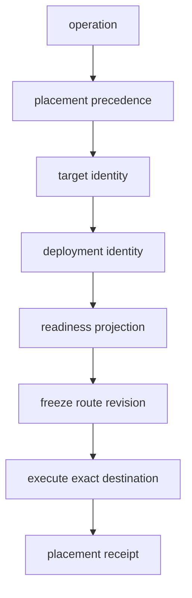

# Execution destinations

This is a source audit at snapshot `675401a857b85336d4acaa8c65383dfc9636e4c8`. A destination names where an admitted operation runs and which boundary it crosses. A target picker or profile row is not proof that a model is ready. No destination was contacted in this audit.

## Destination contract

`holdspeak/inference_targets.py:1-12` defines the additive target contract over the synced `RuntimeProfile`. Target identity is separate from engine and model. Readiness is derived without contacting the target, so the UI can report a state without provoking an inference run. `DeploymentIdentity` at `:98-119` carries destination, kind, engine, model, node, boundary, model path, endpoint, and secret slot as a runtime fact; admission freezes the safe subset as a revision.

The placement authority is `resolve_placement` at `holdspeak/inference_targets.py:562-607`. Its precedence is invocation, Workbench, agent/capability, then the named global default `this_machine`. It returns both the effective target and the tier that won. It does not silently use an arbitrary fallback.

## Current destination kinds

| Destination | Boundary and transport | Readiness and execution behavior |
|---|---|---|
| `this_machine` / on-device | `same_device`, in-process | The local deployment must name a model file. Missing or absent files are unavailable. Execution loads the path frozen by the revision. |
| `local_whisper` | `same_device`, local speech-to-text | The speech plan reserves this for admitted Whisper transcription and preload. Audio remains in the local speech boundary in the capability definition. |
| `local_dictation` | `same_device`, local dictation runtime | Dictation provider stages use the frozen local deployment. A missing model path is a named refusal; mutable meeting config cannot retarget the child. |
| OpenAI-compatible private endpoint | `private_network`, HTTPS | The endpoint must be a valid URL. A required profile key must be present in its own key slot. The target is private by host/IP classification, not by a caller label. |
| OpenAI-compatible external service | `external_service`, HTTPS | The endpoint must be valid and, when required, have its own key. The provider boundary can egress and must be shown in a receipt or owner-facing destination state. |
| paired device / desktop profile | `paired_device`, paired HTTPS | The hub can inspect a paired manifest, but this runner does not construct paired execution. A stale or missing model manifest is named; a frozen paired revision ends in `inference_paired_device_execution_unsupported`. |
| mesh node | `private_mesh`, mesh relay | A node id is required and liveness is checked. Missing or stale worker polling reports an offline target. Execution uses the named mesh node and does not silently become local or cloud. |
| hub default cloud | external cloud leg | This is a separately nameable deployment for a route plan. Historical local-to-cloud behavior cannot claim a local receipt; a cloud leg must be separately frozen and admitted. |

The source mapping is in `holdspeak/inference_targets.py:20-50,243-358,369-486`. The local engine factory pins the frozen local revision and refuses paired execution at `:709-783`; the paired branch has no local fallback.

## Readiness states and failure boundary

`target_from_profile` at `holdspeak/inference_targets.py:369-486` derives states such as `ready`, `unavailable`, `stale_manifest`, `offline`, `unsupported`, and `needs_key`. `resolve_inference_target` at `:507-536` resolves an explicit id or returns an unavailable target by name. It does not retarget an unknown id to the local machine. `target_refusal` and `target_runtime_error` at `:621-637` keep the selected destination attached to the refusal; remote transport or authentication failures name the destination.

Secrets have a presence boundary. `secret_slot` is an identifier for the configured slot; the key value is not part of the target projection. `holdspeak/inference_targets.py:70-87` checks the profile's own key slot. The model library boundary at `holdspeak/mcp/families/model_library.py:1-4,108-139,208-251` keeps secret values at provider dispatch. The integration assertion at `tests/integration/test_model_library_secret_boundary.py:65-101` requires secrets to be absent from JSON, errors, logs, receipts, and assignment heads.

## Route and receipt boundary

A destination does not choose fallback. Assignment records are configuration; the route plan freezes ordered deployment revisions; the fallback controller reserves the next legal child. `holdspeak/services/inference_route_plan_service.py:405-496` freezes the route, while the legacy one-leg adapter at `:729-790` provides a compatibility boundary. `holdspeak/services/inference_fallback_controller.py:161-185` reserves only from frozen evidence, and `:244-307` classifies fallback without accepting a caller-selected leg.

The actual placement is recorded with the run. `DeploymentIdentity.placement_receipt` at `holdspeak/inference_targets.py:184-224` makes the boundary visible, including the special paired-then-external description if such a provider route is represented. A receipt must identify the destination that ran. A same-device child cannot become cloud inside one engine call; cloud is a separate destination and route leg.

## Evidence assertions to inspect

`tests/unit/test_inference_targets.py:44-83` asserts destination kind is independent from engine and model. Local readiness without a model file is asserted at `:83-107`; own-key isolation at `:196-216`; unknown target refusal at `:219-225`; target projection excludes secret and profile alias fields at `:227-280`; placement precedence at `:283-308`; doctor state and reason at `:312-325`; dead endpoint refusal and alternate suggestion at `:328-362`.

The route tests assert pure resolution and no private material (`tests/unit/test_phase143_inference_route_plans.py:98-145`), frozen plans surviving assignment mutation (`:173-197`), legacy projection excluding locator, endpoint, and secret (`:337-363`), and one-shot freeze without physical ordinals before reservation (`:384-426`). These are not run in this lane.

## Current gaps and bounded unknowns

* The source can derive readiness from local configuration, but it does not establish that a destination will remain ready when an owner starts a run.
* The paired-device target is representable and inspectable but execution is intentionally unsupported in this runner.
* A private endpoint classification indicates a network boundary; it does not verify server identity or the owner's policy for that server.
* Receipts carry placement facts and secret presence, but no desk shot was captured to verify how every surface displays egress.
* No model, private endpoint, paired device, mesh node, or cloud service was contacted.
