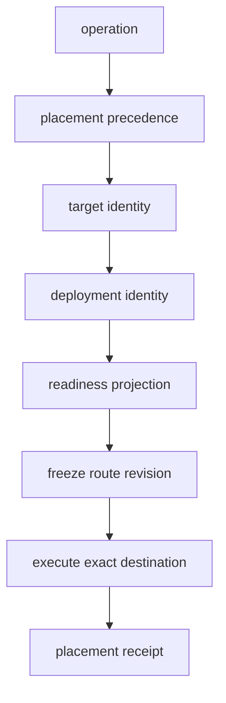

# Execution destinations

A destination is where an operation runs and which boundary it crosses. Contributors use this page. Users: see [Inference targets](INFERENCE_TARGETS.md). The code is in `holdspeak/inference_targets.py`.

## Flow

```mermaid
flowchart TD
    A[operation] --> B[placement precedence]
    B --> C[target identity]
    C --> D[deployment identity]
    D --> E[readiness projection]
    E --> F[freeze route revision]
    F --> G[execute exact destination]
    G --> H[placement receipt]
```

- A target is separate from the engine and the model. It is a view over the synced `RuntimeProfile`.
- Readiness comes from configuration. HoldSpeak does not contact the target to find it.
- `DeploymentIdentity` holds the destination, kind, engine, model, node, boundary, model path, endpoint, and secret slot. Admission freezes the safe fields as a revision.
- `resolve_placement` picks the target. The order is invocation, Workbench, agent or capability, then the global default `this_machine`. It returns the target and the tier that won. It never picks a hidden fallback.

## Destination kinds

| Destination | Boundary | Behavior |
|---|---|---|
| `this_machine` | `same_device`, in-process | The deployment must name a model file. A missing file makes it unavailable. Execution loads the frozen path. A frozen revision with no path ends in `inference_local_deployment_model_unknown`. |
| OpenAI-compatible private endpoint | `private_network` | The endpoint must be a valid HTTP or HTTPS URL. A required key must be in the profile's own key slot. Host or IP class decides that it is private. |
| OpenAI-compatible external service | `external_service` | The same checks apply. Data leaves your network, so a receipt must show it. |
| paired device | `paired_device`, HTTPS | The hub can read a paired manifest. Execution is not built: a frozen paired revision ends in `inference_paired_device_execution_unsupported`. |
| mesh node | `private_mesh` | A node id is required. A node with no worker polling is offline. Execution never falls back to local or cloud. |
| hub default cloud | external cloud leg | A route plan names it as its own deployment. A cloud leg cannot claim a local receipt. |

## Readiness and refusals

`target_from_profile` derives `ready`, `unavailable`, `stale_manifest`, `offline`, `unsupported`, or `needs_key`. `resolve_inference_target` returns an unavailable target for an unknown id. It never retargets to the local machine. `target_refusal` and `target_runtime_error` keep the chosen destination in the message.

A key never appears in a target. `secret_slot` only names the slot. `holdspeak/mcp/families/model_library.py` keeps key values at provider dispatch. They stay out of JSON, errors, logs, receipts, and assignment heads.

## Routes, fallback, and receipts

An assignment is configuration. At run start, `holdspeak/services/inference_route_plan_service.py` freezes the ordered deployment revisions. `holdspeak/services/inference_fallback_controller.py` reserves the next child only from that frozen plan. A caller cannot choose the next leg.

`InferenceTarget.placement_receipt` records where the run happened. A same-device child never becomes cloud inside one engine call. Cloud is a separate destination and a separate route leg.

## Limits

- Readiness at check time does not promise readiness at run time.
- A private-endpoint label shows a network class. It does not prove the server identity.

## Tests

`tests/unit/test_inference_targets.py`, `tests/unit/test_phase143_inference_route_plans.py`, and `tests/integration/test_model_library_secret_boundary.py` cover these rules.
