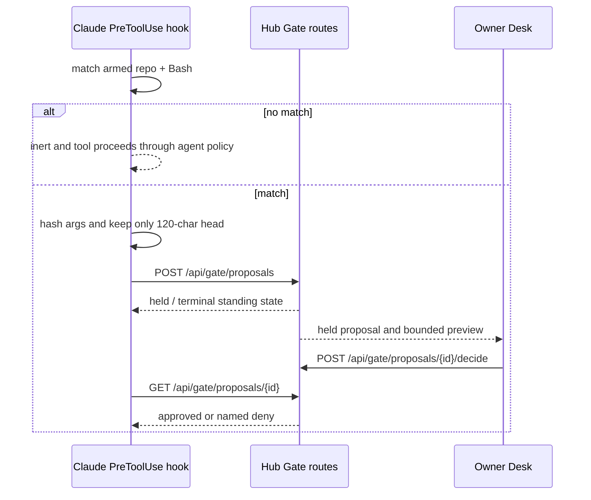

# Coder Gate

The Gate holds matched Coder tool calls for an owner decision. Source audit at
`675401a857b85336d4acaa8c65383dfc9636e4c8`; no hook or live hub was run here.

## Double opt-in and fast path

`~/.holdspeak/gate.json` has `gate_schema: 1`, a master `armed` flag, and a
resolved repository-to-tool map. The current default tool family is `Bash`;
the default TTL is 240 seconds and the hook timeout is 300 seconds
(`holdspeak/coder_gate.py::GateConfig`, `::gate_matches`, lines 45-130).
Missing or malformed configuration means OFF. The hook installation command
prints a block for the owner to add to Claude Code settings; it does not edit
`~/.claude` (`install_block`, lines 647 onward).

When the gate is not armed for the current `cwd` and tool, `run_hook` returns
an inert `HookDecision(deny=None)`. It creates no proposal, audit row, network
request or latency beyond local path matching. This is the ordinary case.

## Held proposal lifecycle

When both opt-ins match, `run_hook` mints one proposal id from Claude Code's
`tool_use_id` (or a UUID), computes the argument SHA-256 and 120-character
head, and POSTs that bounded payload to `POST /api/gate/proposals`. It
polls `GET /api/gate/proposals/{proposal_id}` until approval, denial, expiry or
invalidation (`holdspeak/coder_gate.py::run_hook`, lines 273-377).

`GateProposalRepository.propose` is idempotent: same id and same hash return
the standing row; the same id with a different hash invalidates the held
original and raises `GateArgsMismatchError` (`holdspeak/db/gate.py::propose`,
lines 115-205). Every state flip goes through `_transition`, guarded on
`state = held`, so the first racing decision wins and every transition writes
`gate_audit` (`_transition`, lines 209-249). Legal states are `held`,
`approved`, `denied`, `expired`, and `invalidated`; only `held` is non-terminal.

Expiry is a deny. Hub restart invalidates every held row through
`invalidate_all_held`; it never resumes an old hold. The hook names failures:
authentication unavailable, hub unreachable, HTTP refusal, mid-hold silence,
decision refusal and expiry. There is no timeout auto-allow.

## Served API and receipts

`holdspeak/web/routes/system/gate_routes.py::build_gate_router` serves:

| Operation | Route |
|---|---|
| propose/read/list | `POST /api/gate/proposals`, `GET /api/gate/proposals/{proposal_id}`, `GET /api/gate/proposals` |
| decide/receipt | `POST /api/gate/proposals/{proposal_id}/decide`, `POST /api/gate/proposals/{proposal_id}/receipt` |
| usage/audit/config | `POST /api/gate/usage`, `GET /api/sessions/{session_key}/receipt`, `GET /api/gate/audit`, `GET /api/gate/config` |
| agent principal | `POST /api/principals/agents`, `DELETE /api/principals/agents/{identity}`, `DELETE /api/principals/self` |

The route roster is pinned in [`api-surface.json`](api-surface.json)
under `web.routes.system.gate_routes`. A gate row is a record, not authority;
the waiting hook is the process that can proceed after approval. The hook
credential is issued per `claude:{session_id}`, cached with mode 0600, and
revoked at session end (`issue_agent_credential` and `revoke_agent_credential`,
`holdspeak/coder_gate.py`, lines 150-228). The preview is truncation, not secret redaction. A short tool input can fit
entirely in its first 120 characters. A credential included in that prefix can
reach the hub and its retained Gate record. The hash does not conceal the prefix.
Provider credentials held separately by the hub are a different boundary.

## Verification evidence

`tests/unit/test_coder_gate.py` checks the state machine, replay, mismatch
revocation, expiry, restart invalidation, redaction, double opt-in, inert
fast path and route round trip. `tests/integration/test_gate_threat_model.py`
checks restart mid-hold, decided replay, TOCTOU argument swaps and unarmed
latency. `tests/unit/test_gate_chokepoint.py` checks that state transitions
have one chokepoint and that full payload fields are absent. These assertions
were inspected and remain `not_run` in the Philo metadata.

## Gate authoring constraints

An extension to Gate must define its preview data boundary, one idempotency key,
first-write-wins transitions, named terminal states, restart invalidation and
fail-closed behavior. A new tool matcher is a reviewed policy change. A
successful green unit test would still not prove an owner has armed the gate,
authenticated a Coder session, or approved a real call.
