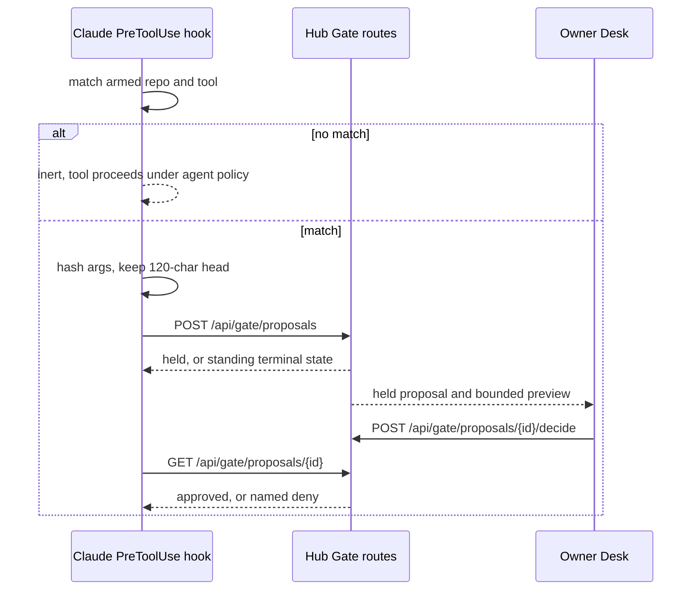

# Coder Gate

The Gate holds a matched Claude Code tool call until you decide on it. A call that
the Gate does not match runs as normal.

## Turn the Gate on

The Gate needs two opt-ins. Both must be on for a call to be held.

1. Print the hook block and add it to `~/.claude/settings.json` yourself:

   ```console
   holdspeak gate install
   ```

   HoldSpeak never edits another application's config.

2. Turn on the master switch:

   ```console
   holdspeak gate arm
   ```

3. Choose the repos to hold. The default tool is `Bash`. Repeat `--tool` for more:

   ```console
   holdspeak gate allow --repo /path/to/repo
   holdspeak gate allow --repo /path/to/repo --tool Bash --tool Edit
   ```

Other commands:

| Command | Effect |
| --- | --- |
| `holdspeak gate status` | Shows both opt-ins. Add `--json` for JSON. |
| `holdspeak gate revoke --repo PATH` | Stops holding that repo. |
| `holdspeak gate disarm` | Turns the master switch off. Every hook call is inert. |

The settings are in `~/.holdspeak/gate.json` (`gate_schema: 1`, the `armed` flag,
and a repo-to-tools map). A missing or malformed file means the Gate is off.

## What happens to a call

When the Gate is not armed for the current `cwd` and tool, the hook returns at
once. It creates no proposal, no audit row, and no network request. This is the
normal case.

When both opt-ins match, the hook does these steps:

1. It takes the proposal ID from the Claude Code `tool_use_id`, or makes a UUID.
2. It computes the SHA-256 of the arguments and keeps the first 120 characters.
3. It sends only that bounded data to `POST /api/gate/proposals`.
4. It polls `GET /api/gate/proposals/{proposal_id}` until the proposal is
   approved, denied, expired, or invalidated.

You decide on the Desk. The decision goes to
`POST /api/gate/proposals/{proposal_id}/decide`.


```mermaid
sequenceDiagram
    participant A as Claude PreToolUse hook
    participant H as Hub Gate routes
    participant O as Owner Desk
    A->>A: match armed repo and tool
    alt no match
        A-->>A: inert, tool proceeds under agent policy
    else match
        A->>A: hash args, keep 120-char head
        A->>H: POST /api/gate/proposals
        H-->>A: held, or standing terminal state
        H-->>O: held proposal and bounded preview
        O->>H: POST /api/gate/proposals/{id}/decide
        A->>H: GET /api/gate/proposals/{id}
        H-->>A: approved, or named deny
    end
```

The default hold time (TTL) is 240 seconds. `HOLDSPEAK_GATE_TTL` overrides it.
The hook timeout is 300 seconds. The hook reaches the hub at `HOLDSPEAK_HUB_URL`
(default `http://127.0.0.1:8765`).

## States

A proposal is `held`, `approved`, `denied`, `expired`, or `invalidated`. Only
`held` is not final.

- A proposal with the same ID and the same hash returns the standing row. The
  same ID with a different hash invalidates the held original and raises
  `GateArgsMismatchError` (`holdspeak/db/gate.py`).
- Every change goes through one transition method, guarded on `state = held`. The
  first decision wins. Each change writes a `gate_audit` row.
- Expiry is a deny.
- A hub restart invalidates every held proposal. HoldSpeak never resumes an old
  hold.
- The hook names each failure: no authentication, hub unreachable, HTTP refusal,
  silence while held, decision refusal, or expiry. There is no auto-allow on
  timeout.

## Preview and credentials

The preview is truncation. It is not secret removal. A short tool input can fit in
the first 120 characters. A credential in that prefix reaches the hub and the
stored Gate record. The hash does not hide the prefix. Treat the preview as
sensitive tool content. Provider keys that the hub holds are a different
boundary.

The hook credential is issued per `claude:{session_id}`, cached with mode `0600`,
and revoked when the session ends (`holdspeak/coder_gate.py`). The Stop hook
reports token totals and the model name to the loopback hub. It sends no message
text.

A Gate row is a record, not authority. Only the waiting hook can proceed after
approval.

## Routes

`holdspeak/web/routes/system/gate_routes.py` serves these routes.

| Operation | Route |
|---|---|
| Propose, read, list | `POST /api/gate/proposals`, `GET /api/gate/proposals/{proposal_id}`, `GET /api/gate/proposals` |
| Decide, receipt | `POST /api/gate/proposals/{proposal_id}/decide`, `POST /api/gate/proposals/{proposal_id}/receipt` |
| Usage, audit, config | `POST /api/gate/usage`, `GET /api/sessions/{session_key}/receipt`, `GET /api/gate/audit`, `GET /api/gate/config` |
| Agent principal | `POST /api/principals/agents`, `DELETE /api/principals/agents/{identity}`, `DELETE /api/principals/self` |

[`api-surface.json`](api-surface.json) pins the route list under
`web.routes.system.gate_routes`.

## Changing the Gate

A change to the Gate must define its preview data limit, one idempotency key,
first-write-wins transitions, named final states, restart invalidation, and
fail-closed behavior. A new tool matcher is a reviewed policy change. A passing
unit test does not show that you armed the Gate or approved a real call. These
tests cover the Gate: `tests/unit/test_coder_gate.py`,
`tests/integration/test_gate_threat_model.py`, and
`tests/unit/test_gate_chokepoint.py`.
