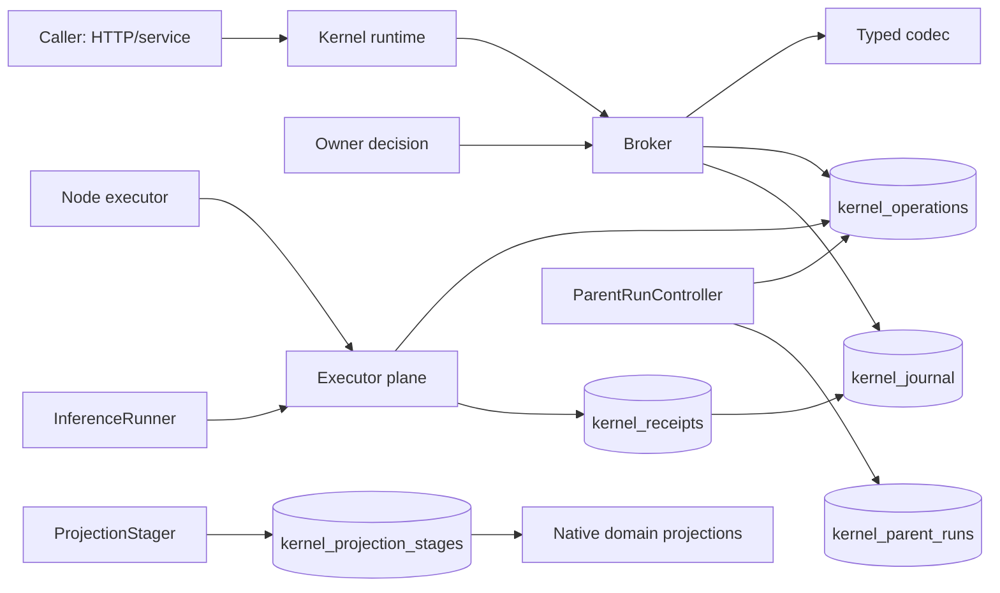
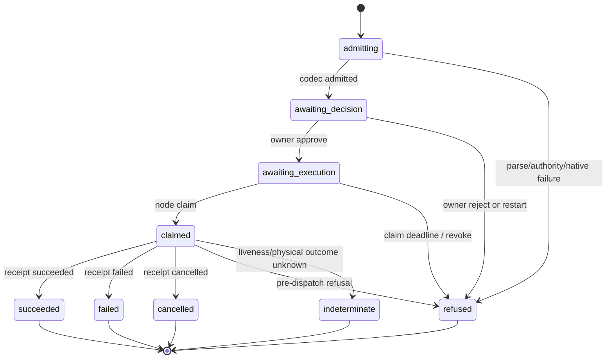

# Kernel and operation runtime

This document reconstructs the runtime operation spine from source at research
snapshot `675401a857b85336d4acaa8c65383dfc9636e4c8` (merged 2026-09-19). The
working branch is `docs/holdspeak-philo`; the current source tree was checked
against that snapshot and no product source drift was found. The document is a
description of executable code. It is not a proposal for a new kernel.

The word *kernel* names a HoldSpeak package, `holdspeak/kernel`, with a public
caller plane (`read`, `submit`, `decide`, `events`) and executor plane (`claim`,
`receipt`, `reconcile`) [holdspeak/kernel/__init__.py:1-9]. It is a durable
operation coordinator and audit journal. It is not an operating-system kernel,
general scheduler, or content store.

## 1. Definition

An operation is a typed, content-bounded request admitted by a trusted-startup
registry. `Broker.submit` parses the request, finds its registered codec,
applies authority and hard prerequisites, creates a durable operation row, and
returns a state or terminal refusal [holdspeak/kernel/broker.py:69-137]. The
operation is the kernel's unit of identity, state, placement, authority,
causality, and terminal evidence.

The kernel has two related runtime forms:

* A broker operation is a single admitted unit. It has `operation_id`, request
  and idempotency keys, operation name/version, principal, target, placement,
  payload hash, parent/correlation ids, revision, and state.
* A parent run is a durable outer graph shell for sequence, workflow,
  workbench, meeting, dictation, wake, tool-turn, and other registered run
  kinds. It owns an execution epoch, child budget, active child, deadline,
  lease, and publication claim [holdspeak/db/schema.py:3253-3277].

The parent is not a second receipt system. A physical model attempt is an
`inference.invoke@1` child with its own admission, claim, dispatch context, and
receipt. A fallback is a new child, with a new operation id and receipt.

## 2. Responsibilities

The runtime owns:

1. typed admission and a private operation registry;
2. authenticated principal and capability checks;
3. exact target and placement binding;
4. idempotent durable operation identity;
5. parent/child correlation and live parent authority;
6. append-only journal records with a per-stream SHA-256 chain;
7. single-winner execution claim and signed, single-use warrants;
8. terminal state and immutable receipt election;
9. liveness reaping, parent lease recovery, and projection recovery ordering;
10. process projections that omit domain content.

The database schema makes the separation explicit: domain content remains in
native tables, while `kernel_operations`, `kernel_receipts`,
`kernel_journal`, and projection stages carry runtime facts
[holdspeak/db/schema.py:2118-2219].

## 3. Explicit non-responsibilities

The kernel does not transcribe audio or choose the business meaning of a
meeting artifact. Codecs call the relevant services. Kernel-owned parent
snapshots can retain input content; do not classify all kernel tables as
content-free. Codecs validate operation-specific shape and delegate
the native work to their service or executor. The journal rejects audio,
PCM, token, and token-stream keys recursively [holdspeak/kernel/model.py:9-13,
65-73]. `Process` is a read projection; the HTTP routes do not expose a
kernel start loop or a general operation registration API
[holdspeak/kernel/runtime.py:210-224].

The kernel is cooperating code, not an OS sandbox. A same-user process can
still launch Python or open sockets; the production desktop effect path uses a
separate validating child, but untrusted plugins need an OS isolation boundary
that this package does not provide. See the existing [security contract](SECURITY.md)
and [authority contract](AUTHORITY.md), which remain authoritative for product
security and control-mode wording.

## 4. Component diagram

The broker supplies admission and authority. The executor plane is a separate
surface that only a node principal may claim, receipt, or reconcile. The parent
controller provides durable graph state and lease recovery. Projection staging
makes a result visible only after its terminal receipt is durable.

## 5. Data structures

`OperationRequest` contains only request schema, request/idempotency keys,
operation name/version, target, placement, argument mapping, subject refs, and
an optional parent operation id [holdspeak/kernel/model.py:25-37]. The generic
`Admission` adds target, placement, payload hash, refs, a bounded journal head,
TTL, and native id [holdspeak/kernel/model.py:39-48].

`kernel_operations` stores the admitted envelope metadata and mutable scheduler
state. Its state check is the executable vocabulary: `admitting`,
`awaiting_decision`, `awaiting_execution`, `claimed`, `succeeded`, `failed`,
`refused`, `cancelled`, and `indeterminate`
[holdspeak/db/schema.py:2123-2152]. `kernel_receipts` has one row per operation,
with terminal state, outcome, result reference, and creation time. Inference
also receives an immutable HMAC attestation [holdspeak/db/schema.py:2156-2177].

The journal event contains stream and sequence identity, operation/process and
causation ids, event type/version, safe refs, privacy class, head, timestamp,
previous hash, and record hash [holdspeak/db/schema.py:2179-2199]. It does not
contain domain bodies.

## 6. State machine

The normal operation path is:

The state transition is a revision compare-and-swap. Only the allow-listed
decision, warrant, revocation, and claimant fields can be changed by the
transition helper [holdspeak/kernel/publication_transition.py:12-50]. The
terminal set is fixed in `model.py:9-9`; there is no return from a terminal
state.

Parent runs use a separate state machine: `OPEN -> CANCELLING -> CANCELLED`
or another terminal state (`SUCCEEDED`, `FAILED`, `REFUSED`,
`INDETERMINATE`). A parent can reserve one active child at a time within its
child budget. It advances only when the exact epoch, planned node, and child id
match the checkpoint compare-and-swap [holdspeak/kernel/parent_checkpoint.py:21-51].

## 7. Event and journal semantics

Admission emits `operation.admitted`; approval emits `operation.approved`;
claim emits `operation.claimed`; terminalization emits
`operation.receipt`. Refusals emit `operation.refused` followed by the receipt
event [holdspeak/kernel/broker.py:118-137; holdspeak/kernel/executor.py:145-156].
The journal appends under a process lock and allocates a stream sequence inside
the SQLite transaction. Verification starts at `sha256:genesis` and rejects a
previous-hash or record-hash mismatch [holdspeak/kernel/journal.py:60-84].

`events(after_cursor, filters)` returns a cursor and at most 500 records. Agent
events require an operation id owned by that agent; anonymous callers are
refused [holdspeak/kernel/broker.py:286-293]. Repeating the same cursor query
is a replay of durable rows, not a new event.

## 8. Work identity and correlation

`operation_id` is generated by the broker as `op_<uuid>`. Idempotency is keyed
by `(principal_identity, idempotency_key)`. A repeated identical envelope returns
the existing row; a different envelope with the same key is refused as
`idempotency_payload_mismatch` [holdspeak/kernel/broker.py:69-105;
holdspeak/kernel/journal.py:127-155]. `native_id` points to the native proposal,
command, invocation, or run. `target_ref` and `placement` are admitted once and
included in the warrant.

`correlation_id` identifies the causal chain. `parent_operation_id` identifies
the immediate parent. The causality resolver requires a live claimed parent,
valid warrant, unexpired execution deadline, and either the same principal or a
continuation identity explicitly named by an owner warrant
[holdspeak/kernel/causation.py:10-43].

## 9. Parent-child relationships

Parent runs persist their input snapshot, definition ref/revision, deadline,
child budget, child list, and currently planned child. Trusted child admission
locks and checks the parent, rejects a publication claim, verifies a live
parent warrant, adds the child to the list, and records the active child
[holdspeak/kernel/trusted_child.py:21-101].

Inference is intentionally one physical child per provider attempt. The
inference runner freezes the deployment revision and definition origin before
admission. A model fallback or compatibility retry reserves and admits another
child; it does not mutate or hide the first receipt. The route schema also
records physical attempt ordinals and terminal disposition
[holdspeak/db/schema.py:3060-3151].

## 10. Persistence

The kernel uses the application's SQLite database and its WAL connection
protocol. The durable rows are the operation, parent, warrant, journal,
receipt, inference attestation, projection stage, and native receipt tables.
The HMAC warrant secret is generated once per database in `kernel_meta`; a
warrant signs operation id, envelope hash, target, placement, policy version,
principal, parent, expiry, and use count [holdspeak/kernel/journal.py:38-58,
499-508].

Domain repositories own their records. Generic inference receipts retain
references and hashes rather than model bodies, but `kernel_parent_runs.input_json`
serializes the caller's input snapshot (`parent_run.py:105-106`). The Sequence
service supplies its request body (`sequence_workflow_service.py:322-328`).
The key filter rejects named audio/PCM/token fields, not arbitrary prompt or
transcript strings. A content-free inference journal test does not prove that
all kernel-owned storage is content-free.

## 11. Restart and recovery

Startup creates one broker per database, registers codecs and projection
materializers, then calls parent reconciliation, inference route recovery and
projection recovery, in that order (`runtime.py:173-175`). Projection recovery
itself starts by reaping expired operations (`projection_stager.py:343-346`).
This does not establish liveness reaping before route recovery. The separate
`reap_and_recover_projections` helper reconciles parents, reaps and then
recovers projections (`broker.py:275-284`). Keep the two entry paths distinct.

Operations in `admitting` or `awaiting_decision` that were invalidated during a
hub restart are terminalized as `indeterminate` with
`hub_restart_during_decision` [holdspeak/kernel/broker.py:24-35]. An approved
operation in `awaiting_execution` remains claimable after a restart if its
warrant is still valid. A claimed operation with an expired execution deadline
becomes `indeterminate`; it is never silently retried.

Parent leases heartbeat every ten seconds and become stale after 90 seconds.
Recovery closes stale shells as indeterminate, finalizes an active projection
stage when possible, and uses a stale-process predicate so a live process cannot
be closed by a recovery process [holdspeak/kernel/parent_run.py:57-87,
323-350]. Mesh worker reservations use the same rule: a crash residue becomes
indeterminate and is not rerun under the same authority
[holdspeak/db/schema.py:1564-1581].

## 12. Cancellation

Parent cancellation takes an immediate write lock, changes `OPEN` to
`CANCELLING`, increments the execution epoch, clears the active child, and
revokes the warrant. The provider cancellation signal can run asynchronously;
the durable cancellation election happens before it is sent
[holdspeak/kernel/parent_terminal.py:20-69]. A publication claim may delay the
request for up to five seconds; if it remains active, callers receive a named
`parent_publication_in_progress` refusal and must retry.

Inference cancellation has an in-process fence. A cancellation that wins before
publication prevents the result from being published. If the physical provider
outcome cannot be known after dispatch intent, the child closes as
`indeterminate`; a late provider result cannot overwrite the receipt. Receipt
persistence failure is surfaced as `CLOSURE_FAILED`, and no result is published
after an unrecorded terminal decision [holdspeak/kernel/inference_runner.py:819-845].

## 13. Failure semantics

Failures before a physical dispatch are named refusals where the runner proves
that no provider was reached. Provider failures after a dispatch are failed
when the provider returns a failure. A timeout, lost process, or cancellation
after dispatch intent can be physically unknowable, so the outcome is
`indeterminate` with a disposition such as `physical_outcome_unknown`.

The liveness reaper makes the same distinction: an unclaimed approved warrant
becomes `refused` with `execution_claim_expired`; a claimed silent operation
becomes `indeterminate` with `execution_liveness_expired`
[holdspeak/kernel/liveness.py:9-61]. Every non-success path still has a receipt.

## 14. Unknown-state semantics

`indeterminate` means HoldSpeak cannot prove that the effect did not happen. It
is terminal and is not retryable under the same operation authority. The
delivery command projection also has domain states `unknown` and
`indeterminate_after_node_reset`, mapped to the generic process state `unknown`
[holdspeak/kernel/process_input.py:169-189]. This is deliberately different
from `failed`, which means the executor reported failure.

## 15. Approval interaction

Admission and approval are separate. A submitted effect normally reaches
`awaiting_decision`; only an owner with `decide` authority, a valid live parent,
or a narrowly validated internal service/scheduler path may decide it
[holdspeak/kernel/broker.py:183-225]. Approval creates a signed warrant and
moves the row to `awaiting_execution`; it does not claim or execute work.

Actuator proposals add a second domain record with independent
`review_decision`, `authorization_state`, and `execution_state` axes. The
existing [authority contract](AUTHORITY.md) defines the product's Secure,
Normal, and YOLO behavior. This kernel document records the runtime fact that
the approved operation and its warrant are immutable inputs to execution.

## 16. Destination interaction

The codec resolves and freezes the destination before approval. For
`inference.invoke@1`, authorization resolves a deployment revision, assigns a
`node:<executor>` placement, records the egress boundary ref, and hashes the
execution material [holdspeak/kernel/inference_invoke.py:65-113]. At claim, the
executor checks the child warrant, payload hash, expiry, revocation, and every
live ancestor before it mints a one-use claim witness
[holdspeak/kernel/executor.py:26-87].

The destination is therefore evidence, not a mutable lookup performed after
approval. A changed profile or endpoint creates a new revision and a new
operation attempt.

## 17. Receipt relationship

`kernel_receipts` is the terminal truth for one operation. The receipt is
inserted in the same transaction that advances the claimed operation state
[holdspeak/kernel/journal.py:372-421]. A second receipt request with different
outcome or result reference is refused as `receipt_immutable`; an identical
request returns the stored row [holdspeak/kernel/executor.py:89-128].

Inference receipts include an HMAC attestation binding receipt id, operation,
state/outcome, result reference, native id, envelope hash, destination,
placement, policy, principal, parent, warrant signature, runner signal, and
send phase [holdspeak/kernel/journal.py:465-493]. Projection staging then
publishes the native domain result only after that receipt is durable.

## 18. Public and internal APIs

The public Python API is exactly `read`, `submit`, `decide`, `events`, `claim`,
`receipt`, and `reconcile` [holdspeak/kernel/__init__.py:1-9]. The HTTP transport
maps these to `/api/kernel/read`, `/submit`, `/operations/{id}/decide`,
`/events`, `/executor/claim`, `/executor/operations/{id}/receipt`, and
`/reconcile` [holdspeak/web/routes/system/kernel_routes.py:21-121].

The request body cannot set principal, authority, control mode, effect class,
data classes, or policy version [holdspeak/kernel/admission.py:11-47]. The
HTTP decision route rejects payload, target, and placement mutation
[holdspeak/web/routes/system/kernel_routes.py:44-70]. Codec registration,
broker construction, claim witness minting, parent contexts, and dispatch
contexts are internal startup seams.

## 19. Security implications

Authentication, declared capability, codec prerequisites, and interruption
policy are recorded as four admission layers. Agent submission is scoped to its
identity; only nodes claim and receipt; owner decision is checked separately.
Principal roles and rights are implemented in `principals.py:20-59`, and edge
route rights are centralized at `principals.py:283-336`.

The journal is content-restricted and hash chained. Warrants are signed and
single-use. Parent/child scope prevents a child from manufacturing owner
authority. These are runtime controls; they do not replace the broader data,
compute, secret, or audit boundaries in [docs/SECURITY.md](SECURITY.md).

## 20. Extension guidance

To add a runtime operation, add a typed codec with explicit `validate`,
`authorize`, `admit`, native read/process projection, terminal semantics, and
bounded arguments. Register it only in trusted startup wiring
`holdspeak/kernel/runtime.py:53-120`, define its state and receipt behavior in
SQLite, and add refusal and terminal tests. Do not put content in operation
arguments that can reach the journal, accept client-supplied authority fields,
or make a generic executor import a native driver.

Parent extensions must add a closed `kind` to the canonical schema and use the
parent controller's epoch, child budget, lease, checkpoint, cancellation, and
publication fence. Physical inference extensions must create one child per
provider attempt and retain a receipt for every attempt. If an extension needs
an OS effect, document its process boundary and destination contract alongside
the codec.

## 21. Tests proving each invariant

The following tests were read at the snapshot; this lane did not run them. They
are evidence references, not claims of a green run.

| Invariant | Inspected assertion | Test |
| --- | --- | --- |
| Public seven-call API and four admission layers | exact `kernel.__all__`; layer tuple and operation basis | `tests/unit/test_kernel_broker.py:66-93` |
| Content never enters journal | refusal receipt is `journal_content_forbidden`; event rendering omits body | `tests/unit/test_kernel_broker.py:96-112` |
| Hash chain detects tamper | named `journal_record_hash_mismatch`, then verifies green after repair | `tests/unit/test_kernel_broker.py:115-138` |
| Owner-only decision and immutable envelope | agent refusal; HTTP returns `admitted_envelope_immutable` | `tests/unit/test_kernel_broker.py:142-166` |
| Expiry, revocation, and liveness | claim refusal; unclaimed becomes refused; claimed silence becomes indeterminate | `tests/unit/test_kernel_broker.py:172-238` |
| Exact claimant and immutable receipt | non-claimant refusal; duplicate receipt replay; changed receipt refused | `tests/unit/test_kernel_broker.py:241-289` |
| Real restart recovery and cursor replay | SIGKILL, identical event replay, pending decision becomes `hub_restart_during_decision` | `tests/integration/test_kernel_real_hub.py:49-234` |
| One receipt per physical inference and safe fallback | separate operation ids/receipts for fallback; no prompt/output/audio in journal | `tests/unit/test_inference_runner.py:64-70,178-192,475-485` |
| Cancellation fence and unknown outcome | cancellation blocks publication; hung provider closes indeterminate | `tests/unit/test_inference_runner.py:219-243,619-635` |
| Actuator approve/execute/refuse/restart behavior | exact claim, receipt, connector failure, rejection, and restart assertions | `tests/unit/test_actuator_kernel.py:67-199` |

No full suite or kernel tests were run for this documentation lane. The focused
validation for this work is the documentation navigation checker reported by
the lane owner.

## Verification limits

The source proves the broker, journal, parent, inference, actuator, and
projection seams above. It does not prove that every domain subsystem uses the
same parent-run mechanism; several native queues and projection services retain
their own state machines. It also does not prove operating-system isolation
against arbitrary same-user code. Platform readiness and owner use remain
unverified in this snapshot.
