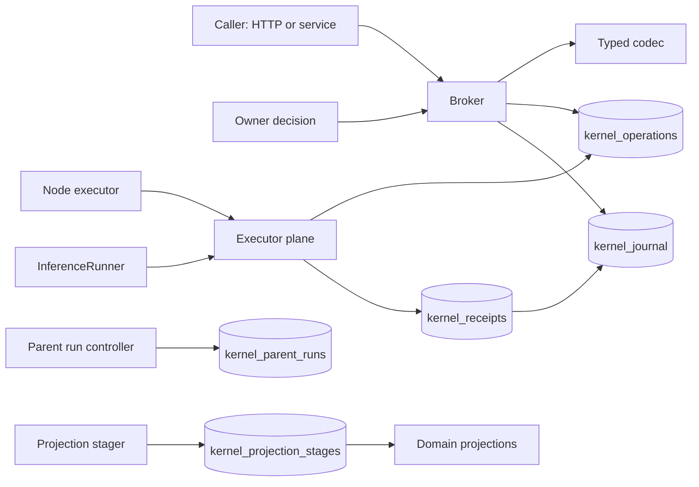
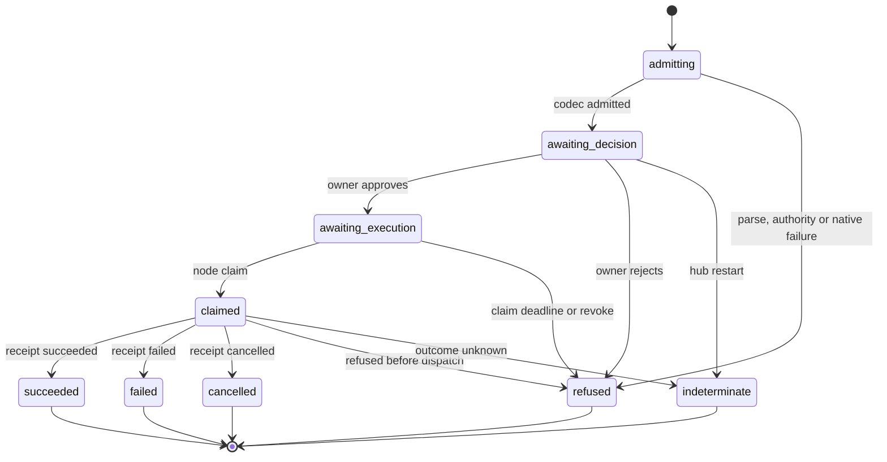

# Kernel and operation runtime

The kernel is the Python package `holdspeak/kernel`. It admits typed
operations, records who may run them, and keeps one terminal receipt for each.
It is a durable operation coordinator and audit journal. It is not an
operating-system kernel, a general scheduler, or a content store.

Read this document if you add an operation, debug a refused or stuck
operation, or review how HoldSpeak records outcomes. For the product rules on
Secure, Normal and YOLO, read [Authority](AUTHORITY.md). For egress, read
[Security](SECURITY.md).

## What the kernel owns

- Typed admission through a private registry of codecs.
- Principal and capability checks.
- Exact target and placement binding.
- Idempotent operation identity.
- Parent and child correlation.
- An append-only journal with a per-stream SHA-256 hash chain.
- A single-winner execution claim and signed, single-use warrants.
- One immutable terminal receipt for each operation.
- Recovery after a crash or a hub restart.
- Process projections that carry no domain content.

Domain content stays in the native tables. The tables `kernel_operations`,
`kernel_receipts`, `kernel_journal`, `kernel_parent_runs` and
`kernel_projection_stages` hold runtime facts.

The kernel does not transcribe audio. It does not decide what a Meeting
artifact means. A codec validates the request and calls the service that does
the work. The kernel is cooperating code, not a sandbox. A same-user process
can still open sockets. An untrusted plugin needs an operating-system
boundary that this package does not give.

## Parts

```mermaid
flowchart LR
  C[Caller: HTTP or service] --> B[Broker]
  B --> V[Typed codec]
  B --> O[(kernel_operations)]
  B --> J[(kernel_journal)]
  D[Owner decision] --> B
  X[Node executor] --> E[Executor plane]
  E --> O
  E --> Q[(kernel_receipts)]
  Q --> J
  P[Parent run controller] --> PR[(kernel_parent_runs)]
  S[Projection stager] --> PS[(kernel_projection_stages)]
  PS --> N[Domain projections]
  W[InferenceRunner] --> E
```

- The broker admits requests and applies authority.
- The executor plane lets only a node principal claim, receipt or reconcile.
- The parent run controller keeps durable graph state and lease recovery.
- The projection stager makes a result visible only after its receipt is
  durable.

## Public calls

The public Python API is seven functions in `holdspeak/kernel/__init__.py`.

| Plane | Call | HTTP route |
| --- | --- | --- |
| Caller | `read` | `GET /api/kernel/read` |
| Caller | `submit` | `POST /api/kernel/submit` |
| Caller | `decide` | `POST /api/kernel/operations/{id}/decide` |
| Caller | `events` | `GET /api/kernel/events` |
| Executor | `claim` | `POST /api/kernel/executor/claim` |
| Executor | `receipt` | `POST /api/kernel/executor/operations/{id}/receipt` |
| Executor | `reconcile` | `GET /api/kernel/executor/operations/{id}/reconcile` |

A request body cannot set principal, authority, control mode, effect class,
data classes or policy version. The decision route cannot change payload,
target or placement. Codec registration, broker construction, claim witnesses,
parent contexts and dispatch contexts are internal startup seams. No route
registers an operation.

## Operation states

An operation has an `operation_id` (`op_<uuid>`), a request key, an
idempotency key, a name and version, a principal, a target, a placement, a
payload hash, a parent id, a correlation id and a revision.

```mermaid
stateDiagram-v2
  [*] --> admitting
  admitting --> awaiting_decision: codec admitted
  admitting --> refused: parse, authority or native failure
  awaiting_decision --> awaiting_execution: owner approves
  awaiting_decision --> refused: owner rejects
  awaiting_decision --> indeterminate: hub restart
  awaiting_execution --> claimed: node claim
  awaiting_execution --> refused: claim deadline or revoke
  claimed --> succeeded: receipt succeeded
  claimed --> failed: receipt failed
  claimed --> cancelled: receipt cancelled
  claimed --> refused: refused before dispatch
  claimed --> indeterminate: outcome unknown
  succeeded --> [*]
  failed --> [*]
  refused --> [*]
  cancelled --> [*]
  indeterminate --> [*]
```

A state change is a compare-and-swap on the revision. A terminal state never
changes again.

Idempotency is keyed by principal identity and idempotency key. A repeated
identical request returns the existing row. A different request with the same
key is refused as `idempotency_payload_mismatch`.

## Journal and warrants

The journal records `operation.admitted`, `operation.approved`,
`operation.claimed`, `operation.refused` and `operation.receipt`. Each record
holds safe refs and the hash of the previous record. Verification starts at
`sha256:genesis` and rejects a hash mismatch. The journal rejects the keys
`audio`, `pcm`, `token` and `token_stream` at any depth.

`events(after_cursor, filters)` returns a cursor and at most 500 records. An
agent sees only events of its own operations. A repeated cursor query replays
durable rows.

Approval creates a signed warrant. The warrant names the operation, payload
hash, target, placement, policy version, principal, parent, expiry and use
count. It is single-use. The signing secret lives in `kernel_meta`, one per
database. Approval does not claim or run the work.

## Parent runs

A parent run is a durable outer shell for a graph of work. Its `kind` is one of
`sequence`, `workflow`, `workbench`, `decision.promotion-draft`,
`delivery.pr-review-draft`, `voice_reference_resolve`, `meeting.session`,
`meeting.deferred-intel-job`, `dictation.session`, `wake.session`,
`cadence.next-action-draft`, `rails.observer-batch` and `tool.turn`.

A parent holds an execution epoch, a child budget, one active child, a
deadline, a lease and a publication claim. Its states are `OPEN`,
`CANCELLING`, `SUCCEEDED`, `FAILED`, `CANCELLED`, `REFUSED` and
`INDETERMINATE`. A parent is not a second receipt system. Each child has its
own admission, claim and receipt.

A child is admitted only while its parent is open, claimed and unexpired. A
child may use its own principal only when the parent warrant names that
continuation identity. The `kernel_parent_runs.input_json` column keeps the
caller's input snapshot. Do not treat every kernel table as content-free.

## Inference attempts

Each physical model attempt is one `inference.invoke@1` child. The
`InferenceRunner` freezes the deployment revision before admission. At claim,
the executor checks the warrant, payload hash, expiry, revocation and every
live ancestor. Then it issues a one-use claim witness. A fallback or retry is
a new child with a new operation id and a new receipt.

An inference receipt also carries an HMAC attestation. It binds the receipt,
operation, outcome, result reference, destination, placement, principal and
warrant. The receipt carries references and hashes, not prompt or output text.
For the model side, read [Model runtime](MODEL_RUNTIME.md).

## Approval and destination

Admission and approval are separate steps. An effect normally stops at
`awaiting_decision`. These can decide it:

- The owner, with the `decide` right.
- A live parent that holds the authority.
- A narrow internal service or scheduler path.

The codec freezes the destination before approval. A changed profile or
endpoint makes a new revision and a new attempt. Actuator proposals add a
second domain record with separate review, authorization and execution axes.

## Receipts

`kernel_receipts` holds the terminal truth, one row per operation. The kernel
writes the receipt in the same transaction that ends the claimed state. A
second receipt with a different outcome is refused as `receipt_immutable`.
An identical request returns the stored row. The stager publishes the domain
result only after the receipt is durable.

## Restart and recovery

At startup the kernel builds one broker for each database. It registers the
codecs and projection materializers. Then it reconciles parent runs,
recovers inference routes and recovers projections.

- An operation in `admitting` or `awaiting_decision` at a restart ends as
  `indeterminate` with `hub_restart_during_decision`.
- An approved operation in `awaiting_execution` stays claimable while its
  warrant is valid.
- A claimed operation past its deadline becomes `indeterminate`. The kernel
  never retries it.
- Parent leases beat every 10 seconds. A lease is stale after 90 seconds. A
  stale parent closes as `INDETERMINATE`. A live process cannot be closed by a
  recovery process.
- Mesh worker reservations follow the same rule.

The liveness reaper separates two cases. An unclaimed approved warrant becomes
`refused` with `execution_claim_expired`. A silent claimed operation becomes
`indeterminate` with `execution_liveness_expired`.

## Cancellation

Parent cancellation takes a write lock, sets `CANCELLING`, raises the epoch,
clears the active child and revokes the warrant. The kernel records the
cancellation before it signals the provider. A publication claim can delay the
request for up to 5 seconds. After that the caller gets
`parent_publication_in_progress` and must retry.

For inference, a cancellation that wins before publication blocks the result.
A late provider result cannot change the receipt. If the receipt cannot be
saved, the runner reports `CLOSURE_FAILED` and publishes nothing.

## Unknown outcomes

`indeterminate` means HoldSpeak cannot prove that the effect did not happen.
It is terminal. The kernel does not retry it under the same authority. It is
different from `failed`, which means the executor reported a failure. Typical
causes are a timeout, a lost process, or a cancel after dispatch intent. The
disposition `physical_outcome_unknown` names the case. Delivery commands also
use the domain states `unknown` and `indeterminate_after_node_reset`. Both map
to the process state `unknown`.

## Security

- Authentication, declared capability, codec prerequisites and interruption
  policy are four separate admission layers.
- An agent submits only under its own identity. Only a node claims and
  receipts. The owner decides.
- Principal roles are `owner`, `agent`, `node` and `scheduler`
  (`holdspeak/principals.py`).
- A child cannot create owner authority.

## Add an operation

1. Write a typed codec with `validate`, `authorize`, `admit`, a native read or
   process projection, and bounded arguments.
2. Register it only in trusted startup wiring (`holdspeak/kernel/runtime.py`).
3. Define its states and receipt behavior.
4. Add tests for refusal and terminal states.

Do not put content in arguments that can reach the journal. Do not accept
authority fields from a client. Do not make a generic executor import a native
driver. For a new parent kind, add it to the `kind` check in the schema and use
the controller epoch, budget, lease, checkpoint, cancellation and publication
fence. For an OS effect, document its process boundary beside the codec.

## Tests

| Invariant | Test |
| --- | --- |
| Seven-call API, four admission layers, journal content ban, hash chain, owner-only decision, expiry, claim and receipt rules | `tests/unit/test_kernel_broker.py` |
| Real restart recovery and cursor replay | `tests/integration/test_kernel_real_hub.py` |
| One receipt per inference attempt, cancellation fence, unknown outcome | `tests/unit/test_inference_runner.py` |
| Actuator approve, execute, refuse and restart | `tests/unit/test_actuator_kernel.py` |

## Limits

Not every subsystem uses parent runs. Several native queues and projection
services keep their own state machines. The kernel gives no isolation against
arbitrary same-user code.
