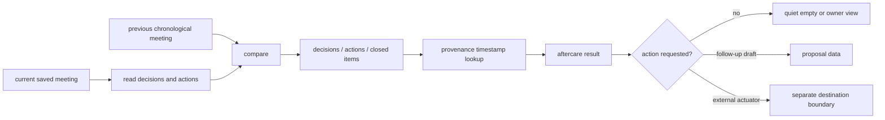

# Meeting aftercare

This is a source audit at snapshot `675401a857b85336d4acaa8c65383dfc9636e4c8`. Aftercare is a read-only comparison over saved meeting artifacts. It can prepare owner-readable follow-up data; it does not itself send a message, create a ticket, or mutate the source meeting. The test assertions named here are inspection evidence and are `not_run` in the Philo fixture.

## Read-only comparison path

`holdspeak/meeting_aftercare.py:1-15` states the three read-only questions. `compute_meeting_aftercare` at `:309-358` builds the result. Decision provenance is resolved to a transcript segment at `:44-76`; decisions are read from the `decisions` artifact at `:79-121`; open items are grouped from their payload at `:124-155`; the previous chronological meeting is selected at `:157-181`. The diff of decisions, actions, and closed items is at `:184-235`, with a project-only variant at `:238-306`.

The aftercare computation is content-derived and quiet when there is no change. Its result carries `is_empty` so a caller can avoid rendering an empty aftercare surface. Unknown meetings, missing artifacts, and no-change comparisons do not create a fake update.

## Result shape and provenance

The meaningful result groups are:

* decisions that are new or changed since the previous meeting;
* action items with owner and due information when the source artifact contains them;
* items that were closed since the previous meeting;
* open questions or follow-up material from the current artifact;
* provenance for a decision when its `source_timestamp` resolves inside the current segment range.

The decision-capture plugin drops an out-of-range timestamp and records a provenance drop. Aftercare independently resolves persisted numeric timestamps: it chooses the last segment starting at or before the timestamp, with the first segment as the lower bound. Missing/non-numeric timestamps and empty segment lists return no reference. An out-of-range numeric value can therefore map to an end segment; the resolver is not the plugin's rejection guard (`meeting_aftercare.py:44-75`). Project-only comparison uses the same resolver.

## Follow-up boundary

Aftercare produces read-only data and draft material. A follow-up ticket, GitHub issue, webhook, Slack message, or other destination is a separate actuator with its own admission and egress boundary. The source documents that distinction in `holdspeak/meeting_aftercare.py:309-358` and the plugin host contract at `holdspeak/plugins/host.py:280-297`. This document makes no claim that a draft was sent or that an actuator is enabled.

## Test assertions to inspect

`tests/unit/test_meeting_aftercare.py:80-90` asserts unknown and empty inputs stay quiet. Owner grouping and item identity are asserted at `:93-114`; decisions and provenance at `:116-130`; a real decision/action/closed-item diff at `:133-172`; project-only diff at `:175-212`; provenance clamping and guards at `:218-236`. Follow-up draft behavior and empty output are asserted at `:276-305`; no-change quiet behavior is asserted at `:329-353`.

The aftercare source does not replace the durability path. A base meeting must first be saved, and the intelligence artifact must be available. The saved meeting and deferred intelligence lifecycle is described in `docs/MEETING_ARCHITECTURE.md` and is implemented through `holdspeak/meeting_session/persistence.py:57-155`.

## Current gaps and bounded unknowns

* The source defines comparison and provenance guards, but no owner desk shot was captured for an aftercare result.
* A draft can be computed without proving that its language is acceptable to the owner or that its destination is authorized.
* Missing, queued, or failed intelligence leaves aftercare incomplete; this is a data state, not evidence of “no follow-up.”
* The prior-meeting selection is chronological and source-backed; the audit does not establish behavior for all project identity or rename cases.
* No live database, model, queue, or external destination was used for this audit.
