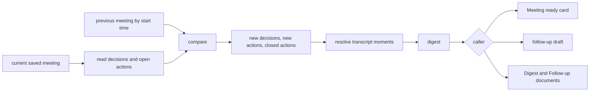

# Meeting aftercare

Aftercare answers three questions after a meeting:

- What is still open, and for whom?
- What did we decide?
- What changed since the previous meeting?

Aftercare only reads saved data. It writes nothing. It sends nothing. It invents nothing.
Sending a follow-up is a separate step with its own approval. See [Meeting Mode guide](MEETING_MODE_GUIDE.md#send).

## Where you see it

- The **Meeting ready** card appears when a meeting is saved or a summary finishes, and the digest has content.
  It shows the open and decided counts. **Open proposals** opens the meeting.
- The **Send** section of a meeting offers the **Digest** and **Follow-up** documents. Both come from aftercare data.
- Project Memory shows the change since the previous meeting of a Project.
- The API returns the digest and the follow-up draft.

When a meeting has no open items, no decisions, and no change, the digest is empty.
HoldSpeak then shows no card.

## How it works

```mermaid
flowchart LR
    A[current saved meeting] --> B[read decisions and open actions]
    C[previous meeting by start time] --> D[compare]
    B --> D
    D --> E[new decisions, new actions, closed actions]
    E --> F[resolve transcript moments]
    F --> G[digest]
    G --> H{caller}
    H --> I[Meeting ready card]
    H --> J[follow-up draft]
    H --> K[Digest and Follow-up documents]
```

`compute_meeting_aftercare` in `holdspeak/meeting_aftercare.py` builds the digest.

1. It reads the open action items of the meeting. It groups them by owner. Named owners sort A to Z. Unassigned items come last.
2. It reads the decisions from the `decisions` artifact of the meeting. It removes duplicates by normalized text.
3. It finds the previous meeting. That is the meeting with the latest start time before this one. The meeting id breaks ties.
4. It compares by normalized text:
   - New decisions are decisions that the previous meeting did not have.
   - New actions are open items that the previous meeting did not have.
   - Closed actions are items of the previous meeting that are now `done` or `dismissed`.
5. It sets `is_empty` when nothing is open, nothing is decided, and nothing changed.

With no previous meeting, `since_last_meeting` is `null`.

## Digest shape

| Field | Content |
| --- | --- |
| `meeting_id`, `meeting_title`, `meeting_date` | The meeting. |
| `open_items.total` | Count of open action items. |
| `open_items.by_owner[]` | `owner`, `count`, and `items[]`. Each item has `task`, `due`, `review_state`, and `provenance`. |
| `decisions[]` | `decision`, `rationale`, `source_timestamp`, and `provenance`. |
| `since_last_meeting` | `previous_meeting`, `new_decisions`, `new_actions`, `closed_actions`, and `changed`. |
| `is_empty` | `true` when the caller should show nothing. |

An owner is the name from the transcript, `Me`, or `Remote`. A blank owner is unassigned.

## Transcript moments

A decision or action item can carry a `source_timestamp`. `resolve_provenance_segment` maps it to the
transcript segment that starts at or before that time. The first segment is the lower bound.
A missing or non-numeric timestamp gives no reference. A timestamp of `0.0` resolves to the first segment.
A timestamp past the end resolves to the last segment.

The decision plugin drops a timestamp outside the meeting range and records it in `provenance_drops`.
The aftercare resolver does not apply that check.

## Follow-up draft

`build_followup_draft` turns a digest into plain Markdown on your machine. It uses no model and sends nothing.
The draft has these sections:

- **What we decided**: each decision, with its reason.
- **Open items**: each item with its owner and due date.
- **Since**: new decisions, new actions, and closed items. HoldSpeak names the previous meeting.

An empty digest gives the title, the date, and one line: "Nothing was decided and nothing is open for this meeting."

## Project comparison

`compute_project_since_last_meeting` compares the latest two meetings of one Project.
It uses Project membership, not the global order. The result names both meetings.

## Boundaries

- A draft does not prove that a message was sent. Sending uses a destination, a control mode, and an approval.
  See [Execution destinations](EXECUTION_DESTINATIONS.md).
- Missing, queued, or failed summaries leave the digest incomplete. An empty digest does not mean "no follow-up".
  Check the summary state on the meeting.
- The comparison matches text. A reworded item counts as new.

## API

| Route | Purpose |
| --- | --- |
| `GET /api/meetings/{meeting_id}/aftercare` | The digest. |
| `GET /api/meetings/{meeting_id}/followup-draft` | The follow-up draft. |
| `POST /api/meetings/{meeting_id}/aftercare/file-issue` | Propose a GitHub issue for an accepted action item. |

## See also

- [Meeting intelligence](MEETING_INTELLIGENCE.md)
- [Meeting architecture](MEETING_ARCHITECTURE.md)
