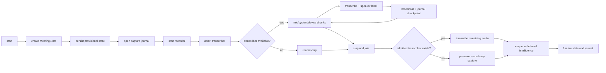
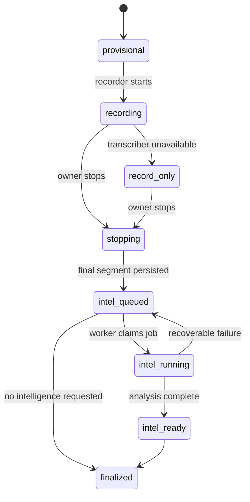
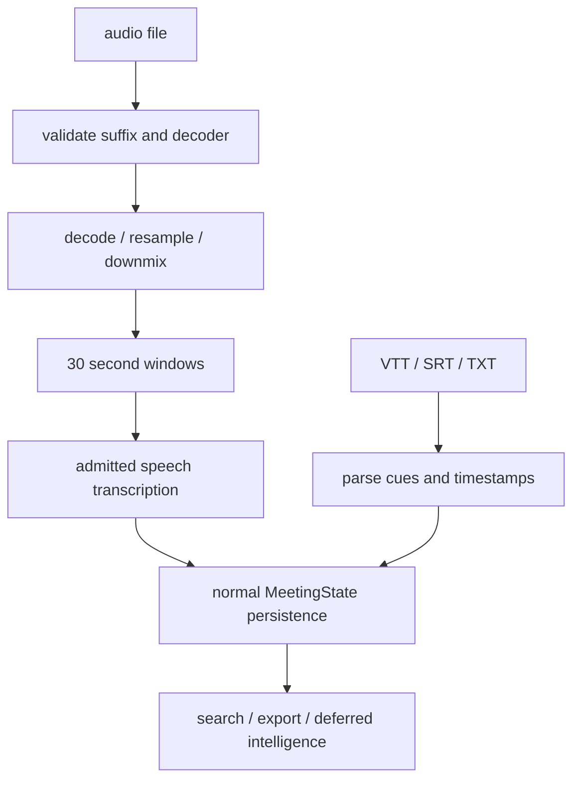

# Meeting architecture

This is a source audit at source snapshot `675401a857b85336d4acaa8c65383dfc9636e4c8`. It describes the current meeting capture, import, persistence, and handoff path. Source presence is not release proof. The named test assertions are inspection evidence and are `not_run` in the Philo fixture.

## Live capture lifecycle

`holdspeak/meeting_session/session.py:422-613`, `MeetingSession.start`, creates the meeting id and provisional capture, admits the frozen meeting-intelligence parent before creating the model engine, saves the state before starting the recorder, opens `MeetingCaptureJournal`, and starts the recorder. It constructs and warms the transcriber under the selected route. An unavailable transcriber puts the meeting into record-only mode. The transcription loop starts only when a transcriber exists.

`holdspeak/meeting_session/transcribe_loop.py:21-84`, `TranscribeLoopMixin._transcribe_audio`, is the single transcription seam for microphone, system, and device segments. It requires an admitted session and gives a named refusal when the session is absent. The loop at `:86-112` processes chunks. Segment handling at `:137-327` labels speakers when diarization is available, broadcasts the segment, and writes an atomic journal checkpoint after the segment.

`holdspeak/meeting_session/session.py:622-763`, `MeetingSession.stop`, stops and joins capture threads, attempts final transcription only when an admitted transcriber exists, cancels the live intelligence parent, and enqueues the deferred final job. It does not run a new post-stop analysis outside the admitted handoff. Fault injection can stop at named points. The state is marked finalized, the capture journal is finalized, recoverable failures retain the capture, and the intelligence session closes.

## Durable state and recovery

`holdspeak/meeting_session/persistence.py:57-155` saves the database row and JSON compatibility projection. If intelligence is enabled, deferred, and segments exist, it enqueues the job. The aftercare-ready broadcast is emitted only after the meeting has ended and a nonempty digest exists. The models at `holdspeak/meeting_session/models.py:115-225` carry `intel_status`, `capture_status`, `intel_job_enqueued`, and the serialized meeting record.

The capture journal is the write-ahead seam for audio bytes and checkpoints. `tests/unit/test_meeting_capture_durability.py:16-81` asserts provisional persistence before capture; `:85-100` asserts fsynced, recoverable journal bytes; `:179-220` asserts recovery keeps the same meeting id and does not duplicate intelligence jobs; `:259-284` exercises pending-fence behavior. These tests were not run here.

## Import paths

`holdspeak/meeting_import.py:1-26` defines audio and transcript import as real meeting creation. It uses the normal `MeetingState` persistence and deferred intelligence path. Audio import labels one user speaker; source audio is read, transcribed, and not retained. Compressed formats require ffmpeg. Downstream behavior is intended to match a captured meeting.

Format validation and named import errors are at `holdspeak/meeting_import.py:53-71,134-165`. Audio decode, 30-second windows, admitted speech sessions, and source-audio disposal are at `:201-293`. `_persist_import` at `:330-392` creates the normal state, records intelligence status, saves, and enqueues. Transcript import at `:395-454` parses VTT, SRT, and TXT and preserves real cue timestamps and speakers when present.

The import assertions cover audio persistence, timestamps, speakers, and intelligence queueing (`tests/unit/test_meeting_import.py:78-116`), downmix/resample (`:120-130`), empty windows (`:133-138`), ffmpeg refusal (`:145+`), and disabled intelligence (`:175-185`). Parity with a captured meeting is asserted by `tests/integration/test_meeting_import_parity.py:88-119`: an imported meeting remains searchable/exportable and can queue intelligence. None were run in this lane.

## Capture sources, artifacts, and lifecycle

The live recorder can receive microphone, system, and device audio through the transcribe-loop seam. Imported audio has one user speaker label. Imported transcripts use cue metadata when available. The record is durable before capture begins, so a crash can recover a meeting id and journal rather than create an orphaned audio stream.

Meeting intelligence runs after the base meeting record exists. Plugin runs and artifacts are persisted separately from the base transcript. A plugin result can be `success`, `proposed`, `error`, `timeout`, `deduped`, `blocked`, `queued`, or `skipped`; these values are defined by `holdspeak/plugins/contracts.py:8-15`. `PluginRun` and `ArtifactLineage` at `:74-129` retain run status and provenance links.

`holdspeak/meeting_plugins.py:94-172` runs the saved-meeting seam from transcript/window/hash and a route decision. Idempotency and rerun handling are at `:174-221`; injected failures and host execution are at `:223-303`; persisted plugin runs and artifacts are at `:305-340+`. A saved meeting can therefore have a complete base record while an intelligence artifact remains queued or failed.

## Meet to Understand slice

One concrete slice is:

1. `MeetingSession.start` admits the parent intelligence session and persists a provisional meeting before the recorder (`holdspeak/meeting_session/session.py:422-613`).
2. A microphone or system segment enters `TranscribeLoopMixin._transcribe_audio`, receives transcription and optional speaker labeling, then is checkpointed (`holdspeak/meeting_session/transcribe_loop.py:21-84,137-327`).
3. `MeetingSession.stop` performs the final segment pass and hands the frozen meeting to deferred intelligence (`holdspeak/meeting_session/session.py:622-763`).
4. Persistence enqueues the job only after the final meeting state is saved (`holdspeak/meeting_session/persistence.py:57-155`).
5. The saved-meeting plugin seam computes a transcript/window hash, executes admitted plugin dispatches, and records artifacts (`holdspeak/meeting_plugins.py:127-172,254-340+`).
6. Aftercare reads the saved artifacts and compares them with the previous chronological meeting (`holdspeak/meeting_aftercare.py:184-235`).

This slice is source-backed. It is not a release walk: no microphone, model, queue worker, or database run was made here.

## Current gaps and bounded unknowns

* The capture journal and recovery paths exist, but this audit does not establish crash behavior for every recorder backend or device.
* Record-only mode preserves capture, but the owner-facing signal for missing transcription is not verified here.
* Imported audio is not retained by the import path. That limits later re-transcription unless the owner keeps the source file separately.
* Intelligence can be deferred or retried, so a saved meeting is not proof that every artifact is ready.
* Source and integration tests describe parity; no live meeting, queue worker, model call, or aftercare walk was run.

Record-only stop does not create transcript text: `_transcribe_audio` returns
`None` when no transcriber exists (`transcribe_loop.py:61-66`). Retained audio
and a queued/finalized state must not be presented as successful transcription.
