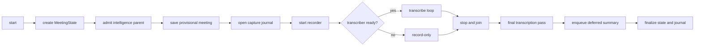
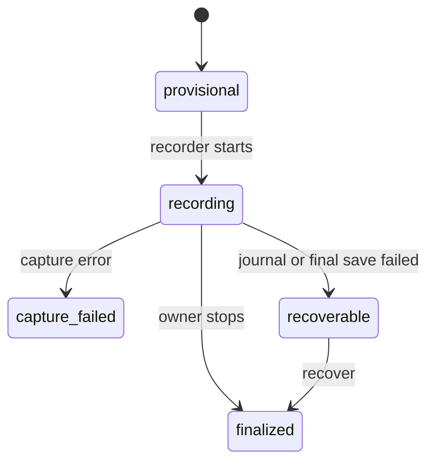
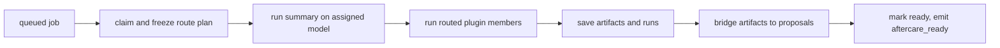
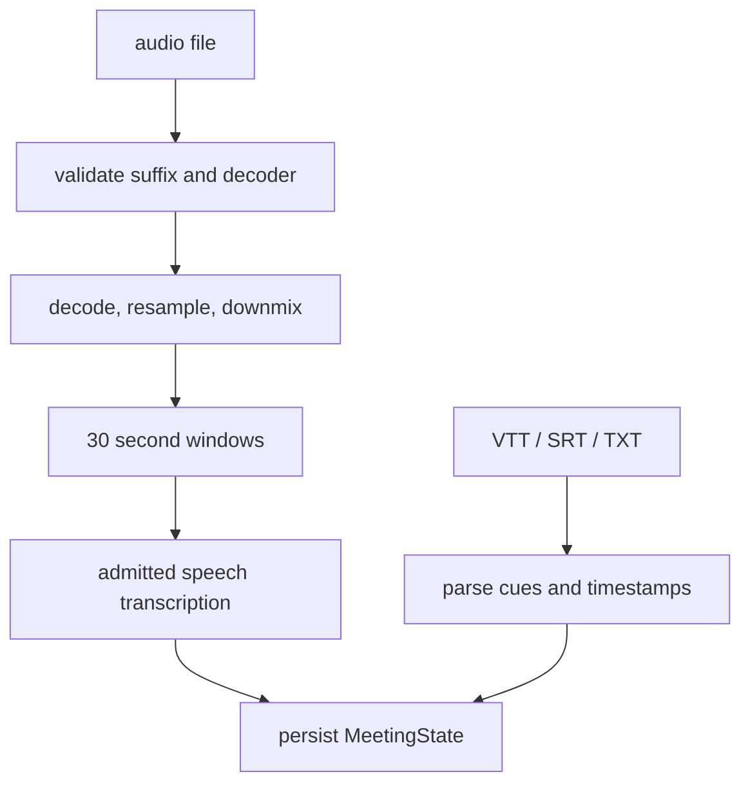

# Meeting architecture

This document is for contributors. It describes how HoldSpeak captures a meeting, saves it,
imports one, and hands it to intelligence. For the user workflow, see the [Meeting Mode guide](MEETING_MODE_GUIDE.md).

## Modules

| Module | Role |
| --- | --- |
| `holdspeak/meeting_session/session.py` | `MeetingSession`: start, stop, and the session lifecycle. |
| `holdspeak/meeting_session/transcribe_loop.py` | The one transcription path for microphone, system, and device audio. |
| `holdspeak/meeting_session/persistence.py` | Saves the meeting and enqueues the summary job. |
| `holdspeak/meeting_session/models.py` | `MeetingState`, segments, and their serialized form. |
| `holdspeak/meeting_recorder.py` | Records microphone and system audio. |
| `holdspeak/meeting_capture_journal.py` | `MeetingCaptureJournal`: crash-safe audio journal. |
| `holdspeak/meeting_import.py` | Imports recordings and transcripts as meetings. |
| `holdspeak/intel_queue.py` | Runs queued summary jobs. |
| `holdspeak/meeting_plugins.py` | Runs the plugin chain on a saved meeting. |
| `holdspeak/meeting_aftercare.py` | Computes the aftercare digest. See [Meeting aftercare](MEETING_AFTERCARE.md). |
| `holdspeak/runtime/meeting_glue.py` | Builds the session for the web runtime. |

## Live capture

```mermaid
flowchart LR
    A[start] --> B[create MeetingState]
    B --> C[admit intelligence parent]
    C --> D[save provisional meeting]
    D --> E[open capture journal]
    E --> F[start recorder]
    F --> G{transcriber ready?}
    G -->|yes| H[transcribe loop]
    G -->|no| I[record-only]
    H --> J[stop and join]
    I --> J
    J --> K[final transcription pass]
    K --> L[enqueue deferred summary]
    L --> M[finalize state and journal]
```

`MeetingSession.start` runs these steps in order:

1. It creates the meeting id and a `MeetingState` with `capture_status` set to `provisional`.
2. It admits the intelligence parent session. A refusal sets a named intelligence status. Recording continues.
3. It saves the meeting row before any audio device opens. A failed save stops the start.
4. It opens `MeetingCaptureJournal` and starts the recorder.
5. It builds the transcriber. With no transcriber, the meeting runs in record-only mode.

The web runtime starts a session with `intel_enabled=False`. Recording does not run live analysis.
Text intelligence runs after the meeting, as the summary.

`TranscribeLoopMixin._transcribe_audio` is the only transcription seam. It needs an admitted speech session.
The loop works on chunks about every 10 seconds. It keeps a short audio tail between passes so that a sentence
across a boundary stays whole. For each segment, it labels the speaker when diarization is on,
broadcasts a `segment` event, and writes a journal checkpoint.

`MeetingSession.stop` joins the capture threads and transcribes the audio that the loop has not yet seen.
It cancels the live intelligence parent and enqueues the deferred summary job. It runs no new analysis itself.

Record-only mode keeps the audio but makes no transcript text. `_transcribe_audio` returns `None`
when no transcriber exists. Do not show a record-only meeting as a successful transcription.

## Capture journal and recovery

The journal is the write-ahead log for audio. It appends 32-bit float samples per source.
It publishes a manifest with only the byte counts that were synced to disk. A checkpoint happens
every five seconds, so a crash loses at most five seconds of audio.

The journal lives in `~/.local/share/holdspeak/meeting-captures/<meeting_id>`.
`MeetingCaptureJournal.recoverable` lists captures that did not finalize.
`POST /api/meetings/{meeting_id}/capture/recover` keeps the last checkpoint as a partial meeting.
The original meeting stays if recovery fails. Recovery keeps the same meeting id.

## States

A meeting has three state axes on `MeetingState`:

| Field | Values |
| --- | --- |
| `capture_status` | `provisional`, `recording`, `finalized`, `capture_failed`, `recoverable` |
| `transcription_status` | `active`, `record_only`, `complete` |
| `intel_status` | `disabled`, `queued`, `running`, `ready`, `partial`, `skipped`, `error` |

The face names `intel_status` as the summary state.

```mermaid
stateDiagram-v2
    [*] --> provisional
    provisional --> recording: recorder starts
    recording --> finalized: owner stops
    recording --> capture_failed: capture error
    recording --> recoverable: journal or final save failed
    recoverable --> finalized: recover
```

`persistence.py` saves the database row and a JSON copy in `~/.local/share/holdspeak/meetings`.
After a stop, `_maybe_auto_enqueue_intel` in `holdspeak/runtime/routing_glue.py` enqueues the summary job.
It does so when the meeting has segments and the `intelligence_auto` setting allows it.
The `aftercare_ready` event goes out when the digest has content. That happens at save and when a summary job finishes.

## Summary job

```mermaid
flowchart LR
    A[queued job] --> B[claim and freeze route plan]
    B --> C[run summary on assigned model]
    C --> D[run routed plugin members]
    D --> E[save artifacts and runs]
    E --> F[bridge artifacts to proposals]
    F --> G[mark ready, emit aftercare_ready]
```

- Two triggers enqueue a job. `intelligence_auto` enqueues after a stop. The **Run summary** verb, `POST /api/meetings/{meeting_id}/intelligence/run`, enqueues on request.
- The hub drains the queue (`intel_queue_conductor`). It checks the queue every 15 seconds. A new job wakes it at once.
- A job freezes its route plan when it starts. A run request carries `expected_selection_hash`.
  The hub refuses with `409` when the route changed. No provider is contacted before that check.
- Failure retries with a growing delay up to `intel_retry_max_attempts`. Then the job is `failed`.
- A plugin result is `success`, `proposed`, `error`, `timeout`, `deduped`, `blocked`, `queued`, or `skipped`.
- A partial plugin chain keeps the finished artifacts and queues a retry for the rest.

See [Meeting intelligence](MEETING_INTELLIGENCE.md) for the plugin path.

## Import

```mermaid
flowchart TD
    A[audio file] --> B[validate suffix and decoder]
    B --> C[decode, resample, downmix]
    C --> D[30 second windows]
    D --> E[admitted speech transcription]
    E --> F[persist MeetingState]
    G[VTT / SRT / TXT] --> H[parse cues and timestamps]
    H --> F
```

`import_meeting` and `import_transcript` share one persistence tail, `_persist_import`.

- The tail builds a normal `MeetingState` and saves it. It enqueues nothing. The meeting arrives
  with `intel_status` set to `disabled` and the **Run summary** verb. Only the owner starts a summary.
- Audio import uses one speaker label (`Recording` by default). It does not keep the source audio.
  WAV decodes in Python. Other formats need `ffmpeg`.
- Transcript import keeps cue times and speaker names from the file. A `.txt` file gets evenly spaced times.
  The default speaker label is `Transcript`.
- The start time is the import time, unless the caller passes `started_at`.
- The tail sets `transcription_status` to `complete`.

## Handoff to intelligence

The meeting record is complete before any plugin runs. Plugin runs and artifacts are separate rows.
A saved meeting can have a full transcript while its summary is queued, failed, or ready.
Do not treat a saved meeting as proof that every artifact exists.

## Known limits

- Recovery behavior depends on the recorder backend and the device.
- A record-only stop has no transcript. The face shows the transcription state.
- An import cannot be transcribed again, because HoldSpeak does not keep the source audio.
