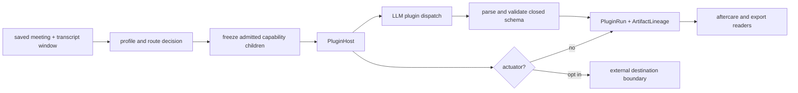

# Meeting intelligence

This is a source audit at snapshot `675401a857b85336d4acaa8c65383dfc9636e4c8`. It inventories the registered built-in meeting plugins and follows their execution boundary. The registry is authoritative for the built-in count. Plugin source and tests show implementation contracts; they do not prove release exposure. Test assertions below are `not_run` in the Philo fixture.

## Intelligence path

`holdspeak/meeting_plugins.py:127-172`, `run_meeting_plugin_chain`, derives a transcript/window hash and route. The idempotency seam is `:174-221`. Host execution, including admitted dispatch and fault handling, is `:223-303`; persistence of runs and artifacts is `:305-340+`. A saved meeting can therefore have a durable base transcript while plugin work is queued, blocked, failed, or ready.

The host registers a plugin's required capability and execution mode. `holdspeak/plugins/host.py:211-278` owns registration and issued dispatch; `:252-278` rejects a model plugin that attempts to call a provider without a host-issued dispatch. Actuator and deferred execution are separate at `:280-297`. The shared result statuses are defined at `holdspeak/plugins/contracts.py:8-15`; `PluginRun` and `ArtifactLineage` are at `:74-129`.

Every built-in intelligence plugin is deferred and requires the `llm` capability. The implementation parses a bounded response and returns a success object or a failure object with `summary`, `confidence_hint: 0.0`, and `active_intents`. Empty transcript, malformed output, no recognized items, and provider errors have explicit failure paths. A provider failure can reach the admitted child as a physical failure; it must not become a successful receipt.

## Registered built-in plugins

The exact registry is `_BUILTIN_PLUGIN_DEFS` at `holdspeak/plugins/builtin/__init__.py:125-140`, registered by `register_builtin_plugins` at `:143-158`. It contains 14 ids. The canonical closed result schemas are in `holdspeak/inference_capabilities.py:805-868`. Each row below includes the implementation class, result payload, model need, bounded failure, source, and the paired unit test file.

| ID and kind | Output schema | Model and failure behavior | Source and test assertion |
|---|---|---|---|
| `requirements_extractor` (synthesizer) | `requirements[]`: `text`, `type` | LLM; empty/malformed/no requirement/provider failure returns named failure | `holdspeak/plugins/builtin/requirements_extractor.py:138-196`; `tests/unit/test_requirements_extractor_plugin.py` asserts success, normalization, empty/no transcript, provider failure, registrar, and missing `llm` |
| `action_owner_enforcer` (validator) | `action_items[]`: `task`, nullable `owner`, nullable `due`, `gap` | LLM; missing owners remain gaps; invalid or empty output fails | `holdspeak/plugins/builtin/action_owner_enforcer.py:144-212`; `tests/unit/test_action_owner_enforcer_plugin.py` asserts gap flags, empty/no transcript, provider failure, registrar, and capability block |
| `mermaid_architecture` (artifact generator) | `mermaid`, `diagram_kind` plus common fields | LLM; no fenced/known diagram, empty input, or provider failure returns failure | `holdspeak/plugins/builtin/mermaid_architecture.py:191-255`; `tests/unit/test_mermaid_architecture_plugin.py` asserts full shape, known kinds, empty/failure, provider failure, and real registration |
| `adr_drafter` (artifact generator) | `adrs[]`: `title`, `status`, `context`, `decision`, `consequences` | LLM; invalid status is coerced, missing decision is dropped, empty result fails | `holdspeak/plugins/builtin/adr_drafter.py:146-202`; `tests/unit/test_adr_drafter_plugin.py` asserts status coercion, drops, empty/no transcript, provider failure, registrar, and capability block |
| `milestone_planner` (synthesizer) | `milestones[]`: `name`, nullable `target`, `deliverables[]`, `dependencies[]` | LLM; missing target is nullable, missing name is dropped, empty result fails | `holdspeak/plugins/builtin/milestone_planner.py:131-189`; `tests/unit/test_milestone_planner_plugin.py` asserts extraction, null target, drops, empty/no transcript, provider failure, registrar, and capability block |
| `dependency_mapper` (synthesizer) | `dependencies[]`: `from`, `to`, nullable `note` | LLM; edges without endpoints are dropped, empty result fails | `holdspeak/plugins/builtin/dependency_mapper.py:105-158`; `tests/unit/test_dependency_mapper_plugin.py` asserts edge mapping, drops, empty/no transcript, provider failure, registrar, and capability block |
| `scope_guard` (validator) | `findings[]`: `item`, `verdict`, nullable `rationale` | LLM; invalid verdict is coerced, missing item is dropped, empty result fails | `holdspeak/plugins/builtin/scope_guard.py:133-186`; `tests/unit/test_scope_guard_plugin.py` asserts verdict coercion, drops, empty/no transcript, provider failure, registrar, and capability block |
| `customer_signal_extractor` (signals) | `signals[]`: `signal`, `type`, nullable `quote` | LLM; invalid signal type is coerced, missing text is dropped, empty result fails | `holdspeak/plugins/builtin/customer_signal_extractor.py:138-191`; `tests/unit/test_customer_signal_extractor_plugin.py` asserts classification, drops, empty/no transcript, provider failure, registrar, and capability block |
| `incident_timeline` (synthesizer) | `events[]`: nullable `time`, `event` | LLM; bare strings are accepted, malformed or empty event list fails | `holdspeak/plugins/builtin/incident_timeline.py:106-159`; `tests/unit/test_incident_timeline_plugin.py` asserts ordering, bare strings, empty/no transcript, provider failure, registrar, and capability block |
| `risk_heatmap` (synthesizer) | `risks[]`: `risk`, `impact`, `likelihood`, nullable `mitigation`, nullable `owner` | LLM; unknown levels coerce to medium, missing risk text is dropped, empty result fails | `holdspeak/plugins/builtin/risk_heatmap.py:152-208`; `tests/unit/test_risk_heatmap_plugin.py` asserts register construction, level coercion, drops, empty/no transcript, provider failure, registrar, and capability block |
| `stakeholder_update_drafter` (artifact generator) | `update`: nullable `headline`, `highlights[]`, `risks[]`, `next_steps[]` | LLM; an empty update fails, malformed/no transcript/provider failure fails | `holdspeak/plugins/builtin/stakeholder_update_drafter.py:107-160`; `tests/unit/test_stakeholder_update_drafter_plugin.py` asserts update shape, headline-only success, empty/no transcript, provider failure, registrar, and capability block |
| `runbook_delta` (artifact generator) | `changes[]`: `change`, `type`, nullable `detail` | LLM; unknown type coerces to modified, missing change is dropped, empty result fails | `holdspeak/plugins/builtin/runbook_delta.py:130-183`; `tests/unit/test_runbook_delta_plugin.py` asserts classification, drops, empty/no transcript, provider failure, registrar, and capability block |
| `decision_announcement_drafter` (artifact generator) | `announcements[]`: `title`, nullable `audience`, `message` | LLM; missing message is dropped, no announcement/empty result fails | `holdspeak/plugins/builtin/decision_announcement_drafter.py:104-159`; `tests/unit/test_decision_announcement_drafter_plugin.py` asserts drafting, drops, empty/no transcript, provider failure, real registration, and capability block |
| `decision_capture` (synthesizer) | `decisions[]`: `decision`, nullable `rationale`, optional `source_timestamp`; `open_questions[]`; `provenance_drops[]` | LLM; timestamp outside the observed window is dropped and named; no decisions/questions fails | `holdspeak/plugins/builtin/decision_capture.py:179-277`; `tests/unit/test_decision_capture_plugin.py:70-116` asserts timestamp bounds, optional timestamp, empty/unparseable/no transcript, provider failure, registrar, and capability block |

All plugin outputs also carry the common `summary`, numeric `confidence_hint`, and `active_intents`. The closed schemas are generated by the canonical capability registry, so the table does not infer fields from prompt prose.

## Live, deferred, and imported behavior

Live meeting capture admits a parent intelligence session before capture and can open live intelligence (`holdspeak/meeting_session/session.py:422-613`). Stop cancels the live parent and hands the frozen record to deferred analysis (`:622-763`). A transcriber outage changes the meeting to record-only; it does not authorize an unadmitted model call.

Imported meetings take the same saved-meeting tail. `tests/integration/test_meeting_import_parity.py:88-119` asserts that an imported meeting remains searchable/exportable and can queue intelligence. Saved-meeting plugin tests assert typed artifacts are persisted (`tests/unit/test_meeting_plugins.py:98-121`), reruns are idempotent (`:124-134`), failed work is retried without duplicating completed work (`:139-198`), deferred intelligence can become ready (`:224-270`), and routed failure retains base analysis while staying queued (`:270-328`). The disabled-router case still persists artifacts (`:331-363`).

## Attribution and egress

The base intelligence output has transcript/window/hash lineage through the saved-meeting seam. `ArtifactLineage` is the typed link for generated artifacts. Plugin model calls are host-issued and require `llm`; plugins do not choose an arbitrary provider. Actuators are a separate opt-in boundary. The built-in 14 registry does not include the external actuators registered by `register_followup_actuator`, `register_github_issue_actuator`, `register_webhook_post_actuator`, or the GitHub PR actuator modules. Those connectors can egress and must be audited at their own registration and destination boundaries.

## Current gaps and bounded unknowns

* The registry proves 14 built-in ids and their source contracts. It does not prove a profile enables every id or that a model is ready.
* LLM output validation is explicit, but semantic correctness of a generated decision, risk, or artifact is not established by schema validation.
* Plugin failure persistence and retry are covered by source and tests; no queue worker or live model run was made here.
* The source includes external actuator registration modules, but their opt-in configuration and user-visible egress are outside this inventory.
* No generated artifact, model receipt, or aftercare view was observed on the owner's desk.
