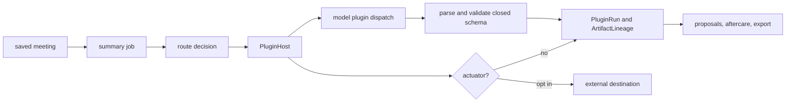

# Meeting intelligence

Meeting intelligence turns a saved transcript into a summary and typed artifacts.
This document names the 14 built-in plugins and describes how they run.
For the user workflow, see the [Meeting Mode guide](MEETING_MODE_GUIDE.md).
To write your own plugin, see [Plugin authoring](PLUGIN_AUTHORING.md).

## How it runs

```mermaid
flowchart LR
    A[saved meeting] --> B[summary job]
    B --> C[route decision]
    C --> D[PluginHost]
    D --> E[model plugin dispatch]
    E --> F[parse and validate closed schema]
    F --> G[PluginRun and ArtifactLineage]
    G --> H[proposals, aftercare, export]
    D --> I{actuator?}
    I -->|opt in| J[external destination]
    I -->|no| G
```

1. The summary job runs on a saved meeting. See [Meeting architecture](MEETING_ARCHITECTURE.md).
2. When a job is claimed, the router scores the transcript against intents with fixed word rules. No model is involved.
   It builds the plugin chain: `project_detector`, the `balanced` base chain, and the plugins of each detected intent.
3. A plugin joins the job only when its model assignment (`meeting.plugin.<id>`) can be frozen.
   Otherwise the job leaves it out and records `plugin_chain_skipped`.
   `run_meeting_plugin_chain` in `holdspeak/meeting_plugins.py` hashes the transcript window and the route.
   An unchanged hash makes a rerun a no-op (`deduped`).
4. `PluginHost` runs each plugin. A plugin that needs the `llm` capability gets a dispatch handle that the host issues.
   A model plugin cannot call a provider by itself. Without a handle, it refuses.
5. The host stores each result as a `PluginRun`. It stores each artifact with an `ArtifactLineage` that links to its source.
6. HoldSpeak turns finished artifacts into proposals that you review. It also uses them for aftercare and export.

A saved meeting has a durable transcript. Its plugin work can be queued, blocked, failed, or ready.

## Presets and intents

The summary job always uses the `balanced` base chain. The other presets apply to previews,
`holdspeak intel --route-dry-run`, `--reroute`, and the live **Intent routing** control.
The detected intents add plugins.

| Preset | Base chain |
| --- | --- |
| `balanced` | `requirements_extractor`, `action_owner_enforcer`, `decision_capture` |
| `architect` | `requirements_extractor`, `mermaid_architecture`, `adr_drafter` |
| `delivery` | `action_owner_enforcer`, `milestone_planner`, `dependency_mapper` |
| `product` | `scope_guard`, `customer_signal_extractor` |
| `incident` | `incident_timeline`, `risk_heatmap`, `stakeholder_update_drafter` |

| Intent | Plugins |
| --- | --- |
| architecture | `requirements_extractor`, `mermaid_architecture`, `adr_drafter` |
| delivery | `action_owner_enforcer`, `milestone_planner`, `dependency_mapper` |
| product | `scope_guard`, `customer_signal_extractor` |
| incident | `incident_timeline`, `runbook_delta` |
| comms | `stakeholder_update_drafter`, `decision_announcement_drafter` |

To skip a plugin, add its id to `meeting.disabled_plugins`. The run shows `skipped`.

## Built-in plugins

The registry is `_BUILTIN_PLUGIN_DEFS` in `holdspeak/plugins/builtin/__init__.py`.
The closed result schemas are in `holdspeak/inference_capabilities.py`.

| Id | Kind | Result fields |
| --- | --- | --- |
| `requirements_extractor` | synthesizer | `requirements[]`: `text`, `type` |
| `action_owner_enforcer` | validator | `action_items[]`: `task`, `owner`, `due`, `gap` |
| `mermaid_architecture` | artifact generator | `mermaid`, `diagram_kind` |
| `adr_drafter` | artifact generator | `adrs[]`: `title`, `status`, `context`, `decision`, `consequences` |
| `milestone_planner` | synthesizer | `milestones[]`: `name`, `target`, `deliverables[]`, `dependencies[]` |
| `dependency_mapper` | synthesizer | `dependencies[]`: `from`, `to`, `note` |
| `scope_guard` | validator | `findings[]`: `item`, `verdict`, `rationale` |
| `customer_signal_extractor` | signals | `signals[]`: `signal`, `type`, `quote` |
| `incident_timeline` | synthesizer | `events[]`: `time`, `event` |
| `risk_heatmap` | synthesizer | `risks[]`: `risk`, `impact`, `likelihood`, `mitigation`, `owner` |
| `stakeholder_update_drafter` | artifact generator | `update`: `headline`, `highlights[]`, `risks[]`, `next_steps[]` |
| `runbook_delta` | artifact generator | `changes[]`: `change`, `type`, `detail` |
| `decision_announcement_drafter` | artifact generator | `announcements[]`: `title`, `audience`, `message` |
| `decision_capture` | synthesizer | `decisions[]`: `decision`, `rationale`, `source_timestamp`, `open_questions[]`, `provenance_drops[]` |

Every plugin also returns `summary`, `confidence_hint`, and `active_intents`.

Rules that all built-in plugins share:

- Each plugin is deferred and needs the `llm` capability.
- Output must match the closed schema. A plugin repairs small errors. An unknown level or type becomes a default value.
  An item with no required text is dropped.
- An empty transcript, malformed output, no usable items, or a provider error gives a failure result.
  The failure result has a `summary`, `confidence_hint` of `0.0`, and `active_intents`.
  A provider failure never becomes a success.
- `decision_capture` drops a `source_timestamp` outside the meeting and names it in `provenance_drops`.

Schema checks do not prove that a decision, risk, or diagram is right. Review the output.

## Run states

A plugin run has one of these states: `success`, `proposed`, `error`, `timeout`, `deduped`, `blocked`, `queued`, or `skipped`.
`proposed` means an actuator made a proposal and did nothing else. `blocked` means a capability or an actuator gate stopped the run.
`skipped` means a setting removed the plugin before it ran.

A summary job is complete when every plugin is `success`, `proposed`, `deduped`, or `skipped`.
When a plugin did not finish, the job keeps the finished artifacts and retries the rest.

## Actuators

An actuator is a plugin that can send data out. The 14 built-in plugins above are not actuators.
These actuator modules exist in `holdspeak/plugins/builtin/`:

- `followup_ticket_actuator`
- `github_issue_actuator`
- `github_pr_actuator`
- `webhook_post_actuator`

An actuator makes a proposal. Running it needs `meeting.allow_actuators`, an allowed id in `meeting.allowed_actuators`,
and authority from your [control mode](AUTHORITY.md). Each actuator crosses its own destination boundary.
See [Actuator development](ACTUATOR_DEVELOPMENT.md).

## Where results appear

- The **Artifacts** wing of a meeting lists artifacts.
- The **Review** wing lists the proposals that come from decisions and action items.
- `GET /api/meetings/{meeting_id}/artifacts` and `.../plugin-runs` return the data.
- `holdspeak intel --route-dry-run MEETING_ID` shows a route without saving.
