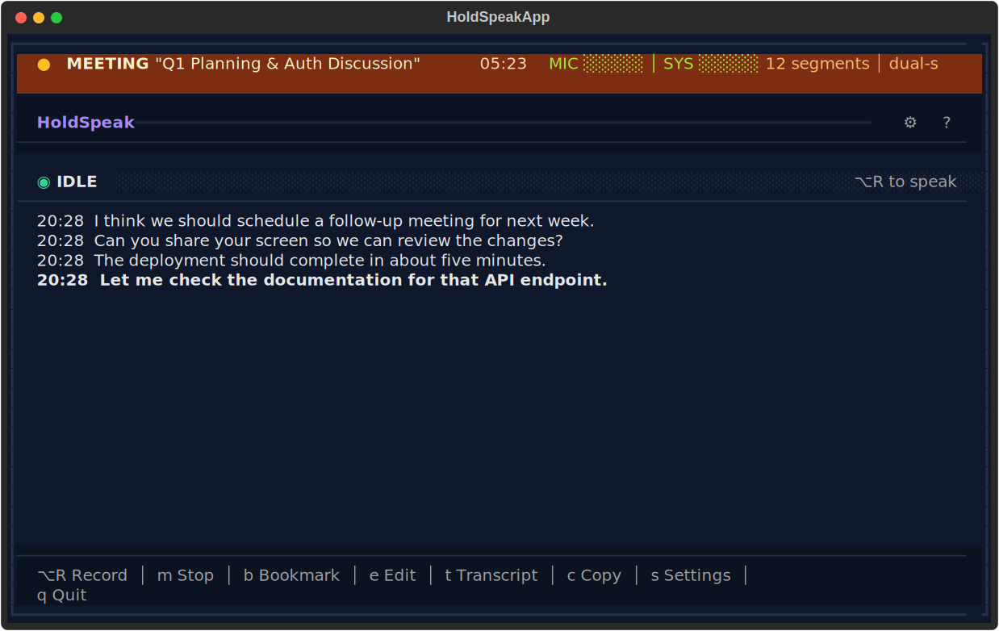

# Meeting Mode - Complete User Guide

HoldSpeak's Meeting Mode captures your microphone plus remote participants' audio, transcribes in real-time, and extracts structured meeting intelligence. It runs local-first, with optional cloud inference when configured.

## Table of Contents

1. [Quick Start](#quick-start)
2. [Prerequisites](#prerequisites)
3. [BlackHole Setup](#blackhole-setup)
4. [Using Meeting Mode](#using-meeting-mode)
5. [Web Interfaces](#web-interfaces)
6. [Meeting Intelligence](#meeting-intelligence)
7. [Configuration Reference](#configuration-reference)
8. [Web API Reference](#web-api-reference)
9. [Troubleshooting](#troubleshooting)

---

## Quick Start

```bash
# 1. macOS: install BlackHole for system audio capture
brew install blackhole-2ch

# 2. Check setup (Linux: verifies Pulse/PipeWire monitor source)
holdspeak meeting --setup

# 3. Start HoldSpeak
holdspeak

# 4. Press 'm' to start a meeting
```

---

## Prerequisites

### Required
- **macOS or Linux**
- **Python 3.10+**
- **Microphone permissions** granted to Terminal/iTerm

### For System Audio Capture
- **BlackHole 2ch** - Virtual audio device to capture remote participants

### For Meeting Intelligence (AI)
- **GGUF model** - Local LLM for extracting topics, action items, and summaries
- Recommended: Qwen2.5-32B or Mistral-7B
- Optional cloud mode: `OPENAI_API_KEY` (or your configured env var) when using `intel_provider: "cloud"` or fallback mode `auto`

### For Web Interfaces
- **FastAPI + Uvicorn** - Web server dependencies
```bash
uv pip install fastapi uvicorn
```

---

## BlackHole Setup

BlackHole is a free virtual audio device that lets HoldSpeak capture system audio (Zoom, Meet, Teams, etc.).

### Installation

```bash
brew install blackhole-2ch
```

### Audio MIDI Setup

1. Open **Audio MIDI Setup** (Applications > Utilities)
2. Click **+** at bottom left, select **Create Multi-Output Device**
3. Check both:
   - Your speakers/headphones (e.g., "MacBook Pro Speakers")
   - **BlackHole 2ch**
4. Right-click the new Multi-Output Device > **Use This Device For Sound Output**

### Verification

```bash
holdspeak meeting --setup
```

This will check if BlackHole is detected and configured correctly.

### List Audio Devices

```bash
holdspeak meeting --list-devices
```

Shows all available audio input/output devices. Look for "BlackHole 2ch" in the list.

---

## Using Meeting Mode

### Starting a Meeting

From the TUI, press `m` to toggle meeting mode on/off.

When a meeting starts:
1. Recording begins on both mic and system audio
2. A live dashboard URL appears (e.g., `http://127.0.0.1:8234`)
3. Transcription happens automatically every ~10 seconds
4. AI intelligence runs every few segments (if enabled)

At any time, you can also open:
- `http://127.0.0.1:<port>/history` for archive search and cross-meeting workflows
- `http://127.0.0.1:<port>/settings` for browser-based configuration



### TUI Controls

| Key | Action |
|-----|--------|
| `m` | Toggle meeting on/off |
| `b` | Add bookmark at current time |
| `t` | Show full transcript |
| `i` | Show intelligence summary |
| `u` | Copy dashboard URL |

### Stopping a Meeting

Press `m` again to stop. The meeting data is preserved until you start a new one.

---

## Web Interfaces

When a meeting starts, HoldSpeak launches a local-only web server on `127.0.0.1` with two browser experiences.

### 1) Live Dashboard (`/`)

Use this during an active meeting for real-time operations:
- Live transcript with speaker labels and timestamps
- Streaming intelligence updates and clear intel status (`live`, `running`, `queued`, `ready`, `error`, `disabled`)
- Bookmark, copy, export, and stop-meeting controls

### 2) Archive + Settings Hub (`/history` and `/settings`)

Use this during or after meetings for cross-session management:
- Search meetings by transcript content
- Track action items across meetings and toggle status
- Inspect and update speaker profiles (name/avatar) with speaking history
- Manage deferred-intel queue (list jobs, process now, retry meeting jobs)
- Edit app settings from browser, including cloud options:
  - `intel_provider` (`local`, `cloud`, `auto`)
  - `intel_cloud_model`
  - `intel_cloud_api_key_env`
  - `intel_cloud_base_url` (OpenAI-compatible endpoint override)

### Multiple Clients

Multiple local browser tabs can connect at once. Live pages receive real-time updates via WebSocket.

---

## Meeting Intelligence

HoldSpeak supports three intelligence modes:
- `local`: requires a local GGUF model
- `cloud`: uses your configured OpenAI-compatible endpoint + API key env var
- `auto`: local-first, then cloud fallback

If no compatible runtime is currently available and deferred mode is enabled, HoldSpeak queues intelligence and fills in topics/actions/summaries later.

### What It Extracts

**Topics**
- Key subjects discussed
- Automatically identified from conversation

**Action Items**
```
Task: Document API endpoints
Owner: Me
Due: Friday
```

**Summary**
- Concise overview of the meeting
- Updates as the meeting progresses

### Model Requirements

Intelligence requires a GGUF model. Recommended options:

| Model | Size | Speed | Quality |
|-------|------|-------|---------|
| Mistral-7B Q6_K | 5.5GB | ~30s | Good |
| Qwen2.5-32B Q4_K_M | 18GB | ~8s (GPU) | Excellent |
| Llama-3.1-8B Q6_K | 6.5GB | ~5s | Good |

### Installing a Model

Download GGUF models from HuggingFace:

```bash
# Using hf CLI
hf download bartowski/Meta-Llama-3.1-8B-Instruct-GGUF \
  --include "*Q6_K.gguf" \
  --local-dir ~/Models/gguf/

# Or direct download
curl -L -o ~/Models/gguf/Mistral-7B-Instruct-v0.3-Q6_K.gguf \
  "https://huggingface.co/bartowski/Mistral-7B-Instruct-v0.3-GGUF/resolve/main/Mistral-7B-Instruct-v0.3-Q6_K.gguf"
```

### GPU Acceleration

HoldSpeak automatically uses Metal GPU on Apple Silicon. The `n_gpu_layers=-1` setting offloads all layers to GPU for maximum speed.

With GPU: Qwen 32B processes meeting intel in ~8 seconds
Without GPU: Same model takes 20+ minutes

---

## Configuration Reference

Configuration file: `~/.config/holdspeak/config.json`

### Meeting Settings

```json
{
  "meeting": {
    "system_audio_device": null,
    "mic_label": "Me",
    "remote_label": "Remote",
    "auto_export": false,
    "export_format": "markdown",
    "intel_enabled": true,
    "intel_provider": "local",
    "intel_realtime_model": "~/Models/gguf/Mistral-7B-Instruct-v0.3-Q6_K.gguf",
    "intel_queue_poll_seconds": 120,
    "intel_cloud_model": "gpt-5-mini",
    "intel_cloud_api_key_env": "OPENAI_API_KEY",
    "intel_cloud_base_url": null,
    "intel_cloud_reasoning_effort": null,
    "intel_cloud_store": false,
    "intel_summary_model": null,
    "intel_deferred_enabled": true,
    "web_enabled": true,
    "web_auto_open": false,
    "diarization_enabled": false,
    "diarize_mic": false,
    "cross_meeting_recognition": true,
    "similarity_threshold": 0.75
  }
}
```

### Option Details

| Option | Type | Default | Description |
|--------|------|---------|-------------|
| `system_audio_device` | string | null | System audio device name (e.g., "BlackHole 2ch"). Auto-detected if null. |
| `mic_label` | string | "Me" | Label for your microphone audio in transcript |
| `remote_label` | string | "Remote" | Label for system audio in transcript |
| `auto_export` | bool | false | Automatically export when meeting ends |
| `export_format` | string | "markdown" | Export format: txt, markdown, json, srt |
| `intel_enabled` | bool | true | Enable AI intelligence extraction |
| `intel_provider` | string | "local" | Intel mode: `local`, `cloud`, or `auto` (local-first, cloud fallback) |
| `intel_realtime_model` | string | (Mistral path) | Path to GGUF model for real-time intel |
| `intel_queue_poll_seconds` | int | 120 | Interval for deferred-intel background worker polling |
| `intel_cloud_model` | string | "gpt-5-mini" | Cloud model used when provider is `cloud` or `auto` falls back to cloud |
| `intel_cloud_api_key_env` | string | "OPENAI_API_KEY" | Environment variable name containing your cloud API key |
| `intel_cloud_base_url` | string | null | Optional OpenAI-compatible base URL (for proxies/compatible providers) |
| `intel_cloud_reasoning_effort` | string | null | Optional cloud reasoning setting (provider dependent) |
| `intel_cloud_store` | bool | false | Allow provider-side storage for cloud requests |
| `intel_summary_model` | string | null | Path to larger model for end-of-meeting summary. Falls back to realtime model if null. |
| `intel_deferred_enabled` | bool | true | Queue meeting intel for later if no compatible local model is currently available |
| `web_enabled` | bool | true | Enable web dashboard server |
| `web_auto_open` | bool | false | Auto-open browser when meeting starts |
| `diarization_enabled` | bool | false | Enable speaker diarization for system audio |
| `diarize_mic` | bool | false | Enable diarization for microphone stream |
| `cross_meeting_recognition` | bool | true | Persist speaker identities across meetings |
| `similarity_threshold` | float | 0.75 | Matching threshold for speaker recognition (`0.0` to `1.0`) |

---

## Web API Reference

The local meeting web server exposes these routes:

### HTTP Endpoints

#### `GET /`
Live meeting dashboard HTML.

#### `GET /history`
Archive/control-plane UI (meetings, actions, speakers, intel queue).

#### `GET /settings`
Settings UI (same web app shell as `/history`).

#### `GET /health`
Health check endpoint.

**Response:**
```json
{"status": "ok"}
```

#### Live meeting APIs
- `GET /api/state` - current meeting state
- `POST /api/bookmark` - add bookmark
- `POST /api/stop` - stop meeting
- `PATCH /api/action-items/{item_id}` - update in-memory action item status
- `PATCH /api/meeting` - update title/tags

#### Archive/data APIs
- `GET /api/meetings`
- `GET /api/meetings/{meeting_id}`
- `GET /api/all-action-items`
- `PATCH /api/all-action-items/{item_id}`
- `GET /api/speakers`
- `GET /api/speakers/{speaker_id}`
- `PATCH /api/speakers/{speaker_id}`

#### Settings/intel queue APIs
- `GET /api/settings`
- `PUT /api/settings`
- `GET /api/intel/jobs`
- `POST /api/intel/process`
- `POST /api/intel/retry/{meeting_id}`

### WebSocket

#### `WS /ws`
Real-time updates via WebSocket connection.

**Message Types:**

```json
// New transcript segment
{"type": "segment", "data": {"speaker": "Me", "text": "...", "timestamp": 123.4}}

// Streaming intel token + final intel snapshot
{"type": "intel_token", "data": "..."}
{"type": "intel_complete", "data": {"topics": [...], "action_items": [...], "summary": "..."}}

// Intel status transitions
{"type": "intel_status", "data": {"state": "running", "detail": "Analyzing..."}}

// Duration tick (every second)
{"type": "duration", "data": "12:34"}

// Bookmark added
{"type": "bookmark", "data": {"timestamp": 300.0, "label": "..."}}

// Meeting stopped
{"type": "stopped", "data": {"status": "stopped"}}
```

**Ping/Pong:**
Send `"ping"` text message, receive `"pong"` response.

---

## Troubleshooting

### "BlackHole not found"

1. Install BlackHole: `brew install blackhole-2ch`
2. Restart Audio MIDI Setup
3. Run `holdspeak meeting --list-devices` to verify

### No remote audio captured

1. Ensure Multi-Output Device is set as system output
2. Check that BlackHole is checked in the Multi-Output Device
3. Verify with `holdspeak meeting --setup`

### Intel extraction is slow

1. Check GPU is being used: Look for "Metal" in logs
2. Use a smaller model (Mistral-7B instead of Qwen-32B)
3. Ensure `n_gpu_layers=-1` is set (default)

### Web dashboard not loading

1. Check FastAPI is installed: `uv pip install fastapi uvicorn`
2. Verify URL in TUI is accessible
3. Check firewall isn't blocking localhost
4. Try `/history` directly on the same port to confirm server health

### Cloud intel errors (`provider=cloud` or `auto`)

1. Confirm your API key env var exists (default: `OPENAI_API_KEY`)
2. Verify `intel_cloud_base_url` is null or starts with `http://` / `https://`
3. Check model name in `intel_cloud_model`

### Transcription quality is poor

1. Check microphone permissions
2. Reduce background noise
3. Try a larger Whisper model in settings (small, medium)

### Memory issues

1. Use smaller quantization (Q4 instead of Q6)
2. Close other applications
3. Disable intel if not needed: `intel_enabled: false`

---

## Best Practices

1. **Test before important meetings** - Run `holdspeak meeting --setup` first
2. **Use headphones** - Prevents echo from speakers
3. **Monitor the dashboard** - Keep it open in a browser tab
4. **Add bookmarks** - Mark important decisions in real-time
5. **Export after meetings** - Save the transcript and intel for reference

---

## Example Workflow

```bash
# Before the meeting
holdspeak meeting --setup    # Verify audio setup
holdspeak                    # Start HoldSpeak

# During the meeting (TUI)
m                            # Start meeting
# Open dashboard URL in browser
b                            # Add bookmark when something important happens

# After the meeting
m                            # Stop meeting
# Export from dashboard or use auto_export
```

---

*For more information, see the [README](../README.md) or open an issue on GitHub.*
