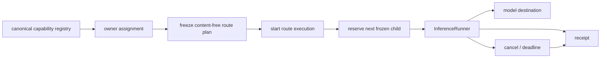
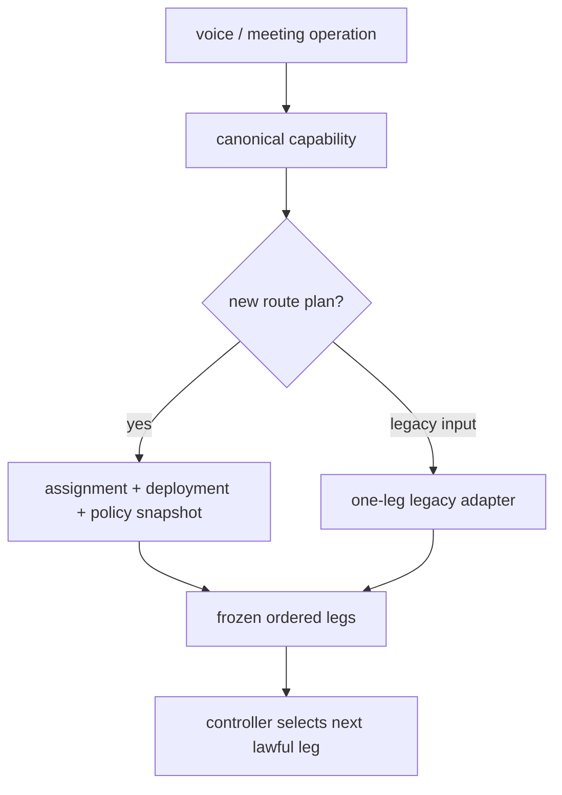

# Model runtime

This is a source audit at snapshot `675401a857b85336d4acaa8c65383dfc9636e4c8`. It separates capability registration, owner assignment, frozen route planning, physical execution, and destination readiness. These layers have different authority. Source presence is not release proof, and no model call was made for this audit.

## Runtime control plane

The capability registry at `holdspeak/inference_capabilities.py:1031-1100` names operations, modalities, output kinds, source modules, visibility, revisions, and fallback dispositions. Relevant voice and meeting entries include `speech.intent_classify`, `speech.rewrite`, `speech.target_classify`, `speech.transcribe`, `speech.preload`, `meeting.live_analysis`, `meeting.bookmark_label`, `meeting.auto_title`, and `meeting.deferred_analysis` (`:1057-1068`). Dynamic meeting-plugin schemas are composed by the same registry (`:805-868`), so plugin output is not a separate untyped path.

Retry policy is registry data. `retry.structured.standard` permits two attempts per entry, four total physical attempts, a 75-second deadline, and a 32,768 token budget. `retry.audio.transcription` permits one attempt per entry, two total physical attempts, and a 120-second deadline. The policy rows are at `holdspeak/inference_capabilities.py:1179-1184`.

## Assignment versus execution

`holdspeak/services/inference_assignment_service.py:1-6` defines assignments as hub-local configuration. It does not execute a provider, reserve capacity, or supply fallback. Its canonical groups at `:52-59` include writing and dictation, speech recognition, meetings, agents and tools, thoughts and notes, and background. Owner-only commands, projections, and compatibility checks are implemented at `:90-369` and later assignment operations.

`holdspeak/services/inference_route_plan_service.py:122-220` resolves a route from the capability, assignment, deployment, and retry policy. The freeze methods at `:405-496` store content-free hashes, revisions, and ordered legs. The derived speech preload plan at `:500-513` copies already-frozen transcription facts and does not perform a second assignment lookup. A route plan is an immutable admission record; it is not a model invocation.

The route plan contains ids, hashes, deployment revisions, capability names, budgets, and boundary facts. It must not contain audio, transcript, prompt, secret, or private endpoint material. The legacy adapter at `holdspeak/services/inference_route_plan_service.py:729-790`, `freeze_legacy_one_leg_plan`, translates one legacy profile into one replay-safe frozen leg. It does not reintroduce a caller-selected provider chain.

## Voice plan and legacy boundary

`holdspeak/speech_session/plan.py:1-12` defines a content-free immutable speech plan. Its capability and destination constants are at `:23-115`: Whisper transcription and preload use `local_whisper`; dictation provider stages use `local_dictation`; intent classify, rewrite, and future punctuation are ordered provider capabilities. Missing capability, missing admission, closed session, unbindable revision, and related cases have named refusals at `:68-106`.

The current route is therefore:

The adapter is a compatibility boundary. It does not mean that a legacy profile has the same readiness, fallback, or receipt guarantees as a newly assigned route until the resulting plan is admitted and executed.

## Readiness, secrets, and deployment selection

Runtime profiles are modeled by `holdspeak/inference_targets.py:1-12`. Target identity is separate from engine and model. Readiness is derived from configured profile facts without contacting a destination. The target kinds and defaults are at `:20-50`; local, desktop, mesh, and OpenAI-compatible profiles are distinct.

The readiness mapping at `holdspeak/inference_targets.py:380-500` checks local model files, desktop manifests, mesh availability, and OpenAI-compatible key presence. Target resolution and placement precedence are at `:507-607`. Unknown targets, incompatible placement, dead endpoints, and unsupported paired execution produce named refusals or doctor findings at `:621-637`.

Secrets stay outside projections and receipts. `holdspeak/mcp/families/model_library.py:1-4,108-139,208-251` keeps secret material explicit at the provider boundary. `tests/integration/test_model_library_secret_boundary.py:65-101` asserts that a sentinel secret is absent from JSON, errors, logs, receipts, and assignment heads; a receipt exposes only required/present state. That assertion is not run here.

## Fallback, cancellation, and receipts

`holdspeak/services/inference_fallback_controller.py:41-46` is the server-owned state machine above the kernel. `start_execution` at `:63-159` binds execution to the exact frozen operation and route hashes. `reserve_next_attempt` at `:161-185` chooses the next lawful child from frozen evidence; the caller supplies no leg, deployment, ordinal, or budget. Fallback classification and route selection use persisted evidence at `:244-307`.

Fallback is bounded. The controller can retry the current frozen leg or advance to a strictly larger executable frozen leg for an allowed disposition. It cannot invent a deployment, borrow a key, or retarget after admission. A deadline is terminal, and a stream that has emitted a delta cannot silently fall back to a new provider.

`holdspeak/kernel/inference_runner.py:80-148` owns invocation state and receipt persistence. Retry and stream rules are at `:155-225`; routed reservation validation is at `:264-311`; a stream emits an indeterminate receipt after cancellation or error following its first delta (`:190-200`). `holdspeak/kernel/inference_cancel_signal.py:23-65` performs an admitted cancellation signal and maps `cancelled` to succeeded, completed to refused, and unknown to indeterminate. Receipt persistence failure is terminal (`inference_runner.py:131-148`).

## Current gaps and bounded unknowns

* The registry and route services provide a coherent current model, but this audit does not identify a configured ready model for every capability.
* A frozen route is content-free by design; an operator still needs destination readiness and credentials at execution time.
* Legacy routes are translated at a boundary. This audit does not claim that every older caller has migrated to the new route service.
* Fallback and cancellation have named, source-backed state transitions; no provider outage, deadline race, cancellation, or receipt persistence failure was executed here.
* No key, private endpoint, model file, or external provider response was observed.
