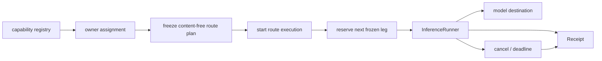

# Model runtime

This page is for contributors. It describes how HoldSpeak turns a capability request into a model call. The layers have separate authority:

1. The capability registry names each operation.
2. An owner assignment chooses the models for a capability.
3. A frozen route plan fixes the ordered models for one run.
4. The fallback controller and the inference runner execute the plan and write the Receipt.

```mermaid
flowchart LR
    A[capability registry] --> B[owner assignment]
    B --> C[freeze content-free route plan]
    C --> D[start route execution]
    D --> E[reserve next frozen leg]
    E --> F[InferenceRunner]
    F --> G[model destination]
    F --> H[Receipt]
    F --> I[cancel / deadline]
    I --> H
```

## Capability registry

`holdspeak/inference_capabilities.py` lists each operation with its modalities, output kinds, source modules, visibility, revision, and fallback dispositions. Voice and meeting entries include `speech.transcribe`, `speech.preload`, `speech.rewrite`, `speech.intent_classify`, `speech.target_classify`, `meeting.live_analysis`, `meeting.bookmark_label`, `meeting.auto_title`, and `meeting.deferred_analysis`. The registry also composes the schemas for meeting plugins.

Retry policy is registry data:

| Policy | Attempts per entry | Total attempts | Deadline |
| --- | --- | --- | --- |
| `retry.structured.standard` | 2 | 4 | 75 s (32,768 token budget) |
| `retry.audio.transcription` | 1 | 2 | 120 s |

## Assignment and route plan

`holdspeak/services/inference_assignment_service.py` stores assignments as hub-local configuration. It does not call a provider, reserve capacity, or add a fallback. Its groups are writing and dictation, speech recognition, meetings, agents and tools, thoughts and notes, and background.

`holdspeak/services/inference_route_plan_service.py` resolves a route from the capability, the assignment, the deployment, and the retry policy. It then freezes the result as ordered legs. A route plan is an admission record. It is not a model call.

A route plan holds ids, hashes, deployment revisions, capability names, budgets, and boundary facts. It never holds audio, transcript, prompt, secret, or private endpoint text.

`freeze_legacy_one_leg_plan` turns one legacy profile into one frozen leg. It does not restore a caller-selected provider chain.

The speech plan in `holdspeak/speech_session/plan.py` is a content-free immutable plan for a voice session. Whisper transcription and preload use `local_whisper`. Dictation provider stages use `local_dictation`. The module names a refusal for each failure, such as a missing capability, a missing admission, or a closed session.

## Targets and readiness

`holdspeak/inference_targets.py` models runtime profiles. A target identity is separate from its engine and model. Local, desktop, mesh, and OpenAI-compatible targets are distinct kinds.

Readiness comes from configured facts and does not contact the destination. It checks local model files, desktop manifests, mesh availability, and the presence of an OpenAI-compatible key. Unknown targets, incompatible placement, and dead endpoints produce a named refusal or a doctor finding.

Secrets stay out of projections and Receipts. `holdspeak/mcp/families/model_library.py` keeps secret material at the provider boundary. `tests/integration/test_model_library_secret_boundary.py` checks that a sentinel secret never appears in JSON, errors, logs, Receipts, or assignment heads.

## Fallback, cancel, and Receipts

`holdspeak/services/inference_fallback_controller.py` is the server-owned state machine above the kernel.

- `start_execution` binds an execution to the frozen operation and route hashes.
- `reserve_next_attempt` picks the next legal child from frozen evidence. The caller gives no leg, deployment, ordinal, or budget.
- The controller can retry the current leg or move to a later frozen leg when the failure allows it. It cannot invent a deployment, borrow a key, or retarget.
- A deadline is final. A stream that already sent a delta cannot fall back to another provider.

`holdspeak/kernel/inference_runner.py` owns invocation state and Receipt storage. A stream that fails or is cancelled after its first delta writes an indeterminate Receipt. A failure to store a Receipt is final. `holdspeak/kernel/inference_cancel_signal.py` sends an admitted cancel signal and maps the outcome to a Receipt state.

## See also

- [Models](MODELS.md): user steps for the Concierge.
- [Intelligence Router architecture](internal/ARCHITECTURE_INTELLIGENCE_ROUTER.md)
